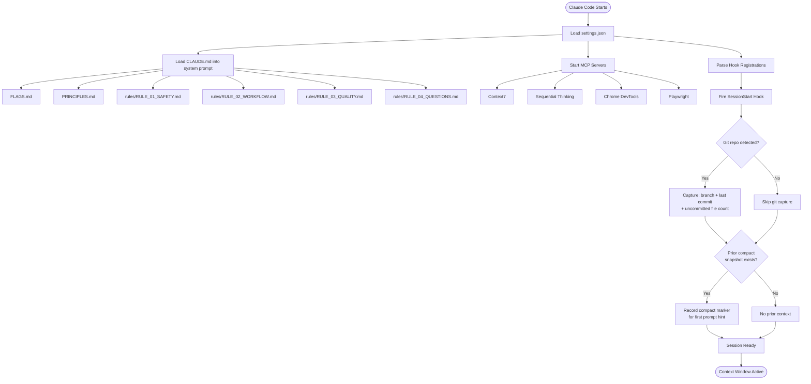
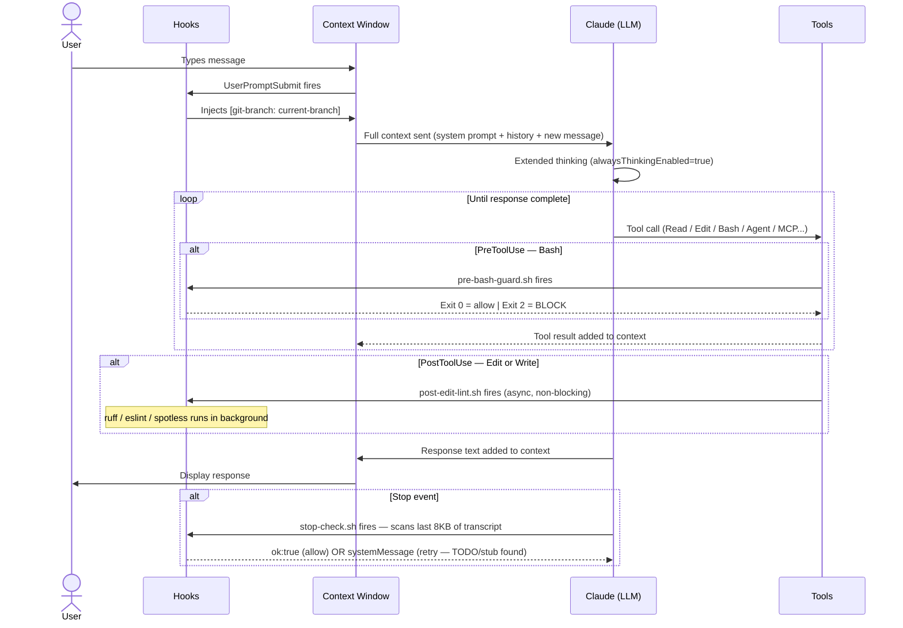
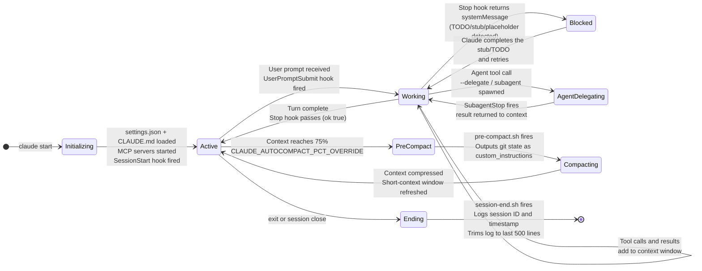
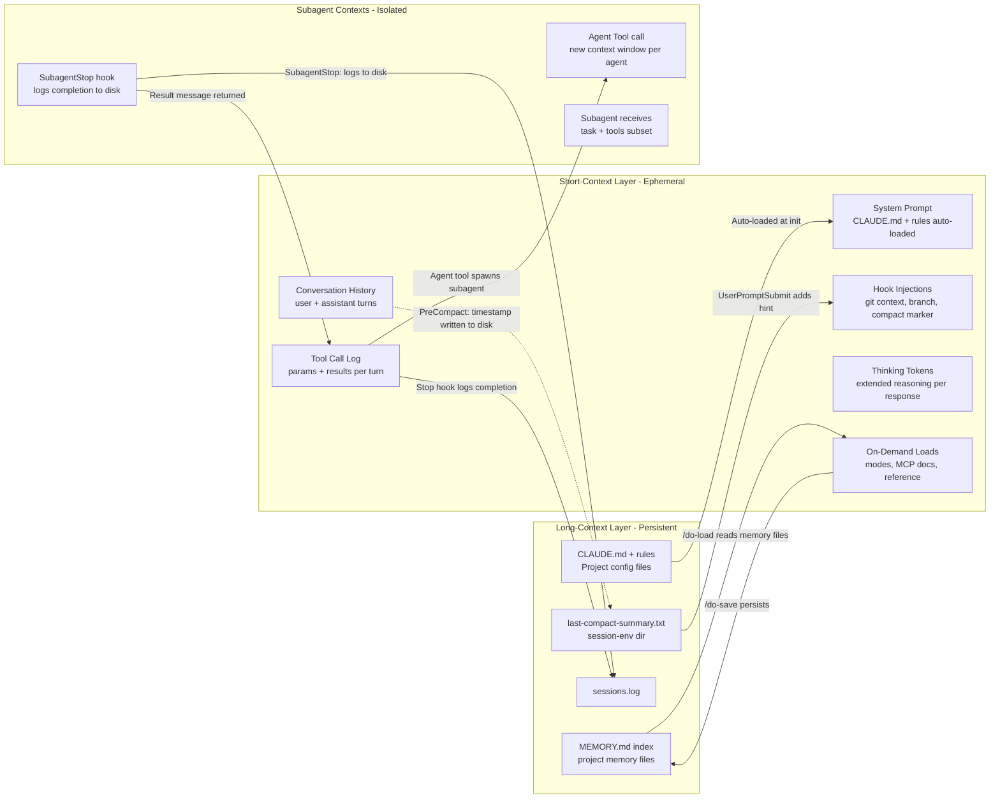

# Agent Coding Workflow

**Give your AI a persistent brain, specialist expertise, and production-grade guardrails — across Claude, Codex, and Gemini.**

> **Note for Claude Code**: Documentation only — not imported in CLAUDE.md, will not auto-load.

---

## The Problem With AI-Assisted Development

You've probably experienced this:

**Problem 1 — The Groundhog Day Session**
Every new Claude Code session starts blank. You re-explain your stack, your naming conventions, your folder structure. The AI gives generic answers because it doesn't know your project. By the time you've rebuilt enough context, your token budget is already burning.

**Problem 2 — The Wrong Expert**
You ask Claude to review your security implementation. You get a surface-level pass with a few style comments. What you needed was a security engineer who knows OWASP, threat models, injection vectors — not a generalist. Same problem when you need architecture decisions, performance diagnosis, or database design.

**Problem 3 — The Dangerous Command**
"Claude ran `git push --force` and wiped my branch." "It deleted the wrong directory." "It dropped a table." AI tools are powerful precisely because they can execute — but without guardrails, that power has no safety net.

**Problem 4 — Multi-Tool Chaos**
You use Claude for implementation, Gemini for documentation, Copilot for autocomplete. Each one has different context, different patterns, different quality standards. Your codebase accumulates inconsistencies at the seams between tools.

---

## What This Framework Does

This repository is a **configuration layer** for your AI coding assistants. Install it and your AI gets:

| Capability | What Changes |
|-----------|-------------|
| **Session memory** | Hooks capture git state at session start and inject branch, commit, and prior-context hints on the first prompt |
| **15 specialist agents** | Route tasks to the right expert: code reviewer, security engineer, backend architect, root-cause analyst, etc. |
| **37 project skills** | `/do-brainstorm`, `/do-review`, `/do-execute-plan`, `/do-implement`, `/do-analyze`, `/parallel-agents`, `/do-research` — structured Claude Code skills for execution, research, coordination, and verification |
| **8 safety hooks** | Blocks `--force` push, `git reset --hard`, `rm -rf /`, `DROP TABLE`, `TRUNCATE TABLE`, `DELETE FROM` without WHERE, `curl/wget \| bash` — automatically |
| **4 MCP servers** | Library docs (Context7), structured reasoning (Sequential), browser testing (Playwright + Chrome DevTools) |
| **Cross-tool consistency** | Same engineering rules (safety, workflow, quality) enforced across Claude, Codex, and Gemini |

---

## Who This Is For

**Individual developers using Claude Code** — You want your AI to remember your project, enforce your standards, and not do anything dangerous. You want `/do-implement` to produce a complete feature, not a scaffold with TODOs.

**Developers using multiple AI tools** — You use Claude for complex reasoning, Copilot/Codex for autocomplete, Gemini for review or documentation. You want consistent behavior and code standards regardless of which tool you're in.

**Teams standardizing AI-assisted development** — You want every developer's AI assistant to follow the same quality gates, safety rules, and engineering principles. One config, every machine.

---

## Quick Start

### Option A — Install for Claude Code only

```bash
git clone git@github.com:khoavu882/claude-code-agent-workflow.git ~/.claude
chmod +x ~/.claude/hooks/*.sh
```

Then install the MCP servers:

```bash
npx -y @upstash/context7-mcp
npx -y @modelcontextprotocol/server-sequential-thinking
npx -y chrome-devtools-mcp@latest
# Playwright: npx @playwright/mcp (or via Claude Code settings)
```

Open Claude Code — the status line shows context%, model, and cost. Type `/skills` to browse everything available, or `/do-help` to open the migrated DoFlow reference skill.

### Option B — Install for all tools (Claude + Codex + Gemini)

```bash
# Clone to a working directory, not directly to ~/.claude
git clone git@github.com:khoavu882/claude-code-agent-workflow.git ~/agent-workflow
cd ~/agent-workflow

# npm link puts the `doflow` command on your PATH via a symlink to bin/doflow.js —
# no publish/global install needed, edits to the repo take effect immediately.
npm link

# Preview what would be installed
doflow install --dry-run

# Install everything (global scope)
doflow install -g

# Or install specific tools
doflow install -g --target claude,codex
```

See [docs/setup.md](docs/setup.md) for the full CLI reference, project-scoped installs, and
backup/rollback. `./sync.sh` still works as a deprecated compatibility shim over `doflow`.

---

## Workflow Docs by Tool

The detailed, copy-ready workflows live in [docs/guide.md](docs/guide.md). README stays intentionally high level so the workflow examples have one canonical source.

| Tool | Installed Source | Capability Tier | Canonical Docs |
|------|------------------|-----------------|----------------|
| Claude Code | `core/skills/`, `core/agents/`, `core/hooks/`, `core/mcp/`, `core/rules/`, `core/reference/`, `core/settings.json`, `core/CLAUDE.md` | Full orchestration: slash skills, auto-loaded policy skills, agents, hooks, MCP servers, session memory | [Guide](docs/guide.md), [Reference](docs/reference.md) |
| Codex / Copilot-style tools | `core/rules/`, `core/agents/`, `core/reference/` | Shared engineering standards and specialist persona prompts | [Guide: Multi-Tool Workflows](docs/guide.md#multi-tool-workflows) |
| Gemini | `core/rules/`, `core/agents/`, `core/reference/` | Broad review, documentation, and architecture support with the same rules | [Guide: Multi-Tool Workflows](docs/guide.md#multi-tool-workflows) |

The actual install mapping is defined in [bin/mappings.conf](bin/mappings.conf). If a file is not listed there, it is documentation or source material only.

Most-used Claude Code paths:

```bash
# Spec-driven feature flow (doflow chain, part of core)
/do-constitution                        # one-time per repo: set project rules
/do-spec "feature idea"                 # WHAT/WHY -> agent-docs/specs/NNN/spec.md
/do-plan                                # HOW -> plan.md (Constitution Check gate)
/do-tasks                               # dependency-ordered tasks.md ([P]/[US#])
/do-execute-plan latest --next --safe   # gated execution (requires plan + tasks)
/do-review --scope changed              # review + spec/tasks traceability
# /do-flow auto-chains constitution -> spec -> plan -> tasks -> implement -> review
# with three approval gates, instead of invoking each phase manually

# Independent investigation flow
/parallel-agents "three unrelated failing test files: auth, billing, dashboard"

# Documentation flow
/do-document "Update API docs and workflow examples"
```

---

## Real Scenarios

### "I keep re-explaining my project to the AI"

**Before**: Every session starts with: "We're using TypeScript strict mode. Our service layer lives in `src/services/`. We follow camelCase. We're on Node 20. We use Prisma for the ORM. Don't suggest mongoose."

**After**: `SessionStart` captures git state, then `UserPromptSubmit` injects branch and commit context on the first prompt. `/do-load` restores native memory (compact summary + project memory files) from the previous session. CLAUDE.md auto-loads your rules and principles. The AI's first message is productive work — not re-onboarding.

---

### "The AI ran a dangerous command without asking"

**Before**: Claude ran `git push --force origin main` in an automation script. Lost three hours of work. Or: `rm -rf ./node_modules` while your working directory was wrong.

**After**: `pre-bash-guard.sh` intercepts every Bash call. These patterns are permanently blocked — they cannot execute:
```
git push --force
rm -rf /  (or ~/...)
DROP TABLE
DELETE FROM ... (without WHERE)
```
No confirmation prompt needed — they just don't run.

---

### "I need a real security expert, not a generalist"

**Before**: "Can you review my payment service for security issues?" → Claude gives general suggestions: "use HTTPS", "validate inputs", "hash passwords". Not wrong, but not deep.

**After**: `@agent-security "review PaymentService for vulnerabilities"` activates a security engineer persona that examines: injection vectors (SQL/NoSQL/command), broken authentication patterns, missing authorization checks, sensitive data exposure, OWASP Top 10 patterns, threat modeling for this specific service type.

The difference is specialization. The security-engineer agent has specific domain knowledge, not just general awareness.

---

### "My team uses different AI tools — our codebase is inconsistent"

**Before**: Developer A uses Claude (suggests reactive patterns). Developer B uses Copilot (suggests imperative). Developer C uses Gemini (suggests different error handling). The codebase has three styles competing at every seam.

**After**: All three run from the same `rules/` and `agents/`. Same SOLID enforcement. Same DRY/KISS/YAGNI. Same naming conventions. Same "no TODO stubs" rule. The AI recommendation each developer gets is shaped by the same foundation.

```bash
# One config, all machines
doflow install -g --target claude,codex,gemini
```

---

### "After a long session, the AI starts contradicting itself"

**Before**: 40 messages in, Claude suggests a pattern that conflicts with a decision made at message 12. The context window has filled up and earlier decisions are now compressed or gone.

**After**: Auto-compact fires at 75% context. `pre-compact.sh` outputs git state as custom instructions to enrich the compact summary; `post-compact.sh` saves the resulting summary to disk. The next session's first prompt includes a hint that a prior compact summary is available, and `/do-load` restores project memories. Subagent delegation with `--delegate` offloads large analysis to isolated contexts, protecting the main window from filling up with tool call noise.

---

## How It Works

### Two Context Horizons

| Horizon | Scope | Managed By | Survives Session? |
|---------|-------|------------|-------------------|
| **Short-context** | Active conversation window | LLM token budget (auto-compacted at 75%) | No |
| **Long-context** | Cross-session persistence | Files on disk, native memory (MEMORY.md + agent-docs) | Yes |

Hooks bridge these two horizons — they inject disk-persisted state into the short-context window at the right moments.

---

### Session Initialization Flow

What gets loaded when a session starts:



**Always in context** (every session): `FLAGS.md`, `PRINCIPLES.md`, and `rules/*.md`. Git state enters on the first prompt through `UserPromptSubmit`.

**Not auto-loaded** (on-demand only): behavioral modes, MCP documentation, reference files, agents (instantiated on demand via `Agent` tool).

---

### Per-Turn Context Building

How context grows with each user message:



Each turn accumulates: hook injections + user message + thinking tokens + tool call params + tool results + response text.

With `alwaysThinkingEnabled=true`, thinking tokens are substantial — accelerating the approach to the 75% compaction threshold.

---

### Session Lifecycle States



---

### Short-Context vs Long-Context Architecture



**Key insight**: Subagents are context-efficient. The main session's context only grows by the size of the subagent's *return message*, not its full working context. This is why `--delegate` is used for large operations — it protects the main context window.

---

### Cross-Session Memory Persistence

```mermaid
flowchart TD
    subgraph SESSION_N["Session N"]
        WN[Work happens - context fills to 75%]
        PC[PreCompact fires]
        WN --> PC
        PC --> TS[Write timestamp marker<br/>to last-compact-summary.txt]
        WN --> SAVE[/do-save - write_memory called]
        WN --> SE[SessionEnd fires]
        SE --> LOG[Append session_id and timestamp<br/>to sessions.log]
    end

    subgraph DISK["Persistent Storage"]
        TS2[last-compact-summary.txt]
        LOG2[sessions.log]
        MEM[MEMORY.md + memory files<br/>project memory dir]
    end

    subgraph SESSION_N1["Session N+1"]
        SS[SessionStart fires]
        INJ[UserPromptSubmit injects:<br/>git branch + last commit<br/>+ prior compact hint if present]
        WORK[Session proceeds with<br/>awareness of prior compaction]
        SS --> INJ
        INJ --> WORK
    end

    TS --> TS2
    LOG --> LOG2
    SAVE --> MEM
    TS2 -->|First prompt detects| INJ
    MEM -->|/do-load reads| INJ
```

---

### Skills and Agents: Context Entry Points

| Mechanism | How It Enters Context | Context Cost | Use When |
|-----------|----------------------|-------------|----------|
| **Skill** (`/skill`) | Skill prompt expanded into system turn | Medium — full skill markdown | Behavioral mode or specialized workflow |
| **Agent** (`Agent` tool) | Only return message added to main context | Low — result only | Parallel work, large searches, context protection |
| **Mode** (manual `Read`) | Full `MODE_*.md` file read into context | High — full file | Session-wide behavioral change needed |
| **MCP call** | Tool result injected as tool-result turn | Varies by response | Library docs, semantic analysis, structured reasoning |
| **Hook injection** | `additionalContext` field in system-reminder | Very low — string only | Ambient metadata (git state, compact marker) |

---

### Context Budget Reference

```
Total context budget: ~200K tokens (Sonnet 4.6)
Auto-compact threshold: 75% = ~150K tokens consumed

Typical per-session allocation:
├── System prompt (CLAUDE.md + rules + FLAGS + PRINCIPLES): ~8–12K tokens
├── Skill/mode expansions (if loaded): ~5–15K per skill
├── MCP server tool schemas (all 5 servers): ~10–20K tokens
├── Conversation turns: ~2–5K per turn (with thinking tokens)
├── Tool results: ~1–50K per call (varies widely)
└── Remaining before compaction: depends on turn count

At 75% fill -> PreCompact fires -> context compressed
Compact marker written to disk -> next session /do-load restores it
```

---

## Installation

### doflow — Node CLI (recommended)

Zero-dependency Node CLI, `node >= 18`. Parity-tested against `bin/sync-legacy.sh` (the frozen
original bash implementation) via `test/cli-parity.sh` for every command it implements.

```bash
# Optional: put `doflow` on your PATH via a symlink to bin/doflow.js — no publish/global
# install needed, edits to the repo take effect immediately. Skip this and use
# `node bin/doflow.js ...` directly if you'd rather not touch your global npm bin.
npm link

# Preview what would be installed (no writes)
doflow install --dry-run -g

# Install globally (all tools: claude, codex, gemini)
doflow install -g --force

# Or install project-scoped instead — the default when -g is omitted, rooted at an
# optional path argument (defaults to '.', i.e. cwd)
doflow install --force                # installs into ./.claude/, ./.codex/, ./.gemini/
doflow install ../my-app --force       # installs into ../my-app/.claude/ etc.

# Update changed files only, check status, list/restore backups, self-update
doflow update -g
doflow status -g              # add --json for scripting
doflow list-backups -g
doflow rollback <backup-id> -g
doflow self-update
```

Global scope (`-g`/`--global`) writes to `$HOME/.{claude,codex,gemini}`. Project scope (default,
no `-g`) writes to `<path>/.{claude,codex,gemini}` instead — useful for per-repo config the way
Claude Code, Codex, and Copilot all natively support alongside their global config (see
`agent-docs/research/context-setup-claude-codex-copilot.md`).

`--no-backup` requires `--force`. `npm test` runs the unit + CLI end-to-end suite; `npm run parity`
runs the parity harness. Full flag reference and backup/rollback details:
[docs/setup.md](docs/setup.md).

`./sync.sh` still works as a deprecated compatibility shim — it translates its old flag grammar
(`--install`, `--rollback [ID]`, ...) into `doflow`'s subcommand grammar. Use `doflow` directly for
new setups.

### File Mapping by Tool

Configured in `mappings.conf`:

| Tool | What Gets Installed |
|------|-------------------|
| **claude** | Full install — commands, agents, hooks, modes, rules, mcp, reference, skills, settings, CLAUDE.md |
| **codex** | Subset — rules, agents, reference |
| **gemini** | Subset — rules, agents, reference |

---

## Complete Reference

### Installed MCP Servers

| Server | Purpose | Flag |
|--------|---------|------|
| Context7 | Library documentation lookup | `--c7` |
| Sequential Thinking | Structured multi-step reasoning | `--seq` |
| Chrome DevTools | Browser inspection and performance | `--chrome` |
| Playwright | Browser testing and E2E automation | `--play` |

---

### Agents

| Agent | Purpose |
|-------|---------|
| `system-architect` | Scalable system design |
| `backend-architect` | Backend systems and APIs |
| `frontend-architect` | UI/UX and frontend |
| `code-reviewer` | Merge request, diff, branch, and coding standard review |
| `security-engineer` | Vulnerability assessment |
| `devops-architect` | Infrastructure and CI/CD |
| `performance-engineer` | Bottleneck identification |
| `quality-engineer` | Testing and quality assurance |
| `refactoring-expert` | Code quality improvement |
| `python-expert` | Python best practices |
| `deep-research-agent` | Comprehensive research |
| `requirements-analyst` | Requirements discovery |
| `root-cause-analyst` | Problem investigation |
| `technical-writer` | Documentation generation |
| `pm-agent` | PDCA self-improvement workflow |

Manual invocation: describe the task naturally — Claude selects the agent. For explicit delegation: `Agent(subagent_type="agent-name")` in orchestration contexts.

---

### Skills

| Skill | Invocation | Description |
|-------|-----------|-------------|
| `token-efficiency` | agent-preloaded (hidden) | Compressed output when context > 75% |
| `code-conventions` | agent-preloaded (hidden) | Language-aware convention router for Java, Python, JavaScript, and TypeScript |
| `java-conventions` | agent-preloaded (hidden) | Java naming, structure, DB standards — auto-loaded into code-reviewer |
| `do-brainstorm` | `/do-brainstorm [topic]` | Socratic requirements discovery |
| `do-research` | `/do-research "[query]"` | Evidence-based research (forked context — only final result in main context) |

---

### Hooks

| Hook | Event | Action |
|------|-------|--------|
| `session-start.sh` | SessionStart | Captures git branch, SHA, last 5 commits to `sessions/{id}/git-context.json` |
| `user-prompt-submit.sh` | UserPromptSubmit | Injects git context on first prompt only via `additionalContext`; flag prevents re-injection |
| `pre-bash-guard.sh` | PreToolUse(Bash) | Blocks dangerous patterns from `blocked-patterns.conf` |
| `post-edit-lint.sh` | PostToolUse(Edit\|Write) | Appends file path to `edited-files.txt` for batch lint at Stop |
| `stop-check.sh` | Stop | Batch lint dispatch; blocks if last assistant response has TODO/stub |
| `pre-compact.sh` | PreCompact | Outputs git state as `custom_instructions` to enrich the compact summary |
| `post-compact.sh` | PostCompact | Saves AI-generated summary to `projects/{cwd_hash}/last-compact-summary.md` |
| `session-end.sh` | SessionEnd | Logs END, writes uncommitted-warning, deletes session dir, trims log |

Blocked operations (always denied, no override):
```
git push --force        (--force-with-lease is allowed)
git reset --hard
git clean -fd
rm -rf /  rm -rf ~/  rm -rf $HOME
DROP TABLE / DROP DATABASE / DROP SCHEMA
DELETE FROM <table>;   (no WHERE clause)
TRUNCATE TABLE
curl <url> | bash  /  wget <url> | bash
```

---

### Workflow Skills

The complete skill table lives in [docs/reference.md](docs/reference.md). Source files live in `core/skills/*/SKILL.md`.

| Group | Examples | Contract |
|-------|----------|----------|
| Manual workflow commands | `/do-implement`, `/do-execute-plan`, `/do-git`, `/do-cleanup` | Human chooses timing; side effects are allowed only through explicit command use. |
| Hybrid read-only skills | `/do-analyze`, `/do-review`, `/do-document`, `/do-troubleshoot`, `/parallel-agents` | Claude may auto-load for matching requests, but auto mode analyzes, drafts, verifies, or coordinates only. |
| Auto-loaded policy skills | `confidence-check`, `code-conventions`, `java-conventions`, `token-efficiency` | Hidden background guidance; `confidence-check` gates implementation-class edits. |

---

### Workflow Execution and Review Gate

The standard delivery path is `/do-spec` -> `/do-plan` -> `/do-tasks` -> `/do-execute-plan` -> `/do-review` (or `/do-flow` to auto-chain the same phases behind three approval gates). See [docs/guide.md](docs/guide.md) for copy-ready examples and [docs/reference.md](docs/reference.md) for invocation modes.

---

### Behavioral Flags Reference

#### Analysis Depth

| Flag | Tokens | MCPs Enabled |
|------|--------|-------------|
| `--think` | ~4K | Sequential |
| `--think-hard` | ~10K | Sequential + Context7 |
| `--ultrathink` | ~32K | All installed |

#### MCP Servers

```
--c7 / --context7     Context7 for library docs
--seq / --sequential  Sequential for structured reasoning
--chrome              Chrome DevTools for performance
--play / --playwright Playwright for E2E testing
--all-mcp             All installed servers
--no-mcp              Native tools only
```

#### Execution Control

```
--safe-mode           Max validation, conservative execution
--validate            Pre-execution risk assessment
--delegate [auto]     Sub-agent parallel processing (>7 dirs, >50 files)
--concurrency [n]     Max concurrent ops (1-15)
--loop                Iterative improvement cycles
--iterations [n]      Cycle count (1-10)
--uc / --ultracompressed  30-50% output compression
```

#### Common Combinations

```bash
# Analysis depth progression
/do-analyze --overview --uc          # Quick scan (token-efficient)
/do-analyze --focus quality --think  # Standard structured analysis
/do-analyze --focus security --think-hard --verbose  # Comprehensive review
/do-analyze --ultrathink             # Exhaustive (use sparingly)

# MCP targeting
/do-implement "feature" --c7 --seq   # Official docs + structured reasoning
/do-implement "feature" --no-mcp     # Native tools only (fastest)
/do-analyze --all-mcp                # All installed servers

# Token efficiency under context pressure
/do-analyze large-codebase/ --uc --delegate     # Compress + delegate to agents
/do-implement "feature" --uc --concurrency 5    # Compressed parallel execution

# Iterative improvement
/do-analyze src/ --focus quality
/do-improve src/ --type quality --safe
/do-improve src/ --type quality --loop --iterations 3
```

---

### Rules Priority

```
CRITICAL   — Safety, data, production (never compromise)
IMPORTANT  — Quality, maintainability (strong preference)
RECOMMENDED — Optimization, style (apply when practical)

Conflict: Safety > Scope > Quality > Speed
```

Key rules:
- **Parallel by default** — batch independent ops, never sequential reads then sequential edits
- **Start it = Finish it** — no TODO stubs or "not implemented" throws
- **Root cause always** — never disable tests to pass builds
- **Evidence over assumption** — verify infrastructure changes against official docs
- **YAGNI** — build only what's asked, no bonus enterprise features

---

### Keyboard Shortcuts (Claude Code)

| Shortcut | Action |
|----------|--------|
| `ctrl+shift+t` | Toggle todos panel |
| `ctrl+shift+o` | Toggle transcript |
| `ctrl+e` | Open external editor |
| `ctrl+r` | Search command history |
| `ctrl+s` | Stash current input |
| `shift+tab` | Cycle input mode (plan/auto/edit) |

---

## Structure

```
claude-code-agent-workflow/
  sync.sh            # Repo-root entry point (delegates to bin/sync.sh)
  requirements.txt   # Python deps for MkDocs CI
  mkdocs.yml         # GitHub Pages site configuration
  README.md
  core/              # Deployable framework files (installed to ~/.claude/)
    CLAUDE.md        # Session entrypoint — loads FLAGS, PRINCIPLES, RULES
    FLAGS.md         # Behavioral flags and MCP server configuration
    PRINCIPLES.md    # Engineering principles (SOLID, DRY, KISS, YAGNI)
    settings.json    # Permissions, hooks, model, outputStyle, autocompact
    keybindings.json # Custom keyboard shortcuts
    .mcp.json        # MCP server definitions (source only — see docs/setup.md#mcp-servers for
                     #   where doflow actually installs the selection: ~/.claude.json or
                     #   <projectRoot>/.mcp.json, never .claude/.mcp.json)
    agents/          # 15 specialized agents
    hooks/           # 8 event-driven safety hooks + lib.sh shared library
    skills/          # 37 Claude Code skills
    modes/           # 6 behavioral modes (on-demand)
    rules/           # Split rules (<60 lines each for adherence)
    mcp/             # MCP server documentation (4 servers)
    reference/       # Domain reference (Java, spec/constitution, research)
  bin/               # Internal scripts
    doflow.js        # Installer (Node, maintained)
    sync.sh          # Deprecation shim -> translates flags, delegates to doflow.js
    sync-legacy.sh   # Frozen original bash implementation (parity-test reference only)
    mappings.conf    # Source→destination file mapping per tool
  src/                 # doflow.js engine modules (mappings/targets/copy/backup/manifest/diff)
  docs/              # MkDocs site source (GitHub Pages)
  agent-docs/        # Generated analysis and design docs
  site/              # Built documentation output
```

Installed layout after `doflow install -g --target claude`:

```
~/.claude/
  CLAUDE.md          agents/   skills/   hooks/
  FLAGS.md           modes/    rules/    mcp/
  PRINCIPLES.md      reference/
  settings.json      keybindings.json

~/.claude.json       # MCP server selection merged into its `mcpServers` key (not inside .claude/)
```

---

## References

- [Claude Code Docs](https://code.claude.com/docs)
