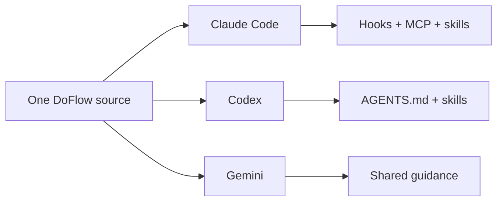

# DoFlow

DoFlow is a configuration layer for AI coding tools. It gives Claude Code, Codex, and Gemini a
shared set of engineering rules, reusable workflows, and safer defaults.



## What it provides

| Need | DoFlow component |
|---|---|
| Repeatable delivery work | 28 skills, including `/do-brainstorm`, `/do-plan`, `/do-test`, and `/do-code-review` |
| Specialist review | 14 focused agent prompts for architecture, security, quality, and root-cause analysis |
| Safer automation | Claude hooks block destructive commands and unfinished implementation stubs |
| Shared standards | Rules for safety, workflow, quality, and clarification across supported tools |
| Session continuity | Claude hooks capture lightweight Git context and compact-session summaries |

## Start here

1. **New to DoFlow?** Follow the [Quickstart](docs/quickstart.md).
2. **Need installation, updates, or rollback?** Use the [Setup guide](docs/setup.md).
3. **Want to understand the moving parts?** Read the visual [Overview](docs/overview.md).
4. **Ready to work?** Pick a task pattern from the [Guide](docs/guide.md).
5. **Looking up a command or capability?** Open the [Reference](docs/reference.md).

## Install with the CLI

Use the maintained installer when you want one source deployed to one or more tools:

```bash
git clone git@github.com:khoavu882/do-flow.git ~/do-flow
cd ~/do-flow
npm link

# Inspect the plan first, then install globally.
doflow install --dry-run -g
doflow install -g --target claude,codex
```

`doflow install` creates a backup before changing configuration. The complete command reference,
including project-scoped installation and rollback, is in [Setup](docs/setup.md).

## A typical feature flow


```text
/do-brainstorm "add a customer export"
/do-design
/do-plan
/do-execute-plan --next --safe
/do-test
/do-code-review
```

Use `/do-flow "add a customer export"` to run the same sequence with its approval gates.

## Tool support

| Tool | Installed capabilities |
|---|---|
| Claude Code | Full integration: skills, agents, hooks, MCP registration, session context, and rules |
| Codex | `AGENTS.md`, skills, scripts, templates, rules, agents, and references |
| Gemini | Shared instructions, rules, agents, modes, skills, and references |

Claude-only hooks are intentionally not installed for Codex or Gemini. See the [installation matrix](docs/setup.md#what-gets-installed) for the exact mapping.

## Contributing

The repository layout and deployment model are documented in the [Architecture guide](docs/architecture.md).
Run `npm test`, `npm run parity`, and the shell suites described there before submitting changes.
