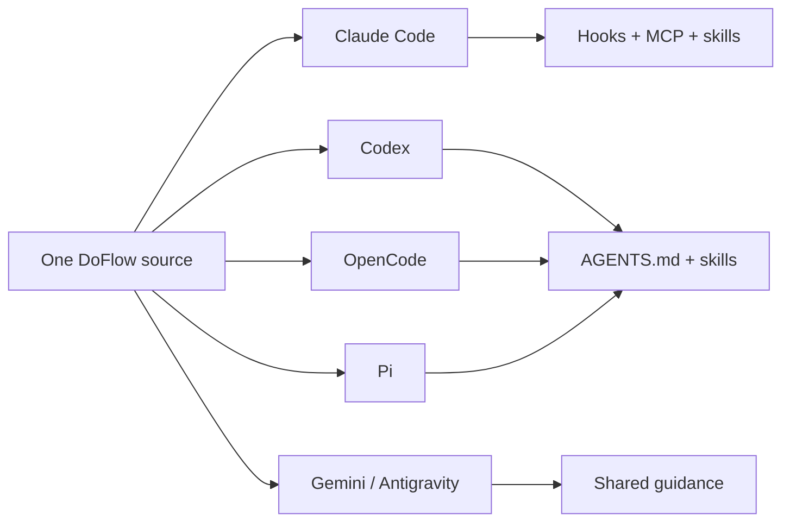
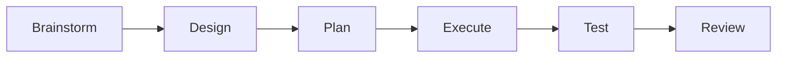

# DoFlow

DoFlow is a configuration layer for AI coding tools. It gives Claude Code, Codex, Gemini /
Antigravity, OpenCode, and Pi a shared set of engineering rules, reusable workflows, and safer
defaults — projected from one source, so the five never drift apart.


```mermaid
flowchart LR
    R[One DoFlow source] --> C[Claude Code]
    R --> X[Codex]
    R --> G[Gemini / Antigravity]
    R --> O[OpenCode]
    R --> P[Pi]
    C --> H[Hooks + MCP + skills]
    X --> S[AGENTS.md + skills]
    G --> A[Shared guidance]
    O --> S
    P --> S
```

## What it provides

| Need | DoFlow component |
|---|---|
| Repeatable delivery work | 12 skills, including `/do-brainstorm`, `/do-plan`, `/do-test`, and `/do-code-review` |
| Specialist review | 5 agents — `spec-analyst`, `system-architect`, `core-implementer`, `quality-guardian`, `research-writer` |
| Safer automation | Claude hooks block destructive commands and unfinished implementation stubs |
| Shared standards | Rules for safety, workflow, quality, and clarification across supported tools |
| Session continuity | Claude hooks capture lightweight Git context and compact-session summaries |

## Start here

1. **New to DoFlow?** Follow the [Quickstart](docs/quickstart.md).
2. **Need installation, updates, or rollback?** Use the [Setup guide](docs/setup.md).
3. **Want to understand the moving parts?** Read the visual [Overview](docs/overview.md).
4. **Ready to work?** Pick a task pattern from the [Guide](docs/guide.md).
5. **Looking up a command or capability?** Open the [Reference](docs/reference.md).

## Install with the CLI

Use the maintained installer when you want one source deployed to one or more tools. Nothing to
clone — run it straight from npm:

```bash
# Inspect the plan first, then install globally.
npx @khoavu882/doflow install --dry-run -g
npx @khoavu882/doflow install -g --target claude,codex
```

To work on DoFlow itself, or to pin an installation to a checkout you control, link the repo
instead — `doflow` then resolves to your working tree:

```bash
git clone git@github.com:khoavu882/do-flow.git ~/do-flow
cd ~/do-flow
npm link
doflow install --dry-run -g
```

The package is published under the `@khoavu882` scope; the unscoped `doflow` name on npm belongs
to an unrelated project.

`doflow install` creates a backup before changing configuration. The complete command reference,
including project-scoped installation and rollback, is in [Setup](docs/setup.md).

## External tools

DoFlow can inspect or manage the supported RTK and Graphify command-line tools on macOS and Linux:

```bash
doflow tools --tool rtk,graphify --action status
doflow tools --tool graphify --action install --dry-run --json
```

`install`, `update`, and `uninstall` display and require confirmation for every command; `--force`
is intentionally rejected. Graphify uses `uv` and DoFlow explains a missing `uv` prerequisite
without installing it. RTK update is reported as skipped because no verified upstream update command
is registered.

## A typical feature flow


```mermaid
flowchart LR
    B[Brainstorm] --> D[Design]
    D --> P[Plan]
    P --> E[Execute]
    E --> T[Test]
    T --> R[Review]
```

```text
/do-brainstorm "add a customer export"
/do-design
/do-plan
/do-execute-plan --next --safe
/do-test
/do-code-review
```

Use `/do-flow "add a customer export"` to run the same sequence with its approval gates.

## Tool support

| Tool | Installed capabilities |
|---|---|
| Claude Code | Full integration: skills, agents, hooks, MCP registration, session context, and rules |
| Codex | `AGENTS.md`, skills, scripts, templates, rules, agents, hooks, and references |
| Gemini / Antigravity | `GEMINI.md`, rules, agents, modes, skills, hooks, and references |
| OpenCode | `AGENTS.md`, `.opencode/skills/`, and `opencode.json` configuration |
| Pi Coding Agent | `AGENTS.md`, `.pi/skills/`, and `pi-mcp-adapter` MCP integration |

Codex hooks are installed as `hooks.json` but require review/trust in Codex before they run.
Gemini hooks merge into a `hooks` key inside `settings.json` (never a full-file replace) and are
similarly subject to Gemini's own hook trust/review gating. OpenCode and Pi standard-adopt `AGENTS.md`
for seamless zero-drift rule projection. See `docs/capability-map.md` and the
[installation matrix](docs/setup.md#what-gets-installed) for the exact mapping.

## Contributing

The repository layout and deployment model are documented in the [Architecture guide](docs/architecture.md).
Run `npm test` and the shell suites described there before submitting changes.
