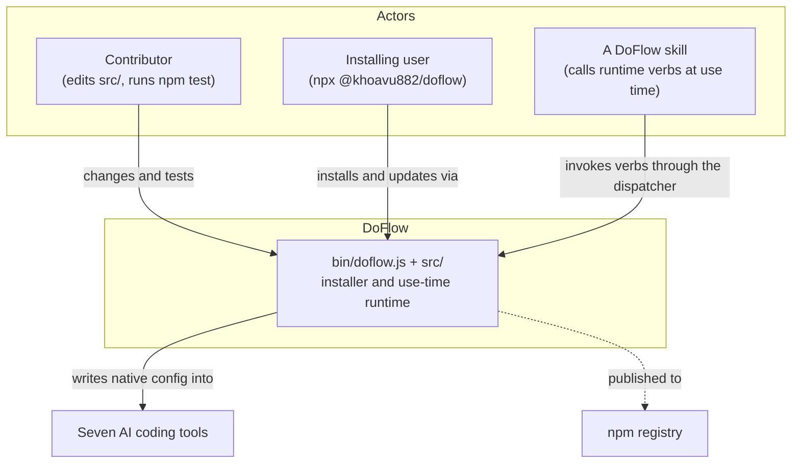
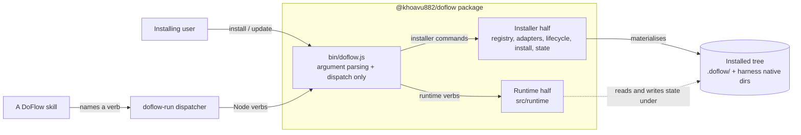
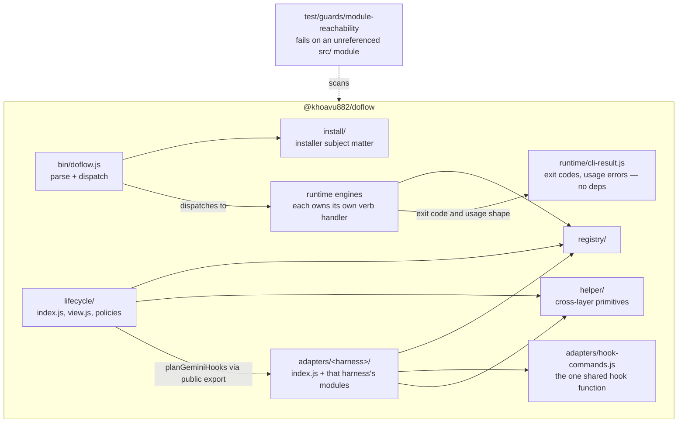
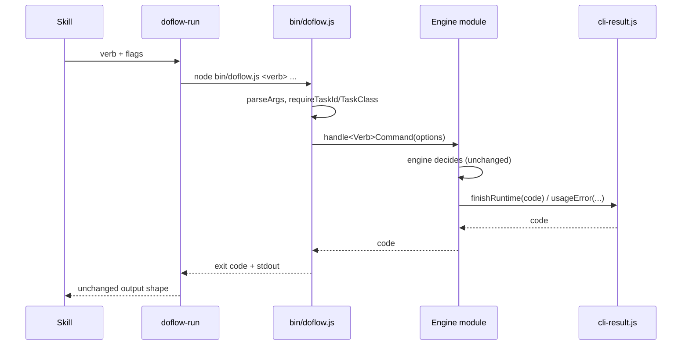

# Design: Visible installer/runtime boundary in `src/`

**Feature:** 010-refactor-backend · **Requirement:** ./requirement.md · **Status:** Draft · **Created:** 2026-08-19

> System shape — architecture, APIs, data/interface contracts.
>
> **Reconstructed 2026-08-19** after `agent-docs/doflow/` was deleted mid-execution. Rebuilt from the
> evidence ledger and the branch's commits. Components C1–C10 are as designed; C11–C14 were added
> during execution as scope grew, and are marked as such.

## 1. Architecture Approach

The layering this feature wants already exists in the dependency graph — it is acyclic and every
cross-layer edge points at the stable registry. What is missing is that the *file layout* does not
express it. The design therefore adds no layer and no abstraction. It relocates code to the layer
that already owns it, extracts exactly one generic symbol whose misplacement created a false
dependency, gives the adapter contract a single shape, and adds one guard so unreachable modules
cannot silently return.

One new module was unavoidable rather than chosen: the verb handlers depend on presentation helpers
private to `bin/doflow.js`, and homing those in the existing `cli.js` would create the repository's
first import cycle (§7 R1). A dependency-free `cli-result.js` is the smallest shape that prevents it.

## 2. System Overview (C4)

### C1: System Context

### C2: Container

### C3: Component

## 3. Components & Boundaries

| ID | Component | Kind | Serves | Status |
|---|---|---|---|---|
| C1 | `bin/doflow.js`, reduced to parse and dispatch | script | FR-003 | Live |
| C2 | `src/runtime/cli-result.js` | service | FR-003 | Live |
| C3 | Eight runtime engine modules, each gaining its verb handler | service | FR-003 | Live |
| C4 | `src/helper/toml.js` (extracted TOML parser) | service | FR-005 | Live |
| C5 | `src/adapters/codex/` module cluster | service | FR-004 | Live |
| C6 | `src/adapters/gemini/` and its public re-export | service | FR-004, FR-005 | Live |
| C7 | Seven adapter factories | reference | FR-007 | Live |
| C8 | `src/lifecycle/view.js` | service | FR-006 | Live |
| C9 | `test/guards/module-reachability.test.js` | script | FR-002 | Live |
| C10 | Four removed runtime modules | reference | FR-001 | Live |
| C11 | `src/helper/` (added during execution) | service | FR-011 | Live |
| C12 | `src/install/` (added during execution) | service | FR-011 | Live |
| C13 | `src/adapters/hook-commands.js` (added during execution) | service | FR-014 | Live |
| C14 | Decomposed runtime modules (added during execution) | service | FR-013 | Live |

**Detail**

- **C1** → Owns argument parsing, the `main()` switch, and the installer command implementations.
  After this change every runtime `case` is a one-line delegation. `requireTaskClass` and
  `requireTaskId` stay: they validate parsed CLI arguments, which is this component's job.
- **C2** → Owns the two CLI-presentation concerns the verb handlers share: `finishRuntime` and
  `usageError`. It must require nothing from `src/runtime/` — that constraint is why it exists
  (§7 R1). `finishScaffold` is not carried over: its body was identical to `finishRuntime`.
- **C3** → `task-classifier`, `workflow-engine`, `capability-router`, `claims`, `context-pack`,
  `verification`, `recovery` and `scaffold` each gain the handler for the verb they already back.
  Each handler's body moves verbatim. This makes all fifteen verbs uniform, matching the four that
  already sat this way.
- **C4** → Owns TOML text parsing. It knows nothing about codex, adapters or the registry. It exists
  because `src/lifecycle/` needs to parse TOML, not because it needs anything from codex. Lives at
  `src/helper/toml.js` after C11.
- **C5** → `agents.js`, `config.js`, `hooks.js`, `mcp.js` under `src/adapters/codex/`, reached from
  `index.js` and from each other as siblings. After C4's extraction this cluster has no consumer
  outside its own directory. `atomicWrite` stays in `config.js`: generic, but every caller is inside
  the cluster.
- **C6** → `hooks.js` under `src/adapters/gemini/`, plus a re-export of `planGeminiHooks` only. The
  public surface widens by exactly one name.
- **C7** → Each adapter exports `create<Name>Adapter()`, a no-argument factory. Existing named
  exports are retained, so no caller is forced to change — which is why FR-007 required no test edit.
- **C8** → The lifecycle-layer view module, moved into `src/lifecycle/` and renamed to drop the
  redundant prefix.
- **C9** → Walks `bin/`, `src/`, `test/`, `bench/`, collects `require()` literals, resolves each, and
  fails naming any unreferenced `src/**/*.js`. Carries a commented allowlist, empty on introduction.
  Excludes `bench/runs/`, which holds recorded eval outputs rather than live code.
- **C10** → The four unreachable modules cease to exist. `freshness.js` and `worktree.js` are
  retained: each is required from `test/` or `bench/`, which C9 counts as reached.
- **C11** → `src/helper/` holds cross-layer primitives under the admission rule *used by two or more
  layers, owns no domain concept*.
- **C12** → `src/install/` holds the installer's own subject matter. Kept separate from C11
  deliberately: these own domain concepts and would lose their identity in a bucket named for what
  they are not.
- **C13** → `src/adapters/hook-commands.js` holds `verifyHookCommands` and its two private helpers —
  the only code proven byte-identical between the codex and gemini hooks modules.
- **C14** → `verification.js`, `scaffold.js` and `trace.js` decomposed into cohesive modules.
  Constrained by G12: `RunLedger`, `sanitizeRunEvent` and the single `appendFileSync` must remain in
  `trace.js`, because the guard scans every other file for a second ledger writer.

## 4. API / Interface Contracts

**Verb handler.** `handle<Verb>Command(options: object) -> number` — unchanged from the inline form.

**Presentation helpers (C2).**
`finishRuntime(code: number) -> number` sets `process.exitCode` and returns it.
`usageError(verb: string, message: string, json: boolean) -> number` reports and returns 2.

**Adapter factory (C7).** `create<Name>Adapter() -> { discover, render, plan, apply, remove, verify }`

**Dispatcher-facing surface.** Unchanged and frozen by NFR-005.

## 5. Data Model

N/A — no schema, entity or persisted format. The one parsing contract touched, TOML, moves module
without changing grammar, including leaving `[[array.of.tables]]` unsupported exactly as it fails today.

## 6. Sequence / Data Flow

## 7. Design Risks & Alternatives Considered

| ID | Risk / Alternative | Disposition | Status |
|---|---|---|---|
| R1 | Homing the presentation helpers in `cli.js` creates an import cycle | mitigated | Live |
| R2 | Engine modules acquire CLI presentation responsibility | accepted | Live |
| R3 | A `commands/` directory for all fifteen handlers | rejected | Live |
| R4 | Static `require()` scanning cannot see a computed require | accepted | Live |
| R5 | Renaming files loses `git log` continuity for reviewers | accepted | Live |
| R6 | `atomicWrite` stays in a module named `config.js` | accepted | Live |
| R7 | Splitting `trace.js` would create a second ledger writer | mitigated | Live |

**Detail**

- **R1** → `cli.js` requires `ClaimsManager` from `claims.js`; if `claims.js` gained
  `handleClaimCommand` and imported `finishRuntime` from `cli.js`, the result is a cycle. The
  repository has none, and introducing its first while claiming to improve boundaries would be a
  regression the guard suite does not catch. Mitigated by C2: a module that requires nothing cannot
  participate in a cycle.
- **R2** → Accepted because it is already the pattern for four of the fifteen verbs, the handlers are
  thin, and C2 keeps the presentation primitives out of the engine. If wrong, the correction is R3,
  which stays available: handlers move as whole functions.
- **R3** → `src/runtime/commands/<verb>.js` for all fifteen would separate presentation from logic
  most cleanly. Rejected for this feature: it would relocate four handlers the requirement does not
  ask to touch and add fifteen files. Recorded so the alternative is visible rather than forgotten.
- **R4** → Accepted: architecture mapping established no computed `require` exists, and the guard's
  presence is what keeps that true. The allowlist is the escape hatch.
- **R5** → Accepted: `git log --follow` and `git blame -C` both track renames.
- **R6** → Accepted rather than mitigated: every caller is inside the codex cluster, so extracting it
  would create a shared module with one consumer group — the speculative extraction NFR-004 forbids.
- **R7** → Discovered during planning. G12 asserts `trace.js` is the only ledger writer and that its
  single `appendFileSync` is the one guarded by `sanitizeRunEvent`. The instinctive split — extract
  `RunLedger` into its own module — is exactly what that guard prevents: a second write path into
  `state/runs/` is a second privacy policy. Mitigated by splitting out only the view and rendering
  code, which is the majority of the file.

## 8. Assumptions

All five design-level questions were deferred by the owner via "Decide for me". Each below is
therefore **my decision, recorded as an assumption**, not an answer given.

| ID | Assumption | Affects | Basis |
|---|---|---|---|
| A1 | A verb's handler belongs beside its engine module | C3 | User deferred |
| A2 | `parseToml` is extracted; `atomicWrite` is not | C4, C5 | User deferred |
| A3 | The factory takes no arguments and named exports are kept | C7 | User deferred |
| A4 | Files drop the redundant harness prefix on the move | C5, C6, C8 | User deferred |
| A5 | Reachability is detected by static `require()` scanning | C9 | User deferred |

**Detail**

- **A1** — Chosen over R3 and over consolidating into `cli.js` because it matches existing precedent
  for four verbs, adds no files, and makes all fifteen uniform in one step. Reversible.
- **A2** — Chosen because `parseToml` carries no codex knowledge, so routing lifecycle's use of it
  through the codex adapter would formalise a dependency on the wrong thing. This narrows FR-005 to
  `planGeminiHooks` only.
- **A3** — Matches the five existing factories; because adapters are imported by directory and
  destructured, retaining named exports meant FR-007 required no test change at all.
- **A4** — The directory already names the harness. The affected tests change their require path
  regardless, so the rename adds little to the diff.
- **A5** — Chosen over loading modules and reading `require.cache` (which executes top-level side
  effects during a guard run) and over a hand-rolled AST parser (which the no-dependency constraint
  would force this repo to own). Its blind spot is R4.

## 9. History

None — initial version. (Reconstructed; C11–C14 and R7 were added during execution and are marked
as such in §3 and §7 rather than recorded as supersessions, since they extend the design rather than
replace part of it.)
