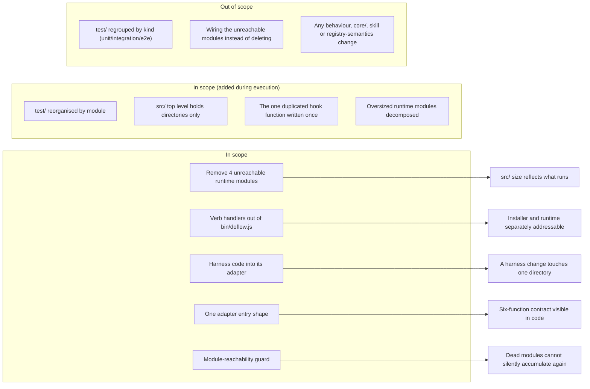

# Feature Requirement: Visible installer/runtime boundary in `src/`

**Feature:** 010-refactor-backend · **Branch:** `feat/010-refactor-backend` · **Status:** Draft
**Created:** 2026-08-19 · **Owner:** Khoa Vu Dang · **Ticket:** none

> WHAT and WHY only — no tech or implementation detail.
>
> **Reconstructed 2026-08-19** after `agent-docs/doflow/` was deleted mid-execution while
> `agent-docs/` was gitignored. Rebuilt from the evidence ledger at
> `.doflow/state/evidence/010-refactor-backend.json` (80 items, 22 supported claims) and the
> branch's commit messages. Every supersession in §9 is preserved. `agent-docs/doflow/` is now
> tracked so this cannot recur.

## 1. Summary

`src/` carries a clean dependency direction but a stale file layout: the installer and the use-time
runtime are one file at the entry point, four runtime modules are unreachable from any caller,
harness-specific code sits in the shared namespace, and the seven adapters present two different
entry shapes for one declared contract. This feature makes the structure match the architecture that
already exists, without changing what DoFlow does.

**Scope boundary:**

## 2. User Stories

- **US1 (P1):** As a DoFlow contributor, I want the installer and the use-time runtime to be
  separately addressable in the file layout, so that I can change one without reading the other.
- **US2 (P1):** As a DoFlow maintainer, I want unreachable modules removed and prevented from
  recurring, so that the size of `src/` reflects what actually runs.
- **US3 (P2):** As a DoFlow contributor, I want harness-specific code to live inside its adapter and
  be reached only through that adapter's public contract, so that adding or changing a harness
  touches one directory.
- **US4 (P3):** As a DoFlow contributor, I want all seven adapters to present the same entry point,
  so that the six-function contract is discoverable from the code rather than only from the registry.
- **US5 (P2):** As a DoFlow contributor, I want the test tree organised by the module it exercises,
  so that finding the tests for a subsystem does not require reading every filename at one flat level.
- **US6 (P2):** As a DoFlow contributor, I want `src/` to contain only directories, each named for
  what it owns, so that placing a new module is a decision with an answer rather than a habit.
- **US7 (P2):** As a DoFlow maintainer, I want hook-handling logic written once rather than copied
  per harness, so that a fix to it cannot land in one adapter and silently miss another.
- **US8 (P3):** As a DoFlow contributor, I want the largest runtime modules broken into cohesive
  units, so that changing one concern does not mean opening a file bigger than the entry point this
  feature just shrank.

## 3. Functional Requirements

**Index** — `Status` is `Live` or `Superseded → <ref>`.

| ID | Requirement | Story | Priority | Status |
|---|---|---|---|---|
| FR-001 | Remove the four unreachable runtime modules | US2 | P1 | Live |
| FR-002 | Fail the build on an unreachable `src/` module | US2 | P2 | Live |
| FR-003 | Verb handlers leave the CLI entry point | US1 | P1 | Live |
| FR-004 | Harness-specific modules live in their adapter | US3 | P2 | Live |
| FR-005 | Lifecycle reaches harness behaviour only via the adapter contract | US3 | P2 | Live |
| FR-006 | The lifecycle view module joins the lifecycle layer | US3 | P2 | Live |
| FR-007 | One uniform adapter entry shape | US4 | P3 | Live |
| FR-008 | Documentation tracks the structure it describes | US1, US3 | P1 | Superseded → FR-009 |
| FR-009 | Tracked documentation is the home for structural prose | US1, US3 | P1 | Live |
| FR-010 | The test tree is organised by module, mirroring `src/` | US5 | P2 | Live |
| FR-011 | `src/`'s top level holds directories only | US6 | P2 | Live |
| FR-012 | Hook-handling logic is shared, not duplicated per harness | US7 | P2 | Superseded → FR-014 |
| FR-013 | The three oversized runtime modules are decomposed | US8 | P3 | Live |
| FR-014 | The one genuinely duplicated hook function is written once | US7 | P3 | Live |

**Detail**

- **FR-001:** The system MUST no longer contain `src/runtime/context-router.js`,
  `src/runtime/retrieval-bridge.js`, `src/runtime/evidence-normalizer.js` or
  `src/runtime/benchmark.js`. None has a requirer in the live tree and none has a test file, so
  their removal orphans no coverage. `src/runtime/freshness.js` and `src/runtime/worktree.js` are
  explicitly NOT covered: each is reached from `test/` or `bench/` and is load-bearing there.
- **FR-002:** The guard suite MUST fail when a `.js` module under `src/` has no requirer from
  `bin/`, `src/`, `test/` or `bench/`, with an explicit, commented allowlist for any deliberate
  exception. This makes FR-001 durable rather than a one-time cleanup: the existing reachability
  guard covers shell scripts, CLI commands and documentation paths, and does not cover JavaScript
  modules, which is how four unreachable modules accumulated without failing anything.
- **FR-003:** The eight runtime verb handlers defined inline in `bin/doflow.js` (`classify`,
  `workflow`, `route`, `claim`, `context-pack`, `verify`, `recover`, `scaffold`) MUST reside under
  `src/runtime/`, leaving `bin/doflow.js` responsible only for argument parsing and dispatch. Every
  verb's handler MUST have exactly one home. This relocates decisions; it does not revisit any.
- **FR-004:** `codex-agents`, `codex-config`, `codex-hooks`, `codex-mcp` MUST reside within
  `src/adapters/codex/`, and `gemini-hooks` within `src/adapters/gemini/`, so that no module named
  for one harness remains in the shared top-level namespace.
- **FR-005:** Where `src/lifecycle/` needs harness-specific behaviour it MUST obtain it from the
  adapter module's public export rather than by importing a file inside the adapter directory. The
  adapter's public API is to be the only way in. Narrowed during design: this governs
  `planGeminiHooks` only. `parseToml` carries no harness knowledge, so it is extracted to a generic
  module instead — routing it through the codex adapter would formalise a dependency on the wrong
  thing rather than remove it.
- **FR-006:** `lifecycle-view` MUST reside within `src/lifecycle/`. It requires the lifecycle
  orchestrator, the state ledger and all seven adapters, making it a lifecycle-layer member
  currently placed in the shared namespace.
- **FR-007:** All seven adapters MUST expose a `create<Name>Adapter()` factory returning the six
  contract functions. Two shapes coexist today: five expose a factory, two export directly.
- **FR-008:** Superseded by FR-009; its original text is in §9 History.
- **FR-009:** Each step's commit MUST update both the documentation paths the guard suite checks and
  the prose those documents use to describe the structure. The structural prose MUST live in
  version-controlled documentation — `docs/architecture.md` for the layout narrative and ownership
  table, `docs/capability-map.md` for the adapter surface. `CLAUDE.md` is excluded because
  `.gitignore` makes it untracked; where it duplicates structural prose it MUST be reduced to a
  pointer rather than maintained as a second, uncommittable copy.
- **FR-010:** `test/` MUST be organised into directories mirroring `src/`'s module boundaries —
  `test/adapters/<harness>/`, `test/lifecycle/`, `test/runtime/`, `test/registry/`, `test/state/`,
  `test/shared/` — with whole-CLI and fixture-driven tests in `test/e2e/`. `test/guards/`,
  `test/fixtures/` and `test/hooks/` MUST keep their current locations. No test may be deleted,
  renamed or weakened by the move; only its location and relative `require` depth change. `npm test`
  MUST remain scoped to `test/`.
- **FR-011:** `src/` MUST contain no loose `.js` files. `src/helper/` takes the cross-layer
  primitives — `git`, `marker-merge`, `settings-merge`, `settings-scope`, `prompt`, `toml` — under a
  stated admission rule: **used by two or more layers, and owns no domain concept of its own**.
  `src/install/` takes the installer's own subject matter — `backup`, `context`, `targets`,
  `tool-lifecycle`, `manifest`, `mcp`. Filing the second group under `helper/` is expressly
  rejected: a directory named for what its contents are not is the dumping ground this work removes.
- **FR-012:** Superseded by FR-014; its original text is in §9 History.
- **FR-013:** `src/runtime/verification.js`, `src/runtime/scaffold.js` and `src/runtime/trace.js`
  MUST each be decomposed into cohesive modules, and `generateScaffold()` MUST be broken up. Each is
  larger than `bin/doflow.js` was after FR-003 reduced it. Unlike every other requirement here, this
  cannot be satisfied by relocation: it requires understanding what each module does before cutting
  it, so it MUST be verified by behavioural comparison rather than by the suite alone.
  Constraint discovered during planning: G12 asserts `trace.js` is the only module that writes the
  run ledger and that its single `appendFileSync` is the one guarded by `sanitizeRunEvent`, so
  `RunLedger`, `sanitizeRunEvent` and that write MUST remain in `trace.js`.
- **FR-014:** `verifyHookCommands`, together with the two private helpers it calls, MUST exist once
  rather than once per adapter. These are the only parts of the two adapter hooks modules proven
  byte-identical. The other three same-named exports MUST NOT be merged: `SUPPORTED_EVENTS` shares
  only two of eleven members between codex and gemini, `validateHooksConfig` differs behaviourally
  (codex enforces a `SessionEnd` timeout cap and a `statusMessage` check gemini does not), and
  `classifyClaudeGuardrails` uses a different data structure entirely. Merging any of them would
  change what each harness accepts.

## 4. Non-Functional Requirements

| ID | Constraint | Kind | Status |
|---|---|---|---|
| NFR-001 | Command surface and installed layout unchanged | reliability | Superseded → NFR-005 |
| NFR-002 | Suite green at every commit, single branch | reliability | Live |
| NFR-003 | Guard assertions immutable; only pinned values change | reliability | Live |
| NFR-004 | No new dependency, no new abstraction without cause | maintainability | Live |
| NFR-005 | Command surface unchanged; installed layout unchanged except the projected runtime library | reliability | Live |

**Detail**

- **NFR-001:** Superseded by NFR-005; its original text is in §9 History.
- **NFR-002 (Incremental green):** Each change MUST be its own commit on a single feature branch,
  with the full test suite and the guard suite passing at every commit. A commit that leaves either
  red forfeits the ability to attribute a later failure to the change that caused it.
- **NFR-003 (Guard integrity):** No existing guard assertion may be weakened or removed. Only the
  literal paths and registry values a guard reads may be updated, and only within the same commit as
  the move that invalidated them. FR-002's new guard is an addition, not an amendment.
- **NFR-004 (No added weight):** The repository MUST remain free of runtime and development
  dependencies, and no new abstraction may be introduced unless it removes more complexity than it
  adds. The dependency direction is already correct — acyclic, every cross-layer edge pointing at
  the stable registry — so this work is placement and consolidation.
- **NFR-005 (Observable behaviour):** Every command's name, exit code and output shape MUST be
  unchanged. What the installer writes to disk MUST be unchanged **except** for the `runtime.lib`
  asset, which `core/registry/assets.yaml` declares with `source: src` and projects verbatim into
  `.doflow/runtime/src`. Rearranging `src/` is this feature's entire purpose, so that asset's
  arrangement necessarily changes with it; every other projected tree MUST be byte-identical.

## 5. Out of Scope

- **Reorganising `test/` by test *kind*** — rejected on its own terms: it groups by a property the
  code does not have. FR-010 instead reorganises by module, mirroring `src/`.
- **Wiring the four unreachable modules rather than deleting them** — would turn a subtraction into
  a feature-completion effort requiring an intended caller for each.
- **Any change to observable behaviour**, including fixing a bug noticed en route. A defect found
  during this work is recorded and raised separately.
- **Changes to `core/`, the skill tree, guidance, or registry semantics** — the registry's declared
  content is the input this work must keep satisfying, not something it revises.
- **Reorganising `bench/`.**

## 6. Acceptance Criteria

- [x] No file named `context-router.js`, `retrieval-bridge.js`, `evidence-normalizer.js` or
      `benchmark.js` under `src/runtime/`; `freshness.js` and `worktree.js` still present (FR-001).
- [x] Adding a `.js` file under `src/` with no requirer fails the guard suite (FR-002).
- [x] `bin/doflow.js` defines no verb handler; each verb resolves to one module (FR-003).
- [x] No module whose name identifies a single harness remains directly under `src/` (FR-004).
- [x] No module under `src/lifecycle/` imports a file inside an adapter directory (FR-005, FR-006).
- [x] Each of the seven adapters exports a factory returning the six contract functions (FR-007).
- [x] `src/` contains no loose `.js` files (FR-011).
- [x] `verifyHookCommands` exists once; the three divergent symbols remain per-adapter (FR-014).
- [ ] The three oversized runtime modules are decomposed (FR-013).
- [ ] `test/` is organised by module (FR-010).
- [x] Full suite and guard suite pass at every commit on the branch (NFR-002).
- [x] Every command's exit code and output shape unchanged from the branch point (NFR-005).
- [ ] No documentation names a path that does not exist (FR-009).

## 7. Open Questions

None.

## 8. Assumptions

| ID | Assumption | Affects | Basis |
|---|---|---|---|
| A1 | Story priorities follow the ranked remediation order | US1–US4 | Derived, not elicited |
| A2 | The zero-dependency property is a constraint to preserve | NFR-004 | Observed current state |

**Detail**

- **A1** — Priorities were assigned from the blast-radius ranking produced during architecture
  mapping, not from a question put to the owner. If delivery order matters for a reason outside that
  ranking, the priorities should be restated before planning fixes the phase order.
- **A2** — `package.json` declares neither dependencies nor devDependencies, and the test runner is
  Node's built-in. Read from the repository rather than stated as a requirement; recorded as binding
  because introducing a dependency during a behaviour-preserving restructure would be a substantive
  change this work is not chartered to make.

## 9. History

| Date | ID | Change | Replaced by |
|---|---|---|---|
| 2026-08-19 | FR-008 | Named an untracked file as a commit target | FR-009 |
| 2026-08-19 | NFR-001 | Froze a layout the feature must change | NFR-005 |
| 2026-08-19 | FR-012 | Rested on a faulty duplication measurement | FR-014 |

**Detail**

- **FR-008** — Originally required each step's commit to update the prose describing the structure,
  "including `docs/architecture.md`'s ownership table, `CLAUDE.md`'s architecture section and
  `docs/capability-map.md`". Discovered during task A.1: `.gitignore` line 71 contains
  `/CLAUDE.md` and `git log` for that path is empty, so the file has never been tracked. A commit
  cannot carry an edit to it, making the requirement unsatisfiable as written — the A.1 edits to
  `CLAUDE.md` are real and on disk but absent from commit `b954079`. FR-009 replaces it.
- **NFR-001** — Originally required that "what the installer writes to disk — the `.doflow/` tree
  and each harness's native directories — MUST be byte-identical before and after". Discovered
  during Phase C verification while investigating why the installer's planned change count moved
  from 197 to 195: `core/registry/assets.yaml` declares an asset `runtime.lib` with `source: src`,
  projected verbatim into `.doflow/runtime/src`. `src/` is therefore a shipped asset, not
  build-time-only code, so every file this feature moves changes the installed layout. The count
  delta was exactly the four deletions plus two additions — correct behaviour, not a regression.
  The freeze could not hold as written and was not caught at design time because no test asserts the
  projected tree's shape. NFR-005 keeps the command-surface freeze intact and exempts `runtime.lib`
  alone.
- **FR-012** — Originally required the logic common to the two adapter hooks modules to live in one
  module, on the stated basis that they "share ninety-three identical meaningful lines across five
  contiguous runs". That figure was wrong, and the error was in how it was measured: the scan
  intersected the two files' *sets of line strings*, so every structural line counted as
  duplication — thirty-three of the ninety-three are the single character `}`. The contiguous-run
  figure in the same measurement was sound, and its longest run of twenty-seven lines is the real
  finding. A per-symbol diff established that only `verifyHookCommands` is byte-identical. FR-014
  replaces this with what the evidence supports. The lesson is recorded rather than the number
  quietly corrected: a duplication metric that ignores where lines sit reports boilerplate as
  duplication.
