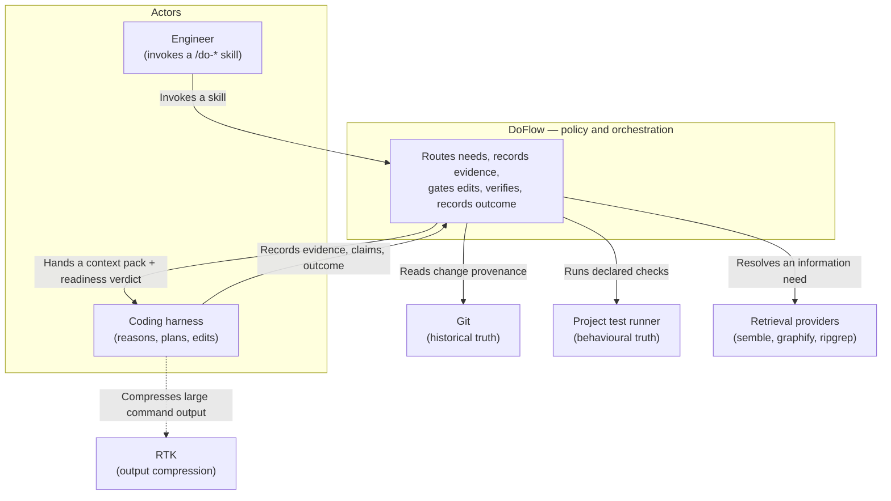
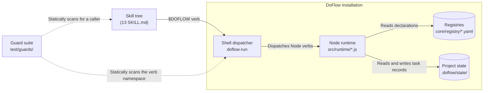
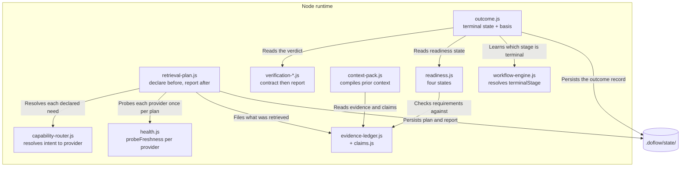
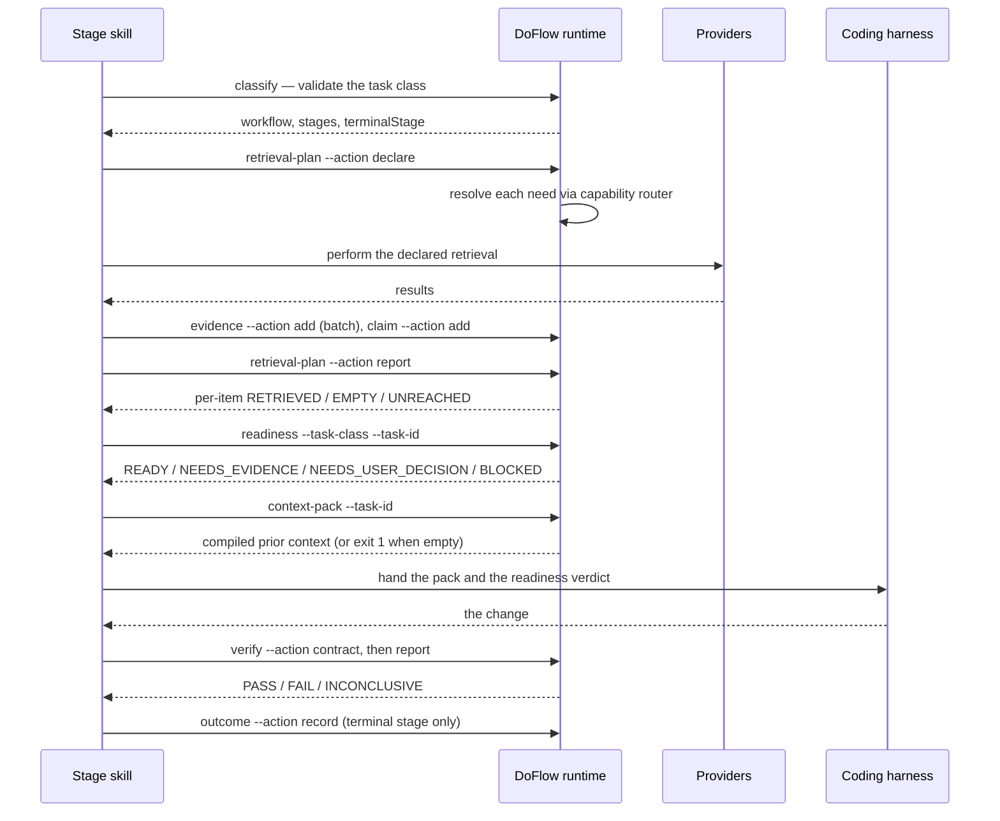

# Design: Runtime Flow Completion

**Feature:** 011-runtime-flow-completion · **Requirement:** ./requirement.md · **Status:** Draft · **Created:** 2026-08-19

> System shape — architecture, APIs, data/interface contracts. Reads ./requirement.md.
> Distinct from plan.md's HOW-to-implement; this is HOW-it's-shaped.
>
> Structure follows `references/ARTIFACT_FORMAT.md`: indexed sections carry a table above full
> `**Detail**`, `Status` is only `Live` or `Superseded → <ref>`, and superseded prose moves to §9.

## 1. Architecture Approach

The shape is deliberately conservative: no new architectural layer, no new dependency, and no
change to the single-dispatcher/single-locator seam that G12 and G15 already hold. Two new runtime
modules join the existing `src/runtime/` set behind two new dispatcher verbs, each modelled on a
primitive that already works — `retrieval-plan` mirrors `verify`'s declare-then-report split, and
`outcome` mirrors `readiness`'s closed-vocabulary state. Everything else in this feature is call
sites: skills gaining invocations of verbs the runtime already exposes.

The enforcement half adds one guard rather than one mechanism. `test/guards/` already asserts
structural truths about this repo's own content, and G16 already closes `require()`-reachability
for `.js` modules; the new guard closes the semantic analogue — a verb reachable from the
dispatcher but from no skill. It carries a documented allowlist in the same shape as G16's, so a
deliberately caller-free verb is a recorded decision rather than an absence.

## 2. System Overview (C4)

### C1: System Context

Who invokes the flow, and which external truth-sources it delegates to. DoFlow owns policy and
sequencing only; every substantive answer comes from a system outside this boundary.



### C2: Container

The units that ship and how they talk. The state store is the only thing this feature adds data to;
the registries are read-only inputs.



### C3: Component

Internals of the Node runtime — the two new modules against the existing ones they mirror and
depend on.



## 3. Components & Boundaries

| ID | Component | Kind | Serves | Status |
|---|---|---|---|---|
| C1 | `retrieval-plan` runtime module and verb | service | FR-010, FR-013, FR-014, FR-015 | Live |
| C2 | `outcome` runtime module and verb | service | FR-011 | Live |
| C3 | Dispatcher verb-namespace extension | script | FR-010, FR-011 | Live |
| C4 | `do-implement` readiness gate and exemption | template | FR-001, FR-002 | Live |
| C5 | ContextPack consumer wiring | template | FR-003, FR-004 | Live |
| C6 | Evidence wiring for review and documentation stages | template | FR-005, FR-006 | Live |
| C7 | Observability consumer in `do` | template | FR-007 | Live |
| C8 | Verb-caller reachability guard | reference | FR-008 | Live |
| C9 | Documentation inventory sync | reference | FR-010, FR-011 | Live |

**Detail**

- **C1** → Owns the declare-then-report contract for retrieval. It exposes two actions: declaring
  the set of information needs a stage intends to resolve and the provider each resolves to, and
  reporting every declared item afterwards with what it returned. It owns the unreached state for
  its own items, and nothing else: it does not perform retrieval, does not choose providers (it
  asks `capability-router` for each), and does not decide whether an unreached item matters — that
  judgement belongs to the stage that declared it. It additionally owns *qualifying* each answer by
  the freshness of the index behind it: it asks `health.js` for each distinct provider's freshness
  once per plan, records that against every need resolving to it, and downgrades an empty answer
  from an unlocatable index to `UNVERIFIED` rather than reporting it as a finding. It does not own
  freshness measurement itself — `probeFreshness` already exists and is reused unchanged — and,
  critically, it does not let freshness change which provider a need resolves to (FR-013, FR-009).
- **C2** → Owns the task's terminal record. It reads the readiness state, the verification verdict
  and the evidence that produced them, and writes one closed-vocabulary state with those as its
  basis. It owns no verdict of its own: it never re-evaluates readiness or re-runs verification,
  and it never converts a state into a number. It deliberately does not own *when* a task ends —
  the workflow's terminal stage decides that and calls it.
- **C3** → The shell dispatcher's verb namespace gains the two new verbs, in `is_node_verb()` and
  in the help text's grouped listing. This component exists as its own entry because G12 asserts
  that every Node verb has a CLI command and vice versa: the namespace and the CLI are one change
  or the guard fails, and treating them as separate work is how they drift.
- **C4** → `do-implement` gains a readiness evaluation before any edit and a documented exemption
  path. It owns the decision to refuse the edit on `BLOCKED` and the reporting of a skipped gate.
  It does not own the readiness rules themselves — those stay in `readiness-templates.yaml` — and
  it explicitly does not gain any behaviour that duplicates the pre-implement-gate hook, which
  FR-012 freezes.
- **C5** → `do-design`, `do-plan`, `do-execute-plan` and `do-implement` gain a ContextPack call
  before they act on prior work. Each call site owns its own handling of the empty-pack failure and
  must state what it decided; the runtime's exit contract is unchanged, so no call site may treat
  the failure as success.
- **C6** → `do-code-review` and `do-document` gain the stage-boundary evidence batch and claim
  recording every other recording stage already performs. They own recording what they found and
  concluded; they gain no gate, no readiness call, and no authority to block.
- **C7** → `do` gains a read of recorded-run observability, surfacing missed capability
  opportunities at the point where routing decisions are actually made. It owns surfacing the
  finding; it owns no automatic action on it, and an analysis that cannot be settled from recorded
  metadata continues to surface as undetermined.
- **C8** → A new guard asserting every verb the dispatcher exposes is invoked by at least one skill
  or appears in a documented allowlist. It owns the assertion and the allowlist's reasons. It
  deliberately does not execute anything: like G16 it scans statically, because a guard that runs
  the code it is auditing can pass for the wrong reason.
- **C9** → `docs/reference.md` and `docs/flags.md` gain the two new verbs. This is a component
  rather than an afterthought because G6, G8 and G10 read those files as inventories and will fail
  the moment the verb namespace and the documented namespace disagree.

## 4. API / Interface Contracts

Both new verbs follow the established CLI shape: `--task-id` keys the record, `--json` switches to
machine output, and a non-zero exit encodes a distinction rather than merely signalling trouble.

```text
doflow retrieval-plan --task-id <id> [--action declare|report] [--need <intent>[,<intent>...]]
                      [--stage <stage-id>] [--json]

  --action declare   Record the intended needs and the provider each resolves to, before retrieval.
                     Resolution per need goes through the capability router; a need with no healthy
                     provider is recorded as declared-unresolvable rather than dropped. Each
                     distinct provider is probed for index freshness once here, and the result is
                     cached on the plan for every need resolving to it.
  --action report    Default. Emit every declared item with its result: RETRIEVED, EMPTY,
                     UNREACHED, UNVERIFIED — and, for any item whose provider index is STALE, the
                     staleness alongside its result. Exit 1 when any required declared item is
                     UNREACHED or UNVERIFIED — neither an unreached lookup nor an ungrounded answer
                     is a completed plan.

doflow outcome --task-id <id> [--action record|show] [--state <state>] [--json]

  --action record    Write the terminal state with its basis, read from the readiness state, the
                     verification report and the evidence ledger for the same task id.
                     Refuses a state outside the closed vocabulary, naming the valid set.
                     Refuses any score-shaped flag by name, as the evidence ledger already does.
  --action show      Default. Emit the recorded outcome. Exit 1 when none exists.
```

**Closed vocabularies.** `retrieval-plan` item results are `RETRIEVED`, `EMPTY`, `UNREACHED`,
`UNVERIFIED` — `EMPTY` means the provider answered with nothing, `UNREACHED` means it was never
asked, `UNVERIFIED` means it answered but its index could not be located so the answer carries no
weight, and collapsing any of these is the failure this component exists to prevent.

Freshness reuses the vocabulary `probeFreshness` already defines — `FRESH`, `STALE`, `UNKNOWN` —
extended with `NOT_APPLICABLE` for providers that have no index concept. Neither token is invented
here: `UNVERIFIED` is already the runtime's word for a probe that could not establish a verdict
(`health.js:32`), and `NOT_APPLICABLE` already means "the alternative was not available, so nothing
was missed" (`trace-views.js:256`). Reusing both keeps one concept to one spelling.

The mapping from freshness to result is deliberately narrow:

| Provider freshness | Empty answer becomes | Reasoning |
|---|---|---|
| `UNKNOWN` | `UNVERIFIED` | No index could be located, so "found nothing" rests on nothing |
| `STALE` | `EMPTY`, marked stale | The index exists and answered; it is behind, which is a known limitation of real evidence rather than an absence of evidence |
| `FRESH` | `EMPTY` | A genuine negative finding |
| `NOT_APPLICABLE` | `EMPTY` | A live filesystem or history scan is current by construction; grep finding nothing is the most trustworthy negative available |

`outcome` states are
`COMPLETED`, `BLOCKED`, `ABANDONED`, `INCONCLUSIVE`, matching `readiness`'s four-state shape and
reusing `verification`'s meaning of `INCONCLUSIVE`: a verdict over zero evidence is not a pass.

**Unchanged contracts.** `context-pack`'s exit 1 on an empty pack is not modified (FR-004), and no
existing verb's flags change. The four skills newly calling `context-pack` each handle that exit
themselves.

## 5. Data Model

Two new per-task records, stored beside the existing evidence records under the invoking project's
state root — the same location and the same task-id safety constraint `evidence-ledger.js` already
enforces, so a task id can never name a path.

```text
.doflow/state/
  evidence/<taskId>.json        (existing)
  retrieval/<taskId>.json       (new — C1)
  outcome/<taskId>.json         (new — C2)
```

**`retrieval/<taskId>.json`** — a declared plan plus its report:

| Field | Meaning |
|---|---|
| `taskId` | The record's key; validated by the existing safe-id rule |
| `stage` | The stage id that declared the plan |
| `declaredAt` | When the plan was declared, stamped by the runtime |
| `providers{}` | Freshness probed once per distinct provider at declare time, keyed by provider id |
| `providers{}.state` | `FRESH` / `STALE` / `UNKNOWN` / `NOT_APPLICABLE` |
| `providers{}.artifact` | The index path that was located, or `null` when none was |
| `providers{}.refresh` | The command that would rebuild it, carried through from `PROVIDER_ARTIFACTS` |
| `needs[]` | One entry per declared information need |
| `needs[].intent` | The route intent this need resolves through |
| `needs[].provider` | What the capability router resolved it to, or `null` when unresolvable |
| `needs[].result` | `RETRIEVED` / `EMPTY` / `UNREACHED` / `UNVERIFIED`; `UNREACHED` until the report says otherwise |
| `needs[].evidenceIds[]` | Ledger ids this need produced, linking the plan to what it yielded |

**`outcome/<taskId>.json`** — the terminal record:

| Field | Meaning |
|---|---|
| `taskId` | The record's key |
| `state` | One of `COMPLETED` / `BLOCKED` / `ABANDONED` / `INCONCLUSIVE` |
| `recordedAt` | Stamped by the runtime, never accepted from the caller |
| `basis.readiness` | The readiness state at the time the outcome was recorded |
| `basis.verification` | The verification report's verdict |
| `basis.evidenceCount` | How many ledger items the task holds — a count of records, not a score |
| `basis.unreached[]` | Declared items no run reached, carried forward from retrieval and verification |
| `writtenByStage` | The terminal stage that wrote it, for provenance |

Freshness is measured at the write for both records, exactly as the evidence ledger does it —
never accepted from the caller. Note the deliberate normalisation: a need stores no freshness of its
own, only its provider id, and reads the state from `providers{}`. Copying the state onto every need
would let two needs resolving to the same provider disagree about that provider's index, which is a
contradiction the record should not be able to represent. The `refresh` command is carried because
an unverifiable index is actionable — `PROVIDER_ARTIFACTS` already declares `graphify update .` and
semble's index-building invocation, so the report can state the remedy rather than only the problem.

## 6. Sequence / Data Flow

The target flow with the two new nodes in place. Only the stages that own each step are shown.



## 7. Design Risks & Alternatives Considered

| ID | Risk / Alternative | Disposition | Status |
|---|---|---|---|
| R1 | Allowlist for a deliberately caller-free verb: registry file vs in-guard | rejected | Live |
| R2 | Adding two verbs breaks the G12 namespace/CLI symmetry | mitigated | Live |
| R3 | Two new artifacts carry no surviving prior art | accepted | Live |
| R4 | Standalone detection wrongly exempts a chained run | mitigated | Live |
| R5 | Four new ContextPack call sites each meet exit 1 | mitigated | Live |
| R6 | `trivial-edit` gating proves noisy in practice | accepted | Live |
| R7 | The guard entrenches wiring that measurement may later disprove | accepted | Live |
| R8 | Freshness probing costs a 4000-file scan per provider | mitigated | Live |
| R9 | `PROVIDER_ARTIFACTS` knows only two providers' index layouts | accepted | Live |
| R10 | `STALE` deliberately does not produce `UNVERIFIED` | accepted | Live |

**Detail**

- **R1** → Considered putting the caller-free exemption in a registry file so it is data rather than
  test code. Rejected: G16 already established the in-guard `ALLOWLIST` with a documented reason per
  entry, and a second exemption mechanism in a different place makes the two guards inconsistent for
  no gain. The reason belongs next to the assertion it weakens. Cost if wrong: an exemption is
  invisible to anything that reads only the registries.
- **R2** → G12 asserts one dispatcher, and that every Node verb has a CLI command and vice versa.
  Adding two verbs touches `is_node_verb()`, the help text, the CLI's own command list, and the
  documented inventories G6/G8/G10 read. Mitigated by treating all of these as one component (C3
  and C9) rather than as follow-up work — the guard fails loudly on a partial change, which is the
  intended behaviour, not a hazard.
- **R3** → RetrievalPlan and TaskOutcome are the only parts of this feature with no surviving
  prior-art finding behind them; the research run reached neither. Accepted deliberately, and both
  are shaped by internal symmetry with primitives that already work rather than by an external
  design. Cost if wrong: their contracts are the most likely to need revision, so they are
  deliberately additive — nothing existing depends on them, and removing them would leave the rest
  of the feature intact.
- **R4** → Exempting on "no evidence record for the task id" is observable and needs no new state,
  but it misfires if a chained run can legitimately reach `do-implement` with nothing recorded.
  Mitigated by FR-002's reporting requirement: an exemption that fires is stated, so a wrong
  exemption is visible rather than silent. This is why the skip must be reported as prominently as
  a block (NFR-004).
- **R5** → `context-pack` exits 1 on an empty pack and FR-004 keeps that. Four new call sites each
  have to decide what empty means for them, which is four chances to treat a failure as success.
  Mitigated by requiring each site to state its handling, so the decision is reviewable rather than
  implicit in a swallowed exit code.
- **R6** → `trivial-edit` is gated like every other class per the requirement's A2, against its own
  workflow note that it must not be blocked by checks meant for larger work. Accepted as the user's
  explicit choice. Its template requires only an identified target and verified single-file scope,
  so `BLOCKED` should be rare; if it proves noisy, exempting that one class is the smallest possible
  reversal and touches nothing else in this design.
- **R7** → The new guard makes the current wiring hard to undo: once every verb must have a caller,
  removing a call site becomes a guard failure rather than a quiet simplification. Accepted, because
  the allowlist is the intended escape — a verb that measurement shows should not be called gets an
  allowlist entry stating why, which is a recorded decision rather than silent drift back to the
  state this feature exists to fix.
- **R8** → `probeFreshness` calls `newestSourceMtime`, which walks the project tree to a
  `SCAN_FILE_LIMIT` of 4000 files. A plan declaring six needs across two providers would pay six
  scans for two distinct answers. Mitigated by probing once per distinct provider at declare time
  and caching on the plan record, so cost is bounded by provider count rather than by need count.
  Residual cost is one scan per provider per plan, which is why declare-time probing is specified
  rather than lazy probing at report time.
- **R9** → Freshness is only meaningful for providers `PROVIDER_ARTIFACTS` knows how to locate — the
  code graph and the semantic index. Every other provider records `NOT_APPLICABLE`, which is correct
  today because ripgrep and git genuinely have no index. Accepted rather than mitigated: if a future
  provider ships an index and is not added to that map, its answers record `NOT_APPLICABLE` and so
  read as fully trustworthy when they are not. The failure is silent, which is the part worth
  knowing — adding a provider to `capabilities.yaml` should carry an entry there, or a deliberate
  statement that it has no index.
- **R10** → A `STALE` index produces `EMPTY`, not `UNVERIFIED`. The rejected alternative treated any
  non-current index as ungrounding its answers. Accepted because a stale index answered from real
  data and its limitation is known and stated, whereas an unlocatable index answered from nothing;
  collapsing the two would repeat, one level down, exactly the empty-versus-unreached conflation
  this component exists to prevent. Cost if wrong: a result postdating a stale index reads as a
  genuine negative. The staleness marker travels with the result so a reader can see it, and the
  `refresh` command is carried so the remedy is one step away.

## 8. Assumptions

| ID | Assumption | Affects | Basis |
|---|---|---|---|
| A1 | The workflow's terminal stage writes the outcome | C2 | User deferred |
| A2 | Analysis and retrieval stages declare a retrieval plan, excluding `operations`' state-check | C1 | User deferred |

**Detail**

- **A1** — Chosen over "do-test writes it" and "do-git writes it". The workflow engine already
  computes `terminalStage` for every class, so binding the outcome write to it needs no new
  per-class decision and stays correct when a class's stages change. The rejected alternatives each
  lose outcomes: verification is optional in several classes, and `do-git` sits outside every
  workflow, so neither fires reliably. If this is wrong — if outcomes should only exist for work
  that actually shipped — the writer moves to `do-git` and `review`-class runs stop producing one.
- **A2** — Chosen over "every recording stage" and "only do-diagnose". Stage kinds `analysis` and
  `retrieval` are where a lookup that never ran actually changes the conclusion, which is what the
  unreached report is for; discovery stages gather from the user rather than from providers, so a
  plan there would be artificial. `operations`' `state-check` stage is kind `analysis` but reads git
  lifecycle state rather than resolving an information need to a provider, so it is excluded by
  name. If this is wrong, the rule widens to all recording stages and discovery plans are mostly
  empty — recoverable, but it would make empty plans normal and so weaken the signal an empty plan
  currently carries.

## 9. History

None — no component or risk has been superseded.

Amended on 2026-08-19 to serve FR-013 through FR-015, added to `requirement.md` by a re-brainstorm
after a provider health check showed both the semantic and structural providers healthy while their
indexes could not be verified. The changes are additive: C1 gained freshness qualification alongside
the contract it already owned, §4's result vocabulary gained `UNVERIFIED` as a fourth state, §5
gained the per-plan `providers{}` cache, and R8 through R10 record what that cost and what it
deliberately does not do. No prior decision was reversed, so no index row carries a tombstone.
