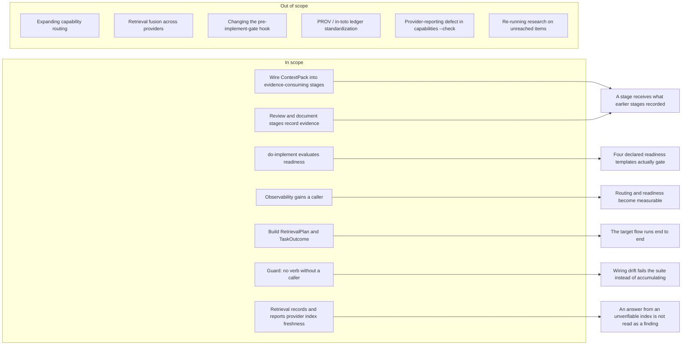

# Feature Requirement: Runtime Flow Completion

**Feature:** 011-runtime-flow-completion · **Branch:** `feat/011-runtime-flow-completion` · **Status:** Draft
**Created:** 2026-08-19 · **Owner:** Khoa Vu Dang · **Ticket:** none

> WHAT and WHY only — no tech or implementation detail. Zero unresolved clarification markers at
> hand-off — every ambiguity is resolved via `AskUserQuestion` before this file is written;
> deferred answers become assumptions in §8.
>
> Structure follows `references/ARTIFACT_FORMAT.md`: indexed sections carry a table above full
> `**Detail**`, `Status` is only `Live` or `Superseded → <ref>`, and superseded prose moves to §9.

## 1. Summary

DoFlow's runtime already implements ten of the twelve nodes in its own target flow, but most of
them are never called by any skill — so capabilities that exist do not run. This feature makes the
declared flow actually execute end to end: it wires the built-but-unwired primitives into the
stages that should use them, adds a guard so a verb can no longer ship without a caller, and builds
the two flow nodes that have no runtime module at all.

**Scope boundary:**

## 2. User Stories

- **US1 (P1):** As an engineer working in a repository that installed DoFlow, I want readiness to
  actually gate my bug, refactor and dependency-change work, so that the templates those classes
  declare protect me rather than merely describing an intention.
- **US2 (P1):** As a DoFlow maintainer, I want a runtime verb to be unable to ship without a
  caller, so that a capability cannot be fully implemented, documented and tested while never
  running — which is how ContextPack reached production with zero callers.
- **US3 (P2):** As an agent executing a stage, I want the evidence and claims earlier stages
  recorded to be compiled and handed to me, so that my work rests on what was established rather
  than on what I can re-derive.
- **US4 (P2):** As a DoFlow maintainer, I want recorded runs to be readable by something that runs,
  so that decisions about routing and readiness become measurable instead of argued.
- **US5 (P3):** As a DoFlow maintainer, I want retrieval declared before it runs and the task's
  terminal state recorded when it ends, so that the flow has no undefined nodes and a run that
  never reached a declared item reports it as unreached.
- **US6 (P3):** As an engineer whose semantic and structural retrieval providers are installed but
  whose indexes DoFlow cannot verify, I want an answer from an unverifiable index to be
  distinguishable from a genuine negative result, so that "the graph found no dependents" and "there
  is no graph" stop looking the same.

## 3. Functional Requirements

**Index** — `Status` is `Live` or `Superseded → <ref>`.

| ID | Requirement | Story | Priority | Status |
|---|---|---|---|---|
| FR-001 | do-implement evaluates readiness and refuses to edit on BLOCKED | US1 | P1 | Live |
| FR-002 | Standalone do-implement invocations are exempt from the readiness gate | US1 | P1 | Live |
| FR-003 | ContextPack is consumed by the stages that act on prior evidence | US3 | P2 | Live |
| FR-004 | The empty-pack exit contract is unchanged; callers handle it | US3 | P2 | Live |
| FR-005 | do-code-review records its findings as evidence and claims | US3 | P2 | Live |
| FR-006 | do-document records its factual basis as evidence and claims | US3 | P2 | Live |
| FR-007 | Recorded-run observability gains a caller | US4 | P2 | Live |
| FR-008 | A guard fails the suite when a dispatcher verb has no caller | US2 | P1 | Live |
| FR-009 | Capability routing is frozen at its current callers | US4 | P2 | Live |
| FR-010 | RetrievalPlan declares retrieval before it runs and reports every declared item | US5 | P3 | Live |
| FR-011 | TaskOutcome records a discrete terminal state with its basis | US5 | P3 | Live |
| FR-012 | The pre-implement-gate hook keeps its current behaviour | US1 | P1 | Live |
| FR-013 | Each declared retrieval need records its provider's index freshness | US6 | P3 | Live |
| FR-014 | An answer from an unverifiable index is a distinct result state | US6 | P3 | Live |
| FR-015 | The retrieval report surfaces the unverifiable-index case at the point of use | US6 | P3 | Live |

**Detail**

- **FR-001:** `do-implement` MUST evaluate the readiness contract for the task class it is serving
  and MUST refuse to modify source when the resulting state is `BLOCKED`, reporting which
  requirement is unmet and what evidence would satisfy it. This applies to every class that names
  `do-implement` as its implementation stage and declares a `readinessTemplate` — `bug`,
  `refactor`, `dependency-change` and `trivial-edit` — with no exemption for `trivial-edit`
  (see A2). The three non-blocking states MUST NOT prevent the edit.
- **FR-002:** When `do-implement` is invoked standalone — no recorded task state for the id it is
  given — it MUST proceed as it does today, without evaluating readiness and without compiling a
  context pack. The escape hatch that `do-implement` exists to provide MUST survive this feature.
  The exemption MUST be reported when it applies, so a skipped gate is visible rather than silent.
- **FR-003:** `do-design`, `do-plan`, `do-execute-plan` and `do-implement` MUST obtain their prior
  context by compiling the recorded evidence and claims for the task, rather than by re-reading
  artifacts directly. Discovery stages remain producers only: they have no prior context to
  compile.
- **FR-004:** The empty-pack failure contract MUST NOT change — nothing recorded stays distinct
  from nothing needed. Each stage added by FR-003 MUST decide for itself what an empty pack means
  and report that decision, rather than the runtime deciding on their behalf.
- **FR-005:** `do-code-review` MUST record its findings as evidence with locators, and its
  conclusions as claims, using the same provenance vocabulary as every other recording stage. A
  finding derived from reading code and a finding asserted from judgement MUST remain
  distinguishable.
- **FR-006:** `do-document` MUST record the factual basis for what it writes as evidence, and its
  conclusions as claims. This is the safeguard its own workflow class names: the characteristic
  failure of documentation work is asserting something nobody checked.
- **FR-007:** At least one skill MUST read recorded-run observability, so that the measurement
  DoFlow already collects is consumed by something that runs. Analysis that cannot be settled from
  recorded metadata MUST continue to report an undetermined result rather than a clear one.
- **FR-008:** The guard suite MUST fail when a verb the dispatcher exposes is invoked by no skill,
  unless that verb is explicitly declared as deliberately caller-free. The declaration MUST state
  why. A failure MUST name the stale side — the unwired verb — rather than reporting a count.
- **FR-009:** No skill that does not already resolve information needs through the capability
  router MUST gain that behaviour in this feature. The router's current reach is treated as a
  deliberate posture pending measurement, not as an incomplete rollout.
- **FR-010:** RetrievalPlan MUST declare, before any retrieval runs, the set of information needs
  the stage intends to resolve and the provider each resolves to. After the run it MUST report
  every declared item, including any the run never reached, which MUST be reported as unreached
  rather than omitted.
- **FR-011:** TaskOutcome MUST record the task's terminal state drawn from a closed vocabulary,
  together with the evidence, readiness state and verification result that produced it. It MUST NOT
  express that state as a number, a percentage or a confidence.
- **FR-012:** The pre-implement-gate hook MUST retain its current behaviour and scope. Readiness
  evaluation inside the skill and file-existence checking inside the hook are two independent
  layers, and neither may be made to depend on the other.
- **FR-013:** Every declared retrieval need MUST record the freshness state of the provider it
  resolved to, alongside that provider. Freshness MUST be measured at the point of use, never
  accepted from the caller, and MUST NOT alter which provider the need resolves to — recording is
  in scope, gating is not (see FR-009 and §5).
- **FR-014:** The result vocabulary for a declared need MUST distinguish a provider that answered
  with nothing from a provider whose answer carries no weight because its index could not be
  verified. These MUST be separate states: an empty answer from a verified index is a negative
  finding, and an empty answer from an unverifiable index is not a finding at all.
- **FR-015:** The retrieval report MUST surface the unverifiable-index case in the same output as
  the unreached case, so the stage that declared the plan sees it immediately rather than through a
  separate command. A recorded freshness state that nothing reports is the same unwired-capability
  failure this feature exists to remove.

## 4. Non-Functional Requirements

| ID | Constraint | Kind | Status |
|---|---|---|---|
| NFR-001 | No primitive expresses its result as a number | correctness | Live |
| NFR-002 | Behaviour is identical across all seven installed harnesses | reliability | Live |
| NFR-003 | The default test command stays scoped to the test tree | reliability | Live |
| NFR-004 | A new gate reports what it skipped as prominently as what it blocked | UX | Live |

**Detail**

- **NFR-001 (No numeric verdicts):** Every state this feature introduces or consumes — readiness,
  retrieval coverage, task outcome — MUST be a discrete state from a stated vocabulary. Score-shaped
  inputs MUST continue to be refused by name. The reason is evidential rather than stylistic: a
  number invites arithmetic across items that were never measured on the same scale, and hides the
  difference between a check that failed and a check that never ran.
- **NFR-002 (Harness parity):** Every behaviour added here MUST reach all seven installed tools
  identically. A gate that fires in one harness and not another is worse than no gate, because it
  makes the guarantee unreliable rather than absent.
- **NFR-003 (Test scoping preserved):** The default test command MUST remain scoped to the test
  tree. Anything this feature adds that produces test-shaped files outside it MUST NOT become
  reachable by the default run.
- **NFR-004 (Skips are as visible as blocks):** Where FR-002 exempts a run from a gate, and where
  FR-010 reports an unreached item, the report MUST make the skip as prominent as a failure. A
  silently skipped check reads as a passed check, which is the failure this feature exists to
  remove.

## 5. Out of Scope

- **Expanding capability routing to further skills** — the router is the least-evidenced primitive
  in the proposal; prior-art research refuted pro-routing and anti-routing claims symmetrically, so
  widening its reach would commit to a design the evidence does not yet support. Revisit once
  FR-007 makes it measurable.
- **Changing the pre-implement-gate hook** — deliberately excluded by FR-012. Putting a runtime
  call in the hot path of every source edit across seven harnesses is a separate decision with its
  own cost.
- **Standardizing the evidence ledger on W3C PROV or in-toto vocabulary** — the highest-confidence
  research finding available, and genuinely worth doing, but it changes a primitive that already
  works rather than making an unwired one run. Its own feature.
- **Re-running research on the five unreached contract items** — verification contracts,
  observability, workflow DAGs, agent routing and the scaffolding-absorption question drew no
  surviving evidence. That gap is real but is answered by research, not by this build.
- **Agent routing changes** — the archetype dispatch already ships; this feature supplies the
  measurement its own sequencing said should come first, and changes nothing about the routing.
- **Retrieval fusion across providers** — running lexical, semantic and structural retrieval
  concurrently and merging their results is a routing behaviour change, and FR-009 freezes routing.
  The prior-art run refuted pro-routing and anti-routing claims symmetrically, so there is no basis
  yet for preferring fusion to the current failover. Revisit once FR-007's observability can show
  whether the semantic leg finds locators the lexical leg missed. FR-013's freshness recording is
  deliberately shaped so it does not presuppose the answer either way.
- **The provider-reporting defect in `capabilities --check`** — it names a declared provider as the
  active one while having silently fallen back to another, which `doctor` reports correctly. This is
  a reporting defect in an existing command rather than a missing capability, so it belongs to a
  `bug`-class task with its own reproduction, not to this feature's design.

## 6. Acceptance Criteria

- [ ] A `bug`, `refactor` or `dependency-change` task whose readiness state is `BLOCKED` cannot
      modify source through `do-implement`, and the refusal names the unmet requirement (FR-001).
- [ ] A standalone `do-implement` invocation with no recorded task state completes as it does
      today, and its report states that the readiness gate was skipped (FR-002, NFR-004).
- [ ] Each of `do-design`, `do-plan`, `do-execute-plan` and `do-implement` obtains prior context by
      compiling recorded evidence and claims (FR-003).
- [ ] Compiling a pack with nothing recorded still fails, and each new caller reports its own
      handling of that case (FR-004).
- [ ] A `do-code-review` run and a `do-document` run each leave evidence and claims recorded
      against the task id, with source-stated and inferred items distinguishable (FR-005, FR-006).
- [ ] At least one skill reads recorded-run observability, and an analysis it cannot settle reports
      an undetermined result rather than a clear one (FR-007).
- [ ] Removing the last caller of any dispatcher verb fails the guard suite, and the failure names
      that verb (FR-008).
- [ ] The set of skills resolving needs through the capability router is unchanged from before this
      feature (FR-009).
- [ ] A stage declares its retrieval before running it, and a declared item the run never reached
      appears in the report as unreached (FR-010, NFR-004).
- [ ] A completed task records a terminal state from a closed vocabulary together with its basis,
      and no state anywhere in the feature is expressed as a number (FR-011, NFR-001).
- [ ] The pre-implement-gate hook's behaviour is byte-identical to before this feature (FR-012).
- [ ] A declared need records the freshness state of the provider it resolved to, and that state
      does not change which provider was chosen (FR-013).
- [ ] With a healthy provider whose index cannot be verified, the need's result is the
      unverifiable-index state rather than the empty state, and a verified provider returning
      nothing still reports empty (FR-014).
- [ ] The retrieval report shows the unverifiable-index case without a second command being run
      (FR-015, NFR-004).
- [ ] The full suite passes on all seven harness targets, and the default test command remains
      scoped to the test tree (NFR-002, NFR-003).

## 7. Open Questions

None.

## 8. Assumptions

| ID | Assumption | Affects | Basis |
|---|---|---|---|
| A1 | The primary user is an engineer in a repository that installed DoFlow, not only a maintainer of this checkout | US1, FR-001 | Not asked — resolved from the code |
| A2 | `trivial-edit` is gated like the other three classes, with no exemption | FR-001 | User rejected the exempt option explicitly |
| A3 | "Standalone" means no recorded task state for the given id | FR-002 | Nearest observable reading of the chosen answer |

**Detail**

- **A1** — `do-implement` ships to seven harnesses through the installer, so the readiness gap is a
  correctness problem in every repository that installed DoFlow, not a tidiness issue in this
  working tree. This was resolved from how the skill is distributed rather than spent as a
  question. If it is wrong — if the intended audience really is only this checkout — then US1 drops
  to P2 and NFR-002 stops being binding.
- **A2** — Offered a variant exempting `trivial-edit` on the grounds that its own workflow note says
  it must not be blocked by checks meant for larger work; the blocking-for-all option was chosen
  over it. Recorded because the tension is real rather than resolved: that class's template requires
  only an identified target and a verified single-file scope, so `BLOCKED` should be rare, but
  when it fires it fires on the workflow explicitly designed to be shortest. If it proves noisy in
  practice, exempting `trivial-edit` is the smallest reversal and changes nothing else.
- **A3** — The chosen exemption needs an observable trigger, and the only one available at the point
  of decision is whether anything is recorded against the task id. This deliberately does not
  attempt to detect user intent. If it turns out that chained runs can also present with no recorded
  state, the trigger is wrong and FR-002 would exempt runs it should have gated.

## 9. History

None — no requirement has been superseded.

FR-013 through FR-015 and US6 were added by a re-brainstorm on 2026-08-19, after a provider health
check on the development machine showed both the semantic and structural providers reporting
healthy while their indexes could not be verified. Nothing already stated became false, so the
addition is additive and no index row carries a tombstone.
