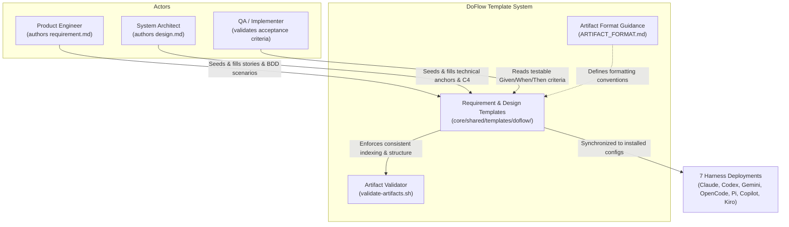
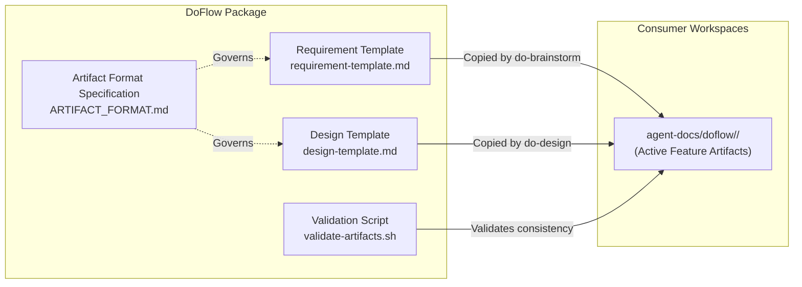
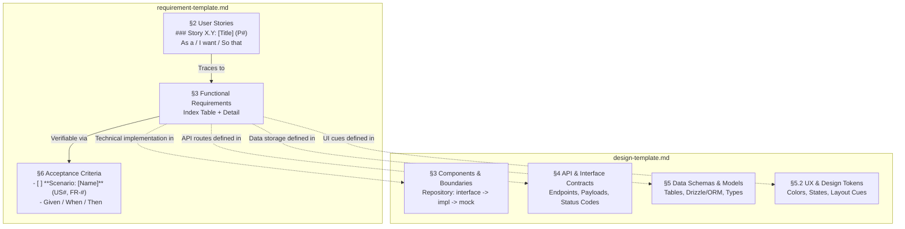
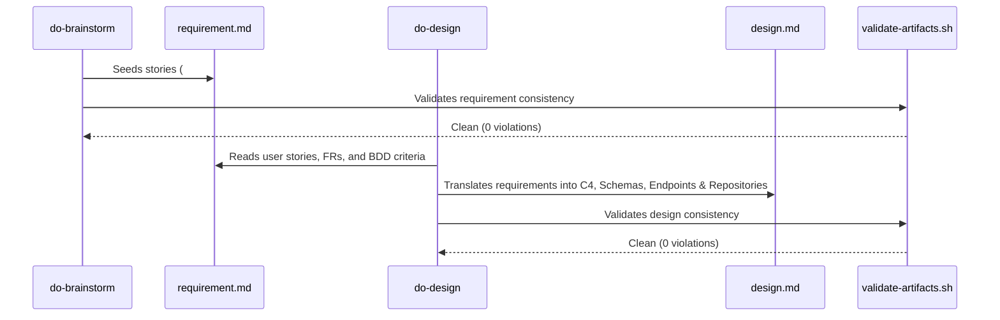

# Design: Enhanced Requirement Template

**Feature:** 012-enhanced-requirement-template · **Requirement:** ./requirement.md · **Status:** Draft · **Created:** 2026-08-19

> System shape — architecture, APIs, data/interface contracts. Reads ./requirement.md.
> Distinct from plan.md's HOW-to-implement; this is HOW-it's-shaped.
>
> Structure follows `references/ARTIFACT_FORMAT.md`: indexed sections carry a table above full
> `**Detail**`, `Status` is only `Live` or `Superseded → <ref>`, and superseded prose moves to §9.

## 1. Architecture Approach

The architecture enhances DoFlow's template system by introducing structured Agile story hierarchies and Gherkin-style BDD scenarios into `requirement-template.md` while providing dedicated technical scaffolding within `design-template.md`. 

To maintain DoFlow's foundational separation of concerns (WHAT/WHY in `requirement.md` vs HOW in `design.md`), technical notes—such as ORM/database schemas, REST/RPC endpoints, repository interface-adapter patterns, and UX tokens—are explicitly routed to dedicated subsections in `design-template.md`. The templates and validation scripts remain zero-dependency pure Markdown and bash, distributed to all 7 harness targets via the standard asset pipeline.

## 2. System Overview (C4)

### C1: System Context

Who interacts with the requirement and design templates, and how the artifacts flow through the engineering lifecycle.



### C2: Container

Deployable components and repository assets modified by this feature.



### C3: Component

Structural layout and sections of the enhanced templates.



## 3. Components & Boundaries

| ID | Component | Kind | Serves | Status |
|---|---|---|---|---|
| C1 | `requirement-template.md` | template | FR-001, FR-002, FR-005 | Live |
| C2 | `design-template.md` | template | FR-003, FR-005 | Live |
| C3 | `ARTIFACT_FORMAT.md` | reference | FR-001, FR-002, FR-003 | Live |
| C4 | `validate-artifacts.sh` | script | FR-004, NFR-003 | Live |

**Detail**

- **C1** → Owns the template structure for feature requirements. It provides hierarchical story templates in §2 (`### Story X.Y: [Title] (P#)`), functional requirement tables in §3, and Gherkin-style Given/When/Then scenario checklists in §6. It strictly enforces the WHAT/WHY boundary by prohibiting raw schema definitions, concrete database queries, or endpoint routing code in requirements.
- **C2** → Owns the template structure for technical architecture and design. It provides explicit subsections for Data Schemas (database tables, ORM models, migrations), API Endpoints (HTTP methods, paths, request/response payloads), Repository & Service Interfaces (`interface` $\rightarrow$ `concrete` $\rightarrow$ `mock`), and UX/UI specifications (color tokens, component states).
- **C3** → Owns the formal formatting rules and authoring guidance in `core/shared/guidance/references/ARTIFACT_FORMAT.md`, documenting the story title syntax, scenario block structure, and index-detail rules.
- **C4** → Owns artifact consistency verification. Validates that scenario checklists in §6 and subsection additions in `design.md` parse cleanly without triggering false orphan warnings or indexing mismatches.

## 4. API & Interface Contracts

### Requirement Template Schema (`requirement-template.md`)

```markdown
## 2. User Stories

### Story 1: [Story Title] (P1)
- **US1 (P1):** As a [role], I want [capability], so that [benefit].

### Story 2: [Story Title] (P2)
- **US2 (P2):** As a [role], I want [capability], so that [benefit].

## 6. Acceptance Criteria

- [ ] **Scenario: [Scenario Title]** (US1, FR-001)
  - **Given** [precondition or initial context]
  - **When** [action or event occurs]
  - **Then** [expected observable outcome]

- [ ] **Scenario: [Scenario Title]** (US2, FR-002)
  - **Given** [precondition]
  - **When** [action]
  - **Then** [expected outcome]
```

### Design Template Schema (`design-template.md`)

```markdown
## 4. API / Interface Contracts

### Endpoints
- `GET /api/v1/[resource]` — [description, query params, response shape]
- `POST /api/v1/[resource]` — [description, request body schema, status codes]
- `PATCH /api/v1/[resource]/:id` — [description, payload, status codes]
- `DELETE /api/v1/[resource]/:id` — [description, status codes]

### Repository & Component Interfaces
- **Repository Pattern:** `[resource].repository.ts` (interface) → `[resource].repository.[engine].ts` (concrete) → `[resource].repository.mock.ts` (mock/testing)

## 5. Data Model

### Database Schemas (ORM / DDL)
- Table `[table_name]`: [fields, primary/foreign keys, indexes, Drizzle/Prisma schema reference]

### UX / UI Specifications
- Component states, layout placement, and design tokens (e.g. status colors, badge variants, modal flows).
```

## 5. Data Model

N/A: This feature introduces no runtime database models or state store changes; all data structures are Markdown template formats.

## 6. Sequence / Data Flow



## 7. Design Risks & Alternatives Considered

| ID | Risk / Alternative | Disposition | Status |
|---|---|---|---|
| R1 | Embedding technical notes directly inside requirement.md | rejected | Live |
| R2 | Inlining Given/When/Then on a single line per criterion | rejected | Live |
| R3 | Validator breaking on multiline scenario checkbox blocks | mitigated | Live |

**Detail**

- **R1** → Considered adding a "Technical Notes" section to `requirement-template.md`. Rejected: Blurring WHAT/WHY with HOW leads to premature implementation lock-in during requirement discovery and violates DoFlow's core architectural principle. Routing technical anchors to `design-template.md` maintains clean separation.
- **R2** → Considered single-line inline Gherkin strings (`Given X, When Y, Then Z`). Rejected: Multiline scenario blocks with sub-bullets provide significantly better visual scannability and readability in Markdown viewers and PR reviews.
- **R3** → Multiline scenario checklists under §6 could potentially conflict with line-by-line checkbox parsers in `validate-artifacts.sh`. Mitigated by verifying that the validator parses top-level `- [ ]` checklist markers independently of nested sub-bullet lines.

## 8. Assumptions

**Index** — `Status` is `Live` or `Superseded → <ref>`.

| ID | Assumption | Affects | Basis |
|---|---|---|---|
| A1 | Existing features 001-011 require no retrofitting | C1, C2, C4 | Backward compatibility (NFR-003) |
| A2 | Single-line acceptance criteria remain valid alongside scenario blocks | C1 | User deferred / flexibility |

**Detail**

- **A1** — Older feature artifacts retain their original structure and will not be retrofitted; the validator already operates on an advisory/consistency model without enforcing rigid version markers.
- **A2** — While Given/When/Then scenario blocks are the standard for behavioral requirements, simple one-line criteria remain valid for non-functional or operational checks.

## 9. History

None — initial version.
