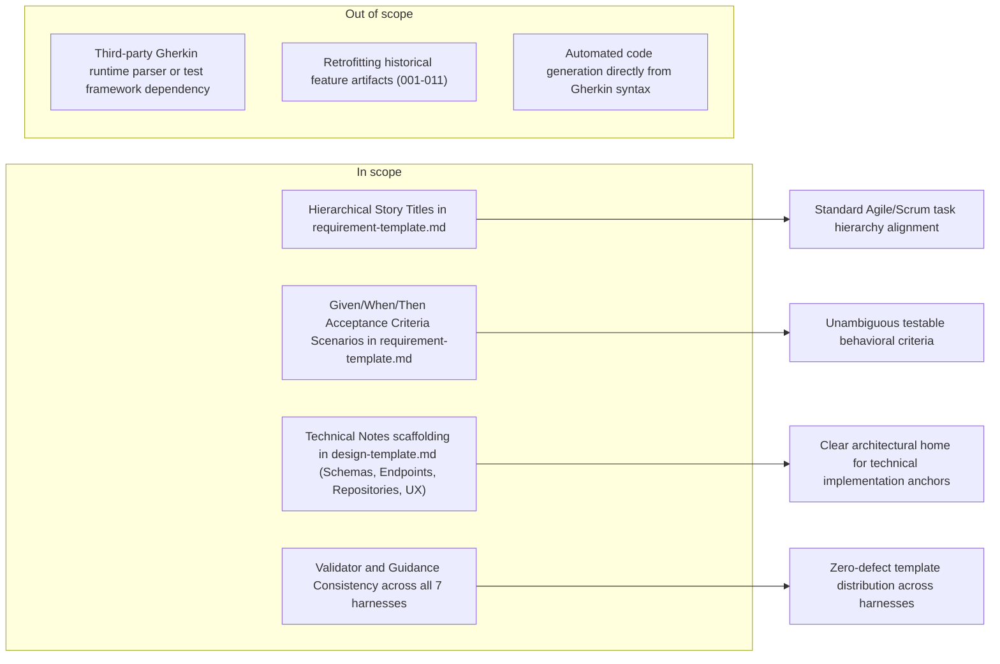

# Feature Requirement: Enhanced Requirement Template

**Feature:** 012-enhanced-requirement-template · **Branch:** `feat/012-enhanced-requirement-template` · **Status:** Draft
**Created:** 2026-08-19 · **Owner:** Khoa Vu Dang · **Ticket:** none

> WHAT and WHY only — no tech or implementation detail. Zero unresolved clarification markers at
> hand-off — every ambiguity is resolved via `AskUserQuestion` before this file is written;
> deferred answers become assumptions in §8.
>
> Structure follows `references/ARTIFACT_FORMAT.md`: indexed sections carry a table above full
> `**Detail**`, `Status` is only `Live` or `Superseded → <ref>`, and superseded prose moves to §9.

## 1. Summary

DoFlow's requirement template currently uses simple flat user story bullet points and basic criteria lists. This feature enhances `requirement-template.md` to support hierarchical story structures (e.g. `Story 3.2: List Management (Projects)`) and Gherkin-style BDD scenarios (`Given / When / Then`) in §6 Acceptance Criteria, while adding explicit scaffolding for technical implementation anchors (database schemas, API endpoints, repository patterns, and UX tokens) into `design-template.md` to preserve DoFlow's core WHAT/WHY vs HOW boundary.

**Scope boundary:**

## 2. User Stories

### Story 1: Hierarchical User Story Definition (P1)
- **US1 (P1):** As an engineer authoring a feature requirement, I want hierarchical story titles (e.g. `Story X.Y: Title`) and standard role/want/benefit syntax in `requirement-template.md`, so that requirements clearly reflect product backlog structure.

### Story 2: Gherkin BDD Acceptance Criteria Scenarios (P1)
- **US2 (P1):** As a developer or QA engineer reviewing requirements, I want acceptance criteria structured as Given/When/Then scenarios referencing story and functional requirement IDs, so that test expectations are explicit, behavioral, and directly verifiable.

### Story 3: Design Template Technical Scaffolding (P2)
- **US3 (P2):** As a system architect creating design artifacts, I want explicit scaffolding in `design-template.md` for schemas, API endpoints, repository interfaces, and UX cues, so that technical notes from discovery have a designated home without leaking into `requirement.md`.

## 3. Functional Requirements

**Index** — `Status` is `Live` or `Superseded → <ref>`.

| ID | Requirement | Story | Priority | Status |
|---|---|---|---|---|
| FR-001 | requirement-template.md supports hierarchical user story headers and role/want/benefit blocks | US1 | P1 | Live |
| FR-002 | requirement-template.md §6 provides Given/When/Then scenario blocks mapped to requirements | US2 | P1 | Live |
| FR-003 | design-template.md provides explicit technical scaffolding for schemas, endpoints, repositories, and UX | US3 | P2 | Live |
| FR-004 | Artifact consistency validator (validate-artifacts.sh) supports enhanced scenario blocks | US2 | P1 | Live |
| FR-005 | WHAT/WHY and HOW boundary is strictly maintained across templates | US1, US3 | P1 | Live |

**Detail**

- **FR-001:** `requirement-template.md` §2 MUST provide scaffolding for hierarchical story headers (`### Story X.Y: [Story Title] (P#)`) alongside the standard `As a [role], I want [capability], so that [benefit]` formulation, allowing both single-level and multi-level story definitions.
- **FR-002:** `requirement-template.md` §6 MUST provide structured BDD scenario blocks with checkboxes and `Given` / `When` / `Then` clauses mapped to specific User Story (`US#`) and Functional Requirement (`FR-###`) IDs.
- **FR-003:** `design-template.md` MUST include explicit sections and subsections for technical implementation anchors, specifically: Data Schemas (database tables/ORM models), API Endpoints (HTTP routes/methods), Repository & Service Interfaces (interfaces, concrete implementations, test mocks), and UX/UI specifications (tokens, component behaviors, design cues).
- **FR-004:** `validate-artifacts.sh` MUST validate the enhanced requirement and design templates without reporting false syntax or indexing errors, ensuring scenario blocks and subsection headers parse cleanly.
- **FR-005:** The template guidance MUST reinforce the separation of concerns: `requirement.md` remains strictly WHAT/WHY (user behavior and functional outcomes), while technical notes (specific database engines, libraries, endpoints, code interfaces) are routed to `design.md`.

## 4. Non-Functional Requirements

**Index** — `Status` is `Live` or `Superseded → <ref>`.

| ID | Constraint | Kind | Status |
|---|---|---|---|
| NFR-001 | Template updates must install and render identically across all 7 supported harnesses | reliability | Live |
| NFR-002 | Templates must remain pure Markdown with zero external parsing dependencies | correctness | Live |
| NFR-003 | Existing feature artifacts (001 through 011) must remain valid and unblocked | reliability | Live |

**Detail**

- **NFR-001 (Harness Parity):** All updated templates in `core/shared/templates/doflow/` MUST be synchronized and deployable across all 7 installed harnesses (`Claude Code`, `Codex`, `Gemini CLI`, `OpenCode`, `Pi`, `Copilot CLI`, `Kiro`) via `doflow update`.
- **NFR-002 (Zero-Dependency Standard):** Templates and scenario structures MUST rely only on standard GitHub Flavored Markdown (GFM) without requiring proprietary extensions or external parser binaries.
- **NFR-003 (Backward Compatibility):** Existing artifacts that use earlier template structures MUST continue to pass validation without modification.

## 5. Out of Scope

- **Third-party Gherkin runtime parser or execution framework:** Automated execution of Gherkin `.feature` files via Cucumber/Behave is out of scope; scenarios are human- and agent-readable specifications.
- **Retrofitting past feature directories (`001`–`011`):** Historical feature artifacts remain untouched as records of past work.
- **Automated code scaffolding from Gherkin syntax:** Code generation from requirements is not part of this template update.

## 6. Acceptance Criteria

- [ ] **Scenario: Requirement Template Story Hierarchy Scaffolding** (US1, FR-001)
  - **Given** `core/shared/templates/doflow/requirement-template.md`
  - **When** an author inspects §2 User Stories
  - **Then** it contains hierarchical story title templates (`### Story X.Y: [Story Title] (P#)`) with role/want/benefit blocks.

- [ ] **Scenario: Requirement Template BDD Acceptance Criteria** (US2, FR-002)
  - **Given** `core/shared/templates/doflow/requirement-template.md`
  - **When** an author inspects §6 Acceptance Criteria
  - **Then** it contains `- [ ] **Scenario: [Name]** (US#, FR-###)` blocks with structured `Given`, `When`, and `Then` clauses.

- [ ] **Scenario: Design Template Technical Anchors** (US3, FR-003)
  - **Given** `core/shared/templates/doflow/design-template.md`
  - **When** an author inspects the component and contract sections
  - **Then** explicit subsections exist for Data Schemas, API Endpoints, Repository Interfaces, and UX/UI specifications.

- [ ] **Scenario: Validator Compatibility** (FR-004, NFR-003)
  - **Given** `validate-artifacts.sh` and the full guard suite
  - **When** `npm test` and `validate-artifacts.sh` are executed
  - **Then** validation passes with 0 errors across all templates and active feature artifacts.

- [ ] **Scenario: Harness Distribution Parity** (NFR-001)
  - **Given** `doflow doctor` and `test/install/` suite
  - **When** harness installation checks run
  - **Then** updated templates are distributed to all 7 harness targets without divergence.

## 7. Open Questions

None.

## 8. Assumptions

**Index** — `Status` is `Live` or `Superseded → <ref>`.

| ID | Assumption | Affects | Basis |
|---|---|---|---|
| A1 | Technical notes (schemas, endpoints, repository interfaces) belong in design.md rather than requirement.md | FR-003, FR-005 | Preserves DoFlow core WHAT/WHY vs HOW separation |
| A2 | Scenario-based acceptance criteria can coexist with single-line criteria in §6 | FR-002, FR-004 | Accommodates simple non-functional or small criteria |

**Detail**

- **A1** — Technical implementation notes (such as SQLite Drizzle schema paths, HTTP endpoints, repository interfaces/mocks, and specific UX colors) are routed to `design-template.md` to keep `requirement.md` strictly focused on user-facing outcomes and business behavior. If this is rejected, technical notes would need to be added to `requirement.md` as an optional subsection.
- **A2** — Gherkin-style Given/When/Then scenario blocks represent the primary recommended format for §6, while single-line criteria remain permissible for concise non-functional criteria.

## 9. History

None — initial version.
