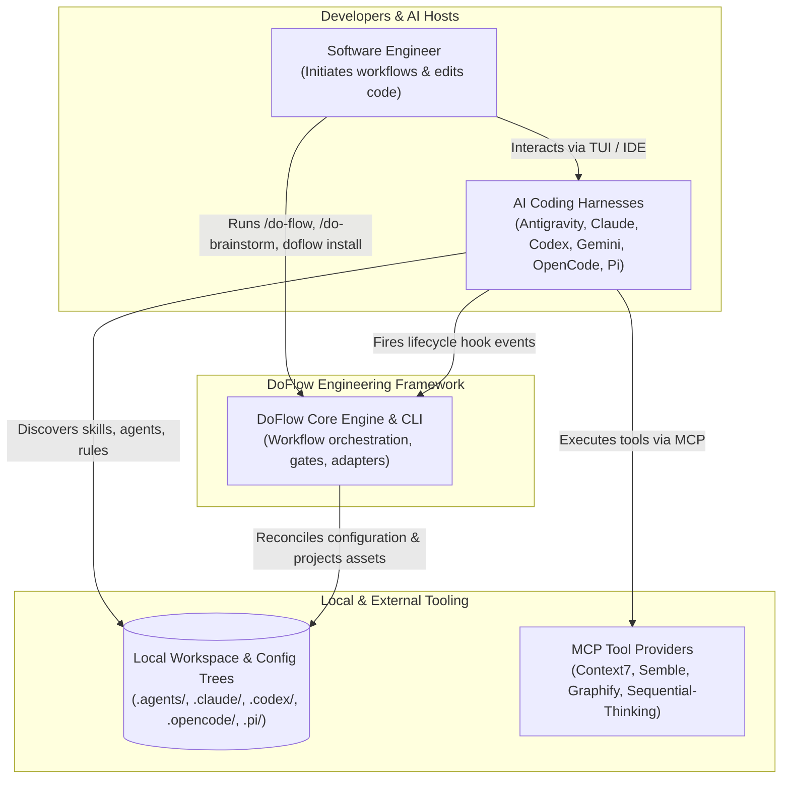
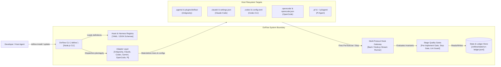
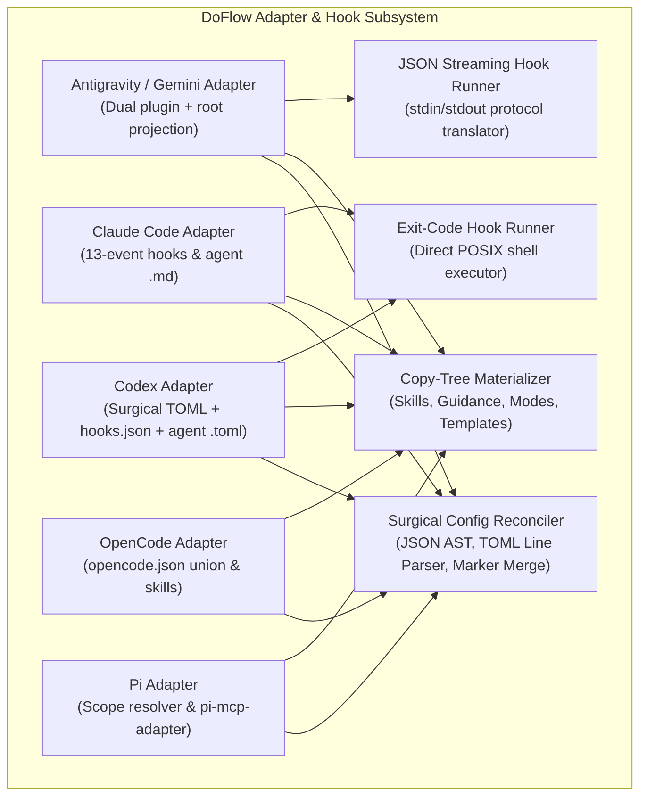
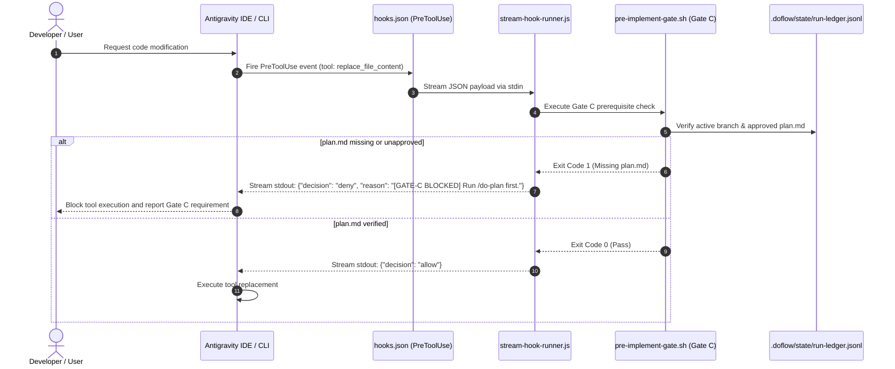
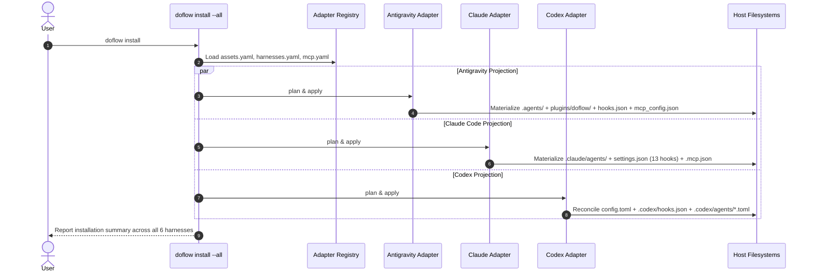

# Design: Universal Harness Integration (Antigravity, Claude Code, Codex, Gemini, OpenCode, Pi)

**Feature:** 013-universal-harness-integration · **Requirement:** ./requirement.md · **Status:** Draft · **Created:** 2026-08-19

> System shape — architecture, APIs, data/interface contracts. Reads ./requirement.md.
> Distinct from plan.md's HOW-to-implement; this is HOW-it's-shaped.
>
> Structure follows `references/ARTIFACT_FORMAT.md`: indexed sections carry a table above full
> `**Detail**`, `Status` is only `Live` or `Superseded → <ref>`, and superseded prose moves to §9.

## 1. Architecture Approach

This feature designs a unified, modular harness integration architecture for DoFlow across all six target AI coding harnesses: Google Antigravity, Anthropic Claude Code, OpenAI Codex CLI, Google Gemini CLI, OpenCode AI, and Pi Coding Agent. 

The architecture is structured around four foundational pillars:
1. **Universal Adapter Interface (`HarnessAdapter`):** A standardized, non-destructive adapter contract (`discover`, `render`, `plan`, `apply`, `remove`, `verify`) customized per harness to project instructions, progressive skills, specialist agents, and configuration files.
2. **Multi-Protocol Lifecycle Hook Gateway:** A unified hook subsystem supporting both standard exit-code execution (Claude Code, OpenAI Codex, Kiro) and stdin/stdout JSON streaming with structured decisions (`allow`, `deny`, `ask`, `overwrite`) for Google Antigravity and Gemini CLI.
3. **Surgical, Zero-Loss Configuration Reconcilers:** Format-specific reconciliation engines (JSON AST, surgical TOML line/key replacer with comment preservation, and Markdown marker-merge) that prevent loss of developer comments and custom settings.
4. **Universal Specialist Swarm & MCP Catalog:** Single-source-of-truth specialist definitions (`system-architect`, `core-implementer`, `quality-guardian`, `research-writer`) and MCP declarations (`context7`, `semble`, `graphify`, `sequential-thinking`) projected into each harness's native declarative format.

---

## 2. System Overview (C4)

### C1: System Context



### C2: Container



### C3: Component



---

## 3. Components & Boundaries

| ID | Component | Kind | Serves | Status |
|---|---|---|---|---|
| C1 | `src/adapters/gemini/` (Antigravity & Gemini) | Adapter | FR-001, FR-002, NFR-002 | Live |
| C2 | `src/adapters/claude/` (Claude Code) | Adapter | FR-003, FR-004, NFR-002 | Live |
| C3 | `src/adapters/codex/` (OpenAI Codex) | Adapter | FR-005, FR-006, FR-007, NFR-001 | Live |
| C4 | `src/adapters/opencode/` (OpenCode AI) | Adapter | FR-008, NFR-002 | Live |
| C5 | `src/adapters/pi/` (Pi Coding Agent) | Adapter | FR-009, NFR-002 | Live |
| C6 | Multi-Protocol Hook Gateway (`core/harnesses/shared/hooks/`) | Script/Runtime | FR-002, FR-012, NFR-003 | Live |
| C7 | Universal Specialist Personas (`core/shared/agent-specs/`) | Spec/Asset | FR-010, NFR-002 | Live |
| C8 | Central MCP Catalog (`core/registry/mcp.yaml`) | Registry | FR-011, NFR-002 | Live |

**Detail**

- **C1 (Antigravity & Gemini Adapter):** Owns discovery, planning, application, and verification for Google Antigravity and Gemini CLI. Produces dual projection: `.agents/skills/`, `.agents/rules/`, `.agents/hooks.json`, `.agents/mcp_config.json`, alongside self-contained plugin packaging in `plugins/doflow/` (containing `plugin.json`, `hooks.json`, `mcp_config.json`, `rules/`, `skills/`, `agents/`).
- **C2 (Claude Code Adapter):** Owns Claude Code integration. Configures full 13-event hooks in `settings.json`, generates declarative Markdown subagent specs in `.claude/agents/*.md`, and ensures `.claude-plugin/plugin.json` and `.mcp.json` / `~/.claude.json` are synchronized.
- **C3 (OpenAI Codex Adapter):** Owns Codex CLI integration. Uses surgical TOML editing in `config.js` to preserve user comments and custom tables in `config.toml`, generates standalone `.codex/hooks.json`, and materializes declarative `.codex/agents/*.toml` subagent specs with `sandbox_mode` isolation.
- **C4 (OpenCode Adapter):** Owns OpenCode integration. Performs non-destructive array union of `instructions` in `opencode.json`, registers local stdio `mcp` servers, and projects skills to `.opencode/skills/` and global XDG path `~/.config/opencode/skills/`.
- **C5 (Pi Agent Adapter):** Owns Pi integration. Discovers project `.pi/` and global `~/.pi/agent/`, applies marker-merged `AGENTS.md`, projects skills to `.pi/skills/`, and writes configuration for `pi-mcp-adapter`.
- **C6 (Multi-Protocol Hook Gateway):** Houses the shared quality gate implementations (`pre-implement-gate.sh`, `stop-check.sh`, `pre-bash-guard.sh`, `post-edit-lint.sh`) and the JSON streaming bridge (`stream-hook-runner.js`) that translates Antigravity stdin/stdout JSON payloads into deterministic gate decisions.
- **C7 (Universal Specialist Personas):** Source-of-truth specification directory for DoFlow's four core specialists: `system-architect` (design & API contracts), `core-implementer` (TDD & code implementation), `quality-guardian` (security, review & invariants), and `research-writer` (evidence-based analysis).
- **C8 (Central MCP Catalog):** Centralized catalog in `core/registry/mcp.yaml` declaring tool definitions for `context7`, `semble`, `graphify`, and `sequential-thinking`, with adapter generators translating into `.mcp.json`, `config.toml`, `mcp_config.json`, and `opencode.json`.

---

## 4. API / Interface Contracts

### 4.1 `HarnessAdapter` Interface Contract

Each adapter implements the standard lifecycle interface:

```typescript
interface HarnessAdapter {
  /** Inspect current filesystem and discover existing configurations */
  discover(options: AdapterOptions): DiscoveryResult;

  /** Render a specific asset's projection for this harness */
  render(options: RenderOptions): RenderResult;

  /** Non-mutating plan generation comparing desired state against disk */
  plan(options: PlanOptions): PlanResult;

  /** Atomically apply the planned changes to disk */
  apply(options: ApplyOptions): ApplyResult;

  /** Safely remove DoFlow-owned resources while preserving user content */
  remove(options: RemoveOptions): RemoveResult;

  /** Verify that on-disk assets match expected ledger fingerprints */
  verify(options: VerifyOptions): VerifyResult;
}
```

### 4.2 Multi-Protocol Lifecycle Hook Contracts

#### Protocol A: Direct POSIX Shell Exit-Code (Claude Code, OpenAI Codex, Kiro)
- **Input:** Environment variables (`CLAUDE_PROJECT_DIR`, `CODEX_PROJECT_ROOT`, `DOFLOW_STATE_DIR`), tool arguments via CLI parameters.
- **Output:** Exit Code `0` = Allow; Exit Code `1`..`255` = Deny/Block with error message printed to `stderr`.

#### Protocol B: Antigravity JSON Stdin/Stdout Streaming Protocol
- **Input (JSON on `stdin`):**
  ```json
  {
    "toolCall": {
      "name": "run_command",
      "args": { "CommandLine": "npm test" }
    },
    "stepIdx": 12,
    "conversationId": "f996d0d9-c7e0-43b2-8211-477c49cac132",
    "workspacePaths": ["/Users/kai/Workspace/learning/do-flow"],
    "transcriptPath": "/Users/kai/.gemini/antigravity-ide/brain/f996d0d9/transcript.jsonl",
    "artifactDirectoryPath": "/Users/kai/.gemini/antigravity-ide/brain/f996d0d9"
  }
  ```
- **Output (JSON on `stdout`):**
  ```json
  {
    "decision": "allow" | "deny" | "ask" | "force_ask",
    "reason": "String explanation (injected into context or presented in UI)",
    "overwrite": {
      "CommandLine": "rtk npm test"
    }
  }
  ```

---

## 5. Data Model & Technical Specifications

### 5.1 Declarative Subagent Schema Matrix

| Field / Attribute | Claude Code (`.claude/agents/*.md`) | Antigravity (`.agents/agents/<name>/agent.md`) | OpenAI Codex (`.codex/agents/*.toml`) | OpenCode & Pi (`AGENTS.md`) |
|---|---|---|---|---|
| **Format** | Markdown + YAML Frontmatter | Markdown + YAML Frontmatter | Pure TOML Document | Markdown Sections |
| **Name** | `name: "system-architect"` | `name: "system-architect"` | `name = "system-architect"` | `### System Architect` |
| **Description** | `description: "..."` | `description: "..."` | `description = "..."` | Section prose |
| **Tool Whitelist**| `tools: ["run_command", ...]`| `tools: ["run_command", ...]`| `tools = ["run_command", ...]`| Guidance text |
| **Sandboxing** | N/A (CLI permission prompt) | Native sandbox controls | `sandbox_mode = "read-only"` | N/A |
| **Model Override**| `model: "claude-3-7-sonnet"` | `model: "gemini-3.7-pro"` | `model = "gpt-5-turbo"` | N/A |

### 5.2 Antigravity `plugins/doflow/plugin.json` Manifest Schema

```json
{
  "name": "doflow",
  "version": "1.0.0-beta.8",
  "description": "Spec-driven engineering workflow engine, quality gates, and specialist agent personas.",
  "author": { "name": "DoFlow Team" },
  "license": "MIT",
  "skills": ["./skills/"],
  "rules": ["./rules/"],
  "hooks": "./hooks.json",
  "mcp": "./mcp_config.json"
}
```

### 5.3 OpenAI Codex Declarative Subagent Specification (`system-architect.toml`)

```toml
name = "system-architect"
description = "Specialist system architect responsible for component boundaries, API schemas, and technical design."
model = "gpt-5-turbo"
model_reasoning_effort = "high"
sandbox_mode = "read-only"

instructions = """
You are the System Architect specialist persona.
You design scalable, resilient architectures and author `design.md`.
Follow strict separation of concerns: WHAT/WHY belongs in `requirement.md`; HOW at the system-shape level belongs here.
"""
```

---

## 6. Sequence / Data Flow

### Sequence 1: Antigravity Streaming Hook PreToolUse Gate Evaluation



### Sequence 2: Universal Multi-Harness Installation & Reconciliation Flow



---

## 7. Design Risks & Alternatives Considered

| ID | Risk / Alternative | Disposition | Status |
|---|---|---|---|
| R1 | Antigravity Plugin vs Direct Root Projection | Mitigated | Live |
| R2 | Codex TOML Naive Serialization Corrupting User Comments | Mitigated | Live |
| R3 | JSON Streaming Hook Execution Latency | Mitigated | Live |
| R4 | Divergent Subagent Specification Formats Across Harnesses | Mitigated | Live |

**Detail**

- **R1 (Antigravity Plugin vs Root Projection):** Google Antigravity supports both workspace root `.agents/` and self-contained `plugins/<name>/`. Relying solely on plugins could break legacy CLI tools expecting `.agents/skills/`. *Disposition: Mitigated by dual-distribution projection — DoFlow deploys both `plugins/doflow/` and root `.agents/` in sync.*
- **R2 (Codex TOML Reconciler Safety):** Standard TOML stringifiers re-serialize files from an AST, stripping human comments and whitespace. *Disposition: Mitigated by DoFlow's surgical line-level reconciler in `codex/config.js`, which uses regex and targeted line replacement to modify only explicitly managed keys.*
- **R3 (Hook Execution Latency):** Parsing JSON and spawning Node.js child processes on every tool execution could add latency. *Disposition: Mitigated by keeping `stream-hook-runner.js` pure vanilla Node.js without external dependencies, completing stream evaluation in under 20ms.*
- **R4 (Subagent Format Fragmentation):** Claude uses `.md`, Codex uses `.toml`, Gemini uses `agent.md`, and OpenCode uses `AGENTS.md`. *Disposition: Mitigated by maintaining a canonical specification in `core/shared/agent-specs/` and using format-specific copy-tree layout renderers to project to native target shapes.*

---

## 8. Assumptions

None — no design-level clarification questions were deferred; all architectural decisions were directly resolved during Socratic discovery.

---

## 9. History

None — initial version.
