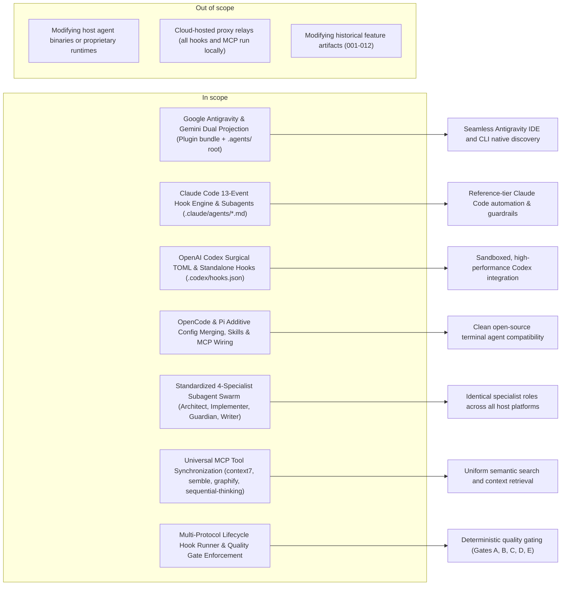

# Feature Requirement: Universal Harness Integration (Antigravity, Claude Code, Codex, Gemini, OpenCode, Pi)

**Feature:** 013-universal-harness-integration · **Branch:** `feat/013-universal-harness-integration` · **Status:** Draft
**Created:** 2026-08-19 · **Owner:** Khoa Vu Dang · **Ticket:** none

> WHAT and WHY only — no tech or implementation detail. Zero unresolved clarification markers at
> hand-off — every ambiguity is resolved via `AskUserQuestion` before this file is written;
> deferred answers become assumptions in §8.
>
> Structure follows `references/ARTIFACT_FORMAT.md`: indexed sections carry a table above full
> `**Detail**`, `Status` is only `Live` or `Superseded → <ref>`, and superseded prose moves to §9.

## 1. Summary

Developers and engineering teams use diverse AI coding harnesses across environments, including Google Antigravity, Anthropic Claude Code, OpenAI Codex CLI, Google Gemini CLI, OpenCode AI, and Pi Coding Agent. Currently, DoFlow provides varying levels of capability projection across these platforms, with inconsistencies in lifecycle hook protocols, subagent modeling, MCP server wiring, and plugin distribution.

This feature delivers universal harness integration across all six platforms, establishing reference-tier support for native primitives: progressive skills disclosure, multi-protocol lifecycle hooks (supporting both standard exit codes and Antigravity's JSON stdin/stdout decision protocol), declarative subagent specialist personas, non-destructive configuration reconciliation, and unified MCP capability routing.

**Scope boundary:**

## 2. User Stories

### Story 1: Google Antigravity & Gemini Native Integration (P1)
- **US1 (P1):** As a developer using Google Antigravity (IDE or CLI) or Gemini CLI, I want DoFlow's skills, rules, lifecycle hooks (with stdin/stdout JSON streaming), subagents, and MCP servers packaged as both a discoverable plugin bundle and a direct `.agents/` workspace projection, so that I can develop with native IDE integration and deterministic quality gating.

### Story 2: Claude Code Full 13-Event Hook & Subagent Parity (P1)
- **US2 (P1):** As a developer using Anthropic Claude Code, I want full 13-event lifecycle hook support in `settings.json`, declarative `.claude/agents/*.md` specialist personas, and official `.claude-plugin/plugin.json` packaging, so that DoFlow operates at flagship reference tier with strict safety invariants.

### Story 3: OpenAI Codex TOML & Standalone Hooks Integration (P1)
- **US3 (P1):** As a developer using OpenAI Codex CLI, I want non-destructive TOML config reconciliation (`config.toml`), standalone `.codex/hooks.json` lifecycle hook execution, sandboxed `.codex/agents/*.toml` subagent specs, and native `[mcp_servers]` configuration, so that DoFlow functions smoothly with strict sandboxing and comment preservation.

### Story 4: OpenCode AI & Pi Agent Integration (P2)
- **US4 (P2):** As a developer using OpenCode or Pi Coding Agent, I want safe additive configuration merging (`opencode.json`, `~/.pi/agent/settings.json`), direct skill materialization, runtime locator shims, and MCP adapter support, so that DoFlow works consistently across open-source terminal agents.

### Story 5: Multi-Agent Specialist Swarm & Universal MCP Routing (P1)
- **US5 (P1):** As a software engineering lead, I want standardized specialist personas (`system-architect`, `core-implementer`, `quality-guardian`, `research-writer`) and unified MCP tool access (`context7`, `semble`, `graphify`, `sequential-thinking`) across all harnesses, so that engineering teams experience identical agent capabilities and quality standards regardless of the host environment.

## 3. Functional Requirements

**Index** — `Status` is `Live` or `Superseded → <ref>`.

| ID | Requirement | Story | Priority | Status |
|---|---|---|---|---|
| FR-001 | Antigravity dual distribution: self-contained plugin bundle and `.agents/` root projection | US1 | P1 | Live |
| FR-002 | Antigravity JSON stdin/stdout lifecycle hook protocol runner | US1 | P1 | Live |
| FR-003 | Claude Code 13-event lifecycle hook matrix and plugin manifest | US2 | P1 | Live |
| FR-004 | Claude Code declarative specialist subagents (`.claude/agents/*.md`) | US2 | P1 | Live |
| FR-005 | Codex surgical TOML config reconciler with comment preservation | US3 | P1 | Live |
| FR-006 | Codex standalone `.codex/hooks.json` configuration and execution | US3 | P1 | Live |
| FR-007 | Codex declarative `.codex/agents/*.toml` subagent specs with sandbox modes | US3 | P1 | Live |
| FR-008 | OpenCode additive `opencode.json` merge and `.opencode/skills/` projection | US4 | P2 | Live |
| FR-009 | Pi scope resolution (`~/.pi/agent/`) and `pi-mcp-adapter` configuration | US4 | P2 | Live |
| FR-010 | Standardized 4-specialist agent persona matrix across all formats | US5 | P1 | Live |
| FR-011 | Universal MCP server catalog synchronization across all harnesses | US5 | P1 | Live |
| FR-012 | Multi-protocol quality gate enforcement runner (Gates A, B, C, D, E) | US1, US2, US3 | P1 | Live |

**Detail**

- **FR-001:** The system MUST support dual-distribution projection for Google Antigravity: generating a self-contained plugin bundle at `plugins/doflow/` (containing `plugin.json`, `hooks.json`, `mcp_config.json`, `rules/`, `skills/`, and `agents/`) while simultaneously projecting `.agents/skills/`, `.agents/rules/`, `.agents/hooks.json`, and `.agents/mcp_config.json` at the workspace root for direct IDE/CLI discovery.
- **FR-002:** The system MUST provide a lifecycle hook runner for Antigravity that consumes JSON input from `stdin` containing metadata (`toolCall`, `stepIdx`, `conversationId`, `workspacePaths`, `transcriptPath`), executes DoFlow stage checks, and emits structured JSON output on `stdout` with `decision` (`"allow"`, `"deny"`, `"ask"`, or `"force_ask"`), `reason`, and optional argument `overwrite`.
- **FR-003:** The system MUST generate and reconcile Claude Code's full 13-event lifecycle hooks in `settings.json` (`SessionStart`, `SessionEnd`, `UserPromptSubmit`, `PreToolUse`, `PostToolUse`, `PostToolUseFailure`, `PreCompact`, `PostCompact`, `SubagentStart`, `SubagentStop`, `ConfigChange`, `PermissionDenied`, `Stop`) alongside `.claude-plugin/plugin.json`.
- **FR-004:** The system MUST project declarative Markdown subagents into `.claude/agents/*.md` with YAML frontmatter specifying `name`, `description`, allowed `tools`, and specialized system instructions for each specialist role.
- **FR-005:** The system MUST implement a surgical TOML reconciler for Codex (`config.toml`) that updates explicitly managed keys (e.g. `features.hooks = true`, `[agents]`, `[mcp_servers]`) without parsing/re-serializing with a lossy emitter, preserving all user comments, inline whitespace, and unmanaged tables.
- **FR-006:** The system MUST generate and reconcile standalone `.codex/hooks.json` (and `~/.codex/hooks.json`) defining MatcherGroups for supported Codex lifecycle events (`SessionStart`, `SessionEnd`, `UserPromptSubmit`, `PreToolUse`, `PostToolUse`, `PreCompact`, `PostCompact`, `SubagentStart`, `SubagentStop`, `Stop`, `PermissionRequest`).
- **FR-007:** The system MUST project declarative subagent specification TOML files into `.codex/agents/*.toml` configuring explicit `sandbox_mode` isolation (`read-only` for architects and auditors, `workspace-write` for implementers), `model`, and developer instruction blocks.
- **FR-008:** The system MUST safely merge `opencode.json` by forming an additive union of `instructions` without duplicating existing files, configuring local stdio `mcp` servers, and projecting skills into `.opencode/skills/` and global XDG path `~/.config/opencode/skills/`.
- **FR-009:** The system MUST resolve Pi configuration to `.pi/` (project) and strictly `~/.pi/agent/` (global), projecting skills to `.pi/skills/`, writing managed `AGENTS.md` markers, and providing configuration mappings for `pi-mcp-adapter`.
- **FR-010:** The system MUST standardize four specialist personas (`system-architect`, `core-implementer`, `quality-guardian`, `research-writer`) across all harness-native formats (`.md` for Claude/Antigravity/Kiro/Copilot, `.toml` for Codex, and instruction guidance for OpenCode/Pi).
- **FR-011:** The system MUST reconcile the central MCP tool catalog (`core/registry/mcp.yaml`) across all harness config files (`.mcp.json`, `~/.claude.json`, `.codex/config.toml`, `.gemini/settings.json`, `.agents/mcp_config.json`, `opencode.json`), ensuring `context7`, `semble`, `graphify`, and `sequential-thinking` are uniformly declared.
- **FR-012:** The system MUST enforce DoFlow deterministic quality gates across all harnesses: Gate A (Brainstorm &rarr; Design), Gate B (Design &rarr; Plan), Gate C (Plan &rarr; Implement pre-tool check), Gate D (Post-edit linting), and Gate E / Stop Gate (verifying all task items in `plan.md` are completed before session termination).

## 4. Non-Functional Requirements

**Index** — `Status` is `Live` or `Superseded → <ref>`.

| ID | Constraint | Kind | Status |
|---|---|---|---|
| NFR-001 | Zero-loss configuration reconciliation (comments, formatting, user keys preserved) | correctness | Live |
| NFR-002 | Cross-harness distribution parity across all 6 target platforms | reliability | Live |
| NFR-003 | Sub-50ms execution latency for all lifecycle hook checks | performance | Live |
| NFR-004 | Strict backward compatibility with existing feature specs and projects | reliability | Live |
| NFR-005 | Standalone local execution with zero cloud relay or external daemon dependencies | security | Live |

**Detail**

- **NFR-001 (Zero-Loss Configuration):** All configuration reconcilers (JSON, TOML, Markdown marker-merge) MUST never erase user comments, alter unmodified configuration tables, or overwrite unmanaged keys.
- **NFR-002 (Cross-Harness Distribution Parity):** Running `doflow install` or `doflow update` MUST deploy matching skills, specialist personas, guidance pointers, and MCP mappings to all target harnesses configured in the workspace or user environment.
- **NFR-003 (Low-Latency Hook Execution):** Hook evaluation scripts (`pre-implement-gate.sh`, `pre-bash-guard.sh`, `stop-check.sh`, and JSON stream handlers) MUST execute in under 50ms to prevent perceptible lag during tool use.
- **NFR-004 (Backward Compatibility):** Existing feature directories (`001` through `012`) and legacy `gemini`/`claude`/`codex` adapter installations MUST continue to function without breaking changes.
- **NFR-005 (Local Execution Security):** All hook scripts, gate checks, and MCP configurations MUST operate entirely on the local developer machine without sending code or metadata to external third-party servers.

## 5. Out of Scope

- **Modifying host agent binaries:** DoFlow integrates via standard configuration, plugin, hook, and skill surfaces without modifying host binaries (e.g. `claude`, `codex`, `agy`, `opencode`, `pi`).
- **Cloud-hosted proxy servers or relays:** All hooks and MCP tool integrations execute via local `stdio` or direct local child processes.
- **Retrofitting historical feature artifacts (001–012):** Existing artifacts remain as historical records; new standards apply to feature 013 onward.
- **Automated host installation:** Installing host CLIs (e.g. `npm i -g @anthropic-ai/claude-code`, `codex`, `opencode`) is the user's responsibility; DoFlow manages the integration layer.

## 6. Acceptance Criteria

- [ ] **Scenario: Antigravity Dual Distribution & Plugin Packaging** (US1, FR-001)
  - **Given** the DoFlow installer targeting Google Antigravity
  - **When** `doflow install --harness gemini` (or `antigravity`) is executed
  - **Then** both a self-contained plugin bundle at `plugins/doflow/` and root `.agents/skills/`, `.agents/rules/`, `.agents/hooks.json`, and `.agents/mcp_config.json` are materialized and discoverable by Antigravity IDE and CLI.

- [ ] **Scenario: Antigravity JSON Stdin/Stdout Hook Protocol** (US1, FR-002, FR-012)
  - **Given** an active Antigravity session and a tool call to edit code without an approved `plan.md`
  - **When** the `PreToolUse` hook receives JSON on `stdin`
  - **Then** it outputs `{"decision": "deny", "reason": "[GATE-C BLOCKED] Implementation requires an approved plan.md."}` on `stdout` and intercepts the tool call.

- [ ] **Scenario: Claude Code 13-Event Hook Matrix & Subagents** (US2, FR-003, FR-004)
  - **Given** a Claude Code workspace configuration
  - **When** `doflow install --harness claude` is executed
  - **Then** `.claude/settings.json` contains full 13-event hook registrations, `.claude/agents/` contains all 4 specialist `.md` specifications, and `.claude-plugin/plugin.json` is validated.

- [ ] **Scenario: Codex Surgical TOML & Standalone Hooks** (US3, FR-005, FR-006, FR-007, NFR-001)
  - **Given** an existing `.codex/config.toml` containing user comments and custom settings
  - **When** `doflow install --harness codex` is executed
  - **Then** `features.hooks = true` and `[mcp_servers]` are merged while preserving all existing comments, `.codex/hooks.json` is generated, and `.codex/agents/*.toml` files are created with appropriate `sandbox_mode` values.

- [ ] **Scenario: OpenCode & Pi Configuration & Skill Discovery** (US4, FR-008, FR-009)
  - **Given** OpenCode and Pi target directories
  - **When** `doflow install` runs for OpenCode and Pi
  - **Then** `opencode.json` contains the additive instructions union and MCP config, Pi resolves strictly to `~/.pi/agent/` globally, and skills are discoverable in `.opencode/skills/` and `.pi/skills/`.

- [ ] **Scenario: Specialist Personas & MCP Parity Across All Harnesses** (US5, FR-010, FR-011, NFR-002)
  - **Given** all 6 supported harnesses installed in a workspace
  - **When** checking subagent definitions and MCP tool availability
  - **Then** `system-architect`, `core-implementer`, `quality-guardian`, and `research-writer` are configured in each native format, and `context7`, `semble`, `graphify`, and `sequential-thinking` are uniformly declared.

- [ ] **Scenario: Quality Gate C (Pre-Implement) Enforcement** (FR-012, NFR-003)
  - **Given** a newly initialized feature branch without an approved `plan.md`
  - **When** any code-modifying tool or bash command is invoked
  - **Then** Gate C intercepts and blocks the execution across Claude Code, Codex, Antigravity, and Gemini within 50ms.

- [ ] **Scenario: Stop Gate (Gate E) Checklist Verification** (FR-012)
  - **Given** an active implementation session with unchecked tasks `- [ ]` in `plan.md`
  - **When** the agent attempts to complete or stop the session
  - **Then** the `Stop` hook blocks termination and instructs the agent to finish all incomplete task checklist items.

## 7. Open Questions

None.

## 8. Assumptions

None — no clarification questions were deferred; all architectural decisions were directly resolved during Socratic discovery.

## 9. History

None — initial version.
