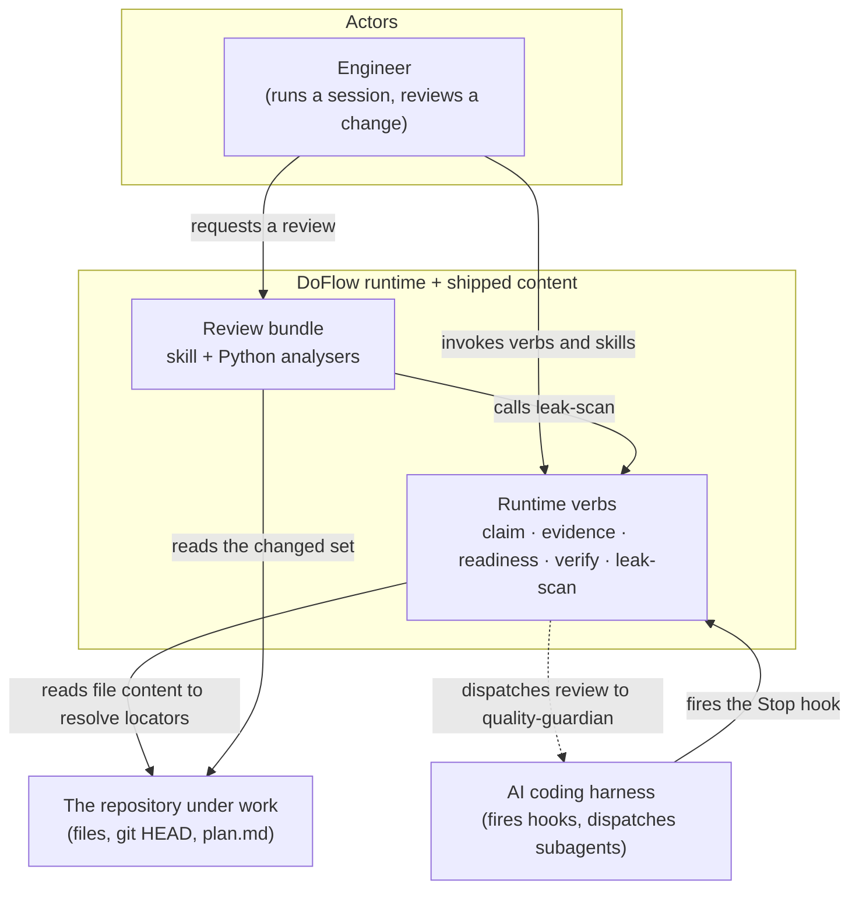
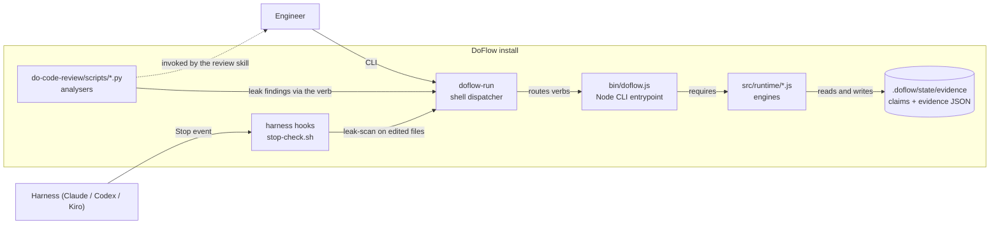
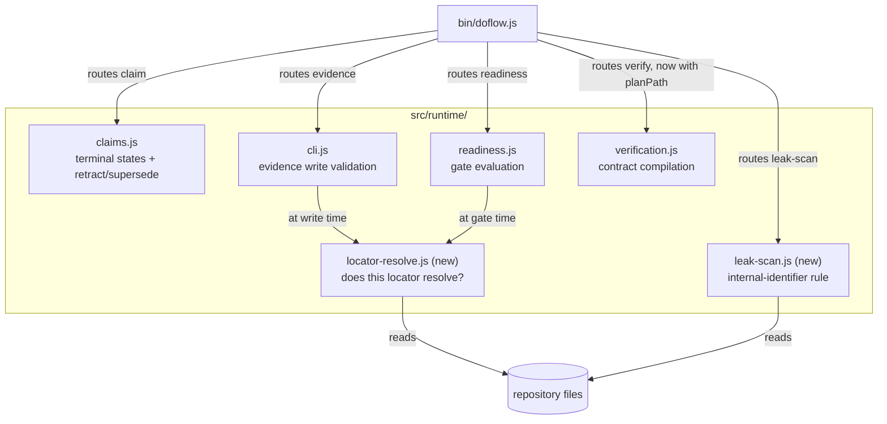
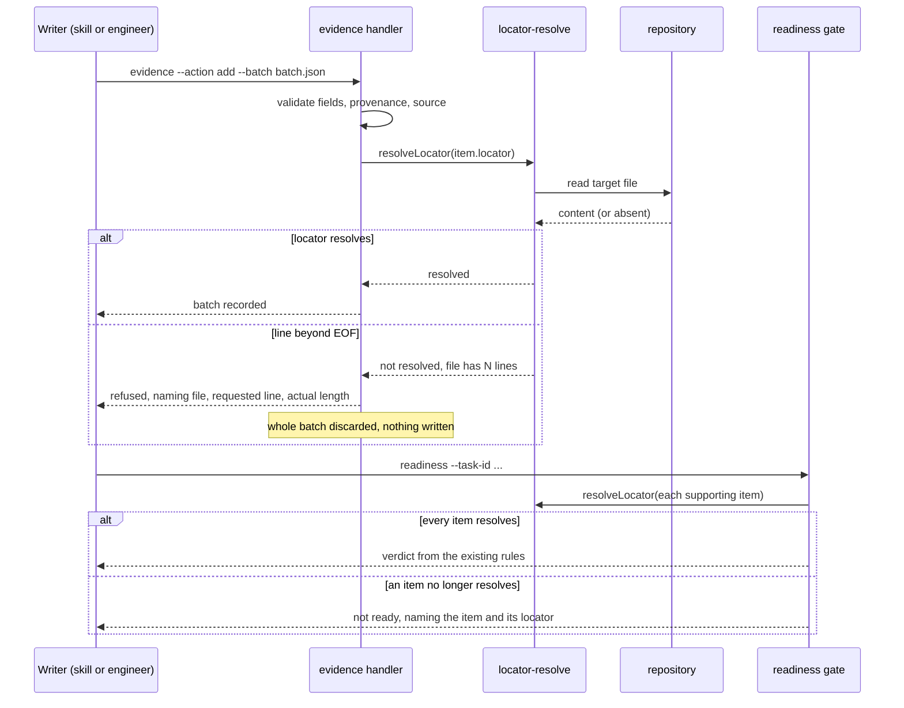

# Design: Runtime Integrity Gaps

**Feature:** 014-runtime-integrity-gaps · **Requirement:** ./requirement.md · **Status:** Draft · **Created:** 2026-08-20

> System shape — architecture, APIs, data/interface contracts. Reads ./requirement.md.

## 1. Architecture Approach

The twelve requirements land on four existing seams and add no new one. Three JavaScript runtime
modules gain behaviour (`claims.js`, `cli.js`, `verification` wiring in `bin/doflow.js`); one new
runtime module holds the leak rule so a single implementation serves both callers; the Python
analyser bundle gains coverage and an honest coverage report; and two shipped content files — the
review skill and the Claude Stop hook — gain callers, not logic.

Two structural constraints shape every choice below. **G12 forbids a verb having two
implementations**, which is why the leak rule becomes a runtime verb rather than a bash pattern in
one place and a Python pattern in another. **G16 requires every `src/` module to be reachable by a
static require**, which is why the shared locator resolver is required by both `cli.js` and
`readiness.js` rather than duplicated in each. Both rules point the same way: put the logic in one
module, give it two callers.

## 2. System Overview (C4)

### C1: System Context

### C2: Container

### C3: Component

## 3. Components & Boundaries

| ID | Component | Kind | Serves | Status |
|---|---|---|---|---|
| C1 | Terminal claim states in `claims.js` | runtime module | FR-001, FR-002, FR-003 | Live |
| C2 | `locator-resolve.js` — shared resolvability check | runtime module | FR-004, FR-005 | Live |
| C3 | Write-time locator validation in `cli.js` | runtime module | FR-004 | Live |
| C4 | Gate-time resolvability in `readiness.js` | runtime module | FR-005 | Live |
| C5 | `leak-scan.js` + its verb | runtime module | FR-009, FR-010 | Live |
| C6 | Stop-hook leak pass in `stop-check.sh` | script | FR-010 | Live |
| C7 | Analyser coverage reporting | script | FR-006, FR-008 | Live |
| C8 | YAML, shell, and JSON analysers | script | FR-007 | Live |
| C9 | Review-bundle dispatch entries | reference | FR-007, FR-009, FR-012 | Live |
| C10 | `--plan-path` wiring | runtime module | FR-011 | Live |
| C11 | Inventory and doc updates | reference | NFR-005 | Live |

**Detail**

- **C1** → Adds `retracted` and `superseded` to the claim status vocabulary and a `TERMINAL_CLAIM_STATUSES`
  set, adds a `supersededBy` field to the claim record, and adds two actions to the claim handler. It
  owns one further change without which the rest is inert: `evaluateClaim` returns early for a claim
  already in a terminal state instead of recomputing from evidence links. It does not own the
  readiness gate's reading of claims — that falls out for free, because the gate's block condition
  filters on `status === 'conflicted'` and a terminal claim no longer matches.
- **C2** → A single exported function answering one question: given a locator and a repository root,
  does it resolve against the file's current content, and if not, what does the file actually offer?
  It owns file reading, line counting, and symbol presence. It owns no policy — it never decides
  whether an unresolvable locator should refuse a write or fail a gate; both callers decide that.
  Keeping the policy out is what lets FR-004 and FR-005 differ (refuse versus report) on one rule.
- **C3** → Calls C2 from `validateEvidenceItem` for items whose provenance asserts a repository read.
  It owns the refusal message and the field names in it. It inherits batch-atomicity from the
  existing code path rather than reimplementing it: `validateEvidenceItem` already throws, and the
  batch writer already discards the whole batch on a throw.
- **C4** → Calls C2 while evaluating supporting evidence, and reports each unresolvable item by id and
  locator in the gate's output. It owns the distinction between *stale* (the file changed at all,
  already handled by freshness) and *unresolvable* (the locator no longer points at anything) — these
  are different verdicts and must not be collapsed, because a stale-but-resolvable item is still
  checkable by a human and an unresolvable one is not.
- **C5** → Holds the internal-identifier rule as data plus one scanning function, and exposes it as a
  `leak-scan` verb taking a set of paths. It owns the pattern vocabulary and the artifact-directory
  exclusion. It owns no output formatting beyond the verb's own JSON and table shapes; the review
  report renders its own view of the same findings.
- **C6** → Adds one partition and one call to the existing batch loop in `stop-check.sh`. It owns
  nothing but the invocation and the warning text. It deliberately does not own a new hook script, a
  new settings matcher, or a new registry asset: `post-edit-lint.sh` already collects the turn's
  edited paths and `stop-check.sh` already batches work over them, so the always-on requirement is
  met by extending a loop rather than adding a surface.
- **C7** → Changes `analyze_directory` to retain per-file errors instead of discarding them, adds a
  skipped-file list and its reasons to the returned structure, and renders both in `print_report`.
  It owns the verdict's coverage phrasing. This is not a new policy: the review skill's own contract
  already states that a file the derivation includes but the review never opened is reported as not
  reviewed. C7 makes the deterministic tool obey the contract the skill already publishes.
- **C8** → Extends `LANGUAGE_EXTENSIONS` and adds analysis paths for shell, YAML, and JSON. It owns
  what a finding means for each: shell is analysed as code (functions, nesting depth, long bodies,
  unquoted expansion); YAML and JSON are analysed as declarative structure (depth, duplicate keys,
  anchor sprawl, parse validity). It does not own SOLID or cyclomatic reporting for the declarative
  pair, because those readings are meaningless there and a fabricated score is the defect this
  feature exists to remove.
- **C9** → Adds `languages/shell.md` and `content-types/config.md`, their rows in the two dispatch
  tables, the leak-scan step in the review contract, and the dispatch note for offloading a review to
  `quality-guardian`. Naming that archetype obliges the skill to reference `MODEL_SELECTION.md` under
  G9, so that reference is part of this component rather than a later discovery.
- **C10** → Adds `--plan-path` to the CLI value-flag table and passes it through the `verify` case to
  `handleVerifyCommand`. The engine and the override parser are unchanged; they already work. This
  component exists because the entrypoint was the only thing standing between them and the user.
- **C11** → Updates the inventories the guards read: the skill's own `description` line (which
  enumerates supported languages), `docs/reference.md`, `docs/flags.md`, the CLI help text, the
  runtime verb table in `doflow-run`, and any count quoted in `README.md`. It owns keeping guards
  green by updating the inventory rather than relaxing the check.

## 4. API / Interface Contracts

### CLI surface

- `doflow claim --task-id <id> --action retract --claim-id <id>` — moves a claim to `retracted`.
  Refuses an unknown claim id and refuses a claim already terminal, naming its current state.
- `doflow claim --task-id <id> --action supersede --claim-id <id> --replaced-by <id>` — moves the
  first claim to `superseded` and records the forward pointer. Refuses when `--replaced-by` names a
  claim the store does not hold, mirroring the existing refusal for linking unrecorded evidence.
- `doflow leak-scan [--path 
]... [--json]` — reports internal-identifier occurrences in the named
  paths. Exit `0` clean, `1` on findings, and it never exits non-zero for an unreadable path, which
  it reports as unscanned instead.
- `doflow verify --task-id <id> [--plan-path <path>]` — `--plan-path` is new; everything else is
  unchanged.

### Module interfaces

- **`src/runtime/locator-resolve.js`** — `resolveLocator({ locator, repoRoot, fsImpl })` →
  `{ resolved: boolean, reason: string|null, actual: object|null }`. `reason` is one of
  `file-missing`, `line-beyond-eof`, `symbol-absent`, `not-checkable`; `actual` carries what the file
  does offer (its line count, or the symbol's real lines) so the caller can build a message the
  writer can act on. `not-checkable` covers a `uri`-only locator and resolves as `true` — this
  function refuses to invent a verdict about something it cannot read.
- **`src/runtime/leak-scan.js`** — `scanPaths({ paths, repoRoot, fsImpl })` →
  `{ findings: [{file, line, pattern, text}], scanned: [], unscanned: [{file, reason}] }`, plus
  `handleLeakScanCommand(options)` following the existing handler shape.
- **`src/runtime/claims.js`** — `ClaimsManager` gains `retractClaim(id)` and
  `supersedeClaim(id, replacedBy)`, both returning the new status and both throwing on the refusal
  cases above. `TERMINAL_CLAIM_STATUSES` is exported alongside `CLAIM_STATUSES`.

### Python analyser interfaces

- `analyze_file(filepath)` keeps returning an `error` key for a file it cannot analyse; the change is
  entirely in what the caller does with it.
- `analyze_directory(...)` gains `skipped: [{file, reason}]` and `files_skipped: int` in its returned
  structure, and `coverage: "complete" | "partial"`. `print_report` renders a SKIPPED section
  whenever `skipped` is non-empty, and the `"No supported files found"` early return becomes a
  structured result reporting every file as skipped rather than an error string that discards them.

## 5. Data Model & Technical Specifications

### Claim record

The stored claim shape gains one optional field and two vocabulary entries. No existing field
changes meaning, which is what NFR-004 requires.

| Field | Type | Change |
|---|---|---|
| `status` | string | Vocabulary gains `retracted`, `superseded` |
| `supersededBy` | string, optional | New; present only on a `superseded` claim |
| `terminalAt` | string, optional | New; ISO timestamp of the terminal transition |

A claim file written before this feature has neither new field and a status outside the terminal
set, so it loads and evaluates exactly as before.

### Internal-identifier vocabulary

Held as data in `leak-scan.js`, not scattered through the callers:

| Pattern | Matches | Rationale |
|---|---|---|
| Requirement item refs | `FR-###`, `NFR-###`, `US#` | The reported leak's largest share |
| Chain artifact refs | `requirement.md`, `design.md`, `plan.md` named as a source of authority | Traceability language that means nothing downstream |
| Artifact paths | `agent-docs/`, `.doflow/state/` | Paths that do not exist in a consumer's checkout |
| State paths | `.doflow/state/` | Paths that do not exist in a consumer's checkout |

Files under the artifact directory are excluded before matching, because every one of these is
correct usage there.

A bare component reference (`C1`, `C#`) is deliberately **not** a pattern. `C#` is a language name,
so that rule would report every shipped mention of C# as a DoFlow leak, and `C1` is too generic to
carry meaning alone. This was found while building the module and is recorded here rather than left
as a silent difference between the design and the code.

## 6. Sequence / Data Flow

## 7. Design Risks & Alternatives Considered

| ID | Risk / Alternative | Disposition | Status |
|---|---|---|---|
| R1 | Terminal claims resurrected by `evaluateAll` | mitigated | Live |
| R2 | Write-time locator checks reject legitimate batches | accepted | Live |
| R3 | Gate-time resolution re-reads files on every evaluation | accepted | Live |
| R4 | Leak scan produces false positives on DoFlow's own docs | mitigated | Live |
| R5 | Alternative: a new hook script for the leak check | rejected | Live |
| R6 | Alternative: two leak implementations, bash and Python | rejected | Live |
| R7 | Alternative: declarative verification schemas in config | rejected | Live |
| R8 | Always-on coverage is only always-on where hooks exist | accepted | Live |
| R9 | Extending the language map changes the skill's own description | mitigated | Live |

**Detail**

- **R1** → `evaluateAll()` runs on every `list` and `status` call and `evaluateClaim` unconditionally
  rewrites `status` from evidence links. Without an early return for terminal states, a retraction
  would be undone by the next read and the feature would appear to work while doing nothing. Mitigated
  by the early return in C1, and this is the single most important line in the change.
- **R2** → A locator naming a file mid-edit, or a line that a concurrent write has just moved, will be
  refused. Accepted: the writer is still holding the batch and can re-read, which is cheaper than the
  alternative of a gate that grades unresolvable evidence as support. If it proves noisy, FR-005 is
  specified independently and the check can move to gate time without touching FR-005's design.
- **R3** → Readiness will read each supporting item's target file. Accepted: evidence sets are small,
  the files are already in the OS cache from the run that produced them, and the gate is not on a
  latency-sensitive path. No caching is designed in, because a cache whose invalidation is wrong
  reintroduces exactly the false-READY this feature removes.
- **R4** → DoFlow's own repository legitimately discusses `FR-###` and `agent-docs/` in documentation
  about DoFlow. Mitigated by excluding the artifact directory before matching, by the verb reporting
  rather than blocking, and by the pattern set being data in one module so a false positive is a
  one-line change rather than a redesign.
- **R5** → Rejected. A new hook means a new script, a new settings matcher, a new registry asset, and
  new per-harness lifecycle mappings, to do work the existing Stop hook is already structured to
  batch. The existing collector/batcher split is exactly the shape this needs.
- **R6** → Rejected under G12. Two implementations of one rule drift, and the drift is invisible: the
  hook and the review would disagree about what counts as a leak, and neither would report the
  disagreement. One verb, two callers.
- **R7** → Rejected on evidence. The plan-level override is fully implemented and only unreachable
  from the entrypoint; building a second declaration mechanism beside a working one would leave two
  places to declare the same thing and no rule for which wins.
- **R8** → The Stop hook is `supported` on Claude, Codex and Kiro, and `unavailable` with a guidance
  fallback on Gemini, OpenCode, Pi and Copilot. So the hook half of FR-010 covers three harnesses.
  Accepted: it matches the established lifecycle policy for every other hook, and the review half of
  the leak scan is harness-neutral because it runs through the verb, which every harness reaches.
- **R9** → The skill's `description` frontmatter enumerates supported languages and is what the
  harness matches on for triggering; adding shell, YAML and JSON without updating it would leave the
  bundle able to analyse files it never gets invoked for. Mitigated by treating the description as
  part of C11's inventory rather than as prose.

## 8. Assumptions

None — no design-level clarification questions were deferred.

## 9. History

None — initial version.
