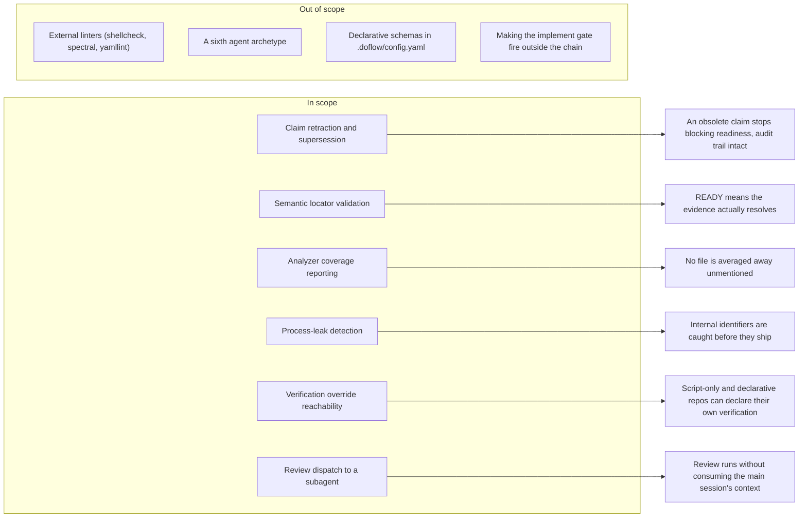

# Feature Requirement: Runtime Integrity Gaps

**Feature:** 014-runtime-integrity-gaps · **Branch:** `feat/014-runtime-integrity-gaps` · **Status:** Draft
**Created:** 2026-08-20 · **Owner:** Khoa Vu Dang · **Ticket:** none

> WHAT and WHY only — no tech or implementation detail. Zero unresolved clarification markers at
> hand-off — every ambiguity is resolved via `AskUserQuestion` before this file is written;
> deferred answers become assumptions in §8.

## 1. Summary

Close six gaps where DoFlow either blocks work it should be able to unblock, or reports success it
has not earned. Five were reported from a real multi-phase run on an external repository and each
was verified against this checkout before being written down; the sixth is a review-dispatch
request raised during discovery. The user-facing outcome is that an engineer can resolve an
obsolete claim through the CLI instead of hand-editing state JSON, and can trust a `READY` gate and
a review verdict to mean what they say.

**Scope boundary:**

## 2. User Stories

### Story 1: Resolving an obsolete claim (P1)
- **US1 (P1):** As an engineer whose plan evolved mid-feature, I want to retract or supersede a
  claim through the CLI, so that a stale conclusion stops blocking the readiness gate without me
  hand-editing state JSON and breaking the audit trail.

### Story 2: Trusting a READY verdict (P1)
- **US2 (P1):** As an engineer relying on the readiness gate, I want evidence whose locator does not
  resolve to be refused, so that a gate reporting `READY` is not resting on a locator that points
  nowhere.

### Story 3: Trusting a review verdict (P1)
- **US3 (P1):** As a reviewer, I want every file the analyzers could not read to be named in the
  report, so that an approving score reflects what was examined rather than what happened to be
  recognised.

### Story 4: Keeping internal process out of shipped files (P2)
- **US4 (P2):** As a maintainer, I want DoFlow's own identifiers flagged when they reach files
  outside `agent-docs/`, so that requirement and design references do not leak into artifacts
  delivered to people who never used DoFlow.

### Story 5: Verifying a repository with no build manifest (P2)
- **US5 (P2):** As an engineer working in a specs-and-scripts repository, I want the verification
  commands my plan declares to actually be used, so that verification resolves instead of stalling
  on manifests my repository does not have.

### Story 6: Reviewing without spending main-session context (P3)
- **US6 (P3):** As an engineer running a review on a large change, I want the review to run in a
  subagent and return its report, so that the analysis does not consume the context I still need
  for the work itself.

## 3. Functional Requirements

**Index** — `Status` is `Live` or `Superseded → <ref>`.

| ID | Requirement | Story | Priority | Status |
|---|---|---|---|---|
| FR-001 | Claim retraction verb with a tombstone status | US1 | P1 | Live |
| FR-002 | Claim supersession verb naming its replacement | US1 | P1 | Live |
| FR-003 | Retracted and superseded claims stay readable and stop gating | US1 | P1 | Live |
| FR-004 | Extracted-evidence locators are checked against file content | US2 | P1 | Live |
| FR-005 | Readiness never reports READY on unresolvable evidence | US2 | P1 | Live |
| FR-006 | Review reports name every unanalysed file | US3 | P1 | Live |
| FR-007 | Analyser coverage extends to YAML, shell, and JSON | US3 | P1 | Live |
| FR-008 | A review verdict accounts for unanalysed coverage | US3 | P1 | Live |
| FR-009 | Review reports flag DoFlow-internal identifiers in shipped files | US4 | P2 | Live |
| FR-010 | An always-on check warns when an internal identifier is written | US4 | P2 | Live |
| FR-011 | A plan's declared verification commands are reachable from the CLI | US5 | P2 | Live |
| FR-012 | Review is dispatchable to the quality-guardian archetype | US6 | P3 | Live |

**Detail**

- **FR-001:** The claim interface MUST accept a retraction action that names an existing claim and
  moves it to a terminal `retracted` state. The claim record, its statement, and its evidence links
  MUST survive the operation unchanged — retraction records that a conclusion no longer holds, it
  does not erase that the conclusion was once drawn. Retracting a claim that does not exist, or one
  already in a terminal state, MUST be refused with a message naming the claim and its current
  state, not silently accepted.
- **FR-002:** The claim interface MUST accept a supersession action that names an existing claim and
  the claim replacing it, moving the first to a terminal `superseded` state that carries a forward
  pointer to the second. The replacement MUST already exist; superseding a claim by an unrecorded id
  MUST be refused, for the same reason linking unrecorded evidence is refused — a forward pointer to
  nothing is worse than no pointer.
- **FR-003:** A claim in a terminal state MUST remain visible in claim listings, showing its state
  and, for supersession, what replaced it. It MUST NOT contribute to a readiness verdict: neither as
  support, nor as the conflict that produced the `BLOCKED` outcome this requirement exists to
  resolve. Evaluation MUST NOT re-derive a terminal claim's state from its evidence links; a human
  decision to retract outranks a mechanical re-reading.
- **FR-004:** When evidence is recorded with a provenance asserting it was read from the repository,
  the runtime MUST confirm the locator resolves against the named file's actual content before
  accepting the item — a line number beyond the file's length, or a named symbol absent from it,
  MUST be refused. Refusal MUST name the file, what was asked for, and what the file actually
  offers, so the writer can correct it rather than guess. Consistent with existing batch semantics,
  one refused item MUST write nothing.
- **FR-005:** The readiness gate MUST NOT return a ready verdict while any evidence item it counts
  as support has a locator that does not resolve. Where an item was accepted earlier and the file
  has since changed, the gate MUST report the item as unresolvable and name it, rather than either
  ignoring it or silently downgrading the whole verdict without saying which item caused it.
- **FR-006:** Every review report MUST name each file that was examined and each file that was not,
  with the reason it was not. A file the analysers could not read MUST NOT be omitted from the
  report or excluded from the count of files considered. This applies whether the unanalysed files
  are the minority of a mixed change or the entirety of it.
- **FR-007:** The analysers MUST recognise and analyse YAML, shell, and JSON files, reporting the
  same shape of finding they report for the languages already covered. Depth is expected to differ
  by file kind; silence is not.
- **FR-008:** A review verdict MUST reflect the proportion of the change that was actually analysed.
  A change whose files were largely unanalysable MUST NOT carry a verdict phrased as though the
  change was reviewed and found sound; the verdict MUST state that coverage was partial and name
  what was left out.
- **FR-009:** A review MUST report occurrences of DoFlow-internal identifiers — requirement and
  design item references, artifact-directory paths, and equivalent process vocabulary — appearing in
  files outside the artifact directory, with file and line for each. Occurrences inside the artifact
  directory are correct usage and MUST NOT be reported.
- **FR-010:** An always-on check MUST warn when a write introduces a DoFlow-internal identifier into
  a file outside the artifact directory, independent of which skill (if any) is running, so that a
  session that never invokes a review still surfaces the leak. The check MUST NOT block the write:
  a legitimate occurrence exists (documentation about DoFlow itself), and a false positive that
  halts work costs more than the leak it prevents.
- **FR-011:** The verification commands a feature's plan declares MUST take effect when verification
  is invoked through the command-line entrypoint, not only when the engine is called directly. Where
  a repository offers no recognised build or test manifest and its plan declares commands, those
  commands MUST be what verification runs.
- **FR-012:** A review MUST be dispatchable to the existing quality-guardian archetype, which
  returns its report to the calling session. The dispatched review MUST produce the same report
  content and verdict vocabulary as an in-session review; only where the work runs changes.

## 4. Non-Functional Requirements

| ID | Constraint | Kind | Status |
|---|---|---|---|
| NFR-001 | No new external tool dependencies | reliability | Live |
| NFR-002 | The always-on check stays fail-open and fast | reliability | Live |
| NFR-003 | No claim or evidence record is ever removed | reliability | Live |
| NFR-004 | Existing state files remain readable | reliability | Live |
| NFR-005 | The structural guard suite stays green | reliability | Live |
| NFR-006 | Every new capability works without chain artifacts | UX | Live |

**Detail**

- **NFR-001 (No new external dependencies):** Nothing in this feature may require a tool that is not
  already required to run DoFlow. Analyser coverage for YAML, shell, and JSON is delivered with what
  ships today. External linters would give richer findings, but they turn a capability that works
  everywhere into one that works where someone happened to install a tool — and the failure mode is
  a silent coverage hole, which is the defect this feature exists to close.
- **NFR-002 (Fail-open and fast):** The always-on check inherits the existing hook contract: any
  uncertainty resolves to allowing the operation, and it must not add perceptible latency to a
  write. A check that stalls or blocks on ambiguity would be removed by its users, at which point it
  protects nothing.
- **NFR-003 (Nothing is removed):** No operation added here may delete a claim or evidence record.
  The audit trail's value is that it is append-only; a retraction that removed the record would make
  the trail unable to answer why a decision changed, which is the question it is kept for.
- **NFR-004 (Existing state remains readable):** State written before this feature must load and
  evaluate without migration. A claim recorded without a terminal state reads as non-terminal;
  evidence recorded before locator validation is not retroactively refused.
- **NFR-005 (Guards stay green):** The repository's structural guards must pass unchanged. Where
  this feature adds a command, a flag, a script, or a documented path, the corresponding inventory
  must be updated in the same change rather than the guard being weakened.
- **NFR-006 (No chain artifacts required):** Every capability here must work in a repository with no
  feature directory and no chain artifacts. Claim and evidence operations, review, and verification
  are used outside the chain as well as inside it.

## 5. Out of Scope

- **External linters (shellcheck, Spectral, Redocly, yamllint)** — excluded by NFR-001. Reconsider
  once the built-in coverage is in place and its limits are measured rather than assumed.
- **A dedicated code-reviewer agent archetype** — excluded because the existing quality-guardian
  archetype already claims code-quality review; a sixth archetype would duplicate it and force a
  narrowing of the fifth.
- **Declarative verification schemas in `.doflow/config.yaml`** — excluded because the plan-level
  override mechanism already exists and is fully implemented. The defect is that it is unreachable,
  not that it is missing; building a second mechanism beside a working one is the wrong fix.
- **Making the implement gate fire outside the chain** — excluded. The gate allowing edits when no
  feature has been started is deliberate, not a defect, and FR-010 covers the leak case without
  changing it.
- **Retroactive validation of already-recorded evidence** — excluded by NFR-004. FR-004 applies at
  write time; FR-005 covers what the gate does when an older item has since stopped resolving.

## 6. Acceptance Criteria

- [ ] **Scenario: An obsolete claim stops blocking the gate** (US1, FR-001, FR-003)
  - **Given** a task whose readiness is blocked by a claim that later analysis made obsolete
  - **When** the engineer retracts that claim through the CLI
  - **Then** the claim is listed as retracted with its statement and evidence links intact, and the
    readiness gate no longer counts it

- [ ] **Scenario: Supersession names its replacement** (US1, FR-002)
  - **Given** a recorded claim and a newer claim that replaces it
  - **When** the engineer supersedes the first by the second
  - **Then** the first is listed as superseded with a forward pointer to the second, and superseding
    by an unrecorded id is refused with a message naming that id

- [ ] **Scenario: A locator that points past the end of a file is refused** (US2, FR-004)
  - **Given** an evidence batch whose extracted item names a line beyond the target file's length
  - **When** the batch is written
  - **Then** the write is refused naming the file, the requested line, and the file's actual length,
    and no item from the batch is recorded

- [ ] **Scenario: A gate does not report READY on evidence that no longer resolves** (US2, FR-005)
  - **Given** a task whose supporting evidence was valid when recorded but whose target file has
    since shrunk past the recorded line
  - **When** readiness is evaluated
  - **Then** the verdict is not ready and the report names the specific item that no longer resolves

- [ ] **Scenario: A mixed change reports what it could not read** (US3, FR-006, FR-008)
  - **Given** a change containing both files the analysers recognise and files they do not
  - **When** the review runs
  - **Then** the report names every unanalysed file with the reason, and the verdict states that
    coverage was partial rather than presenting the analysed subset as the whole

- [ ] **Scenario: A specs-and-scripts change is analysed rather than skipped** (US3, FR-007)
  - **Given** a change consisting of YAML, shell, and JSON files
  - **When** the review runs
  - **Then** findings are reported for those files, and the run does not conclude that no supported
    files were found

- [ ] **Scenario: Internal identifiers in a shipped file are reported** (US4, FR-009)
  - **Given** a file outside the artifact directory containing requirement or design item references
  - **When** the review runs
  - **Then** each occurrence is reported with file and line, and equivalent occurrences inside the
    artifact directory are not reported

- [ ] **Scenario: A leak is surfaced in a session that runs no skill** (US4, FR-010)
  - **Given** a session in which no DoFlow skill has been invoked
  - **When** a write introduces an internal identifier into a file outside the artifact directory
  - **Then** a warning is surfaced and the write proceeds

- [ ] **Scenario: A repository with no build manifest verifies against its plan** (US5, FR-011)
  - **Given** a repository with no recognised build or test manifest, whose plan declares its
    verification commands
  - **When** verification is invoked through the command-line entrypoint
  - **Then** the declared commands are what runs, and no tier is left unresolved for want of a
    manifest the repository does not have

- [ ] **Scenario: A review runs in a subagent** (US6, FR-012)
  - **Given** a change to be reviewed
  - **When** the review is dispatched to the quality-guardian archetype
  - **Then** the calling session receives a report whose content and verdict vocabulary match an
    in-session review

- [ ] No capability added by this feature requires a tool absent from DoFlow's current requirements
      (NFR-001).
- [ ] The always-on check allows the write on any error or ambiguity, and adds no perceptible
      latency (NFR-002).
- [ ] No operation added by this feature removes a claim or evidence record (NFR-003).
- [ ] State written before this feature loads and evaluates without migration (NFR-004).
- [ ] The structural guard suite passes, with inventories updated rather than guards weakened
      (NFR-005).
- [ ] Every capability works in a repository with no feature directory and no chain artifacts
      (NFR-006).

## 7. Open Questions

None.

## 8. Assumptions

| ID | Assumption | Affects | Basis |
|---|---|---|---|
| A1 | Locator validation happens at write time and refuses the item | FR-004 | Existing runtime posture |
| A2 | "Internal identifier" is a closed, configurable vocabulary | FR-009, FR-010 | Not elicited; smallest safe reading |
| A3 | Review offload needs no change to the quality-guardian spec | FR-012 | Its stated capabilities already cover review |
| A4 | Terminal claim states are added, not repurposed | FR-001, FR-002, NFR-004 | Backward compatibility |

**Detail**

- **A1** — The alternative was validating at gate time and warning rather than refusing. Write-time
  refusal was chosen because the runtime already refuses an evidence item whose provenance is
  unstated rather than defaulting it, and refuses a claim link to unrecorded evidence rather than
  grading it — deferring this one check to the gate would put a single advisory check inside an
  otherwise refuse-first interface. It is also where the error is most actionable: the writer is
  still holding the batch. If this turns out wrong, the symptom is legitimate batches being refused
  for files that are mid-edit, and the fix is to move the check to the gate under FR-005, which is
  specified independently and does not depend on A1.
- **A2** — The set of patterns counting as internal (requirement and design item references,
  artifact-directory paths) was not elicited item by item. Assuming a closed, configurable set
  rather than an open heuristic keeps false positives bounded and reviewable. If wrong, the symptom
  is leaks passing undetected, and widening the set is a configuration change rather than a redesign.
- **A3** — quality-guardian's specification already lists code quality review among its
  capabilities, so FR-012 is assumed to need dispatch wiring rather than a specification change. If
  wrong, the symptom is a dispatched review producing findings that differ in kind from an in-session
  one, and the fix is a narrowing edit to that specification.
- **A4** — `retracted` and `superseded` are assumed to be additions to the claim state vocabulary,
  leaving existing states and their meanings untouched. Repurposing an existing state would make old
  state files read differently after upgrade, which NFR-004 forbids.

## 9. History

None — initial version.
