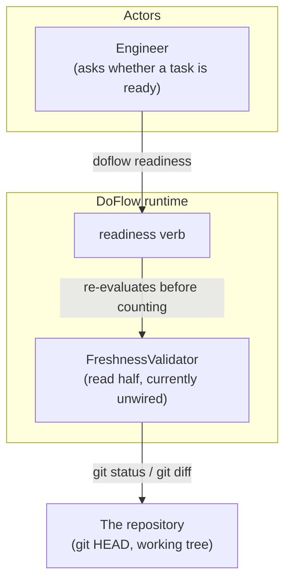
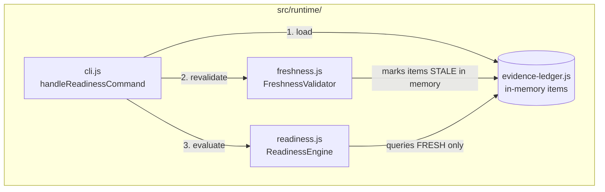
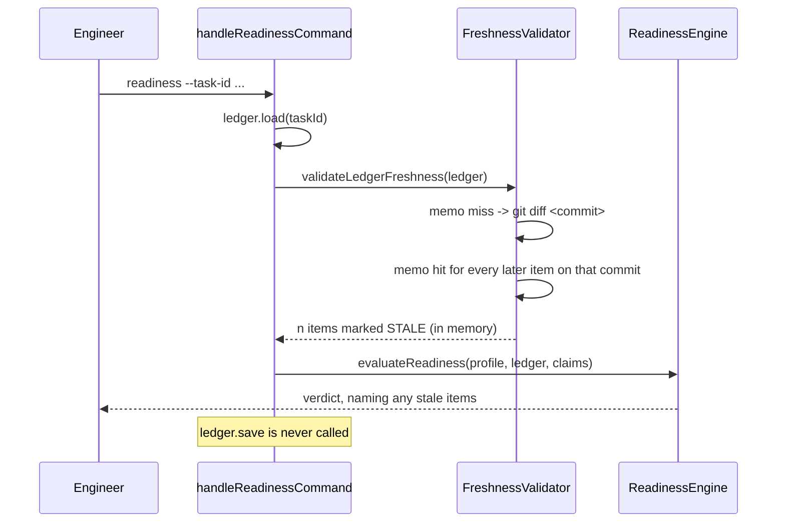

# Design: Freshness Wiring

**Feature:** 019-freshness-wiring · **Requirement:** ./requirement.md · **Status:** Draft · **Created:** 2026-08-21

## 1. Architecture Approach

One call site and one memo. `handleReadinessCommand` already loads the ledger and constructs the
engine; freshness re-evaluation slots between those two steps. `FreshnessValidator` needs no new
capability — it needs a caller and a cache.

## 2. System Overview (C4)

### C1: System Context

### C2: Container

N/A: single process, no deployable boundary crossed.

### C3: Component

## 3. Components & Boundaries

| ID | Component | Kind | Serves | Status |
|---|---|---|---|---|
| C1 | Re-validation call in `handleReadinessCommand` | runtime module | FR-001, FR-002 | Live |
| C2 | Per-commit diff memo in `FreshnessValidator` | runtime module | FR-003 | Live |
| C3 | Stale reporting in the readiness verdict | runtime module | FR-004 | Live |

**Detail**

- **C1** → Calls `validateLedgerFreshness` on the loaded ledger before the engine evaluates, and
  never calls `ledger.save`. The ledger object is mutated in memory only, which is what keeps a read
  operation from writing.
- **C2** → A `Map` from commit sha to the modified-file `Set`, held on the validator instance and
  therefore per invocation. Evidence written in one batch shares one commit, so the common case
  collapses from one `git diff` per item to one per batch.
- **C3** → Reports the stale items by id and locator alongside the existing unresolvable list, so
  the two reasons a verdict moved stay distinguishable.

## 4. API / Interface Contracts

- **`FreshnessValidator`** gains no new public method. `getModifiedFilesSince(refCommit)` memoises
  on `refCommit`; `validateLedgerFreshness(ledger)` keeps its signature and return (count marked).
- **`handleReadinessCommand`** gains no new parameter. The re-validation is unconditional.
- **Readiness report** gains `staleEvidence: [{ evidenceId, locator, reason }]`, mirroring the
  shape of the existing `unresolvableEvidence`.

## 5. Data Model & Specifications

No stored shape changes. The `freshness.status` field on an item is written `FRESH` at record time
as before; the read-time overlay changes it in memory only and is never saved.

## 6. Sequence / Data Flow

## 7. Design Risks & Alternatives Considered

| ID | Risk / Alternative | Disposition | Status |
|---|---|---|---|
| R1 | Gates that pass today begin failing | accepted | Live |
| R2 | Alternative: persist STALE on write | rejected | Live |
| R3 | Alternative: wire `invalidateFiles` instead | rejected | Live |
| R4 | git cost on every readiness call | mitigated | Live |

**Detail**

- **R1** → This is the point of the change, not a side effect: a gate that could never see stale
  evidence was reporting a confidence it had not earned. Accepted deliberately, and it is why this
  is a feature rather than a fix.
- **R2** → Rejected. A stored verdict goes stale itself, and the write path would have to guess a
  future in which the file might change.
- **R3** → Rejected. `invalidateFiles` takes a caller-supplied file list, which pushes the question
  of *which* files changed back onto every caller. `validateLedgerFreshness` answers it from git.
- **R4** → Mitigated by C2's memo. The floor is one `git status` plus one `git diff` per distinct
  recorded commit, and a task's evidence is usually written in one or two batches.

## 8. Assumptions

None — no design-level clarification questions were deferred.

## 9. History

None — initial version.
