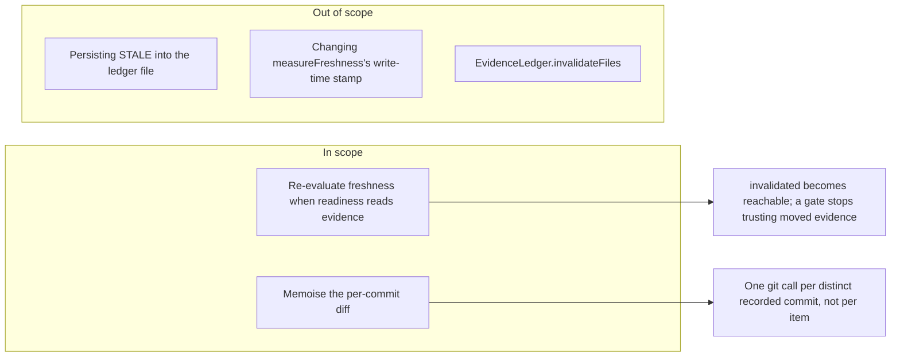

# Feature Requirement: Freshness Wiring

**Feature:** 019-freshness-wiring · **Branch:** `feat/019-freshness-wiring` · **Status:** Draft
**Created:** 2026-08-21 · **Owner:** Khoa Vu Dang · **Ticket:** none

## 1. Summary

Connect the read half of the evidence-freshness mechanism so recorded evidence can stop being
fresh. Today `measureFreshness` stamps every item `FRESH` at write time and nothing ever
re-evaluates it, so the readiness gate's `status: 'FRESH'` filter matches everything and the claim
status `invalidated` cannot occur.

**Scope boundary:**

## 2. User Stories

### Story 1: A gate that notices moved evidence (P1)
- **US1 (P1):** As an engineer relying on the readiness gate, I want evidence whose file changed
  since it was recorded to stop counting as support, so that `READY` reflects the tree as it is now.

### Story 2: A gate that stays usable (P2)
- **US2 (P2):** As the same engineer, I want that check to cost one git call per distinct recorded
  commit rather than one per evidence item, so the gate does not become slow enough to avoid.

## 3. Functional Requirements

| ID | Requirement | Story | Priority | Status |
|---|---|---|---|---|
| FR-001 | Readiness re-evaluates freshness before counting support | US1 | P1 | Live |
| FR-002 | Re-evaluation does not persist to the ledger file | US1 | P1 | Live |
| FR-003 | The per-commit diff is computed once per distinct commit | US2 | P2 | Live |
| FR-004 | The gate names the items it found stale | US1 | P1 | Live |

**Detail**

- **FR-001:** Before the readiness gate counts supporting evidence, each item whose provenance
  asserts a repository read MUST be re-checked against the tree as it stands, and marked stale when
  the file it names has changed since the commit recorded on it.
- **FR-002:** That re-evaluation MUST NOT write to the ledger file. Freshness is a property of the
  moment it is asked, not a stored fact; persisting it would make a read operation mutate state and
  would freeze a verdict that should be recomputed next time.
- **FR-003:** Evidence written in one batch shares one recorded commit, so the diff for a given
  commit MUST be computed once and reused for every item naming it.
- **FR-004:** A gate whose verdict changed because of staleness MUST name the items that went
  stale, in the same way it already names items whose locator no longer resolves.

## 4. Non-Functional Requirements

| ID | Constraint | Kind | Status |
|---|---|---|---|
| NFR-001 | No new external dependency | reliability | Live |
| NFR-002 | Existing ledger files load unchanged | reliability | Live |
| NFR-003 | The guard suite stays green | reliability | Live |

**Detail**

- **NFR-001 (No new dependency):** The check uses the git already required, nothing more.
- **NFR-002 (Existing state loads):** A ledger written before this feature must load and evaluate
  without migration; the stored `FRESH` stamp keeps its write-time meaning.
- **NFR-003 (Guards green):** The structural guards pass unchanged, with inventories updated rather
  than the checks weakened.

## 5. Out of Scope

- **Persisting STALE** — excluded by FR-002.
- **`EvidenceLedger.invalidateFiles`** — a second, batch-oriented path to the same state; leaving it
  unwired keeps this change to one mechanism.
- **Changing `measureFreshness`** — the write-time stamp is correct as it is.

## 6. Acceptance Criteria

- [ ] **Scenario: Evidence whose file moved stops counting** (US1, FR-001)
  - **Given** a task whose supporting evidence names a file recorded at an earlier commit
  - **When** that file is modified and readiness is evaluated
  - **Then** the verdict is not `READY` and the report names the stale item

- [ ] **Scenario: Reading does not write** (US1, FR-002)
  - **Given** a ledger file on disk
  - **When** readiness re-evaluates freshness and finds staleness
  - **Then** the ledger file's bytes are unchanged

- [ ] **Scenario: One git call per commit** (US2, FR-003)
  - **Given** several evidence items sharing one recorded commit
  - **When** freshness is re-evaluated
  - **Then** the diff for that commit is computed once

- [ ] Existing ledger files load and evaluate without migration (NFR-002).
- [ ] The guard suite passes unchanged (NFR-003).

## 7. Open Questions

None.

## 8. Assumptions

| ID | Assumption | Affects | Basis |
|---|---|---|---|
| A1 | Read-time evaluation, not stored state | FR-002 | Freshness is a property of now |

**Detail**

- **A1** — Freshness could have been persisted on write. Evaluating at read time was chosen because
  a stored verdict goes stale itself, and because a gate that mutates the ledger while answering a
  question is surprising. If wrong, the symptom is repeated git work on every gate call, which
  FR-003's memoisation already bounds.

## 9. History

None — initial version.
