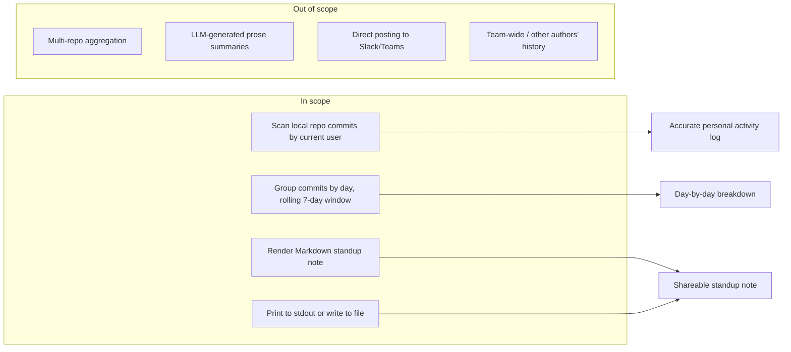

# Feature Requirement: Git History Weekly Standup Summarizer (CLI)

**Feature:** 009-git-standup-summary · **Branch:** `task/bench-boundary-do-brainstorm-2` · **Status:** Draft
**Created:** 2026-08-18 · **Owner:** unassigned · **Ticket:** none

> WHAT and WHY only — no tech or implementation detail. Zero unresolved
> `[NEEDS CLARIFICATION]` markers at hand-off — every ambiguity is resolved via
> `AskUserQuestion` before this file is written; deferred answers become assumptions in §8.
>
> Structure follows `references/ARTIFACT_FORMAT.md`: indexed sections carry a table above full
> `**Detail**`, `Status` is only `Live` or `Superseded → <ref>`, and superseded prose moves to §9.

## 1. Summary

A CLI tool that reads the user's own git commit history from the current repository and generates
a Markdown-formatted weekly standup note, so the user no longer has to manually reconstruct what
they worked on before a standup meeting.

**Scope boundary:**

## 2. User Stories

- **US1 (P1):** As a developer, I want to run a CLI command that reads my recent git commit
  history and generates a weekly standup summary, so that I don't have to manually recall and
  write out what I worked on before standup.
- **US2 (P2):** As a developer working across multiple branches, I want the summary grouped by
  day, so that I can see at a glance what I worked on and when.
- **US3 (P3):** As a developer, I want to export the generated note to a file, so that I can paste
  it into Slack, a ticketing tool, or keep a personal record.

## 3. Functional Requirements

**Index** — `Status` is `Live` or `Superseded → <ref>`.

| ID | Requirement | Story | Priority | Status |
|---|---|---|---|---|
| FR-001 | Scan current user's commits in a date window | US1 | P1 | Live |
| FR-002 | Group commits by day | US2 | P2 | Live |
| FR-003 | Render Markdown note to stdout | US1 | P1 | Live |
| FR-004 | Write note to a file via flag | US3 | P3 | Live |
| FR-005 | Include commits from all local branches | US2 | P2 | Live |
| FR-006 | Run fully offline, no network calls | US1 | P1 | Live |

**Detail**

- **FR-001:** The system MUST scan the git commit history of the repository in the current working
  directory for commits authored by the current git user (per `git config user.email`), within a
  default rolling 7-day window ending at run time. The system MUST support optional `--since` and
  `--until` flags to override the default window with an explicit date range.
- **FR-002:** The system MUST group the matched commits by calendar day within the summarized
  window and present each day's commits as its own section, in chronological order.
- **FR-003:** The system MUST render the grouped commits as a human-readable, Markdown-formatted
  standup note and print it to stdout by default. Each entry MUST show the commit's short hash and
  subject line (first line of the commit message).
- **FR-004:** The system MUST support an `--output <path>` flag that writes the generated note to
  the given file path instead of printing to stdout.
- **FR-005:** The system MUST include commits authored by the current user across all local
  branches reachable in the repository, not only the currently checked-out branch, so work done on
  feature branches is not silently dropped from the summary.
- **FR-006:** The system MUST generate the summary entirely from local git metadata, without
  requiring network access or any external API call.

## 4. Non-Functional Requirements

| ID | Constraint | Kind | Status |
|---|---|---|---|
| NFR-001 | Summary generation completes quickly on typical repos | performance | Live |
| NFR-002 | Output is plain, chat-paste-friendly Markdown | UX | Live |
| NFR-003 | Graceful handling of non-repo or empty-history runs | reliability | Live |

**Detail**

- **NFR-001 (Performance):** For a repository with up to roughly 10,000 commits in its history,
  generating the weekly summary MUST complete in under 2 seconds, since the tool is expected to run
  interactively immediately before a standup meeting.
- **NFR-002 (Chat-paste-friendly output):** The rendered note MUST be readable as plain text in a
  terminal (no ANSI-only formatting required to interpret it) and MUST be directly paste-able into
  chat tools such as Slack without further editing.
- **NFR-003 (Reliability):** If run outside a git repository, or if zero commits match the window,
  the system MUST print a clear, specific message (e.g. "not a git repository" or "no commits found
  in the last 7 days") rather than an unhandled stack trace or exception.

## 5. Out of Scope

- **Multi-repository aggregation** — summarizing commits across more than one local repository is
  deferred; the MVP operates on a single repository (the current working directory).
- **LLM-generated natural-language summaries** — the MVP produces a deterministic, rule-based
  grouping/formatting of commit metadata, not an AI-generated narrative, to avoid a hard dependency
  on network access, an API key, or inference cost for what is fundamentally a formatting task.
- **Direct posting to Slack/Teams/other services** — the MVP only prints to stdout or writes to a
  local file; pushing the note to a chat service is excluded.
- **Team-wide or other-authors' history** — the MVP summarizes only the current git user's own
  commits, not teammates' activity.

## 6. Acceptance Criteria

- [ ] Running the CLI inside a git repository with commits by the current user in the last 7 days
      prints a Markdown note with commits grouped by day (FR-001, FR-002, FR-003).
- [ ] Running with `--output <path>` writes the same note to the given file instead of stdout
      (FR-004).
- [ ] Commits authored by the current user on a branch other than the checked-out one, within the
      window, appear in the summary (FR-005).
- [ ] No network requests occur during summary generation, verified by running with network access
      disabled (FR-006).
- [ ] Running the CLI outside a git repository prints a clear, specific error message rather than a
      raw stack trace (NFR-003).
- [ ] Generating a summary for a repository with roughly 10,000 commits completes in under 2
      seconds (NFR-001).

## 7. Open Questions

None. (The `[NEEDS CLARIFICATION: question]` marker syntax is reserved for a session
aborted mid-loop — a completed artifact carries zero of these.)

## 8. Assumptions

| ID | Assumption | Affects | Basis |
|---|---|---|---|
| A1 | "Weekly" means a rolling 7-day window ending at run time by default, overridable via `--since`/`--until` | FR-001 | No calendar convention (Mon–Sun vs. Sun–Sat) was specified; a rolling window avoids an arbitrary week-boundary decision and matches how people naturally prepare "since we last spoke" updates. |
| A2 | Commit scope is limited to the current git user (`git config user.email`) | FR-001, Out of Scope | The request says "my git history" — first person, implying personal history rather than the whole team's. |
| A3 | Summarization is confined to a single local repository (the CWD's repo) | FR-001, Out of Scope | No mention of multiple projects; single-repo is the smallest viable scope, with multi-repo left as a plausible future extension. |
| A4 | Output defaults to stdout in Markdown, with an optional `--output` flag to write to a file | FR-003, FR-004 | "Note" implies a shareable text artifact; stdout-by-default follows standard CLI convention and keeps the tool pipeable into other commands. |
| A5 | Summarization is deterministic (commit metadata grouped/formatted), not LLM-generated prose | FR-006, Out of Scope | Avoids a hard runtime dependency (API key, network, inference cost) for what the user described as a straightforward summarization task; documented as a possible future enhancement rather than MVP scope. |
| A6 | Commits from all local branches (not only the checked-out one) count toward the summary, filtered by author and date | FR-005 | Developers commonly work across several feature branches in a week; restricting to only the current branch would silently drop real standup-relevant work. |

**Detail**

- **A1** — If wrong (user actually wants a fixed Mon–Sun calendar week), the date-window
  calculation in FR-001 changes from "now minus 7 days" to "most recent Monday through today"; the
  `--since`/`--until` override already accommodates either case manually.
- **A2** — If wrong (user wants a whole team's history), FR-001's author filter would need to
  become configurable (e.g. `--author <email>` or `--all-authors`), which is a small, additive
  change rather than a redesign.
- **A3** — If wrong (user has work spread across multiple repos), the tool would need a
  multi-repo config/discovery mechanism; flagged explicitly as future scope in §5 rather than
  silently assumed away.
- **A4** — If wrong (user wants clipboard copy or direct chat posting instead), FR-003/FR-004
  would gain another output sink; the underlying Markdown-generation logic is unaffected.
- **A5** — If wrong (user specifically wants AI-written prose, not just grouped commit lists),
  this becomes a new FR requiring an LLM integration, credentials, and network access — a
  materially larger scope than the current MVP, so it is called out explicitly rather than assumed.
- **A6** — If wrong (user only cares about the current branch), FR-005 narrows to
  `git log <current-branch>` instead of scanning all local branches; the day-grouping logic (FR-002)
  is unaffected either way.

## 9. History

None — initial version.
