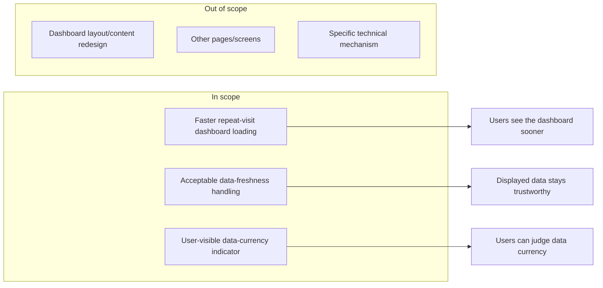

# Feature Requirement: Faster Dashboard Loading

**Feature:** 009-faster-dashboard-loading · **Branch:** `task/bench-boundary-do-brainstorm-3` · **Status:** Draft
**Created:** 2026-08-18 · **Owner:** Unassigned · **Ticket:** none

> WHAT and WHY only — no tech or implementation detail. Zero unresolved
> `[NEEDS CLARIFICATION]` markers at hand-off — every ambiguity is resolved via
> `AskUserQuestion` before this file is written; deferred answers become assumptions in §8.
>
> Structure follows `references/ARTIFACT_FORMAT.md`: indexed sections carry a table above full
> `**Detail**`, `Status` is only `Live` or `Superseded → <ref>`, and superseded prose moves to §9.

## 1. Summary

Users currently wait longer than they should for the dashboard to display data, especially on
repeat visits. This feature makes the dashboard load noticeably faster without changing what data
or widgets it shows, so users can act on their information sooner and with less friction.

**Scope boundary:**

## 2. User Stories

- **US1 (P1):** As a dashboard user, I want the dashboard to load noticeably faster on repeat
  visits, so that I don't have to wait to see my data.
- **US2 (P2):** As a dashboard user, I want the data shown to remain accurate enough to trust, so
  that faster loading doesn't come at the cost of misleading information.
- **US3 (P3):** As a dashboard user, I want to be able to tell how current the data I'm looking at
  is, so that I can decide whether to trust it or seek an up-to-date view.

## 3. Functional Requirements

**Index** — `Status` is `Live` or `Superseded → <ref>`.

| ID | Requirement | Story | Priority | Status |
|---|---|---|---|---|
| FR-001 | Reduce dashboard load time on repeat visits | US1 | P1 | Live |
| FR-002 | Keep displayed data within an acceptable staleness window | US2 | P2 | Live |
| FR-003 | Let users tell how current the displayed data is | US3 | P3 | Live |

**Detail**

- **FR-001:** The system MUST reduce the dashboard's load time on repeat/returning visits relative
  to its current behavior, without removing, hiding, or changing the meaning of any data or widget
  currently shown.
- **FR-002:** The system MUST ensure that data displayed on the dashboard reflects the underlying
  source data within the acceptable staleness window defined in NFR-002, and MUST refresh that
  displayed data once the window elapses or the underlying data changes materially, so users are
  never shown information that is stale beyond what is acceptable.
- **FR-003:** The system MUST make it possible for a user to determine how recent the data they are
  viewing is (for example, a visible indicator of when it was last updated), so they can judge
  whether it is current enough for their purpose.

## 4. Non-Functional Requirements

| ID | Constraint | Kind | Status |
|---|---|---|---|
| NFR-001 | Perceptible, measurable load-time reduction on repeat visits | performance | Live |
| NFR-002 | Bounded, tolerable staleness window for displayed data | reliability | Live |
| NFR-003 | No loss of correctness or availability from the performance change | reliability | Live |

**Detail**

- **NFR-001 (Load-time reduction):** Repeat-visit dashboard load time MUST be measurably and
  perceptibly reduced compared to the documented current baseline. The exact numeric target is
  deferred to design/planning once a real baseline is measured (see A2) rather than asserted here
  without evidence.
- **NFR-002 (Staleness tolerance):** Data shown on the dashboard MUST NOT be older than a short,
  bounded staleness window under normal operation; no part of the dashboard requires strictly
  real-time (sub-second) data (see A4).
- **NFR-003 (No regression):** The change that makes the dashboard load faster MUST NOT reduce the
  correctness of displayed data or the dashboard's availability relative to current behavior.

## 5. Out of Scope

- **Dashboard layout or content redesign** — this feature changes how fast data appears, not what
  data or visual design is shown.
- **Other pages or screens** — only the dashboard is addressed; extending the same treatment
  elsewhere is a separate effort.
- **The specific technical mechanism used** — choosing how load time and staleness are achieved is
  `/do-design`'s job, not this requirement's.

## 6. Acceptance Criteria

- [ ] Returning users experience a measurably faster dashboard load than the documented current
      baseline (FR-001, NFR-001).
- [ ] No dashboard data or widget is removed, hidden, or changed in meaning as a side effect of the
      performance change (FR-001).
- [ ] Data shown on the dashboard is never older than the defined staleness window under normal
      operation (FR-002, NFR-002).
- [ ] A user can determine how current the data they are viewing is (FR-003).
- [ ] Overall dashboard correctness and availability are unchanged relative to current behavior
      (NFR-003).

## 7. Open Questions

None. (The `[NEEDS CLARIFICATION: question]` marker syntax is reserved for a session
aborted mid-loop — a completed artifact carries zero of these.)

## 8. Assumptions

| ID | Assumption | Affects | Basis |
|---|---|---|---|
| A1 | "Dashboard" means the application's primary/main dashboard view (the one most frequently loaded), not a specific named report | US1, FR-001 | user deferred |
| A2 | The numeric load-time target is left for design/planning to set against a measured baseline rather than invented here | FR-001, NFR-001 | user deferred; avoids an unverified metric |
| A3 | The underlying data feeding the dashboard changes at a moderate-to-low frequency relative to how often users view it, making full re-derivation on every load largely redundant | FR-002 | inferred from the stated symptom |
| A4 | The acceptable staleness window is short but non-zero — no dashboard consumer needs strictly real-time (sub-second) data | FR-002, NFR-002 | user deferred; conservative default |
| A5 | All current dashboard users are affected equally; no user segment needs different freshness or performance handling than another | US1, US2, US3 | user deferred |

**Detail**

- **A1** — The request said "our dashboard" without naming which one. Defaulting to the primary/
  most-visited dashboard keeps the requirement concrete; if the intended dashboard differs, FR-001
  and US1 would need to be re-scoped to the correct view.
- **A2** — Asserting a specific percentage or millisecond target without a measured baseline would
  be an invented metric. Design/planning should measure current load time first, then set a target
  against it.
- **A3** — "Loads faster" as the stated symptom implies the dashboard currently does more repeated
  work per load than the underlying data's real rate of change justifies; if the data actually
  changes every load, a staleness-based approach would need to be reconsidered.
- **A4** — Chosen as a safe middle ground: tight enough that data stays trustworthy, loose enough
  to make faster loading achievable. If any widget genuinely requires real-time data, FR-002 and
  NFR-002 would need a carve-out for that widget.
- **A5** — No signal in the request suggested otherwise; if some users (e.g., real-time monitoring
  roles) need different freshness guarantees, that would split US1–US3 into segment-specific
  stories.

## 9. History

None — initial version.
