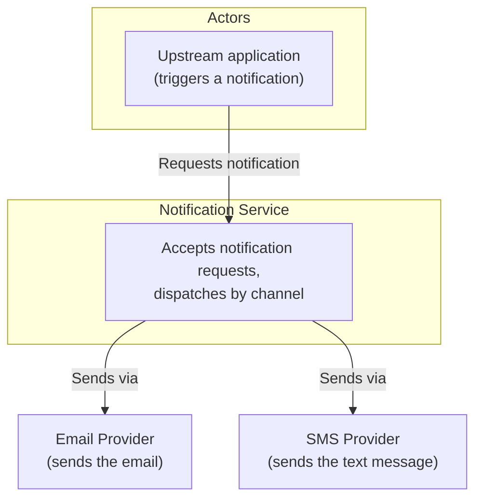
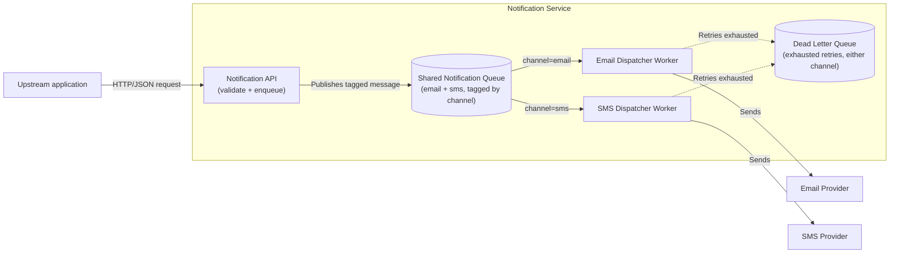
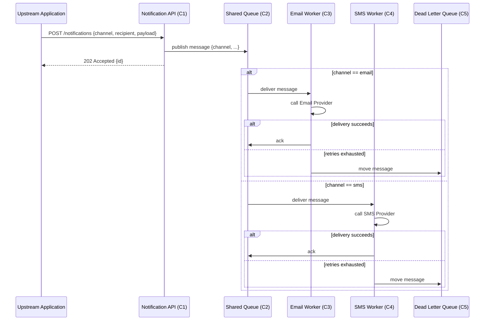

# Design: Shared-Queue Notification Service

**Feature:** 009-notification-shared-queue · **Requirement:** ./requirement.md (not yet written —
see §0) · **Status:** Draft · **Created:** 2026-08-18

> System shape — architecture, APIs, data/interface contracts. Reads ./requirement.md.
> Distinct from plan.md's HOW-to-implement; this is HOW-it's-shaped.
>
> Structure follows `references/ARTIFACT_FORMAT.md`: indexed sections carry a table above full
> `**Detail**`, `Status` is only `Live` or `Superseded → <ref>`, and superseded prose moves to §9.

## 0. Precondition Note

`requirement.md` does not exist in this feature dir (`has_requirement: false`). Per this skill's
advisory (non-blocking) precondition, that gap is surfaced here rather than silently ignored: the
requester asked a direct system-shape question ("how should we structure the notification service
so email and SMS share a queue") without going through `/do-brainstorm` first. Recommended next
step after this design: run `/do-brainstorm` to backfill `requirement.md` so the WHAT/WHY (why a
shared queue, delivery guarantees the business actually needs) is captured rather than only
inferred here.

## 1. Architecture Approach

A single **Notification Service** exposes one inbound API that both email- and SMS-triggering
callers use. Every accepted request becomes one message on a **shared Notification Queue** —
one logical queue, not two — tagged with a `channel` field (`email` | `sms`). Two independent
dispatcher workers, one per channel, consume from that same queue filtered by `channel` and call
the matching external provider. Sharing the queue means one operational surface (one thing to
monitor, scale, and apply backpressure to) instead of two parallel pipelines that happen to do the
same job.

## 2. System Overview (C4)

### C1: System Context

### C2: Container

### C3: Component

N/A: covered by §3 Components & Boundaries — each container above already has a single,
non-decomposed responsibility; a further internals diagram would restate the same five rows.

## 3. Components & Boundaries

| ID | Component | Kind | Serves | Status |
|---|---|---|---|---|
| C1 | Notification API | service | Accept + enqueue | Live |
| C2 | Shared Notification Queue | data store | Decouple producer from dispatch | Live |
| C3 | Email Dispatcher Worker | service | Channel=email dispatch | Live |
| C4 | SMS Dispatcher Worker | service | Channel=sms dispatch | Live |
| C5 | Dead Letter Queue | data store | Exhausted-retry holding | Live |

**Detail**

- **C1 (Notification API)** → Owns request validation (recipient, channel, payload shape) and
  publishing one message per accepted request onto C2. Does not own delivery, retries, or
  provider-specific formatting — those belong to the channel workers.
- **C2 (Shared Notification Queue)** → Owns durable holding of not-yet-delivered messages for
  *both* channels in one logical queue, each message carrying a `channel` attribute the workers
  filter on. Does not own channel-specific delivery logic or provider credentials.
- **C3 (Email Dispatcher Worker)** → Owns consuming `channel=email` messages, calling the Email
  Provider, and acknowledging or retrying. Does not read or process `channel=sms` messages.
- **C4 (SMS Dispatcher Worker)** → Owns consuming `channel=sms` messages, calling the SMS
  Provider, and acknowledging or retrying. Does not read or process `channel=email` messages.
- **C5 (Dead Letter Queue)** → Owns holding messages, from either channel, that exhausted their
  retry budget, for manual inspection or replay. Does not attempt delivery itself.

## 4. API / Interface Contracts

- `POST /notifications` (Notification API, C1) — request body: `{ "channel": "email" | "sms",
  "recipient": string, "payload": object }`. Returns `202 Accepted` with a message id once
  published to C2, or `400` on a validation failure (missing/invalid `channel`, malformed
  `recipient` for that channel). This is the only inbound contract; delivery status is not
  returned synchronously (see §6).
- Queue message envelope (C1 → C2 → C3/C4) — see §5 Data Model.

## 5. Data Model

Message envelope on the shared queue (C2):

| Field | Type | Notes |
|---|---|---|
| `id` | string | Unique per message; returned to the caller by C1 |
| `channel` | enum(`email`,`sms`) | The field both dispatcher workers filter on |
| `recipient` | string | Channel-appropriate address (email address or phone number) |
| `payload` | object | Channel-specific content, opaque to C1/C2 |
| `attempt` | integer | Retry counter, incremented by the dispatching worker |
| `createdAt` | timestamp | Set by C1 at publish time |

## 6. Sequence / Data Flow

## 7. Design Risks & Alternatives Considered

| ID | Risk / Alternative | Disposition | Status |
|---|---|---|---|
| R1 | Two separate queues (one per channel) instead of one shared queue | rejected | Live |
| R2 | Head-of-line blocking: a slow provider on one channel delaying the other | mitigated | Live |
| R3 | Uniform queue-level retry policy can't fit differing channel needs | mitigated | Live |

**Detail**

- **R1** → Considered running an entirely separate queue per channel (the conventional default).
  Rejected because it does not answer the question actually asked — "share a queue" — and would
  duplicate the operational surface (two queues to provision, monitor, and scale) for two
  pipelines whose only real difference is which external provider they call.
- **R2** → Because C3 and C4 are independent consumers each filtering their own channel off the
  same queue, one provider being slow (e.g., email) does not block the other worker (SMS) from
  consuming its own messages — the workers do not share a consumption thread or connection.
  Accepted risk: if the underlying queue technology enforces strict global FIFO across all
  messages regardless of channel, a burst of one channel's messages could still delay visibility
  of the other's; flagged for `/do-plan` to confirm the chosen queue technology supports
  per-channel (or per-partition-key) consumption rather than a single global cursor.
- **R3** → Retry/backoff policy is looked up by the dispatching worker (C3/C4) per message using
  its `channel` field at dispatch time, not enforced by the queue itself — so email and SMS can
  have different retry counts/backoff curves without needing separate queues.

## 8. Assumptions

| ID | Assumption | Affects | Basis |
|---|---|---|---|
| A1 | No cross-channel ordering guarantee is required — email and SMS dispatch independently | C2, C3, C4 | user deferred (Decide for me) |
| A2 | Both channels have equal delivery priority; no VIP/priority lane | C2 | user deferred (Decide for me) |
| A3 | Failed messages get bounded retries with backoff, then move to a DLQ rather than being dropped | C3, C4, C5 | user deferred (Decide for me); standard reliability default |
| A4 | The queue is modeled as an abstract shared-broker component; which specific queue product/service to run is left to `/do-plan` | C2 | user deferred (Decide for me); keeps this artifact at system-shape only |

**Detail**

- **A1** — The request asked how to *structure* the sharing, not about delivery ordering. If cross-
  channel ordering turns out to matter (e.g., an SMS reminder must never arrive before its
  corresponding email), C3/C4 would need to coordinate via a shared sequence token instead of
  consuming independently.
- **A2** — No signal in the request suggested one channel is more urgent. If wrong, C2's message
  envelope would need a `priority` field and the workers would need priority-aware consumption.
- **A3** — Silently dropping failed notifications is a worse default than holding them for
  inspection; if the real requirement is "fire-and-forget, drop on failure," C5 becomes
  unnecessary and C3/C4 simplify to ack-or-discard.
- **A4** — Naming a specific broker product (e.g., a particular managed queue service) is an
  implementation choice, not a system-shape one; `/do-plan` picks it against real constraints
  (existing infra, team familiarity, cost) once this shape is agreed.

## 9. History

None — initial version.
