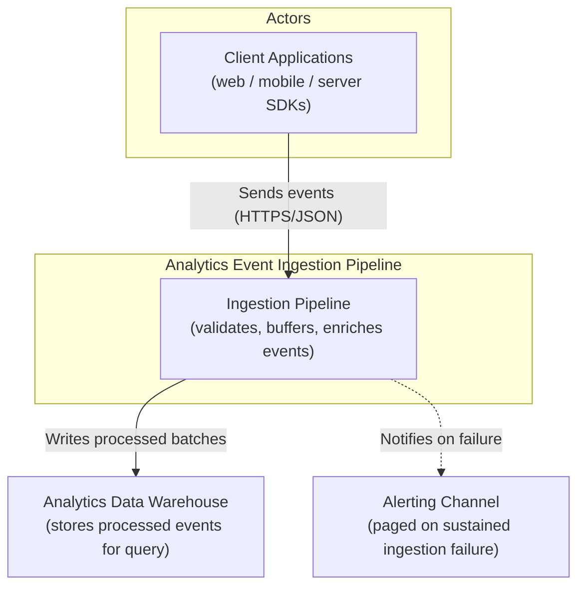
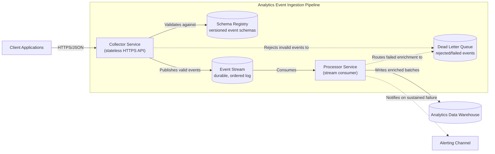
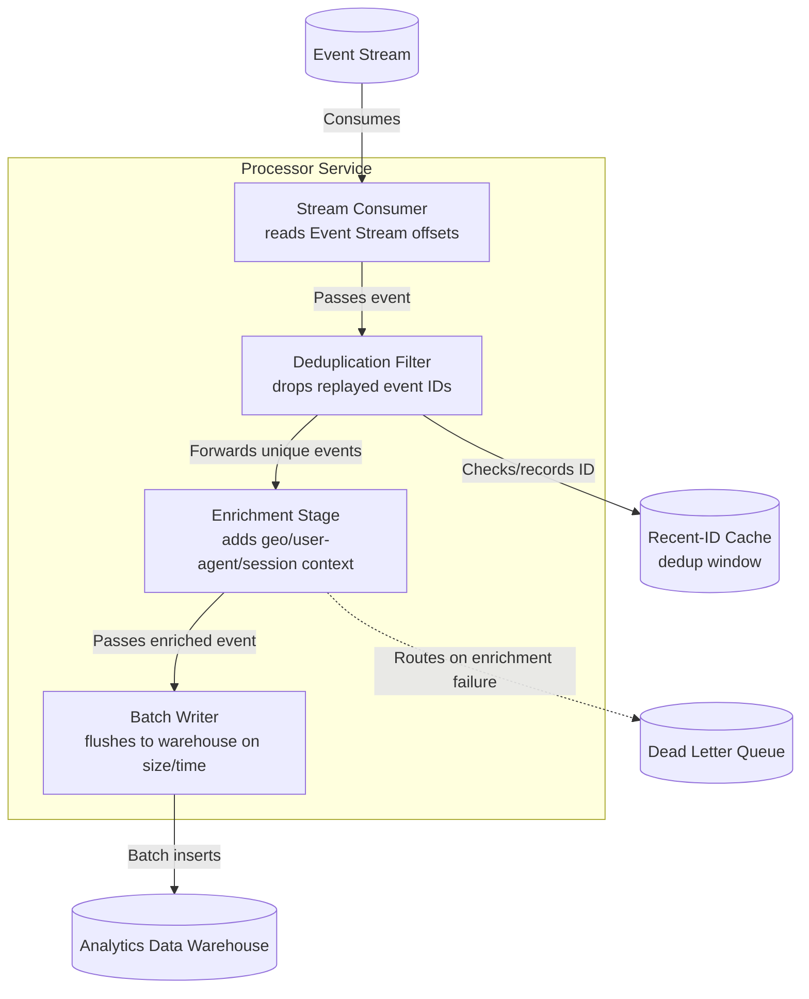
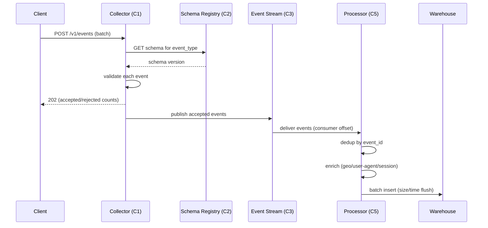

# Design: Analytics Event Ingestion Pipeline

**Feature:** task/bench-boundary-do-design-2 · **Requirement:** ./requirement.md · **Status:** Draft · **Created:** 2026-08-18

> System shape — architecture, APIs, data/interface contracts. Reads ./requirement.md.
> Distinct from plan.md's HOW-to-implement; this is HOW-it's-shaped.
>
> Structure follows `references/ARTIFACT_FORMAT.md`: indexed sections carry a table above full
> `**Detail**`, `Status` is only `Live` or `Superseded → <ref>`, and superseded prose moves to §9.

> **No `requirement.md` exists for this slug.** The advisory precondition in `/do-design` step 3
> was surfaced and skipped (advisory, not the hard hook gate) because this run is non-interactive
> and the prompt itself ("Design the ingestion pipeline for our analytics events") is specific
> enough to design against directly. Recommendation: run `/do-brainstorm` to backfill
> `requirement.md` before this design is used to gate `/do-plan`.

## 1. Architecture Approach

A two-service pipeline: a stateless, public-facing **Collector** validates inbound events against
a versioned schema and publishes them to a durable event stream; an internal **Processor**
consumes that stream, deduplicates and enriches each event, and batch-writes the result to the
analytics data warehouse. Splitting ingress from processing isolates the public attack surface
from business logic and lets each side scale independently of the other's load profile (bursty
client traffic vs. steady batch-write throughput). This is new infrastructure — there is no
existing ingestion path in this repository to fit against.

## 2. System Overview (C4)

### C1: System Context

Client applications (web, mobile, server-side SDKs) send events to the pipeline over HTTPS. The
pipeline's only external dependency is the analytics data warehouse it ultimately writes to, and
an alerting channel it notifies on sustained ingestion failure.

### C2: Container

### C3: Component

The Processor is the only container touching 3+ internal components, so C3 covers it.

## 3. Components & Boundaries

| ID | Component | Kind | Serves | Status |
|---|---|---|---|---|
| C1 | Collector Service | service | FR-001 | Live |
| C2 | Schema Registry | service | FR-002 | Live |
| C3 | Event Stream | service | FR-001, FR-003 | Live |
| C4 | Dead Letter Queue | service | FR-004 | Live |
| C5 | Processor Service | service | FR-003 | Live |

**Detail**

- **C1** → Collector Service: the only public-facing component. Terminates client HTTPS
  connections, validates each event's shape and required fields against the current schema
  version held in C2, assigns an ingestion timestamp and event ID, and publishes accepted events
  to C3. Owns request authentication and rate limiting. Does not own enrichment, deduplication, or
  any write to the warehouse.
- **C2** → Schema Registry: holds versioned event schemas and their compatibility rules. Serves
  read-only lookups to C1 during validation. Does not own event data itself, only the contracts
  events must satisfy.
- **C3** → Event Stream: durable, ordered, partitioned log that decouples Collector's write rate
  from Processor's read rate and provides replay for backfills. Owns retention policy, not event
  content.
- **C4** → Dead Letter Queue: holds events rejected by C1 (failed validation) or C5 (failed
  enrichment), each tagged with a failure reason, for manual inspection or replay. Owns nothing
  beyond storage and tagging — no automatic retry logic.
- **C5** → Processor Service: internal-only consumer of C3. Deduplicates by event ID, enriches
  each event with derived context, and batch-writes the result to the warehouse. Does not accept
  direct client traffic and does not own schema validation (that is C1's job at the edge).

## 4. API / Interface Contracts

**Collector ingestion endpoint** (public, HTTPS):

- `POST /v1/events` — body: `{"events": [Event, ...]}` (batch of 1–500 events per request).
  - `202 Accepted` — `{"accepted": <n>, "rejected": <n>, "rejections": [{"index": <i>, "reason": <str>}]}`.
    A batch may be partially accepted; rejected entries land in C4 with their reason.
  - `400 Bad Request` — malformed JSON or missing required batch envelope fields.
  - `401 Unauthorized` — missing/invalid client API key.
  - `429 Too Many Requests` — client over its rate limit.
- `GET /v1/schemas/{event_type}` — returns the current schema version for `event_type`, proxied
  from C2, so client SDKs can validate locally before sending.

**Schema Registry interface** (internal, consumed by C1 only):

- `GET /schemas/{event_type}/latest` — current schema + version.
- `POST /schemas/{event_type}` — register a new backward-compatible version (used by the analytics
  engineering team, out of scope for the pipeline's runtime path).

## 5. Data Model

**Event envelope** (the contract C1 validates and C3 carries):

| Field | Type | Required | Notes |
|---|---|---|---|
| `event_id` | UUID | yes (assigned by C1 if absent) | Dedup key used by C5. |
| `event_type` | string | yes | Selects the schema version to validate against. |
| `occurred_at` | ISO-8601 timestamp | yes | Client-reported event time. |
| `received_at` | ISO-8601 timestamp | assigned by C1 | Ingestion time, for clock-skew analysis. |
| `user_id` / `anonymous_id` | string | at least one required | Identity resolution key. |
| `properties` | object | yes | Event-type-specific payload; shape governed by C2's schema for `event_type`. |
| `context` | object | assigned/augmented by C5 | Enriched fields: geo, user-agent, session — absent at ingestion, filled by the Processor. |

**Warehouse table shape**: one append-only fact table per `event_type`, partitioned by
`received_at` date, columns = envelope fields above with `properties`/`context` stored as
semi-structured columns (the specific warehouse engine and column typing are implementation
details for `/do-plan`, not a design-level decision).

## 6. Sequence / Data Flow

## 7. Design Risks & Alternatives Considered

| ID | Risk / Alternative | Disposition | Status |
|---|---|---|---|
| R1 | Direct client-to-stream produce (skip Collector) | rejected | Live |
| R2 | Single combined ingestion+processing service | rejected | Live |
| R3 | Synchronous warehouse write with no stream buffer | rejected | Live |
| R4 | Event Stream backpressure during warehouse outage | accepted | Live |

**Detail**

- **R1** → Rejected because it would require exposing stream broker endpoints (or long-lived
  credentials) to every client type, including untrusted browser/mobile clients, and removes the
  edge point where schema validation and rate limiting currently live.
- **R2** → Rejected because a single service couples the public ingress's availability and scaling
  needs (bursty, latency-sensitive) to the Processor's (steady, throughput-sensitive), and expands
  the public attack surface to include enrichment and warehouse-write logic.
- **R3** → Rejected because a synchronous warehouse write on the request path ties client-perceived
  latency to warehouse write latency and removes replay/backfill capability if the warehouse write
  fails after the client has already been told the event was accepted.
- **R4** → Accepted: if the warehouse is unavailable, C3's retention window absorbs the backlog and
  C5 resumes from its last committed offset once the warehouse recovers. Cost if it lands: consumer
  lag grows and dashboards relying on near-real-time data see delay proportional to the outage,
  bounded by stream retention — a retention long enough to cover a plausible warehouse outage is a
  `/do-plan` sizing decision, not resolved here.

## 8. Assumptions

| ID | Assumption | Affects | Basis |
|---|---|---|---|
| A1 | Ingestion transport is an HTTPS REST API accepting batched JSON, not a client-embedded stream producer or host collector agent | C1 | User deferred — no requirement.md or stated preference existed; chosen as the most portable option across web/mobile/server clients and the common pattern for analytics collectors (avoids exposing broker endpoints to untrusted clients). |
| A2 | Ingestion is split into two independently deployable services (Collector + Processor) rather than one combined service | C1, C5 | User deferred — chosen because "analytics events" implies real traffic volume, and splitting isolates public attack surface from processing/scaling concerns; also what makes a C2 Container diagram meaningful per §2. |
| A3 | A durable event stream sits between Collector and Processor rather than a synchronous warehouse write | C3 | User deferred — chosen to decouple ingestion rate from warehouse write rate and to provide replay/backfill, standard for event-ingestion architectures at any real scale. |
| A4 | Event schemas are enforced via a versioned Schema Registry at the Collector boundary rather than best-effort/loose validation | C1, C2 | User deferred — chosen so malformed events are rejected at the edge (visible in the `202` response) instead of polluting the stream and being discovered downstream. |

**Detail**

- **A1** — If client environments turn out to require a persistent low-latency connection (e.g.
  server-to-server high-throughput producers), this would change C1 from a request/response API to
  also accept a streaming ingestion mode; the C2 Container diagram would gain a second ingress
  path.
- **A2** — If actual traffic volume is low enough that operating two services is unwarranted
  overhead, this collapses to R2's rejected alternative (single service), removing the C3-level
  detail entirely and simplifying §2/§3.
- **A3** — If replay/backfill is confirmed unnecessary and warehouse write latency is acceptable
  on the client's critical path, this reduces to R3's rejected alternative, removing C3 (Event
  Stream) and C5 (Processor) as separate components.
- **A4** — If schema evolution needs to be looser than a registry allows (e.g. arbitrary
  client-defined properties with no upfront contract), C2 would be replaced with lightweight
  JSON-shape validation only, and per-event-type schema versioning would move out of scope.

## 9. History

None — initial version.
