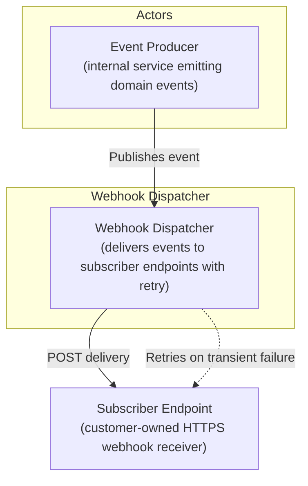
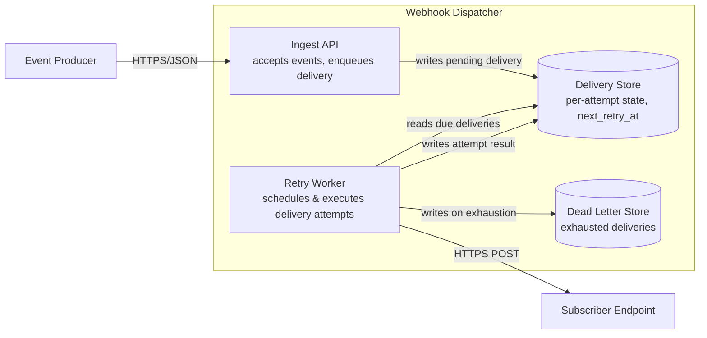
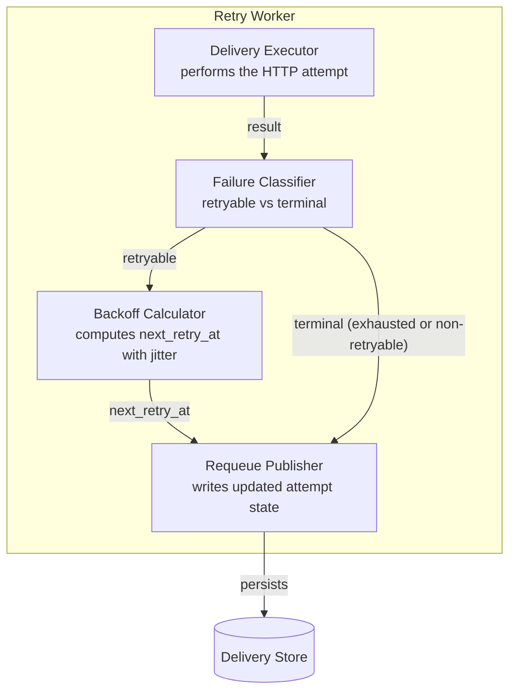
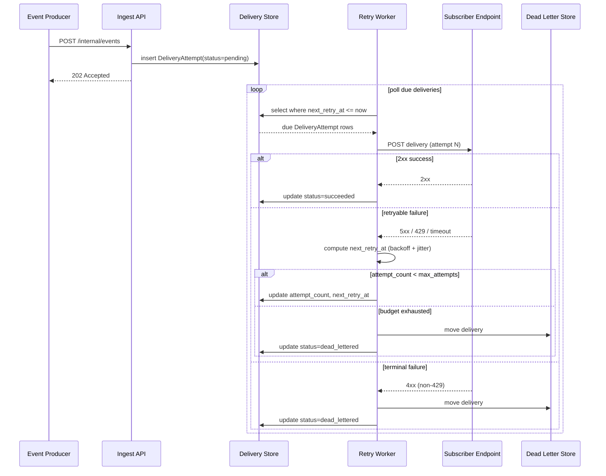

# Design: Webhook Dispatcher Retry Policy

**Feature:** task/bench-boundary-do-design-3 · **Requirement:** N/A — no `requirement.md` present for
this run (advisory precondition, skipped; see note below) · **Status:** Draft · **Created:** 2026-08-18

> System shape — architecture, APIs, data/interface contracts. Reads ./requirement.md.
> Distinct from plan.md's HOW-to-implement; this is HOW-it's-shaped.
>
> Structure follows `references/ARTIFACT_FORMAT.md`: indexed sections carry a table above full
> `**Detail**`, `Status` is only `Live` or `Superseded → <ref>`, and superseded prose moves to §9.

**Note on missing requirement.md:** `do-design`'s Step 3 precondition is advisory, not a hard
block. No `requirement.md` exists in this feature dir (`has_requirement: false` from the resolver),
and this repository (DoFlow, an installer/CLI tool) has no existing webhook dispatcher — this design
is a greenfield, standalone exercise scoped directly from the invocation prompt: "Design a retry
policy for our webhook dispatcher." Three requirements are derived from that prompt and used in
place of formal FRs (labelled `DR-` instead of `FR-` to keep the substitution visible):

- **DR-1:** Reliably deliver webhook events to subscriber endpoints despite transient failures.
- **DR-2:** Avoid overwhelming subscriber endpoints or the dispatcher itself while a subscriber is
  degraded or down.
- **DR-3:** Give up on permanently failing deliveries without silent data loss, and surface them for
  operator action.

## 1. Architecture Approach

The retry policy lives inside a **Webhook Dispatcher** service boundary with three internal
containers: an ingest API that accepts outbound events from internal producers, a durable delivery
store that tracks per-attempt state, and a retry worker that owns backoff scheduling, failure
classification, and dead-lettering. This is a greenfield design — the change adds retry behavior to
the dispatch path rather than modifying an existing scheduler, since no prior webhook dispatcher
exists in this codebase to extend.

## 2. System Overview (C4)

### C1: System Context

### C2: Container

### C3: Component

## 3. Components & Boundaries

| ID | Component | Kind | Serves | Status |
|---|---|---|---|---|
| C1 | Ingest API | service | DR-1 | Live |
| C2 | Delivery Store | service | DR-1, DR-3 | Live |
| C3 | Retry Worker | service | DR-1, DR-2 | Live |
| C4 | Delivery Executor | component (within C3) | DR-1 | Live |
| C5 | Backoff Calculator | component (within C3) | DR-2 | Live |
| C6 | Failure Classifier | component (within C3) | DR-1, DR-2 | Live |
| C7 | Dead Letter Store | service | DR-3 | Live |

**Detail**

- **C1** → Accepts events from internal producers, validates the target subscription, and writes an
  initial `pending` `DeliveryAttempt` row to C2. Does not perform delivery itself.
- **C2** → Owns durable state for every delivery attempt (see §5). Is the single source of truth for
  "what is due to be retried when" — the retry policy is realized as data in this store, not as
  in-memory timers, so it survives worker restarts.
- **C3** → Polls C2 for deliveries whose `next_retry_at <= now`, dispatches to C4–C6, and persists
  the outcome via the Requeue Publisher. Owns the retry policy's runtime behavior; does not own
  event ingestion or long-term failure storage.
- **C4** → Issues the HTTPS POST to the subscriber endpoint with a bounded per-attempt timeout, and
  returns the raw outcome (status code, timeout, network error) to C6.
- **C5** → Given an attempt count, computes the next retry delay using exponential backoff with
  jitter (see §7 R2). Pure function of attempt count; no I/O.
- **C6** → Classifies an outcome as retryable or terminal per the policy in §4, and decides whether
  the delivery has exhausted its retry budget (routing to C7 instead of another retry).
- **C7** → Stores deliveries that exhausted their retry budget or hit a terminal classification, for
  operator inspection and manual replay. Out of scope for this design: the operator-facing UI over
  this store.

## 4. API / Interface Contracts

**Ingest (internal):**
- `POST /internal/events` — internal producers publish an event; body carries `event_id`,
  `subscriber_id`, `event_type`, `payload`. Returns `202 Accepted` with the created `delivery_id`.

**Delivery (dispatcher → subscriber):**
- `POST <subscriber_url>` — body is the event payload. Headers: `X-Webhook-Id` (stable across
  retries of the same event, for subscriber-side dedup), `X-Webhook-Attempt` (1-based attempt
  number), `X-Webhook-Signature` (HMAC over the raw body, existing subscription secret).
- **Response contract (drives C6's classification):**
  - `2xx` → success; mark `DeliveryAttempt.status = succeeded`.
  - `429` → retryable; if a `Retry-After` header is present, C5 uses it as a floor for the computed
    delay rather than overriding the backoff curve.
  - `5xx`, connection timeout, connection refused → retryable.
  - Any other `4xx` → terminal (subscriber-side/config problem a retry cannot fix); routes directly
    to C7 without consuming further retry budget.

**Operator (internal):**
- `POST /internal/webhooks/{delivery_id}/retry` — manually re-enqueues a dead-lettered delivery with
  a fresh attempt budget. Minimal complement to C7 so a dead-lettered delivery is not a dead end;
  no broader operator UI is in scope here.

## 5. Data Model

**DeliveryAttempt** (owned by C2):

| Field | Type | Notes |
|---|---|---|
| `id` | uuid | primary key |
| `event_id` | uuid | the source event, from the ingest payload |
| `subscriber_id` | uuid | target subscription |
| `url` | string | resolved subscriber endpoint at enqueue time |
| `status` | enum | `pending` / `in_flight` / `succeeded` / `failed` / `dead_lettered` |
| `attempt_count` | int | attempts consumed so far |
| `max_attempts` | int | retry budget ceiling (see §8 A2) |
| `next_retry_at` | timestamp | null once `succeeded` or `dead_lettered` |
| `last_error` | string, nullable | last classified failure, for operator triage |
| `created_at` / `updated_at` | timestamp | standard bookkeeping |

**WebhookSubscription** — referenced by `subscriber_id`; assumed to already exist as part of
whatever manages subscriber URLs and secrets. Not owned or modified by this design.

## 6. Sequence / Data Flow

## 7. Design Risks & Alternatives Considered

| ID | Risk / Alternative | Disposition | Status |
|---|---|---|---|
| R1 | External message broker (SQS/RabbitMQ) for retry scheduling, instead of a polled Delivery Store | rejected | Live |
| R2 | Thundering herd: many deliveries to the same degraded subscriber retry in lockstep | mitigated | Live |
| R3 | Duplicate delivery on retry causes subscriber-side double-processing | mitigated | Live |
| R4 | Retry queue growth while a subscriber is down for the full retry window | accepted | Live |

**Detail**

- **R1** → A broker adds an infrastructure dependency this repository has no existing evidence of
  operating. A DB-backed due-queue (poll `next_retry_at <= now`) gives the same durability guarantee
  with one fewer moving part at the scale implied by "our webhook dispatcher." Revisit if delivery
  volume or poll latency requirements outgrow a polled store.
- **R2** → Backoff Calculator (C5) applies exponential backoff **with jitter** (randomized offset
  around the computed delay), so deliveries that failed at the same moment do not all become due at
  the same moment again.
- **R3** → `X-Webhook-Id` is stable across all attempts of the same event. Subscribers that dedupe
  on this header are protected from double-processing; this is a contract obligation documented in
  §4, not a runtime guarantee the dispatcher itself can enforce.
- **R4** → Bounded by `max_attempts` (§8 A2): once a delivery exhausts its budget it moves to C7 and
  stops consuming worker/store capacity. Growth is capped by (event rate) × (max_attempts), not
  unbounded.

## 8. Assumptions

| ID | Assumption | Affects | Basis |
|---|---|---|---|
| A1 | Backoff strategy is exponential with jitter | C5 | user deferred — see rationale |
| A2 | Retry budget is attempts spanning roughly 24h | C2, C3, C6 | user deferred — see rationale |
| A3 | Only 5xx, timeouts, network errors, and 429 are retryable; other 4xx are terminal | C6 | user deferred — see rationale |
| A4 | Delivery state is durably persisted (DB-backed), not in-memory | C2 | user deferred — see rationale |

**Detail**

- **A1** — During the design-level clarification loop, the choice between fixed interval, linear
  backoff, and exponential-with-jitter was resolved via the "Decide for me" defer path (this run is
  non-interactive; see transcript for the substituted-question record). Exponential-with-jitter is
  the recommended default and the de facto industry convention for webhook retry (avoids retry
  storms per R2). If wrong: a fixed/linear policy is a localized change to C5 only.
- **A2** — Deferred the same way. A ceiling around 24h / ~10+ attempts matches common webhook
  provider conventions (enough time for a subscriber's incident to resolve) while still bounding
  worst-case queue growth (R4). If wrong: `max_attempts` is a single config value on C2/C3, not a
  structural change.
- **A3** — Deferred the same way. Treating non-429 4xx as terminal is standard practice (retrying a
  client/config error wastes budget and delays dead-lettering); 429 is retried and honors
  `Retry-After` when present. If wrong: reclassifying a status code is a Failure Classifier (C6)
  table change, not a structural one.
- **A4** — Deferred the same way. Durable, DB-backed state was chosen over in-memory because the
  stated goal (DR-1: reliable delivery despite transient failures) implies surviving a worker
  restart mid-retry-window; in-memory state would silently drop in-flight retries on deploy/crash.
  This is the one assumption with real structural weight — reversing it would mean C2 is no longer
  the source of truth and C3 would need its own recovery mechanism.

## 9. History

None — initial version.
