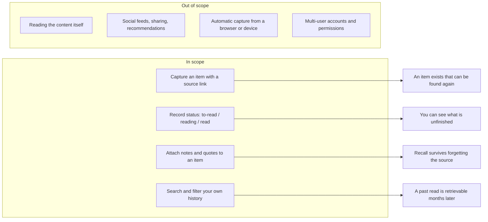

# Feature Requirement: Personal Reading Tracker

**Feature:** bench-d3-do-brainstorm-1 · **Branch:** `task/bench-d3-do-brainstorm-1` · **Status:** Draft
**Created:** 2026-08-18 · **Owner:** unassigned · **Ticket:** none

> WHAT and WHY only — no tech or implementation detail. Zero unresolved
> `[NEEDS CLARIFICATION]` markers at hand-off — every ambiguity is resolved via
> `AskUserQuestion` before this file is written; deferred answers become assumptions in §8.

## 1. Summary

A single personal place to record what you have read, are reading, and mean to read, so that months
later you can still answer "where did I see that?" — the recall problem, not the collecting problem.
Every ambiguity in this document was resolved by the assistant on the user's behalf ("Decide for me"),
so §8 is unusually large and §8's assumptions are the first thing design should re-check with the user.

**Scope boundary:**

## 2. User Stories

- **US1 (P1):** As a reader, I want to record something I have read with a link back to the source,
  so that I can find it again when I only half-remember it.
- **US2 (P1):** As a reader, I want to attach my own notes and quoted passages to an item, so that
  what I took from it survives forgetting the item itself.
- **US3 (P2):** As a reader, I want to search my own history by words in the title, my notes, or a
  tag, so that recall does not depend on remembering when I read it.
- **US4 (P2):** As a reader, I want each item to carry a status of to-read, reading, or read, so
  that I can see what I have left unfinished.
- **US5 (P3):** As a reader, I want to see what I read over a period, so that I can notice my own
  patterns without that being the point of the tool.

## 3. Functional Requirements

**Index** — `Status` is `Live` or `Superseded → <ref>`.

| ID | Requirement | Story | Priority | Status |
|---|---|---|---|---|
| FR-001 | Capture an item with title, source reference, and date added | US1 | P1 | Live |
| FR-002 | Attach free-form notes and verbatim quotes to an item | US2 | P1 | Live |
| FR-003 | Full-text search across titles, notes, and quotes | US3 | P2 | Live |
| FR-004 | Assign and filter by user-defined tags | US3 | P2 | Live |
| FR-005 | Track an item's status through to-read, reading, read | US4 | P2 | Live |
| FR-006 | Edit and delete any captured item and its attachments | US1 | P2 | Live |
| FR-007 | Export the whole collection in a portable, readable form | US1 | P2 | Live |
| FR-008 | List items read within a stated date range | US5 | P3 | Live |

**Detail**

- **FR-001:** The system MUST let the reader record an item with, at minimum, a title and a source
  reference, and MUST stamp the date it was added. The source reference MUST accept a URL, and MUST
  also accept a non-URL identifier such as a book title, an ISBN, or a free-text description of a
  physical source — a reading tracker that can only hold links cannot hold books. Every other field
  MUST be optional, so capture never blocks on completeness.
- **FR-002:** The system MUST let the reader attach any number of notes and verbatim quotes to an
  item, at any time — at capture, while reading, or long after finishing. A quote MUST be
  distinguishable from the reader's own note, because the value of a quote depends on knowing it is
  not paraphrase. A location hint (page, chapter, timestamp) MUST be recordable alongside a quote
  but MUST NOT be required.
- **FR-003:** The system MUST search across item titles, notes, and quotes together and return
  matching items. Search MUST be case-insensitive and MUST match on partial words, because the
  recall case is "I remember roughly one word of it".
- **FR-004:** The system MUST let the reader define tags freely and assign any number to an item,
  and MUST let the reader list items by tag. Tags MUST NOT be drawn from a fixed vocabulary: the
  categories a reader needs are not knowable in advance.
- **FR-005:** The system MUST record each item's status as exactly one of `to-read`, `reading`, or
  `read`, MUST default a newly captured item to `to-read`, and MUST allow the status to move in any
  direction — including back from `read`, because rereading is normal. When an item first becomes
  `read` the system MUST record that date.
- **FR-006:** The system MUST let the reader edit or delete any item, note, quote, or tag. Deletion
  MUST require an explicit confirmation, because the collection's whole value is that it is the only
  copy of the reader's own annotations.
- **FR-007:** The system MUST export the entire collection — items, notes, quotes, tags, statuses
  and dates — into a single file in a format that is readable without this tool. Export MUST be
  possible at any time and MUST NOT be gated behind any account or paid state.
- **FR-008:** The system MUST list items whose read date falls in a range the reader states, and MUST
  report the count. It MUST NOT compute streaks, goals, or targets.

## 4. Non-Functional Requirements

| ID | Constraint | Kind | Status |
|---|---|---|---|
| NFR-001 | Capture completes in a handful of interactions | UX | Live |
| NFR-002 | The reader's data stays on the reader's own storage | security | Live |
| NFR-003 | Search stays responsive at personal scale | performance | Live |
| NFR-004 | No data loss on interrupted writes | reliability | Live |
| NFR-005 | Usable offline | reliability | Live |

**Detail**

- **NFR-001 (Capture is cheap):** Recording a new item MUST take the reader no more than a title and
  a source reference. Every optional field MUST be deferrable to later. The binding reason: a tracker
  that costs more to write to than the reading is worth stops being used within a fortnight, and an
  abandoned tracker has negative value because it makes the reader believe things were recorded.
- **NFR-002 (Your notes are yours):** The collection MUST be stored under the reader's own control
  and MUST NOT be transmitted to a third party as a condition of the tool working. Reading history is
  disclosive — it reveals health, politics, and finances by inference — so this is a constraint, not
  a preference.
- **NFR-003 (Recall is fast):** A search across a personal collection — assumed in §8 to be low
  thousands of items — MUST return quickly enough that the reader does not context-switch away. This
  is a statement about the personal-scale case only; no claim is made about larger collections.
- **NFR-004 (Never lose an annotation):** An interrupted write MUST NOT corrupt or truncate the
  existing collection. A partially captured item is acceptable; a damaged collection is not.
- **NFR-005 (Works where reading happens):** Capture, notes, and search MUST work without a network
  connection. Reading happens on trains and planes, which is exactly where a quote is worth
  recording.

## 5. Out of Scope

- **Reading or rendering the content itself** — this tracks what was read, it is not a reader. A
  reader is a much larger product and would change every constraint above.
- **Social features: feeds, following, sharing, public shelves, recommendations** — the stated need
  is personal recall. Sharing introduces accounts, permissions, and moderation, none of which serve
  recall.
- **Automatic capture from a browser, e-reader, or device** — genuinely desirable and explicitly
  deferred, not rejected. It requires per-platform integration whose cost is unknown at this stage,
  and manual capture must be good enough to stand alone first.
- **Multi-user accounts, permissions, and sync between people** — single reader only, per A4.
- **Reading goals, streaks, and targets** — FR-008 reports what happened; it does not set targets.
  Gamification changes what the tool is for and was not asked for.

## 6. Acceptance Criteria

- [ ] An item can be captured with only a title and a source reference, and appears in the
      collection with its date added (FR-001, NFR-001).
- [ ] A book with no URL can be captured as readily as a web article (FR-001).
- [ ] A note and a verbatim quote can be attached to an existing item, and the two are visually
      distinguishable when read back (FR-002).
- [ ] Searching a partial word found only in a note returns the item that note belongs to (FR-003).
- [ ] An item carries multiple tags and is retrievable by any one of them (FR-004).
- [ ] A new item defaults to `to-read`; it can be moved to `read` and back again, and the first
      transition to `read` records a date (FR-005).
- [ ] Deleting an item requires a confirmation and, once confirmed, removes its notes and quotes too
      (FR-006).
- [ ] Export produces one file containing every item, note, quote, tag, status, and date, readable
      without this tool (FR-007).
- [ ] Items read in a stated date range are listed with a count, and no streak or goal is shown
      (FR-008).
- [ ] Capture, note-taking, and search all succeed with the network disabled (NFR-005).
- [ ] Interrupting the process mid-write leaves the previously saved collection intact and readable
      (NFR-004).

## 7. Open Questions

None. Every ambiguity surfaced in discovery was resolved by the assistant on the user's behalf and is
recorded in §8, because no user was present in this session to answer. This is a completed artifact
in form, but §8's basis column reads "assistant decided, user absent" throughout — design should treat
§8 as the agenda for the first real conversation rather than as settled fact.

## 8. Assumptions

| ID | Assumption | Affects | Basis |
|---|---|---|---|
| A1 | "What I read" spans web articles, books, and papers, not one medium | FR-001 | assistant decided, user absent |
| A2 | The driving need is later recall, not collecting or habit-tracking | US1, US2, FR-003 | assistant decided, user absent |
| A3 | Capture is manual; no browser or device integration | FR-001, Out of Scope | assistant decided, user absent |
| A4 | Single reader, no sharing or multi-user | NFR-002, Out of Scope | assistant decided, user absent |
| A5 | Personal scale is low thousands of items over years | NFR-003 | assistant decided, user absent |
| A6 | Notes and quotes are the payload; the link alone is not enough | FR-002 | assistant decided, user absent |
| A7 | Statuses are exactly to-read / reading / read | FR-005 | assistant decided, user absent |
| A8 | Export matters because the collection outlives the tool | FR-007 | assistant decided, user absent |

**Detail**

- **A1** — The phrase "what I read" was left open. I assumed all three media rather than picking one,
  which is why FR-001 requires a non-URL source reference. If the reader in fact only tracks web
  articles, FR-001 simplifies to a URL field and the book case disappears; if they only track books,
  the link-centric framing of FR-001 and FR-003 is wrong and capture should start from a search of a
  book database instead.
- **A2** — Three plausible motives sit behind "keep track of what I read": recall it later, see
  progress and habits, or build a shareable library. I chose recall because "keep track of what I
  read" is past-tense and possessive. If the real motive is habit-tracking, US5 becomes P1 and the
  whole document reorders around FR-008; if it is a shareable library, the sharing exclusion in §5
  is wrong.
- **A3** — Automatic capture is the single most-requested feature of tools in this space and the
  most expensive. I excluded it to keep the first version honest, and recorded it in §5 as deferred
  rather than rejected. If the reader's actual pain is "I forget to record things", A3 is the wrong
  call and automatic capture is the product.
- **A4** — Nothing in the request mentioned other people. I assumed single-user, which is what makes
  NFR-002's local-storage constraint affordable. Multi-user would pull in accounts, sync conflicts,
  and permissions, and would contradict NFR-002 as written.
- **A5** — NFR-003 needs some scale to mean anything. Low thousands over years is the ordinary
  personal case. If the reader has a 50,000-item legacy import, NFR-003 stops being free and becomes
  a real design constraint.
- **A6** — I assumed the reader wants their own annotations, not just a list of links. This is what
  makes FR-002 a P1 and what makes NFR-004 and FR-007 matter — a list of links is cheap to rebuild,
  years of notes are not. If the reader only wants a link list, FR-002 drops to P3 and NFR-004
  relaxes considerably.
- **A7** — I picked three statuses over richer alternatives (abandoned, skimmed, reference) because
  a status set that needs thought at capture time violates NFR-001. If the reader abandons books
  often, a fourth `abandoned` status is a cheap addition and FR-005 would need to say so.
- **A8** — Export was not requested. I raised it to a P2 requirement because NFR-002 says the data is
  the reader's, and data you cannot get out is not yours. If the reader disagrees, FR-007 is the
  easiest thing in this document to cut.

## 9. History

None — initial version.
