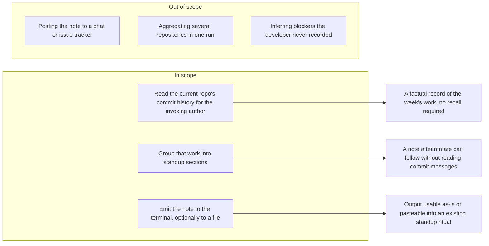

# Feature Requirement: Weekly Standup Note from Git History

**Feature:** bench-d3-do-brainstorm-2 · **Branch:** `task/bench-d3-do-brainstorm-2` · **Status:** Draft
**Created:** 2026-08-18 · **Owner:** unassigned · **Ticket:** none

> WHAT and WHY only — no tech or implementation detail. Zero unresolved
> `[NEEDS CLARIFICATION]` markers at hand-off — every ambiguity is resolved via
> `AskUserQuestion` before this file is written; deferred answers become assumptions in §8.
>
> Structure follows `references/ARTIFACT_FORMAT.md`: indexed sections carry a table above full
> `**Detail**`, `Status` is only `Live` or `Superseded → <ref>`, and superseded prose moves to §9.

## 1. Summary

A command-line tool that reads a developer's own recent commit history in the repository they are
standing in and emits a standup-shaped note — what was finished, what is still open, and a space for
blockers — so the developer stops reconstructing their week from memory or scrolling a log before
each standup.

**Scope boundary:**

## 2. User Stories

- **US1 (P1):** As a developer with a daily or weekly standup, I want my recent commits turned into a
  ready-to-read summary, so that I can report my week accurately without trawling the log.
- **US2 (P2):** As a developer whose week spans several strands of work, I want that summary grouped
  by the thing being worked on rather than listed commit by commit, so that a teammate can follow it.
- **US3 (P3):** As a developer whose reporting period is not exactly seven days, I want to choose the
  window the note covers, so that the note lines up with when my team actually meets.

## 3. Functional Requirements

**Index** — `Status` is `Live` or `Superseded → <ref>`.

| ID | Requirement | Story | Priority | Status |
|---|---|---|---|---|
| FR-001 | Produce a standup note from the invoking author's commits in the current repository | US1 | P1 | Live |
| FR-002 | Default the reporting window to the previous seven days and allow it to be changed | US3 | P3 | Live |
| FR-003 | Group the work by the subject it concerns rather than listing commits verbatim | US2 | P2 | Live |
| FR-004 | Emit the note with a Done, an In progress, and a Blockers section | US1 | P1 | Live |
| FR-005 | Write the note to standard output by default, or to a named file on request | US1 | P1 | Live |
| FR-006 | Report a usable result when the window contains no qualifying commits | US1 | P1 | Live |

**Detail**

- **FR-001:** The system MUST build the note from the commits authored by the person invoking it, in
  the repository they are standing in. Commits by other contributors MUST NOT appear. Merge commits
  MUST be excluded, because they record an integration event rather than a piece of work the author
  can report. If the invoking author cannot be identified from the repository's own configuration,
  the system MUST say so and stop rather than silently summarising everybody's commits.
- **FR-002:** The system MUST cover the seven days ending at the moment of invocation unless the user
  states a different window. The user MUST be able to state that window when invoking the tool. The
  note MUST state the window it covered, so a reader can tell what period is being reported.
- **FR-003:** The system MUST group commits by the subject they concern rather than emitting one
  bullet per commit. Where commit messages carry a recognisable ticket or issue reference, that
  reference MUST be the grouping key and MUST appear on the group. Where they do not, the system MUST
  group by the area of the repository the commits touched. A commit that fits no group MUST still
  appear in the note rather than being dropped.
- **FR-004:** The note MUST contain a Done section covering work that reached the repository's
  integration branch within the window, an In progress section covering work that exists on the
  author's other branches but has not reached it, and a Blockers section. The Blockers section MUST
  be emitted as an empty placeholder for the developer to complete; the system MUST NOT invent
  blockers, because nothing in commit history records them.
- **FR-005:** The system MUST write the note to standard output by default so it can be piped or
  copied. The user MUST be able to direct it to a file instead. Writing to a file MUST NOT overwrite
  an existing file without the user having asked for that.
- **FR-006:** When no commit in the window qualifies, the system MUST emit a note that states the
  window and says no qualifying work was found, and MUST exit successfully. An empty week is a valid
  answer to report at standup, not an error.

## 4. Non-Functional Requirements

| ID | Constraint | Kind | Status |
|---|---|---|---|
| NFR-001 | Repository content must not leave the machine | security | Live |
| NFR-002 | The note must be readable as plain text with no rendering step | UX | Live |
| NFR-003 | A run must complete fast enough to be done in the minute before standup | performance | Live |
| NFR-004 | The tool must never modify the repository | reliability | Live |

**Detail**

- **NFR-001 (Stays local):** Producing the note MUST NOT transmit commit messages, diffs, file names
  or any other repository content off the machine. Commit history routinely contains client names,
  unreleased product detail and internal identifiers, and a developer will not adopt a standup helper
  they have to get security review for. If a future variant wants to send content somewhere, that is
  a separate opt-in decision, not this requirement.
- **NFR-002 (Plain text):** The note MUST be readable exactly as emitted, without a viewer or a
  rendering step, because its destination is a chat message, a wiki box, or a person reading it aloud.
- **NFR-003 (Fast enough to be habitual):** A run over a typical week of one developer's commits MUST
  complete quickly enough that the developer runs it in the moments before standup rather than
  planning around it. A tool that takes long enough to be worth avoiding will be avoided, which
  defeats the whole requirement.
- **NFR-004 (Read-only):** The system MUST NOT create, move, amend or delete anything in the
  repository — no commits, no branches, no checkouts, no stashes. The one thing it may write is the
  output file the user explicitly asked for under FR-005.

## 5. Out of Scope

- **Posting the note anywhere** — delivery into a chat tool or issue tracker means credentials,
  per-workspace configuration and a failure mode that has nothing to do with summarising history. The
  note is emitted; the developer places it.
- **Summarising more than one repository in a run** — cross-repository roll-up needs a notion of which
  repositories count and how they are ordered in the note, which is a separate discovery. A developer
  with several repositories can run the tool in each.
- **Inferring blockers** — nothing in commit history records why work stalled. Guessing would produce
  confident, wrong standup content, which is worse than a blank line.
- **Reporting anything other than commits** — pull requests, reviews, comments and issue transitions
  are a different data source with different access requirements.
- **Editing or storing past notes** — the tool produces a note for a window; it keeps no archive and
  offers no history of what it previously emitted.

## 6. Acceptance Criteria

- [ ] Running the tool in a repository with a week of the author's commits produces a note containing
      only that author's non-merge commits (FR-001).
- [ ] The emitted note names the window it covered, and a user-supplied window changes what is
      included (FR-002).
- [ ] Commits sharing a ticket reference appear under one group carrying that reference; commits with
      no reference are grouped by repository area and none are dropped (FR-003).
- [ ] The note contains Done, In progress and Blockers sections, and Blockers is empty rather than
      populated by inference (FR-004).
- [ ] With no destination given the note goes to standard output; with one given it goes to that file,
      and an existing file is not silently overwritten (FR-005).
- [ ] Running over a window with no qualifying commits emits a note saying so and exits successfully
      (FR-006).
- [ ] A run makes no network connection (NFR-001).
- [ ] The repository is byte-identical before and after a run, apart from a requested output file
      (NFR-004).

## 7. Open Questions

None. (The `[NEEDS CLARIFICATION: question]` marker syntax is reserved for a session
aborted mid-loop — a completed artifact carries zero of these.)

## 8. Assumptions

| ID | Assumption | Affects | Basis |
|---|---|---|---|
| A1 | Only the invoking author's commits, in the current repository, are in scope | FR-001 | user deferred |
| A2 | The note goes to the terminal by default, with a file as the only alternative destination | FR-005 | user deferred |
| A3 | The note is grouped standup prose, not a literal commit list | FR-003, FR-004 | user deferred |
| A4 | The window defaults to the previous seven days and is user-settable | FR-002 | user deferred |
| A5 | In progress means the author's unmerged branch work; Blockers is left blank | FR-004 | user deferred |
| A6 | Merge commits are excluded from the note | FR-001 | user deferred |
| A7 | Ticket references, where present, are the grouping key; repository area otherwise | FR-003 | user deferred |
| A8 | Repository content must not leave the machine | NFR-001 | user deferred |
| A9 | The feature has no owner or ticket recorded yet | header | no owner or ticket was named |

**Detail**

- **A1** — Asked whether the note should cover the invoking author only, everyone in the repository,
  or several named repositories; the answer was deferred. Chose author-only in the current repository
  because a standup note reports what *you* did, and because it is the narrowest reading that still
  satisfies the request. If wrong, the likely correction is multi-repository roll-up, which would move
  an item out of §5 and add a notion of a repository set — a scope change, not a rewrite.
- **A2** — Asked where the note should end up; deferred. Chose standard output with an opt-in file,
  because that composes with whatever the team already does and needs no configuration. If the real
  need is posting into a chat tool, the third §5 exclusion becomes a requirement and this grows
  credentials and delivery-failure handling.
- **A3** — Asked whether the note should be a literal commit list or grouped narrative; deferred.
  Chose grouped, because US2's whole point is that a teammate can follow it, and a raw commit list is
  what the developer is already trying to avoid reading. If wrong, FR-003 relaxes to a straight list,
  which is strictly less work.
- **A4** — Asked how the window should be defined — fixed seven days, configurable, or since the last
  note; deferred. Chose a configurable window defaulting to seven days, because "weekly" was stated
  but team cadences differ. "Since the last note" was rejected because it implies keeping an archive,
  which §5 excludes.
- **A5** — Asked how In progress could be determined, given that commits record completed work;
  deferred. Chose the author's unmerged branch work as the signal and a blank Blockers line, because
  those are the only honest answers available from history. If the developer wants real blocker
  tracking, that is a different data source and a different feature.
- **A6** — Asked whether merge commits should count; deferred. Excluded them, because a merge records
  integration rather than authored work and would inflate the note. If a team's workflow makes merges
  meaningful units of work, this flips with no structural consequence.
- **A7** — Asked what grouping key to use; deferred. Chose ticket reference where the commit messages
  carry one and repository area otherwise, because that degrades gracefully across teams with and
  without ticket discipline. If a team uses neither convention, grouping falls back to area and the
  note is still correct, just coarser.
- **A8** — Asked whether commit content may leave the machine as part of producing the summary;
  deferred. Chose no, because the cost of being wrong is asymmetric: a local-only tool that could have
  been cloud-assisted is merely less clever, while a cloud tool that should have been local is a data
  incident. If the user later opts in, NFR-001 is superseded rather than quietly ignored.
- **A9** — No owner and no ticket were named in the request, so the header records `unassigned` and
  `none` rather than inventing either.

## 9. History

None — initial version.
