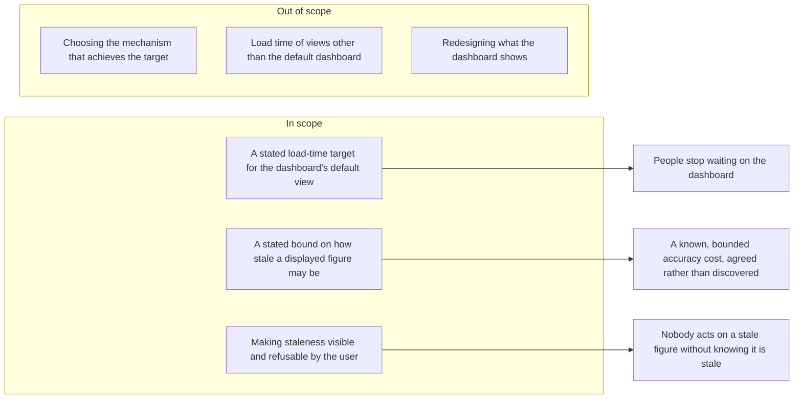

# Feature Requirement: Dashboard Loads Fast Enough to Be Usable

**Feature:** bench-d3-do-brainstorm-3 · **Branch:** `task/bench-d3-do-brainstorm-3` · **Status:** Draft
**Created:** 2026-08-18 · **Owner:** unassigned · **Ticket:** none

> WHAT and WHY only — no tech or implementation detail. Zero unresolved
> `[NEEDS CLARIFICATION]` markers at hand-off — every ambiguity is resolved via
> `AskUserQuestion` before this file is written; deferred answers become assumptions in §8.
>
> Structure follows `references/ARTIFACT_FORMAT.md`: indexed sections carry a table above full
> `**Detail**`, `Status` is only `Live` or `Superseded → <ref>`, and superseded prose moves to §9.

## 1. Summary

The dashboard takes long enough to load that people wait on it, and the wait is what they complain
about. This requirement states how quickly the dashboard must become usable, how stale the figures
on it may be in exchange, and what the user must be able to see and do about that staleness.

The request arrived as a proposed solution — "add a caching layer". That is a candidate mechanism,
and it is recorded here only so the trail from request to requirement is intact. **The mechanism is
not decided in this artifact and no requirement below presumes one**; it belongs to `/do-design`.
What discovery pinned down instead is the outcome the mechanism has to hit and the correctness
constraints it may not break to get there.

**Scope boundary:**

## 2. User Stories

- **US1 (P1):** As someone who opens the dashboard many times a day, I want it usable almost
  immediately, so that checking a number costs me a glance rather than a wait.
- **US2 (P1):** As someone making a decision from a dashboard figure, I want to know how current that
  figure is, so that speed is never bought with a wrong decision I could not have detected.
- **US3 (P2):** As someone who has just changed something, I want to be able to see the current truth
  on demand, so that a faster dashboard does not become a dashboard I cannot trust after a change.

## 3. Functional Requirements

**Index** — `Status` is `Live` or `Superseded → <ref>`.

| ID | Requirement | Story | Priority | Status |
|---|---|---|---|---|
| FR-001 | The dashboard's default view must reach a usable state within the stated target | US1 | P1 | Live |
| FR-002 | Every displayed figure must carry the time it is current as of | US2 | P1 | Live |
| FR-003 | The user must be able to demand current data and get it | US3 | P2 | Live |
| FR-004 | A figure the user themselves just changed must be shown current, not stale | US3 | P2 | Live |
| FR-005 | When the fast path is unavailable the dashboard must still load, correctly | US1 | P1 | Live |

**Detail**

- **FR-001:** Opening the dashboard's default view MUST bring it to a state the user can read and act
  on within the target named in NFR-001. "Usable" means the figures are on screen and correct as
  displayed — not that a skeleton or a spinner has appeared. A layout that arrives instantly and then
  fills in over several seconds does not satisfy this; it relocates the wait rather than removing it.
- **FR-002:** Every figure the dashboard displays MUST be accompanied by the time it is current as of,
  visible without interaction. This is the condition on which any staleness at all is acceptable: the
  bargain in NFR-002 is only defensible if the user can see which side of it they are on. A figure
  whose as-of time cannot be established MUST NOT be displayed as though it were current.
- **FR-003:** The user MUST be able to ask for current data and receive it, from the dashboard itself,
  without reloading the application or clearing anything by hand. The result MUST be current as of
  that request, and FR-002's as-of time MUST update to reflect it. If satisfying the request takes
  longer than NFR-001's target, that is acceptable — the user asked for correctness over speed — but
  the dashboard MUST show that the request is in flight.
- **FR-004:** A figure that reflects a change the same user has just made MUST be shown as current,
  not within NFR-002's staleness bound. Watching your own action fail to appear reads as the system
  having lost it, and no load-time gain is worth that. This applies to the acting user's own view; it
  does not extend to other users, who are covered by NFR-002.
- **FR-005:** If whatever makes the dashboard fast is unavailable, degraded, or returns nothing, the
  dashboard MUST still load with correct figures, taking as long as it takes. Failure of an
  optimisation MUST NOT become failure of the dashboard, and MUST NOT surface as an error to the user.

## 4. Non-Functional Requirements

| ID | Constraint | Kind | Status |
|---|---|---|---|
| NFR-001 | The default dashboard view must be usable within 2 seconds at p95 | performance | Live |
| NFR-002 | No displayed figure may be more than 5 minutes stale | reliability | Live |
| NFR-003 | One user's data must never be shown to another | security | Live |
| NFR-004 | The improvement must hold for a cold first visit, not only repeat visits | performance | Live |

**Detail**

- **NFR-001 (Usable in 2 seconds, p95):** The default dashboard view MUST reach FR-001's usable state
  within 2 seconds for 95% of loads, measured from the user's action to the figures being readable.
  See A1: the 2-second figure is a stated target chosen from common interactive-latency practice, not
  a measurement — discovery had no access to the current baseline. It MUST be confirmed against a
  measured baseline before design commits to it, and if the present p95 is far outside it, the target
  is what gets renegotiated, not the requirement's existence.
- **NFR-002 (Bounded, deliberate staleness):** No figure the dashboard displays may be more than 5
  minutes older than the underlying truth, except as narrowed by FR-004. This is the price being paid
  for NFR-001 and it is stated here so it is a decision rather than a side effect discovered in
  production. Any figure that cannot be kept inside this bound MUST be treated as un-displayable
  under FR-002 rather than shown with an old as-of time.
- **NFR-003 (No cross-user leakage):** A figure derived from one user's data MUST NEVER be shown to
  another user, under any load-time optimisation. This is not negotiable against NFR-001: a fast
  dashboard that occasionally shows someone else's numbers is a breach, not a regression. Any reuse
  of previously computed results MUST be scoped so that this cannot occur even transiently.
- **NFR-004 (Cold visits count):** NFR-001 MUST hold for a user's first visit of the day, not only
  for a repeat visit moments after a previous one. The complaint being answered is about opening the
  dashboard, and the first open of the day is the one people remember. A measurement taken only on
  warm repeat loads does not demonstrate this requirement.

## 5. Out of Scope

- **Choosing the mechanism** — whether the target is met by storing computed results, by changing how
  the figures are derived, by narrowing what the default view loads, or by something else, is a design
  decision. This artifact states the target and the constraints it must be met within; `/do-design`
  picks how. Naming the mechanism here would settle by assumption the one question design exists to
  answer, and would do it before anyone has measured where the time actually goes.
- **Views other than the default dashboard** — the request named the dashboard. Extending a latency
  target across every screen is a much larger commitment and needs its own evidence.
- **Changing what the dashboard shows** — no figure is added, removed, or redefined. Doing the same
  job faster is the whole of it.
- **Making writes faster** — this covers reading the dashboard, not the speed of the operations that
  produce the underlying data.
- **Offline or disconnected use** — showing figures with no live connection is a different capability
  with a different staleness contract, and it is not what "loads faster" asked for.

## 6. Acceptance Criteria

- [ ] The default dashboard view reaches a readable, correct state within 2 seconds at p95, measured
      against a recorded baseline (FR-001, NFR-001).
- [ ] That p95 holds for a cold first visit and not only for a warm repeat visit (NFR-004).
- [ ] Every displayed figure shows an as-of time without the user interacting (FR-002).
- [ ] A figure whose as-of time cannot be established is not displayed as current (FR-002, NFR-002).
- [ ] Requesting current data from the dashboard returns data current as of that request, updates the
      as-of time, and indicates that the request is in flight (FR-003).
- [ ] A change made by a user is reflected in that user's own view immediately rather than after the
      staleness bound (FR-004).
- [ ] No displayed figure is ever more than 5 minutes stale (NFR-002).
- [ ] No user is ever shown a figure derived from another user's data (NFR-003).
- [ ] With the fast path made unavailable, the dashboard still loads correct figures and shows no
      error (FR-005).

## 7. Open Questions

None. (The `[NEEDS CLARIFICATION: question]` marker syntax is reserved for a session
aborted mid-loop — a completed artifact carries zero of these.)

## 8. Assumptions

| ID | Assumption | Affects | Basis |
|---|---|---|---|
| A1 | "Faster" means a usable default view within 2 seconds at p95 | NFR-001, FR-001 | user deferred |
| A2 | Only the default dashboard view is in scope | FR-001 | user deferred |
| A3 | Up to 5 minutes of staleness is an acceptable price | NFR-002 | user deferred |
| A4 | Both cold and warm loads are in scope, cold being the priority | NFR-004 | user deferred |
| A5 | The user must be able to force current data on demand | FR-003 | user deferred |
| A6 | Every figure carries a visible as-of time | FR-002 | user deferred |
| A7 | A user's own just-made change is exempt from the staleness bound | FR-004 | user deferred |
| A8 | Loss of the fast path degrades to the current behaviour, never to an error | FR-005 | user deferred |
| A9 | The mechanism the request proposed is treated as a design candidate, not a requirement | §1, §5 | skill boundary |
| A10 | No owner and no ticket are recorded | header | none was named |

**Detail**

- **A1** — Asked what "faster" has to mean to count as solved: a stated absolute target, a relative
  improvement on today, or a target derived from a measured baseline. Deferred. Chose an absolute
  2-second p95 because a requirement with no number is not testable and acceptance criteria need one.
  This is the weakest assumption in the artifact and it is labelled as such in NFR-001: discovery had
  no access to the current baseline and 2 seconds is a conventional interactive threshold, not a
  measurement. If the present p95 is an order of magnitude away, the number moves during design; the
  requirement that there BE a committed, measured target does not.
- **A2** — Asked whether the target covers the default dashboard only or every view. Deferred. Chose
  the default view, because that is what the request named and it is the narrowest scope that still
  answers the complaint. Widening it later adds views without invalidating anything written here.
- **A3** — Asked how stale a figure may be before the speed is not worth it. Deferred. Chose 5
  minutes, on the reasoning that a dashboard is a monitoring surface rather than a transactional one
  and its figures are already aggregates over longer windows. If any figure on it is genuinely
  decision-critical to the second, A3 is wrong for that figure specifically, and the fix is a
  per-figure bound rather than abandoning the requirement.
- **A4** — Asked whether the complaint is about the first load, repeat loads, or both. Deferred.
  Chose both with cold prioritised, because an improvement that only shows up on a repeat visit
  optimises the load nobody was complaining about. This is deliberately the harder reading.
- **A5** — Asked whether the user needs a way to demand current data. Deferred. Chose yes: without it,
  A3's staleness bound is something done to the user rather than something they can step outside of,
  and the first time a figure looks wrong they lose trust in the whole surface.
- **A6** — Asked whether staleness must be visible or may be silent. Deferred. Chose visible, and it
  is the condition on which A3 is defensible at all. Silent staleness converts a stated trade-off
  into an undetectable defect; the cost of showing an as-of time is one line of screen space.
- **A7** — Asked whether a user's own just-made change may be subject to the staleness bound.
  Deferred. Chose exempt, because a user not seeing their own action reads as data loss and generates
  exactly the support load this work is meant to reduce. Scoped to the acting user only, since
  extending it to everyone would collapse A3 entirely.
- **A8** — Asked what should happen if the fast path is unavailable. Deferred. Chose silent
  degradation to current behaviour, because the dashboard worked before this change and an
  optimisation whose absence is an outage is a net reliability loss.
- **A9** — Not a deferred question but a recorded reading of the skill's boundary. The request named
  a mechanism ("a caching layer"). This artifact is WHAT/WHY only, so the mechanism is recorded in §1
  as the request's wording and excluded in §5, and no requirement below is written in terms of it.
  If measurement during design shows the time is not going where a stored-result approach would help,
  nothing in this artifact needs rewriting — which is the point of not having adopted it. If the
  intent was instead a firm architectural directive rather than a proposal, that is a decision to
  restate at the design gate, and this assumption is where it gets caught.
- **A10** — No owner and no ticket were named, so the header records `unassigned` and `none` rather
  than inventing either.

## 9. History

None — initial version.
