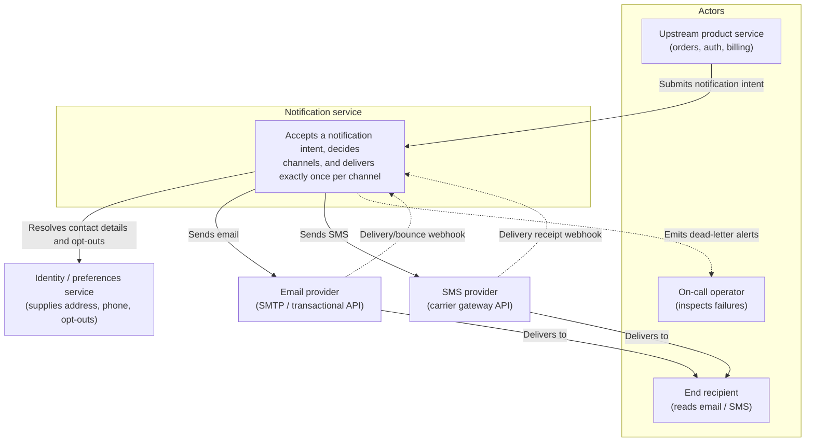
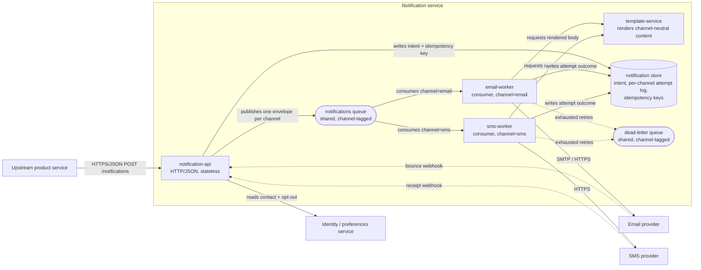
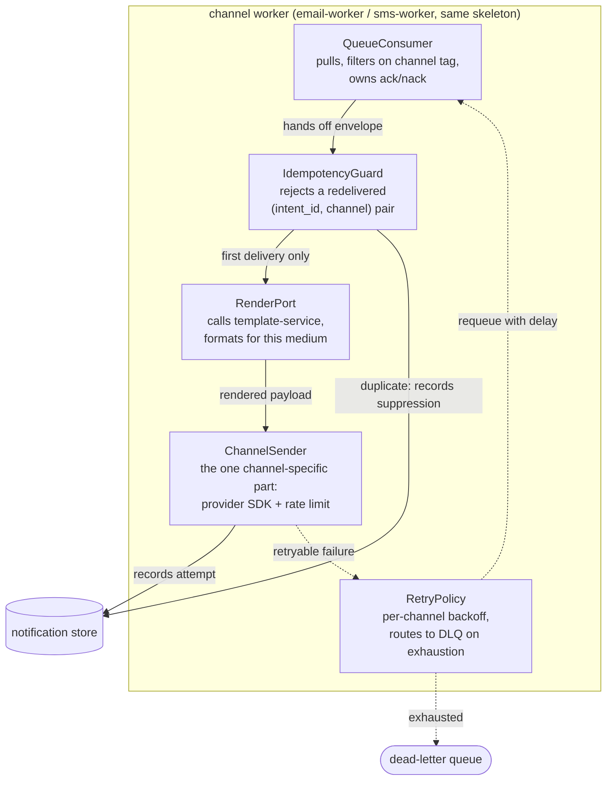
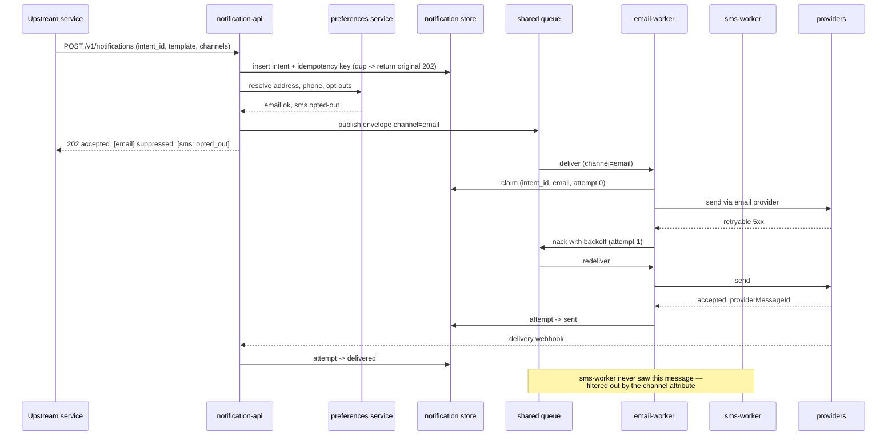

# Design: Notification service with a shared email/SMS queue

**Feature:** bench-d3-do-design-1 · **Requirement:** ./requirement.md · **Status:** Draft · **Created:** 2026-08-18

> System shape — architecture, APIs, data/interface contracts. Reads ./requirement.md.
> Distinct from plan.md's HOW-to-implement; this is HOW-it's-shaped.
>
> Structure follows `references/ARTIFACT_FORMAT.md`: indexed sections carry a table above full
> `**Detail**`, `Status` is only `Live` or `Superseded → <ref>`, and superseded prose moves to §9.

**Input gap, stated up front:** `requirement.md` does not exist for this feature
(`has_requirement: false` from the resolver). Step 3's advisory precondition was not satisfied.
Every FR/NFR reference below is therefore a *provisional* identifier this design coins for its own
internal traceability, not a pointer into an existing requirement artifact. When
`/do-brainstorm` later produces `requirement.md`, these IDs must be reconciled.

## 1. Architecture Approach

One notification API accepts a channel-agnostic `NotificationRequest`, normalises it into a single
canonical envelope, and publishes it to **one shared queue** — the shared queue is the requested
constraint, so the design's real work is deciding what "shared" means at the consumer, payload,
and failure boundaries. Consumers are split per channel: an email worker and an SMS worker each
subscribe to the same queue with a channel filter, so the two share transport, ordering domain,
backpressure and observability while keeping delivery logic, provider credentials, and rate limits
independent. Rendering is pulled out of both workers into a shared template service so a
notification's content is decided once and each channel only formats it for its own medium. The
boundary that matters: the queue carries *intent to notify*, never a pre-rendered channel-specific
body — that is what lets one message serve both channels without the producer knowing which
channels will fire.

## 2. System Overview (C4)

### C1: System Context



### C2: Container



### C3: Component

Required here — the feature touches more than three components inside the worker container.



## 3. Components & Boundaries

| ID | Component | Kind | Serves | Status |
|---|---|---|---|---|
| C-01 | notification-api | service | FR-001, FR-002 | Live |
| C-02 | notifications queue (shared) | infrastructure | FR-003 | Live |
| C-03 | email-worker | service | FR-004 | Live |
| C-04 | sms-worker | service | FR-005 | Live |
| C-05 | template-service | service | FR-006 | Live |
| C-06 | notification store | data store | FR-007 | Live |
| C-07 | dead-letter queue + replay | infrastructure | FR-008 | Live |

**Detail**

- **C-01 (notification-api):** owns the public contract, idempotency-key admission, contact and
  opt-out resolution against the preferences service, channel selection, and fan-out of one
  envelope per selected channel onto the shared queue. It deliberately does not own rendering, any
  provider credential, or any retry — a caller's request either becomes durable enqueued intent or
  is rejected synchronously, and nothing in between.
- **C-02 (notifications queue, shared):** the single transport both channels consume. It carries a
  channel tag as a message attribute so a consumer can subscribe by filter rather than by separate
  topic. It owns durability, at-least-once delivery, visibility timeout, and the ordering domain.
  It deliberately does not own routing logic: it never inspects payload contents to decide who
  consumes, only the tag the producer set.
- **C-03 (email-worker):** consumes `channel=email`, renders through C-05, sends through the email
  provider, applies the email retry policy and the email rate limit. Owns nothing SMS-specific and
  holds no SMS credential; a misconfiguration in one channel cannot page the other.
- **C-04 (sms-worker):** the same skeleton as C-03 against the SMS provider, with its own
  (much tighter) rate limit and its own segment/length constraints. Kept a separate deployable so
  the two channels scale and fail independently despite sharing the queue.
- **C-05 (template-service):** turns a template id plus variables into channel-neutral content,
  which each worker then formats for its medium (HTML/plain for email, 160-char segments for SMS).
  It owns copy and localisation; it owns no delivery concern and never talks to a provider.
- **C-06 (notification store):** the record of intent, the idempotency-key index, and the
  per-`(intent_id, channel)` attempt log that makes "did this person get told?" answerable per
  channel. It is not a queue and is never polled as one.
- **C-07 (dead-letter queue + replay):** one shared DLQ, channel-tagged like the main queue, plus
  an operator replay path. Owns the terminal-failure surface; owns no retry decision, which stays
  in each worker's RetryPolicy.

## 4. API / Interface Contracts

**Inbound — `POST /v1/notifications`** (called by upstream product services)

```jsonc
// request
{
  "intent_id": "uuid",              // caller-supplied; the idempotency key
  "recipient_ref": "user:9f2c…",    // opaque; the API resolves address/phone via preferences
  "template_id": "order.shipped",
  "variables": { "order_no": "A-1187", "eta": "2026-08-21" },
  "channels": ["email", "sms"],     // optional; omitted means "use recipient preference"
  "priority": "standard"            // standard | urgent
}
// 202 Accepted
{ "intent_id": "uuid", "accepted_channels": ["email", "sms"],
  "suppressed": [{ "channel": "sms", "reason": "opted_out" }] }
```

`202` always, once the intent is durably stored and enqueued; delivery outcome is never reported
synchronously. A repeated `intent_id` returns the original `202` body unchanged and enqueues
nothing.

**Queue envelope — the contract that makes the queue shareable**

```jsonc
{
  "envelope_version": 1,
  "intent_id": "uuid",
  "channel": "email",               // ALSO set as a broker message attribute, for filtering
  "recipient": { "address": "…" },  // resolved by the API, one channel's address only
  "template_id": "order.shipped",
  "variables": { … },
  "priority": "standard",
  "attempt": 0,
  "enqueued_at": "2026-08-18T09:00:00Z"
}
```

The envelope is channel-*tagged*, not channel-*shaped*: every field except `recipient` and
`channel` is identical across channels, so a third channel (push, webhook) is added by tagging, not
by changing the schema. The envelope carries no rendered body — see §7 R2.

**Outbound — provider ports.** Each worker depends on a narrow `ChannelSender` port
(`send(renderedPayload) -> {providerMessageId} | RetryableError | PermanentError`), so provider
swaps do not reach past the worker boundary.

**Inbound — `POST /v1/webhooks/{provider}`** for bounce and delivery receipts; updates the C-06
attempt log, never re-enters the queue.

## 5. Data Model

| Entity | Key | Holds |
|---|---|---|
| `notification_intent` | `intent_id` (uuid, caller-supplied) | recipient_ref, template_id, variables (jsonb), requested channels, priority, created_at |
| `notification_attempt` | `(intent_id, channel, attempt_no)` | status (`queued`/`sent`/`failed`/`suppressed`/`dead`), provider_message_id, error_code, timestamps |
| `idempotency_key` | `intent_id` | first-seen response body, created_at, TTL |

`notification_attempt` is keyed per `(intent_id, channel)` rather than per intent: one shared queue
message-set can succeed on email and dead-letter on SMS, and a single-row-per-intent model could
not represent that. Unique constraint on `(intent_id, channel, attempt_no)` is what makes the
worker's IdempotencyGuard cheap — a redelivery loses the insert race and is recorded as suppressed.

## 6. Sequence / Data Flow



## 7. Design Risks & Alternatives Considered

| ID | Risk / Alternative | Disposition | Status |
|---|---|---|---|
| R1 | Alternative: one topic fanned out to per-channel queues instead of one shared queue | rejected | Live |
| R2 | Alternative: render in the API and put the finished body on the queue | rejected | Live |
| R3 | Head-of-line blocking — a slow SMS provider starves email throughput on the shared queue | mitigated | Live |
| R4 | At-least-once delivery means a duplicate notification reaches the recipient | mitigated | Live |
| R5 | A shared DLQ mixes two operational failure modes in one place | accepted | Live |
| R6 | Adding a third channel requires touching the producer's channel-selection logic | accepted | Live |

**Detail**

- **R1** → Per-channel queues are the textbook shape and give perfect isolation, but they were the
  thing the request explicitly ruled out, and they cost a second source of truth for ordering and
  backpressure plus duplicated infrastructure per channel added later. Rejected in favour of one
  queue with a channel message-attribute filter, which preserves independent *consumers* (the part
  that actually needs isolation) while keeping one transport. The cost is R3.
- **R2** → Rendering in the API would make the envelope self-contained and workers trivial, but it
  freezes copy at enqueue time (a template fix cannot help a message already queued), inflates the
  message far past broker size limits for HTML email, and forces a channel-shaped payload —
  destroying the property that makes one queue serve both channels. Rejected; the envelope carries
  intent, workers render at send time.
- **R3** → Real, and the direct price of R1. Mitigated structurally rather than by tuning:
  consumers are separate deployables with separate concurrency and prefetch, so SMS backpressure
  parks SMS consumers, not the queue; the channel attribute means an email worker never even
  receives an SMS message. Residual exposure is broker-level — a very deep SMS backlog still
  consumes shared queue depth and can hit a global size limit. Accepted at that level, with a
  queue-depth-by-channel alarm as the detection.
- **R4** → At-least-once is a property of the transport, not a bug to design away. Mitigated with
  the `(intent_id, channel, attempt_no)` unique constraint and the worker IdempotencyGuard, which
  makes a redelivery a recorded suppression rather than a second send. Exactly-once to the provider
  is still not guaranteed — a crash between provider-accept and store-write can re-send — so this
  reduces duplicates, it does not eliminate them, and the design does not claim otherwise.
- **R5** → One DLQ means an operator triaging an SMS carrier outage sifts past email bounces. Kept
  anyway for symmetry with the shared main queue and to keep one replay path; the channel tag makes
  filtered triage possible. Cost if it lands: slower triage, not lost messages. Revisit if DLQ
  volume makes filtering insufficient.
- **R6** → The channel-selection logic in C-01 is the one place that must learn a new channel; the
  envelope, queue, store schema, and DLQ do not change. Accepted as the deliberate location of that
  coupling rather than dispersing it.

## 8. Assumptions

| ID | Assumption | Affects | Basis |
|---|---|---|---|
| A1 | One physical queue with a channel message-attribute filter, not one topic with per-channel subscriber queues | C-02, C-03, C-04 | user deferred (no user available; "share a queue" read literally) |
| A2 | One envelope is published per selected channel, not one multi-channel envelope consumed twice | C-01, C-02 | user deferred |
| A3 | Retry policy and DLQ routing are per channel; the DLQ itself is shared and channel-tagged | C-03, C-04, C-07 | user deferred |
| A4 | No cross-channel ordering or "first channel to succeed wins" semantics are required | C-02, C-06 | user deferred |
| A5 | Contact details and opt-outs are resolved by the API before enqueue, not by the worker | C-01, C-05 | user deferred |
| A6 | Broker is a standard at-least-once queue with message attributes and a visibility timeout (SQS/RabbitMQ class), not a partitioned log | C-02 | user deferred |

**Detail**

- **A1** — "share a queue" was read as one physical queue both consumers subscribe to with a
  channel filter. If it turns out to mean one *logical* pipeline over per-channel queues, C-02 and
  the C2 diagram change and R3 disappears entirely; nothing in the envelope contract (§4) or store
  schema (§5) would need to change, which is why this assumption is cheap to reverse.
- **A2** — One message per channel keeps the consumer trivial (ack means "this channel is done")
  and makes per-channel retry and DLQ natural. A single multi-channel message consumed by both
  workers would need partial-ack semantics no mainstream broker offers. If it turns out a single
  message is required, the whole retry and idempotency design in §5 and C3 changes shape.
- **A3** — Email and SMS have very different retry economics (an SMS retry costs money per attempt;
  an email retry does not), so a shared retry policy would be wrong for one of them. If a single
  global policy is mandated instead, RetryPolicy moves out of the worker into shared config.
- **A4** — Assumed each channel is independent and a recipient may legitimately get both. If
  "notify by SMS only if email fails" is actually required, this is no longer a fan-out design at
  all: it becomes a per-intent state machine and §6's sequence is wrong.
- **A5** — Resolving before enqueue means the envelope carries a concrete address and the worker
  needs no preferences dependency, but it also means a preference changed after enqueue is not
  honoured. If late binding is required, C-05's boundary moves and the worker gains a PREFS edge.
- **A6** — A partitioned log (Kafka class) has no per-message visibility timeout and no attribute
  filtering, so A1's shared-queue-with-filter shape would not work as written; consumers would read
  every message and discard by channel. If the broker is a log, revisit A1 first.

## 9. History

None — initial version.
