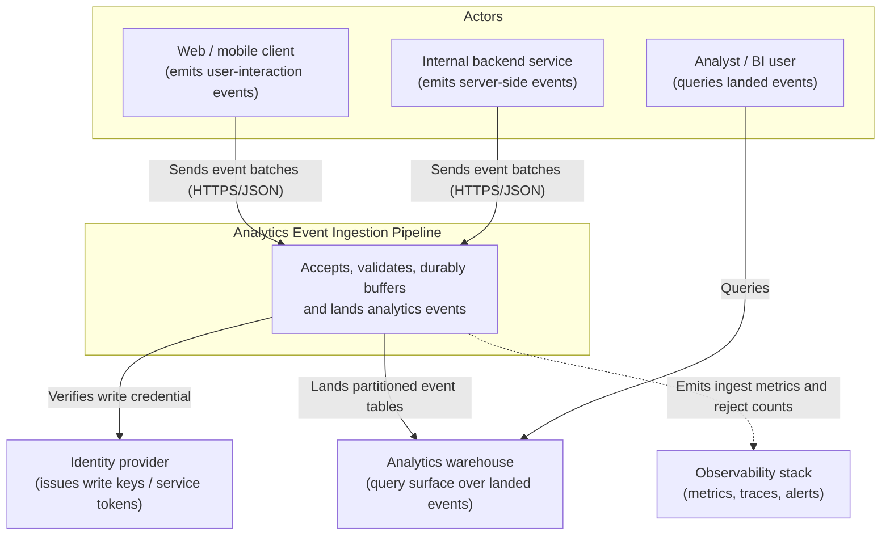
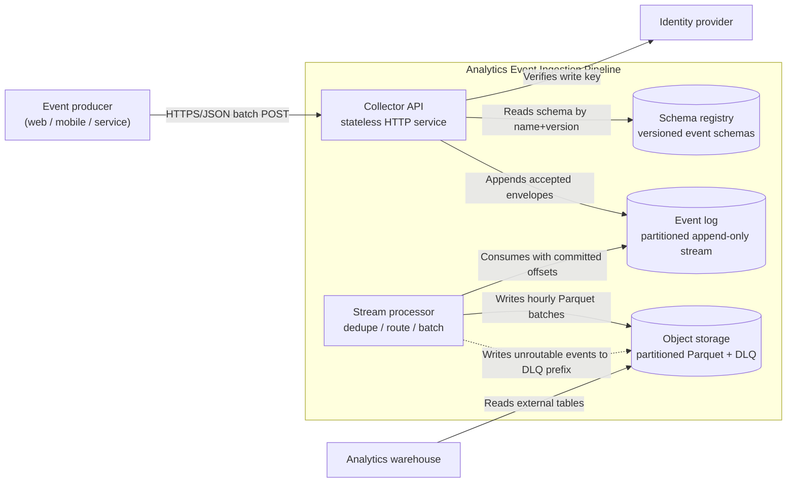
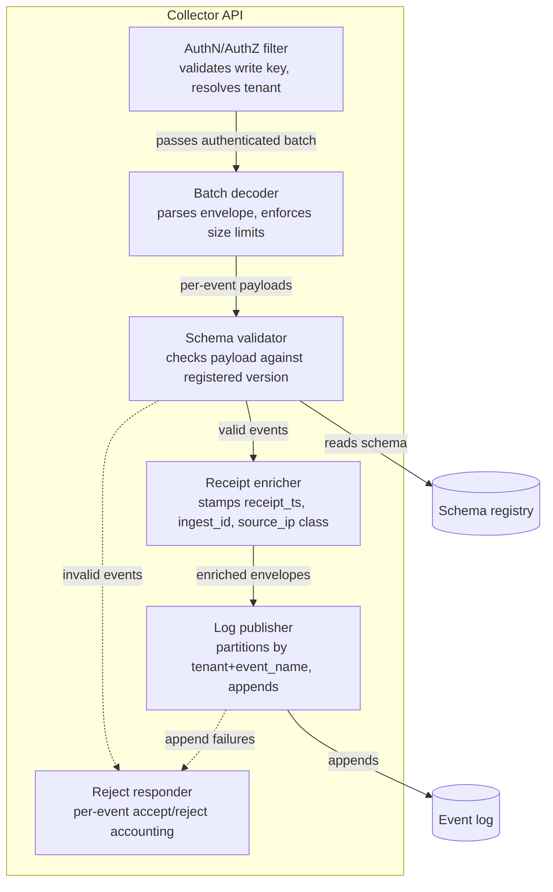
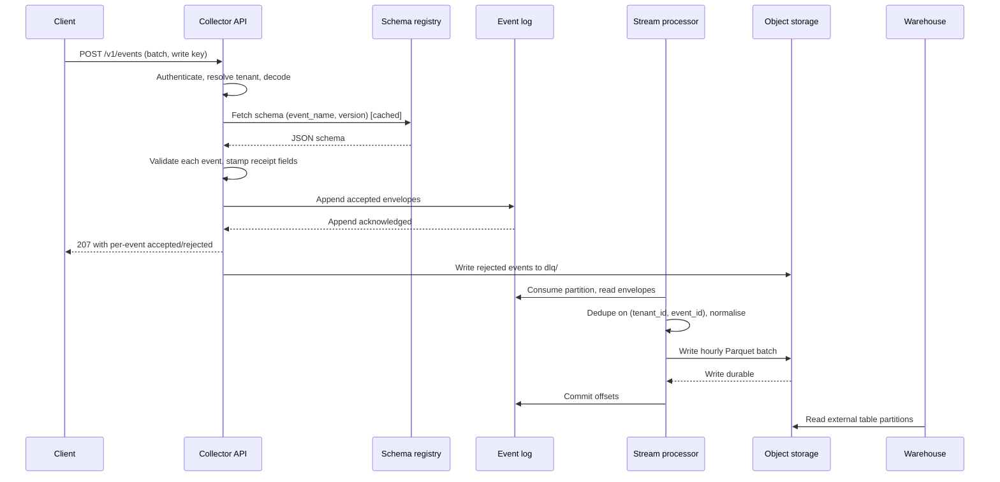

# Design: Analytics Event Ingestion Pipeline

**Feature:** bench-d3-do-design-2 · **Requirement:** ./requirement.md (not present — see §8 A0) · **Status:** Draft · **Created:** 2026-08-18

> System shape — architecture, APIs, data/interface contracts. Reads ./requirement.md.
> Distinct from plan.md's HOW-to-implement; this is HOW-it's-shaped.
>
> Structure follows `references/ARTIFACT_FORMAT.md`: indexed sections carry a table above full
> `**Detail**`, `Status` is only `Live` or `Superseded → <ref>`, and superseded prose moves to §9.

## 1. Architecture Approach

Analytics events arrive from first-party clients (web, mobile, backend services) at a thin stateless
HTTP collector whose only jobs are authenticate, validate against a registered schema, stamp
server-side receipt metadata, and append to a durable append-only log. Everything downstream reads
from that log, so the collector never blocks on a warehouse write and a downstream outage degrades
freshness rather than losing events. A stream processor consumes the log, deduplicates on the
client-supplied event id, routes rejects to a dead-letter topic, and lands batched, partitioned
Parquet in object storage; the warehouse reads that storage. The boundary that matters is
**collector = admission control, log = the durable contract, processor = shaping** — the collector
owns no business semantics and the processor owns no authentication.

## 2. System Overview (C4)

### C1: System Context

Actors that emit events and the external systems the pipeline hands off to. Internals are at C2/C3.



### C2: Container

Independently deployable units and the data stores between them.



### C3: Component

Internals of the Collector API — the one container this feature adds the most surface to, and it
carries more than three components.



## 3. Components & Boundaries

| ID | Component | Kind | Serves | Status |
|---|---|---|---|---|
| C1 | Collector API | service | Event admission | Live |
| C2 | Schema registry | service | Contract enforcement | Live |
| C3 | Event log | service | Durable buffering | Live |
| C4 | Stream processor | service | Dedupe, routing, batching | Live |
| C5 | Object storage landing zone | service | Warehouse-readable storage | Live |
| C6 | Dead-letter path | service | Non-lossy failure handling | Live |

**Detail**

- **C1 (Collector API)** → Owns admission control: terminates TLS, authenticates the write key,
  resolves the tenant, decodes the batch, enforces per-batch and per-event size limits, calls the
  schema validator, stamps server-side receipt fields, and appends accepted envelopes to the event
  log. It returns a per-event accept/reject result so a single bad event never fails a whole batch.
  It deliberately does **not** own deduplication, ordering guarantees, warehouse schema, or any
  business interpretation of an event's payload — it is stateless and horizontally scalable, and
  holds no data of its own beyond an in-process schema cache.
- **C2 (Schema registry)** → Owns the versioned catalogue of event schemas keyed by
  `(event_name, schema_version)`, and owns the compatibility rule that a new version of an existing
  event must be backward compatible (added optional fields only). It serves reads to the collector
  and to the stream processor. It does not own runtime validation itself — it hands out the schema;
  the collector applies it — and it does not gate deploys.
- **C3 (Event log)** → Owns durability and replay. An append-only partitioned stream, partitioned by
  `tenant_id` + `event_name`, with a retention window long enough to rebuild downstream state from
  scratch. It is the pipeline's contract boundary: once an event is appended, the collector's
  obligation ends and the processor's begins. It does not own transformation, deduplication, or
  any notion of "landed".
- **C4 (Stream processor)** → Owns everything between the log and storage: deduplication on
  `(tenant_id, event_id)` over a bounded window, late-arrival handling against the event's
  `occurred_at`, normalisation into the columnar row shape, and batching into hourly partitions. It
  commits offsets only after a batch is durably written, which is what makes the pipeline
  at-least-once end to end. It does not own authentication or schema publication.
- **C5 (Object storage landing zone)** → Owns the physical layout the warehouse reads:
  `s3://<bucket>/events/<event_name>/dt=<YYYY-MM-DD>/hr=<HH>/*.parquet`, plus the manifest the
  warehouse's external tables point at. It does not own query semantics or access control beyond
  bucket-level policy.
- **C6 (Dead-letter path)** → Owns non-lossy failure: any event the validator rejects or the
  processor cannot route is written verbatim, with its rejection reason and original receipt
  metadata, under a `dlq/` prefix in the same storage. It exists so that "we dropped it" is never
  the answer, and so a schema mistake is replayable after a fix. It does not own alerting — it emits
  a counter the observability stack alerts on.

## 4. API / Interface Contracts

**`POST /v1/events`** — the only ingest surface.

Request headers: `Authorization: Bearer <write-key>`, `Content-Type: application/json`,
optional `Content-Encoding: gzip`.

Request body:

```json
{
  "sent_at": "2026-08-18T09:30:00.000Z",
  "events": [
    {
      "event_id": "01J9Z8QW3N7Y0000000000",
      "event_name": "checkout_completed",
      "schema_version": 3,
      "occurred_at": "2026-08-18T09:29:58.412Z",
      "context": { "app_version": "4.12.0", "platform": "web" },
      "properties": { "order_id": "A-1001", "amount_cents": 4999 }
    }
  ]
}
```

Response `207 Multi-Status` — always per-event, even when everything succeeded:

```json
{
  "ingest_id": "ing_01J9Z8R0",
  "accepted": 1,
  "rejected": 0,
  "results": [{ "event_id": "01J9Z8QW3N7Y0000000000", "status": "accepted" }]
}
```

Status contract: `207` whenever the batch itself was well-formed and authenticated (individual
events may still be rejected in `results`); `400` only for a malformed or oversized batch envelope;
`401` for a bad or revoked write key; `413` over the batch size limit; `429` with `Retry-After` when
the tenant's rate limit is exceeded; `503` when the event log is unavailable — the only status a
client should retry wholesale.

Client retry contract: retries reuse the same `event_id` values. That, plus C4's dedupe window, is
what turns transport-level at-least-once into effectively-once landing.

**Internal:** the log envelope the collector appends is the client event plus
`{tenant_id, ingest_id, receipt_at, collector_version, ip_country}`; the processor reads only this
envelope, never the raw HTTP request.

## 5. Data Model

Event envelope as landed (one Parquet row):

| Field | Type | Source | Notes |
|---|---|---|---|
| `event_id` | string (ULID) | client | Dedupe key with `tenant_id` |
| `tenant_id` | string | collector | Resolved from write key, never client-supplied |
| `event_name` | string | client | Also the storage partition |
| `schema_version` | int | client | Must exist in registry |
| `occurred_at` | timestamp UTC | client | Business time; drives late-arrival handling |
| `receipt_at` | timestamp UTC | collector | Server time; authoritative for ordering |
| `landed_at` | timestamp UTC | processor | Freshness measurement |
| `context` | struct | client | Flattened to typed columns per registered schema |
| `properties` | struct | client | Flattened to typed columns per registered schema |
| `ingest_id` | string | collector | Batch correlation for support and replay |
| `ip_country` | string | collector | Coarsened at the collector; raw IP is never stored |

Registry entry: `(event_name, schema_version, json_schema, owner, created_at, status)` where
`status ∈ {active, deprecated}`. Adding a required field requires a new `schema_version`; adding an
optional field does not.

DLQ row: the full original envelope plus `{reject_reason, reject_stage, rejected_at}`.

## 6. Sequence / Data Flow



Ordering note: the collector responds to the client only after the log append is acknowledged, so a
`207 accepted` is a durability promise, not an optimistic one. The processor commits offsets only
after the Parquet write is durable, so a processor crash replays rather than loses.

## 7. Design Risks & Alternatives Considered

| ID | Risk / Alternative | Disposition | Status |
|---|---|---|---|
| R1 | Client SDK writes directly to the log, no collector | rejected | Live |
| R2 | Collector writes straight to the warehouse, no log | rejected | Live |
| R3 | Exactly-once end to end instead of at-least-once + dedupe | rejected | Live |
| R4 | Dedupe window is bounded, so a very late duplicate lands twice | accepted | Live |
| R5 | Schema-on-read instead of a registry | rejected | Live |
| R6 | Small-file proliferation from hourly partitioning at low volume | mitigated | Live |

**Detail**

- **R1** → Rejected. Giving untrusted clients broker credentials makes the write key a
  broker-level credential and puts partition-key and serialisation decisions in every client
  release, which cannot be changed without a client rollout. The collector costs one hop and buys
  a single place to authenticate, validate, and evolve the wire contract.
- **R2** → Rejected. It couples client-visible availability to the warehouse: a warehouse
  maintenance window becomes a client-facing 5xx and dropped events. The log makes that a freshness
  lag instead. It also makes replay after a transformation bug impossible.
- **R3** → Rejected. End-to-end exactly-once requires a transactional coupling between the log and
  object storage that neither commodity object storage nor a client HTTP retry can honour. Since
  clients must retry on `503` anyway, the duplicate is already in the system; the honest design is
  to accept at-least-once transport and idempotently collapse on `(tenant_id, event_id)`.
- **R4** → Accepted. A duplicate arriving after the dedupe window (assumed 24h, A2) lands twice and
  is corrected by the warehouse's downstream dedupe view, not by the pipeline. Cost if it lands: a
  small, bounded overcount on the raw table, visible and fixable at query time. The alternative —
  an unbounded dedupe key store — grows without limit for a failure mode measured in a handful of
  events per month.
- **R5** → Rejected. Schema-on-read pushes every producer mistake to the analyst, months later, in
  a query. A registry moves the failure to ingest time where the producing team still has context,
  and the DLQ (C6) means enforcement is not lossy.
- **R6** → Mitigated. Hourly partitions on a low-volume event produce many tiny Parquet files, which
  degrade warehouse scans. Mitigated by the processor writing a partition only when either a size
  threshold or the hour boundary is reached, plus a daily compaction pass over the previous day's
  partitions.

## 8. Assumptions

| ID | Assumption | Affects | Basis |
|---|---|---|---|
| A0 | Designed without a `requirement.md` | all | Advisory precondition unmet; no user available |
| A1 | Ingest is a first-party HTTP collector, not direct-to-broker SDKs | C1 | user deferred |
| A2 | At-least-once delivery with a 24h dedupe window, not exactly-once | C4 | user deferred |
| A3 | A durable log sits between collector and storage | C3 | user deferred |
| A4 | Schemas are registry-enforced at ingest, not schema-on-read | C2 | user deferred |

**Detail**

- **A0** — `"$DOFLOW" paths --json` reported `has_requirement: false`. The skill's step 3 gate is
  advisory, and there was no user to accept the offer to run `/do-brainstorm` first, so this design
  proceeds from the one-line prompt. What would change if wrong: volume, latency and retention
  NFRs are unstated here, and they are exactly the inputs that would decide A2's window, C3's
  retention, and C5's partition granularity. Treat every quantity in this document as a shape, not
  a sized commitment.
- **A1** — Assumed a collector because it is the only shape that lets the wire contract change
  without a client release, and because R1's credential exposure is hard to walk back. What would
  change if wrong: if producers are exclusively trusted internal services on the same network, the
  collector's authentication layer (C1/AUTH) collapses to mTLS and direct log append becomes
  defensible, removing a hop and a deployable.
- **A2** — Assumed at-least-once because HTTP clients retry and object storage offers no cross-system
  transaction. The 24h window is a placeholder sized to a client's plausible offline-retry horizon.
  What would change if wrong: a requirement for strict exactly-once forces a transactional sink
  (warehouse-native streaming ingest) in place of C5, which trades replayability for the guarantee.
- **A3** — Assumed a log because it is what makes downstream outages non-lossy and transformation
  bugs replayable. What would change if wrong: at genuinely low volume with relaxed durability, the
  collector could batch straight to object storage and C3/C4 collapse into one component — cheaper,
  but replay and backpressure both become manual.
- **A4** — Assumed registry enforcement because the DLQ makes it non-lossy, so the usual objection
  to strict ingest validation (dropping data) does not apply. What would change if wrong: if
  producers cannot be made to register schemas, C2 becomes an observed-shape catalogue and
  validation degrades to a warning counter rather than a reject.

## 9. History

None — initial version.
