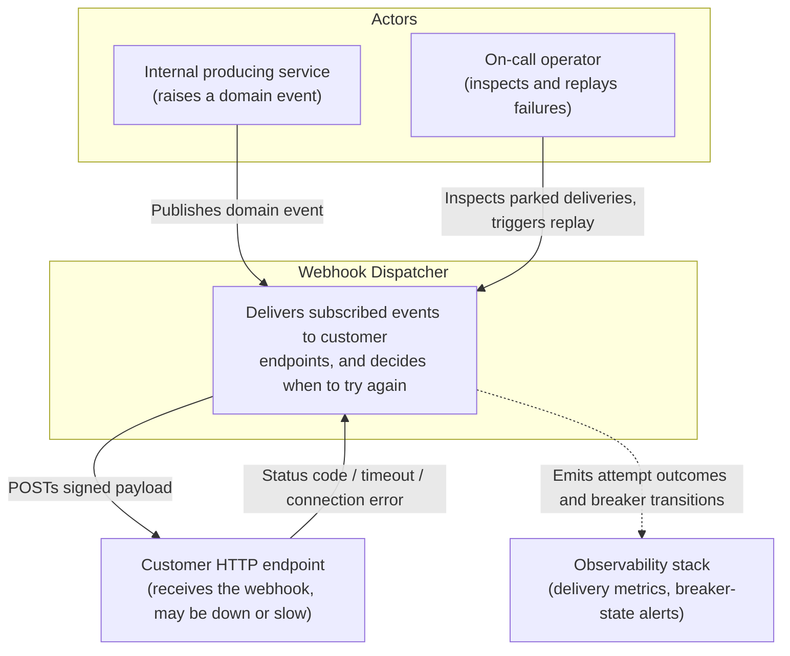
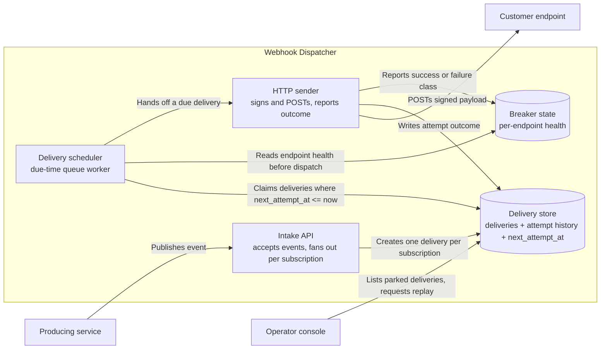
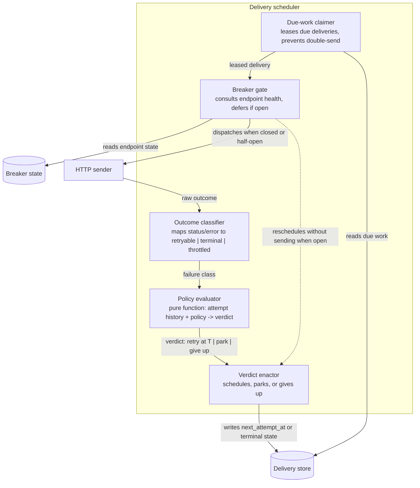
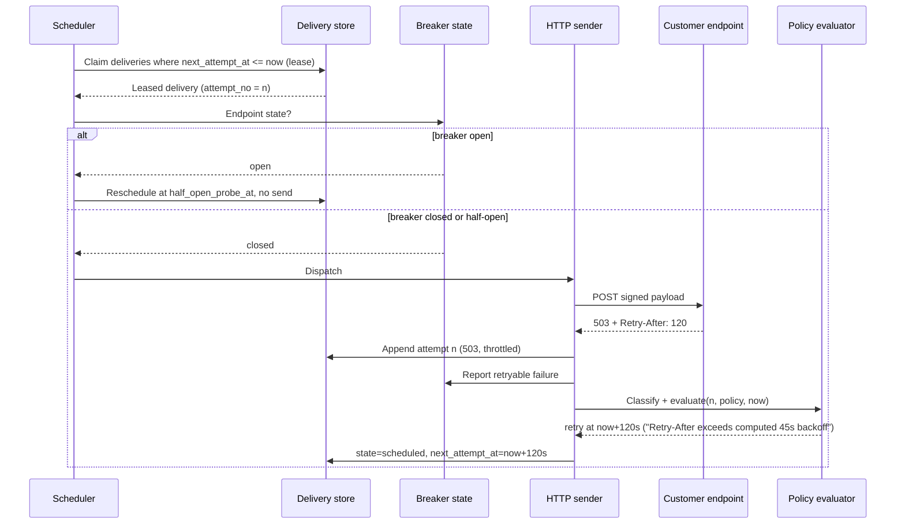

# Design: Webhook Dispatcher Retry Policy

**Feature:** bench-d3-do-design-3 · **Requirement:** ./requirement.md (not present — see §8 A0) · **Status:** Draft · **Created:** 2026-08-18

> System shape — architecture, APIs, data/interface contracts. Reads ./requirement.md.
> Distinct from plan.md's HOW-to-implement; this is HOW-it's-shaped.
>
> Structure follows `references/ARTIFACT_FORMAT.md`: indexed sections carry a table above full
> `**Detail**`, `Status` is only `Live` or `Superseded → <ref>`, and superseded prose moves to §9.

## 1. Architecture Approach

The retry policy is not a `catch` block inside the sender — it is a **separately owned scheduling
decision** placed between a durable delivery-attempt record and the HTTP sender. A dispatch attempt
that fails writes its outcome to the attempt store; a policy evaluator reads that outcome plus the
subscription's policy and returns one of three verdicts — `retry at T`, `park`, or `give up` — and a
scheduler enacts it. The sender therefore never decides whether to retry; it only reports what
happened. That split is what makes the policy testable without a network, and what lets one
subscription's failing endpoint be quarantined without touching the delivery path of every other.
A per-endpoint circuit breaker sits alongside the evaluator so a hard-down endpoint stops consuming
retry capacity rather than absorbing it.

## 2. System Overview (C4)

### C1: System Context



### C2: Container



### C3: Component

Internals of the Delivery scheduler container — the component this feature adds, and it carries
more than three parts.



## 3. Components & Boundaries

| ID | Component | Kind | Serves | Status |
|---|---|---|---|---|
| C1 | Outcome classifier | service | Failure taxonomy | Live |
| C2 | Policy evaluator | service | Retry decision | Live |
| C3 | Verdict enactor | service | Scheduling and terminal states | Live |
| C4 | Breaker gate + breaker state | service | Endpoint quarantine | Live |
| C5 | Delivery store | service | Durable attempt history | Live |
| C6 | Replay surface | service | Operator recovery | Live |

**Detail**

- **C1 (Outcome classifier)** → Owns the mapping from a raw HTTP result to exactly one failure
  class: `success` (2xx), `retryable` (408, 425, 429, 5xx, connect timeout, read timeout, TLS
  handshake failure, DNS failure), `terminal` (400, 401, 403, 404, 410, 422 — the endpoint
  understood the request and refuses it), and `throttled` (429 or 503 carrying `Retry-After`, split
  out because it names its own delay). It owns nothing about timing. It deliberately does not treat
  every non-2xx as retryable: retrying a 401 forever is how a misconfigured subscription becomes a
  self-inflicted outage.
- **C2 (Policy evaluator)** → Owns the retry decision and is a **pure function** of
  `(failure class, attempt history, subscription policy, now)` returning
  `{verdict, next_attempt_at, reason}`. No I/O, no clock of its own — `now` is injected — which is
  what makes the full backoff curve, the budget exhaustion boundary and the `Retry-After` override
  testable without a server. It does not write anything and does not know the breaker exists; the
  gate (C4) is consulted before it, not by it.
- **C3 (Verdict enactor)** → Owns the only writes that change a delivery's lifecycle state:
  `pending → in_flight → (delivered | scheduled | parked | abandoned)`. It persists
  `next_attempt_at` for a `retry`, moves the delivery to `parked` with its full attempt history for
  a budget exhaustion, and to `abandoned` for a terminal class. It owns the invariant that a
  delivery is never both scheduled and terminal.
- **C4 (Breaker gate + breaker state)** → Owns per-endpoint quarantine, keyed by
  `(subscription_id, endpoint_host)`. Closed → open after a threshold of consecutive retryable
  failures; open → half-open after a cool-down, admitting a single probe; half-open → closed on a
  success, back to open on a failure. While open, due deliveries for that endpoint are rescheduled
  without a network call, so a dead endpoint costs a store write instead of a connection timeout. It
  does not decide per-delivery retry counts — that is C2 — and it never abandons a delivery.
- **C5 (Delivery store)** → Owns durability and the audit trail: one row per delivery plus an
  append-only attempt history (`attempt_no`, `started_at`, `duration_ms`, `status_code`,
  `failure_class`, `response_excerpt`). It owns the lease that stops two schedulers sending the same
  delivery. It does not own retention policy beyond a fixed window on attempt bodies.
- **C6 (Replay surface)** → Owns the operator path out of `parked`: list parked deliveries by
  subscription and reason, and re-enqueue one or a filtered set with a fresh budget. It exists so
  "the endpoint was down for six hours" is recoverable without a database edit. It does not
  auto-replay; re-arming a budget is a human decision because it can re-trigger the same overload.

## 4. API / Interface Contracts

**Policy evaluator (the contract this design exists to fix):**

```text
evaluate(input) -> verdict

input   = { failure_class:  "success" | "retryable" | "terminal" | "throttled",
            attempt_no:     int,            // 1-based, the attempt that just finished
            first_attempt_at: timestamp,
            retry_after_s:  int | null,     // parsed from the response header, if present
            policy:         RetryPolicy,
            now:            timestamp }

verdict = { decision: "retry" | "park" | "abandon" | "done",
            next_attempt_at: timestamp | null,
            reason: string }                // always populated, always human-readable
```

**RetryPolicy** (per subscription, defaulted at the tenant level):

| Field | Default | Meaning |
|---|---|---|
| `max_attempts` | 8 | Attempt cap including the first |
| `max_elapsed_s` | 86400 | Wall-clock budget from `first_attempt_at` |
| `base_delay_s` | 5 | First retry delay |
| `multiplier` | 3 | Exponential factor |
| `max_delay_s` | 3600 | Per-interval ceiling |
| `jitter` | `full` | `full` \| `equal` \| `none` |
| `respect_retry_after` | true | `Retry-After` overrides the computed delay when longer |

Decision rules, in order: `success → done`; `terminal → abandon`; `attempt_no >= max_attempts` or
`now - first_attempt_at >= max_elapsed_s → park`; otherwise `retry` at
`now + jitter(min(base_delay_s * multiplier^(attempt_no-1), max_delay_s))`, raised to `retry_after_s`
when that is longer and `respect_retry_after` is set. Backoff is capped, not truncated: hitting
`max_delay_s` does not end the sequence, only flattens it.

**Operator surface:** `GET /admin/deliveries?state=parked&subscription_id=…` and
`POST /admin/deliveries/{id}/replay` (idempotent per `(delivery_id, replay_token)`).

**Outbound contract** is unchanged by this design: signed `POST` with `X-Webhook-Id`,
`X-Webhook-Attempt` (now meaningful — it carries `attempt_no`), `X-Webhook-Signature`, `X-Webhook-Timestamp`.

## 5. Data Model

`delivery`:

| Field | Type | Notes |
|---|---|---|
| `id` | uuid | Stable across all attempts; the receiver's dedupe key |
| `subscription_id` | uuid | Owns the effective RetryPolicy |
| `event_id` | uuid | Source event |
| `state` | enum | `pending` \| `in_flight` \| `delivered` \| `scheduled` \| `parked` \| `abandoned` |
| `attempt_count` | int | Denormalised from attempt history for the due-work index |
| `first_attempt_at` | timestamp | Anchors `max_elapsed_s` |
| `next_attempt_at` | timestamp \| null | Null in every terminal state |
| `lease_until` | timestamp \| null | Claim lease, prevents double-send |
| `terminal_reason` | text \| null | Populated for `parked` and `abandoned` |

`delivery_attempt` (append-only): `delivery_id`, `attempt_no`, `started_at`, `duration_ms`,
`status_code`, `failure_class`, `response_excerpt` (truncated), `error`.

`endpoint_breaker`: `(subscription_id, endpoint_host)`, `state`, `consecutive_failures`,
`opened_at`, `half_open_probe_at`.

Index that carries the scheduler: `(state, next_attempt_at)` filtered to `state = 'scheduled'`.

## 6. Sequence / Data Flow



Budget exhaustion follows the same path with the verdict `park` and a `terminal_reason` naming which
bound was hit — `max_attempts` or `max_elapsed_s` — never a bare "failed".

## 7. Design Risks & Alternatives Considered

| ID | Risk / Alternative | Disposition | Status |
|---|---|---|---|
| R1 | Retry loop inside the sender rather than a separate evaluator | rejected | Live |
| R2 | In-process retry with `sleep` instead of a persisted `next_attempt_at` | rejected | Live |
| R3 | Synchronised retries stampede a recovering endpoint | mitigated | Live |
| R4 | Strict per-subscription ordering during retries | rejected | Live |
| R5 | Parked deliveries accumulate unbounded for an abandoned endpoint | accepted | Live |
| R6 | Breaker quarantines an endpoint that was only briefly slow | mitigated | Live |

**Detail**

- **R1** → Rejected. A retry loop inside the sender couples the decision to a live socket, so the
  policy cannot be tested without a server, and the retry budget dies with the process. Making the
  evaluator a pure function (C2) is the whole point of the design.
- **R2** → Rejected. `sleep`-based retry loses every in-flight retry on deploy or crash, and a
  one-hour `max_delay_s` would mean holding a worker for an hour. Persisting `next_attempt_at` makes
  restarts free and lets the queue depth be observed.
- **R3** → Mitigated by `jitter: full` as the default. Without jitter, an endpoint that was down for
  ten minutes gets every backed-up delivery at the same instant on recovery — the retry policy
  causes the second outage. Full jitter spreads the same expected delay over the interval.
- **R4** → Rejected. Guaranteeing per-subscription order across retries means head-of-line blocking:
  one endpoint's slow 503 stalls every later event for that subscriber, and the retry budget then
  measures queue age rather than endpoint health. Deliveries retry independently; ordering is the
  receiver's job via `event_id` and the event's own timestamp. Recorded because it is the choice most
  likely to be revisited.
- **R5** → Accepted. Nothing in this design deletes `parked` deliveries, so a permanently dead
  subscriber accretes rows. Cost if it lands: store growth proportional to that subscriber's event
  volume, visible in the parked-count metric before it is a problem. The alternative — auto-purging
  after N days — silently destroys the audit trail that C6 exists to serve, so the disposal decision
  is left to a retention policy stated outside this design.
- **R6** → Mitigated. A breaker keyed on consecutive retryable failures can open on a transient
  latency spike. Half-open probing bounds the cost: one probe after the cool-down restores service,
  so a false positive delays that endpoint by one cool-down rather than quarantining it.

## 8. Assumptions

| ID | Assumption | Affects | Basis |
|---|---|---|---|
| A0 | Designed without a `requirement.md`, and against no existing dispatcher code | all | Advisory precondition unmet; no user available |
| A1 | Exponential backoff with full jitter and a per-interval ceiling | C2 | user deferred |
| A2 | Two bounds — attempt cap and wall-clock budget — ending in `parked`, not silent drop | C2, C3 | user deferred |
| A3 | Retries are independent; no per-subscription ordering guarantee | C3 | user deferred |
| A4 | Durable store-backed scheduling with a per-endpoint circuit breaker | C4, C5 | user deferred |

**Detail**

- **A0** — `"$DOFLOW" paths --json` reported `has_requirement: false`, and a search of this
  repository for a webhook dispatcher found only incidental mentions in
  `core/shared/templates/doflow/external-contract-template.md` and
  `core/shared/skills/do-execute-plan/references/scaffold.md` — there is no dispatcher here to read.
  The skill's step 3 gate is advisory and no user was available to accept the offer of
  `/do-brainstorm`, so this design proceeds from the one-line prompt against an assumed dispatcher.
  What would change if wrong: every default in §4's policy table is a shape, not a sized commitment,
  and an existing dispatcher's actual state machine would constrain C3's lifecycle states.
- **A1** — Assumed exponential + full jitter because it is the only common curve that both bounds
  load on a struggling endpoint and avoids R3's recovery stampede. What would change if wrong: a
  contractual "deliver within N seconds" SLA would force a flat short interval with a hard deadline,
  which trades endpoint protection for latency.
- **A2** — Assumed both an attempt cap and a wall-clock budget, because either alone is wrong at one
  end: attempts alone let a long backoff run for days, elapsed time alone lets a fast-failing
  endpoint burn dozens of attempts in a minute. Ending in `parked` rather than deleted is assumed
  because a dropped webhook is invisible to the subscriber. What would change if wrong: if operators
  will not triage a parked queue, `park` collapses into `abandon` and C6 loses its purpose.
- **A3** — Assumed no ordering guarantee, per R4. What would change if wrong: a subscriber that
  genuinely needs ordered delivery forces a per-subscription serial lane, which reintroduces
  head-of-line blocking and makes the breaker (C4) mandatory rather than protective.
- **A4** — Assumed durable scheduling plus a breaker because R2's failure mode (losing retries on
  deploy) is unacceptable at any volume. What would change if wrong: at very low volume with an
  at-most-once tolerance, C5 could be an in-memory timer wheel and C4 unnecessary.

## 9. History

None — initial version.
