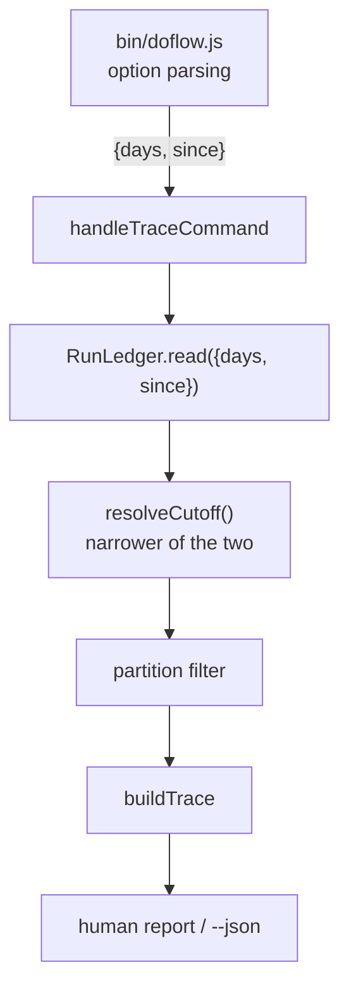

# Design: `--since <date>` window for the run ledger

**Feature:** bench-d3-do-flow-2 · **Status:** Draft · **Created:** 2026-08-18
Traces: FR-001, FR-002, FR-003, NFR-001 from `requirement.md`.

## 1. Architecture Approach

No new module. The window is already a property of one reader — `RunLedger.read()` in
`src/runtime/trace.js` — which today takes `{ days }` and computes a cutoff Date. `--since` is a
second way to express the same cutoff, so it belongs in the same place: `read()` gains a `since`
option, resolves both inputs to one cutoff, and every consumer of the reader is unchanged.

## 2. System Overview (C4)

### C3: Component

## 3. Components & Boundaries

| Component | Change | Boundary held |
|---|---|---|
| `bin/doflow.js` | parse `--since <value>`, pass through to the trace case | Parsing only; no date semantics here |
| `src/runtime/trace.js` `RunLedger.read` | accept `since`, resolve one cutoff | Sole owner of window semantics |
| `src/runtime/trace.js` `ledgerSummary` | emit `windowSince` alongside `windowDays` | Additive only (NFR-001) |
| `handleTraceCommand` | thread the option, print the applied window | No filtering logic of its own |

`stats` and `discover` call the same `read()`, so they will accept `since: null` and behave exactly
as today. Widening them is out of scope per requirement §5, and this shape does not force it.

## 4. API / Interface Contracts

- CLI: `doflow trace [--days <N>] [--since <YYYY-MM-DD>]`
- `RunLedger.read({ days = null, since = null })` →
  `{ …existing…, days: number|null, since: string|null }`
- `trace --json` → `ledger.windowDays` unchanged; `ledger.windowSince` added, `null` when unused.
- Validation failure: throw a named error carrying the flag and the accepted form; the CLI's
  existing error path turns it into a non-zero exit with that message (FR-002).

## 5. Data Model

No persisted shape changes. The ledger's on-disk day partitions are untouched; only which
partitions are read changes.

## 6. Sequence / Data Flow

1. CLI parses `--since` as a raw string and does not interpret it.
2. `read()` validates: must match `^\d{4}-\d{2}-\d{2}$` and parse to a real date not after today.
3. `read()` computes `cutoffDays` from `days` (existing rule) and `cutoffSince` from `since`.
4. The applied cutoff is `max(cutoffDays, cutoffSince)` over the non-null ones — the narrower
   window, per FR-003.
5. Partitions dated on or after the applied cutoff are read; the summary records which inputs were
   given and which cutoff was applied.

## 7. Design Risks & Alternatives Considered

| Alternative | Why not |
|---|---|
| Convert `--since` to a day count in the CLI and reuse `days` untouched | Loses the distinction FR-003 needs to report, and re-derives a date the reader already has. |
| A general `--range <a>..<b>` flag | Serves a need nobody asked for and enlarges a flag surface D.2 just cut. |
| Accept relative strings ("last monday") | Needs a date-parsing dependency; the repo is plain Node with none. Would make this a dependency-change task first. |

Risk: the `--days` cutoff is computed as `(N-1)` days back at millisecond precision, while `--since`
is a date boundary. Both must be floored to the start of the local day before comparison, or the
narrower-window rule picks wrongly for part of a day.

## 8. Assumptions

Inherits A1–A4 from `requirement.md` §8. One added:

- **A5** — the comparison happens in local time, matching how the existing partition names are
  formed. Recorded because a UTC/local mismatch is exactly the off-by-one this risk section names.
  Basis: no user available; "Decide for me".

## 9. History

None — initial version.
