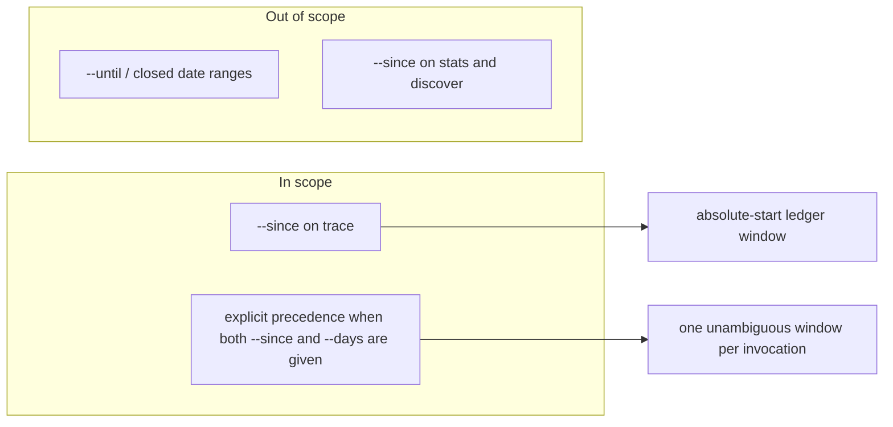

# Feature Requirement: `--since <date>` window for the run ledger

**Feature:** bench-d3-do-flow-2 · **Branch:** `task/bench-d3-do-flow-2` · **Status:** Draft
**Created:** 2026-08-18 · **Owner:** unassigned · **Ticket:** none

## 1. Summary

`doflow trace` can only window the run ledger relatively, with `--days N`. This adds an absolute
window start, `--since <date>`, so a user can ask "everything from the 1st onward" without
recomputing N every day.

**Scope boundary:**

## 2. User Stories

- **US1 (P1):** As a DoFlow user reviewing a run, I want to window `doflow trace` from an explicit
  start date, so that I can look at a fixed period without converting it to a day count.
- **US2 (P2):** As a user who mistypes a date, I want a clear rejection, so that I do not read a
  silently-empty ledger as "nothing happened".

## 3. Functional Requirements

**Index** — `Status` is `Live` or `Superseded → <ref>`.

| ID | Requirement | Story | Priority | Status |
|---|---|---|---|---|
| FR-001 | `trace` accepts `--since <date>` and keeps records dated on or after it | US1 | P1 | Live |
| FR-002 | An unparseable or future `--since` value is rejected with a named error | US2 | P2 | Live |
| FR-003 | `--since` and `--days` together resolve to one stated window | US1 | P2 | Live |

**Detail**

- **FR-001:** `doflow trace --since <date>` MUST keep only ledger partitions dated on or after the
  given date, inclusive of that date, using the same calendar-day partitioning `--days` already
  uses. The value MUST be accepted in `YYYY-MM-DD` form.
- **FR-002:** A value that does not parse as a calendar date, or that is later than today, MUST
  exit non-zero with a message naming the flag and the accepted form. It MUST NOT fall back to the
  unwindowed ledger and MUST NOT report an empty result as a successful read.
- **FR-003:** When both `--since` and `--days` are given, the run MUST use the narrower of the two
  windows and MUST state in its output which window it applied. It MUST NOT silently drop one.

## 4. Non-Functional Requirements

| ID | Constraint | Kind | Status |
|---|---|---|---|
| NFR-001 | The JSON shape of `trace --json` stays backward-compatible | reliability | Live |

**Detail**

- **NFR-001 (JSON compatibility):** Existing consumers read `ledger.windowDays`. Adding an absolute
  window MUST NOT remove or repurpose that field; a new field carries the absolute start. Breaking
  it would break any script already parsing `trace --json`.

## 5. Out of Scope

- **`--until` / closed ranges** — an end bound is a separate need; nothing in this request asks to
  exclude recent records.
- **`--since` on `stats` and `discover`** — they share the ledger reader and would inherit it
  cheaply, but widening the surface is a separate decision from serving this request.

## 6. Acceptance Criteria

- [ ] `doflow trace --since 2026-08-01` returns only records dated 2026-08-01 or later (FR-001).
- [ ] `doflow trace --since notadate` exits non-zero and names the flag and accepted form (FR-002).
- [ ] `doflow trace --since <date> --days N` states which window it applied (FR-003).
- [ ] `doflow trace --json` still emits `ledger.windowDays` (NFR-001).

## 7. Open Questions

None.

## 8. Assumptions

| ID | Assumption | Affects | Basis |
|---|---|---|---|
| A1 | `--since` is inclusive of the named date | FR-001 | no user available; "Decide for me" |
| A2 | `YYYY-MM-DD` is the only accepted form | FR-001 | no user available; "Decide for me" |
| A3 | `--since` + `--days` narrows rather than errors | FR-003 | no user available; "Decide for me" |
| A4 | Scope stays on `trace`, not `stats`/`discover` | §5 | no user available; "Decide for me" |

**Detail**

- **A1** — Inclusive matches how `--days` computes its cutoff (`(N-1)` days back from today, so the
  Nth day is included). If wrong, the boundary record is off by one day.
- **A2** — Relative forms ("last monday") would need a date-parsing dependency; the repo has none
  and is plain Node with no bundler. If wrong, this becomes a dependency-change task first.
- **A3** — Erroring on the combination is the other defensible answer. Narrowing was chosen because
  it never loses data the user asked to see. If wrong, FR-003 becomes a rejection rule.
- **A4** — The request names `trace` only. If wrong, the same option threads through two more
  handlers that already take `days`.

## 9. History

None — initial version.
