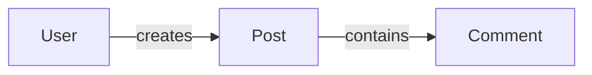
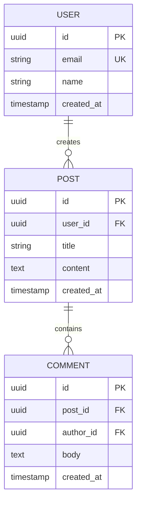
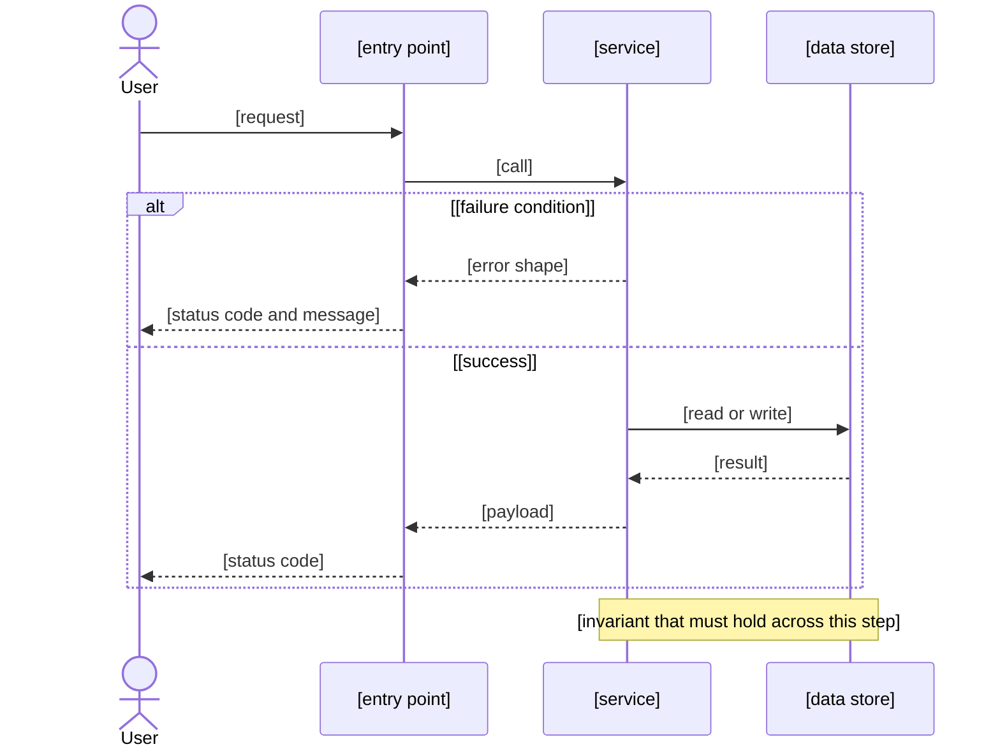

# Data Model: [FEATURE NAME]

**Feature:** [NNN-slug] · **Design:** ./design.md · **Maturity:** Draft · **Created:** [DATE]

> Entity/data model and data-flow diagrams a design decided, split out of design.md's own narrative
> (§5/§6) and specs.md's interface-contract detail (§1). Reads ./design.md; distinct from ./specs.md
> the way a persisted shape and the flows that move through it are distinct from the contracts that
> expose them.
>
> Structure follows `references/ARTIFACT_FORMAT.md`: the document-level `Maturity` is `Draft`,
> `In review` or `Approved`. Neither §1 nor §2 below carries an `ID`-bearing index — a diagram is not
> a normative, citable statement — so both stay free-form; §3 History is index-then-detail like
> every other chain artifact's final section, and its item-level `Status` is only `Live` or
> `Superseded → <ref>`.

## 1. Data Model

<!-- Free-form, NOT part of the indexed convention above — diagrams and schema tables are not
     ID-bearing normative statements, so this section stays exactly as specs-template.md's former
     §2 already was.

     The model is presented in two tiers. The conceptual domain map comes first and carries no
     attributes, so the shape of the domain is legible before any field name. One ER view per
     bounded subdomain follows, each carrying the attributes, keys and cardinalities of that
     subdomain alone. Splitting one diagram into views must not drop an entity, a key or a
     constraint the single diagram carried. -->

### Conceptual domain map

<!-- The entities and the relationships between them, with no attributes. Skip with "N/A: [why]" if
     the feature persists no entity. -->

#### ER view: [subdomain]

<!-- One heading of this form per bounded subdomain, each an erDiagram carrying the attributes,
     keys and cardinalities of that subdomain alone. Skip with "N/A: [why]" if the feature persists
     no entity. -->

### Database Schemas (ORM / DDL)

<!-- The catalog of every table the views above draw, with its keys, indexes and ORM file. -->

| Table | Purpose | Primary Key | Foreign Keys & Relations | Key Indexes | Schema / ORM File |
|---|---|---|---|---|---|
| `[table_name]` | [one-line table responsibility] | `id` (UUID) | `[user_id]` → `users(id)` | `idx_[table]_[col]` | `src/db/schema/[table].ts` |

### UX / UI Specifications
- **Design Tokens & Cues:** [color tokens (e.g. Indigo for Work, Emerald for Personal), badge variants, typography]
- **Component States:** [loading, empty, populated, error states]

## 2. Sequence / Data Flow

<!-- Free-form, NOT part of the indexed convention — a diagram is not an ID-bearing normative
     statement, so this section stays free-form exactly as §1 does.

     One `sequenceDiagram` per non-trivial interaction the feature introduces. Scaffolding matches
     §1's depth deliberately: this is the chain's most-used diagram type, not an afterthought.

     `references/DIAGRAM_GUIDE.md` governs the lifeline ceiling. There is no message ceiling,
     because a sequence diagram lays out columnwise and cannot tangle however many messages it
     carries — so show the whole interaction rather than trimming it to look tidy.

     Conventions:
       - Declare every participant up front, in the order they first act, so the columns read
         left-to-right in causal order.
       - Use `actor` for a human or an external caller and `participant` for a component.
       - `->>` is a call, `-->>` is a return. Keep returns only where the returned value matters.
       - Put the failure path in an `alt` block. An interaction drawn only on its happy path hides
         the branch a reader most needs.
       - `Note over X,Y:` carries a constraint or an invariant, never narration of the line above.
       - Prefer `rect` over `par` to mark a region: `par` claims the steps happen simultaneously,
         which most groupings cannot support. Reserve `par` for genuine parallelism, `alt` for a
         branch.

     Skip with "N/A: [why]" if the feature introduces no non-trivial interaction. -->

### [Interaction name]

[One sentence: what triggers this flow and what it ends with.]

[If the failure branch has consequences the diagram cannot carry — a retry policy, a compensating
action, an idempotency requirement — state them in a sentence beneath the diagram rather than
crowding the fence.]

### Flow: [name]

<!-- One "#### Flow: <name>" heading per end-to-end flow, each embedding its committed render from
     design/c4/flow-<name>.png. The heading name matches its source file's stem, which is the only
     index -- nothing maintains a manifest, because a manifest could disagree with the directory.

     This slot carries NO inline text diagram, and that asymmetry is forced by grammar rather than
     chosen: Mermaid has no lane primitive, and approximating lanes with subgraph grouping would
     carry no lane semantics and so would misrepresent the diagram it stood in for. The authored
     .puml remains readable text under review, so the flow's logic is still diffable.

     `references/DIAGRAM_GUIDE.md` §6 governs the lane conventions. Skip with "N/A: [why]" when the
     feature's flow involves a single actor. -->

![End-to-end flow: [name]](design/c4/flow-[name].png)

[One sentence: what triggers this flow and what it ends with. Any consequence the lanes cannot
carry — a retry policy, a compensating action, an idempotency requirement — belongs here rather
than crowded into the diagram.]

## 3. History

<!-- Superseded data-model entries move here; the index row above stays as a tombstone with
     `Superseded → <ref>`. -->

None — initial version.
