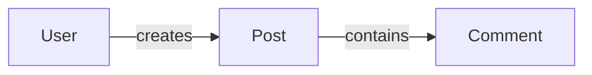
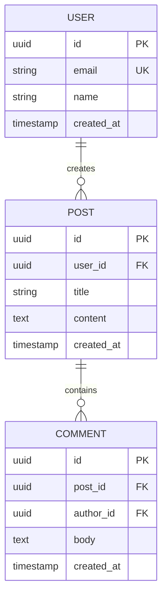

# Data Model: [FEATURE NAME]

**Feature:** [NNN-slug] · **Design:** ./design.md · **Maturity:** Draft · **Created:** [DATE]

> Entity/data model and data-flow diagrams a design decided, split out of design.md's own narrative
> (§5/§6) and specs.md's interface-contract detail (§1). Reads ./design.md; distinct from ./specs.md
> the way a persisted shape and the flows that move through it are distinct from the contracts that
> expose them.
>
> Structure follows `references/ARTIFACT_FORMAT.md`: the document-level `Maturity` is `Draft`,
> `In review` or `Approved`. Neither §1 nor §2 below carries an `ID`-bearing index — a diagram is not
> a normative, citable statement — so both stay free-form; §3 History is index-then-detail like
> every other chain artifact's final section, and its item-level `Status` is only `Live` or
> `Superseded → <ref>`.

## 1. Data Model

<!-- Free-form, NOT part of the indexed convention above — diagrams and schema tables are not
     ID-bearing normative statements, so this section stays exactly as specs-template.md's former
     §2 already was.

     The model is presented in two tiers. The conceptual domain map comes first and carries no
     attributes, so the shape of the domain is legible before any field name. One ER view per
     bounded subdomain follows, each carrying the attributes, keys and cardinalities of that
     subdomain alone. Splitting one diagram into views must not drop an entity, a key or a
     constraint the single diagram carried. -->

### Conceptual domain map

<!-- The entities and the relationships between them, with no attributes. Skip with "N/A: [why]" if
     the feature persists no entity. -->

#### ER view: [subdomain]

<!-- One heading of this form per bounded subdomain, each an erDiagram carrying the attributes,
     keys and cardinalities of that subdomain alone. Skip with "N/A: [why]" if the feature persists
     no entity. -->

### Database Schemas (ORM / DDL)

<!-- The catalog of every table the views above draw, with its keys, indexes and ORM file. -->

| Table | Purpose | Primary Key | Foreign Keys & Relations | Key Indexes | Schema / ORM File |
|---|---|---|---|---|---|
| `[table_name]` | [one-line table responsibility] | `id` (UUID) | `[user_id]` → `users(id)` | `idx_[table]_[col]` | `src/db/schema/[table].ts` |

### UX / UI Specifications
- **Design Tokens & Cues:** [color tokens (e.g. Indigo for Work, Emerald for Personal), badge variants, typography]
- **Component States:** [loading, empty, populated, error states]

## 2. Sequence / Data Flow

[Key interaction sequences, if non-trivial — a `sequenceDiagram` works well here — or `N/A: [why]`.]

## 3. History

<!-- Superseded data-model entries move here; the index row above stays as a tombstone with
     `Superseded → <ref>`. -->

None — initial version.
