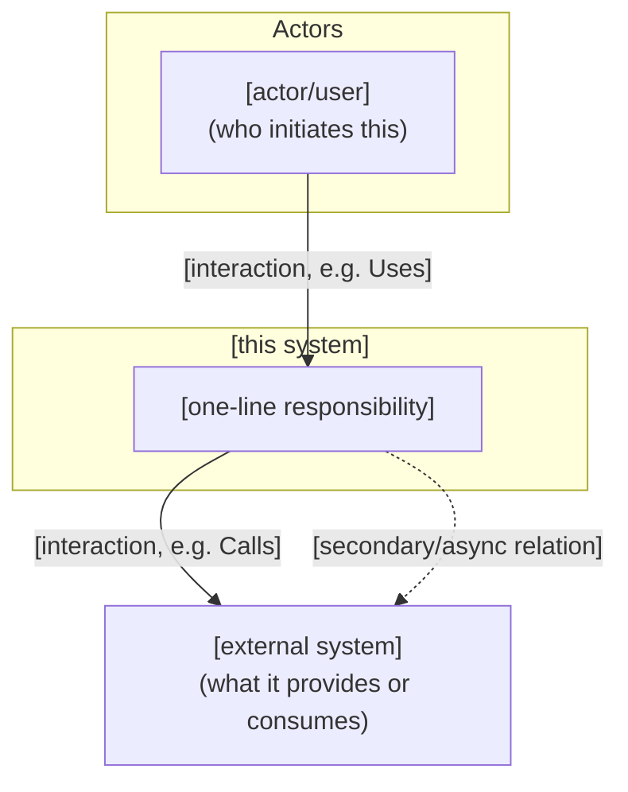
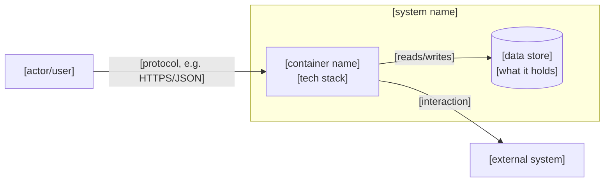
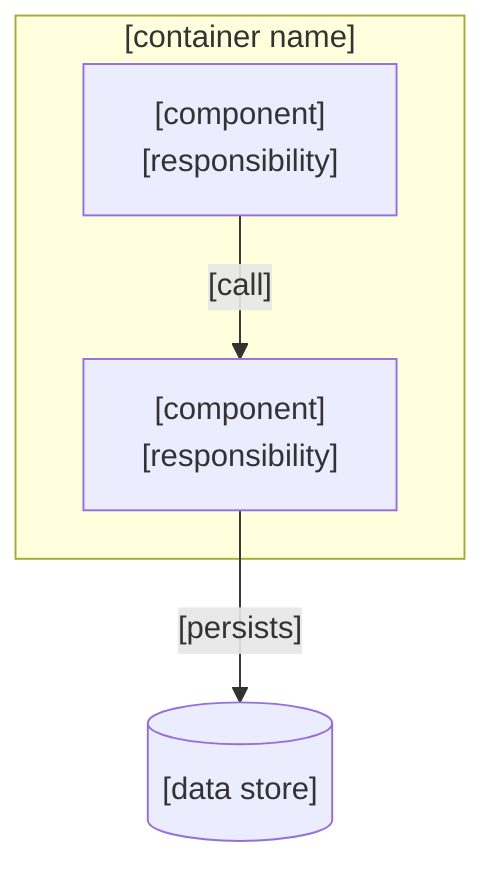

# Design: [FEATURE NAME]

**Feature:** [NNN-slug] · **Requirement:** ./requirement.md · **Status:** Draft · **Created:** [DATE]

> System shape — architecture, APIs, data/interface contracts. Reads ./requirement.md.
> Distinct from plan.md's HOW-to-implement; this is HOW-it's-shaped.
>
> Structure follows `references/ARTIFACT_FORMAT.md`: indexed sections carry a table above full
> `**Detail**`, `Status` is only `Live` or `Superseded → <ref>`, and superseded prose moves to §9.

## 1. Architecture Approach

[Component boundaries, where this fits in the existing system, 2–4 sentences.]

## 2. System Overview (C4)

<!-- The visual complement to §1 — lets a reader unfamiliar with this feature see the shape before
     reading prose. C4 is kept as the conceptual zoom model (Context → Container → Component) and
     rendered with Mermaid `flowchart` + `subgraph`.

     Do NOT use the C4Context / C4Container diagram types. They are experimental in Mermaid: no
     direction control, relationship labels collide with arrowheads, and rendering varies across
     viewers. `flowchart` is the most widely supported type and puts labels legibly on the arrow.

     Skip a level with "N/A: [why]". For a trivial single-file change with no new external
     interaction, write "N/A: [why]" for the whole section. -->

### C1: System Context

[Who/what uses this system, and which external systems it talks to. One box per actor or external
system — internal components belong at C2/C3, not here.]

### C2: Container

[Which deployable services/apps/data stores this feature spans, and how they talk. One box per
independently deployable unit — internals of a single container belong at C3.]

### C3: Component

<!-- Required when this feature touches 3+ components within a single container; otherwise write
     "N/A: covered by §3 Components & Boundaries". On a small change this diagram restates the §3
     table verbatim, and a diagram that adds nothing trains authors to tick boxes. -->

[Internals of the container this feature changes — handlers, services, ports, adapters.]

## 3. Components & Boundaries

| ID | Component | Kind | Serves | Status |
|---|---|---|---|---|
| C1 | [component name] | service / script / template / reference | FR-001 | Live |

**Detail**

- **C1** → [its responsibility in full, what it owns, and what it deliberately does not own].

## 4. API / Interface Contracts

<!-- Document endpoints, interface contracts, and repository patterns that anchor implementation. -->

### Endpoints
- `GET /api/v1/[resource]` — [description, query parameters, response payload]
- `POST /api/v1/[resource]` — [description, request body schema, status codes]
- `PATCH /api/v1/[resource]/:id` — [description, payload, status codes]
- `DELETE /api/v1/[resource]/:id` — [description, status codes]

### Repository & Service Interfaces
- **Repository Pattern:** `[resource].repository.ts` (interface) → `[resource].repository.[engine].ts` (concrete) → `[resource].repository.mock.ts` (mock/testing)
- **Service Signatures:** `[serviceMethod](params): ReturnType`

## 5. Data Model & Technical Specifications

### Database Schemas (ORM / DDL)
- **Table `[table_name]`:** [fields, primary/foreign keys, indexes, Drizzle/Prisma/SQL schema reference]

### UX / UI Specifications
- **Design Tokens & Cues:** [color tokens (e.g. Indigo for Work, Emerald for Personal), badge variants, typography]
- **Component States:** [loading, empty, populated, error states]

## 6. Sequence / Data Flow

[Key interaction sequences, if non-trivial — a `sequenceDiagram` works well here — or "N/A".]

## 7. Design Risks & Alternatives Considered

| ID | Risk / Alternative | Disposition | Status |
|---|---|---|---|
| R1 | [risk, or an alternative shape considered] | mitigated / accepted / rejected | Live |

**Detail**

- **R1** → [why this shape was chosen, or why the risk is accepted and what it costs if it lands].

## 8. Assumptions

| ID | Assumption | Affects | Basis |
|---|---|---|---|
| A1 | [assumption stated] | C1 | [why this default, or "user deferred"] |

**Detail**

- **A1** — [the reasoning, and what would change if it turns out wrong].

<!-- Write "None — no design-level clarification questions were deferred." in place of the table
     and detail if every design-level ambiguity was resolved by a direct answer rather than the
     defer escape hatch during /do-design's clarification loop. -->

## 9. History

<!-- Superseded design decisions move here; the index row above stays as a tombstone with
     `Superseded → <ref>`. -->

None — initial version.
