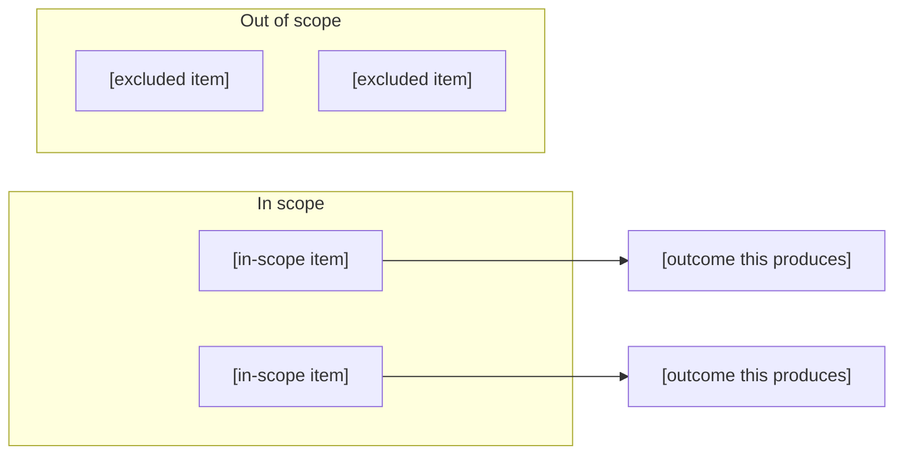

# Feature Requirement: [FEATURE NAME]

**Feature:** [NNN-slug] · **Branch:** `feat/[NNN-slug]` · **Status:** Draft
**Created:** [DATE] · **Owner:** [OWNER] · **Ticket:** [PBI/ticket ID, or "none"]

> WHAT and WHY only — no tech or implementation detail. Zero unresolved clarification markers at
> hand-off — every ambiguity is resolved via `AskUserQuestion` before this file is written;
> deferred answers become assumptions in §8.
>
> Structure follows `references/ARTIFACT_FORMAT.md`: indexed sections carry a table above full
> `**Detail**`, `Status` is only `Live` or `Superseded → <ref>`, and superseded prose moves to §9.

## 1. Summary

[1–2 sentences: the user-facing outcome and why it matters.]

**Scope boundary:**

<!-- The visual orientation: what is in, what is explicitly out, and what each in-scope item
     achieves — so a reader sees the shape of the change before parsing prose. Replace with
     "N/A: [why]" for a change too small to have a meaningful boundary. -->

## 2. User Stories

<!-- Use hierarchical story headings (e.g. "### Story 1: [Story Title] (P1)" or "### Story 3.2: [Story Title] (P1)")
     followed by the standard role/want/benefit formulation. -->

### Story 1: [Story Title] (P1)
- **US1 (P1):** As a [role], I want [capability], so that [benefit].

### Story 2: [Story Title] (P2)
- **US2 (P2):** As a [role], I want [capability], so that [benefit].

### Story 3: [Story Title] (P3)
- **US3 (P3):** As a [role], I want [capability], so that [benefit].

## 3. Functional Requirements

**Index** — `Status` is `Live` or `Superseded → <ref>`.

| ID | Requirement | Story | Priority | Status |
|---|---|---|---|---|
| FR-001 | [one-line summary] | US1 | P1 | Live |
| FR-002 | [one-line summary] | US2 | P2 | Live |

**Detail**

- **FR-001:** The system MUST [full behaviour — every qualifier and exception that makes this
  correct stays here; the index above is navigation, never a substitute].
- **FR-002:** The system MUST [behaviour].

## 4. Non-Functional Requirements

| ID | Constraint | Kind | Status |
|---|---|---|---|
| NFR-001 | [one-line summary] | performance / security / UX / reliability | Live |

**Detail**

- **NFR-001 ([short label]):** [the constraint in full, with the reasoning that makes it binding].

## 5. Out of Scope

- **[excluded item]** — [why it is excluded, so the boundary is unambiguous rather than an omission].

## 6. Acceptance Criteria

<!-- Structured as Gherkin BDD scenario blocks with Given / When / Then clauses mapped to User Stories (US#)
     and Functional Requirements (FR-###). Single-line criteria remain permissible for simple non-functional checks. -->

- [ ] **Scenario: [Scenario Title]** (US1, FR-001)
  - **Given** [precondition or initial context]
  - **When** [action or trigger event occurs]
  - **Then** [expected observable outcome]

- [ ] **Scenario: [Scenario Title]** (US2, FR-002)
  - **Given** [precondition]
  - **When** [action]
  - **Then** [expected outcome]

- [ ] [observable, testable outcome] (NFR-001).

## 7. Open Questions

None. (The clarification-marker syntax is reserved for a session aborted mid-loop; a completed
artifact carries none. The marker itself is deliberately not spelled here — a filled template is
checked for its absence, and a template that quotes it makes every correct artifact look wrong.)

## 8. Assumptions

| ID | Assumption | Affects | Basis |
|---|---|---|---|
| A1 | [assumption stated] | FR-001 | [why this default, or "user deferred"] |

**Detail**

- **A1** — [the reasoning, and what would change if the assumption turns out wrong].

<!-- Write "None — no clarification questions were deferred." in place of the table and detail if
     every ambiguity was resolved by a direct answer rather than the defer escape hatch. -->

## 9. History

<!-- When an item is superseded, its obsolete prose moves here and its index row above stays as a
     tombstone with `Superseded → <ref>`. The body then reads as current truth; this section keeps
     the reasoning behind the change. -->

None — initial version.
