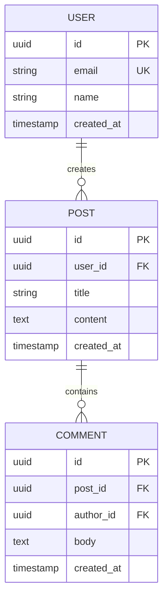

# Specs: [FEATURE NAME]

**Feature:** [NNN-slug] · **Design:** ./design.md · **Status:** Draft · **Created:** [DATE]

> Machine-checkable interface/schema contracts split out of design.md's own narrative — endpoints,
> CLI verb signatures, repository/service interfaces, data schemas and file formats a design
> decided. Reads ./design.md; distinct from it the way a contract is distinct from the rationale
> that produced it.
>
> Structure follows `references/ARTIFACT_FORMAT.md`: indexed sections carry a table above full
> `**Detail**`, `Status` is only `Live` or `Superseded → <ref>`, and superseded prose moves to §3.

## 1. Interface Contracts

<!-- Document endpoints, CLI verb signatures, and repository/service interfaces that anchor
     implementation — one IC-### entry per contract, so plan.md and downstream implementation can
     cite a specific contract precisely instead of a paragraph of prose. -->

| ID | Contract | Kind | Status |
|---|---|---|---|
| IC-001 | [one-line summary] | endpoint / cli-verb / schema / file-format | Live |

**Detail**

- **IC-001:** [the full normative shape — for an `endpoint`: method, route, request/response
  payload, status codes; for a `cli-verb`: verb name, flags, arguments, exit codes; for a `schema`:
  repository/service interface (`interface` → `concrete` → `mock` pattern) or service method
  signature (`[serviceMethod](params): ReturnType`); for a `file-format`: the file's key
  fields/shape — every qualifier and exception intact].

## 2. Data Model

<!-- Free-form, NOT part of the indexed convention above — diagrams and schema tables are not
     ID-bearing normative statements, so this section stays exactly as design-template.md's former
     §5 already was. -->

### Database Schemas (ORM / DDL)

<!-- Entity-Relationship diagram illustrating entities, primary/foreign keys, and cardinalities.
     Skip with "N/A: [why]" if the feature does not introduce or alter database entities. -->

| Table | Purpose | Primary Key | Foreign Keys & Relations | Key Indexes | Schema / ORM File |
|---|---|---|---|---|---|
| `[table_name]` | [one-line table responsibility] | `id` (UUID) | `[user_id]` → `users(id)` | `idx_[table]_[col]` | `src/db/schema/[table].ts` |

### UX / UI Specifications
- **Design Tokens & Cues:** [color tokens (e.g. Indigo for Work, Emerald for Personal), badge variants, typography]
- **Component States:** [loading, empty, populated, error states]

## 3. History

<!-- Superseded contracts move here; the index row above stays as a tombstone with
     `Superseded → <ref>`. -->

None — initial version.
