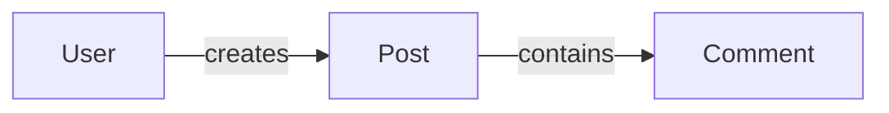
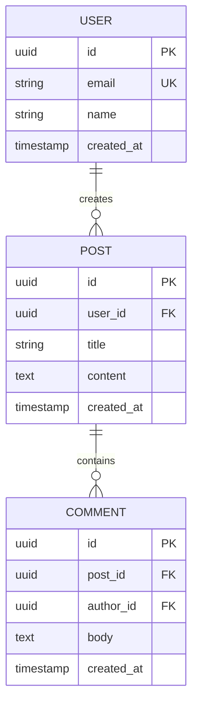

# Specs: [FEATURE NAME]

**Feature:** [NNN-slug] · **Design:** ./design.md · **Maturity:** Draft · **Created:** [DATE]

> Machine-checkable interface/schema contracts split out of design.md's own narrative — endpoints,
> CLI verb signatures, repository/service interfaces, data schemas and file formats a design
> decided. Reads ./design.md; distinct from it the way a contract is distinct from the rationale
> that produced it.
>
> Structure follows `references/ARTIFACT_FORMAT.md`: indexed sections carry a table above full
> `**Detail**`, the document-level `Maturity` is `Draft`, `In review` or `Approved`, the item-level
> `Status` is only `Live` or `Superseded → <ref>`, and superseded prose moves to §3.

## 1. Interface Contracts

<!-- Document endpoints, CLI verb signatures, and repository/service interfaces that anchor
     implementation — one IC-### entry per contract, so plan.md and downstream implementation can
     cite a specific contract precisely instead of a paragraph of prose.

     The index carries a `Family` column, and the detail below is grouped under
     "#### Family: [name]" headings. Contracts are ordered within a family, and families are ordered
     as the index lists them. Each contract carries its own "#### IC-###: [summary]" heading so a
     reader can link to and cite one contract without scanning the block around it. A heading of
     that form counts as the contract's detail entry only when the same ID also appears in the first
     column of the index above; an ID-shaped heading with no matching index row is ignored. Grouping
     is navigation: it never shortens the normative text a contract carries. Write "N/A: [why]" in
     place of the index and detail when the feature introduces no interface contract. -->

| ID | Contract | Family | Kind | Status |
|---|---|---|---|---|
| IC-001 | [one-line summary] | [family name] | endpoint / cli-verb / schema / file-format | Live |
| IC-002 | [one-line summary] | [family name] | endpoint / cli-verb / schema / file-format | Live |

**Detail**

#### Family: [family name]

#### IC-001: [one-line summary]

[the full normative shape — for an `endpoint`: method, route, request/response
payload, status codes; for a `cli-verb`: verb name, flags, arguments, exit codes; for a `schema`:
repository/service interface (`interface` → `concrete` → `mock` pattern) or service method
signature (`[serviceMethod](params): ReturnType`); for a `file-format`: the file's key
fields/shape — every qualifier and exception intact].

#### IC-002: [one-line summary]

[the full normative shape, every qualifier and exception intact].

## 2. Data Model

<!-- Free-form, NOT part of the indexed convention above — diagrams and schema tables are not
     ID-bearing normative statements, so this section stays exactly as design-template.md's former
     §5 already was.

     The model is presented in two tiers. The conceptual domain map comes first and carries no
     attributes, so the shape of the domain is legible before any field name. One ER view per
     bounded subdomain follows, each carrying the attributes, keys and cardinalities of that
     subdomain alone. Splitting one diagram into views must not drop an entity, a key or a
     constraint the single diagram carried. -->

### Conceptual domain map

<!-- The entities and the relationships between them, with no attributes. Skip with "N/A: [why]" if
     the feature persists no entity. -->

#### ER view: [subdomain]

<!-- One heading of this form per bounded subdomain, each an erDiagram carrying the attributes,
     keys and cardinalities of that subdomain alone. Skip with "N/A: [why]" if the feature persists
     no entity. -->

### Database Schemas (ORM / DDL)

<!-- The catalog of every table the views above draw, with its keys, indexes and ORM file. -->

| Table | Purpose | Primary Key | Foreign Keys & Relations | Key Indexes | Schema / ORM File |
|---|---|---|---|---|---|
| `[table_name]` | [one-line table responsibility] | `id` (UUID) | `[user_id]` → `users(id)` | `idx_[table]_[col]` | `src/db/schema/[table].ts` |

### UX / UI Specifications
- **Design Tokens & Cues:** [color tokens (e.g. Indigo for Work, Emerald for Personal), badge variants, typography]
- **Component States:** [loading, empty, populated, error states]

## 3. History

<!-- Superseded contracts move here; the index row above stays as a tombstone with
     `Superseded → <ref>`. -->

None — initial version.
