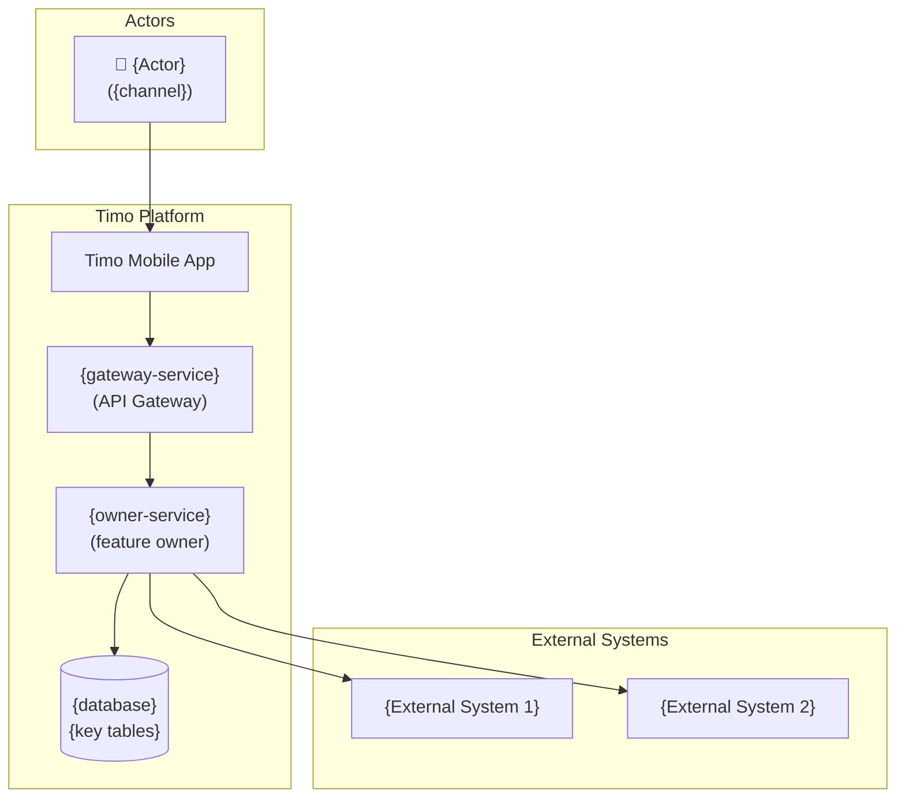
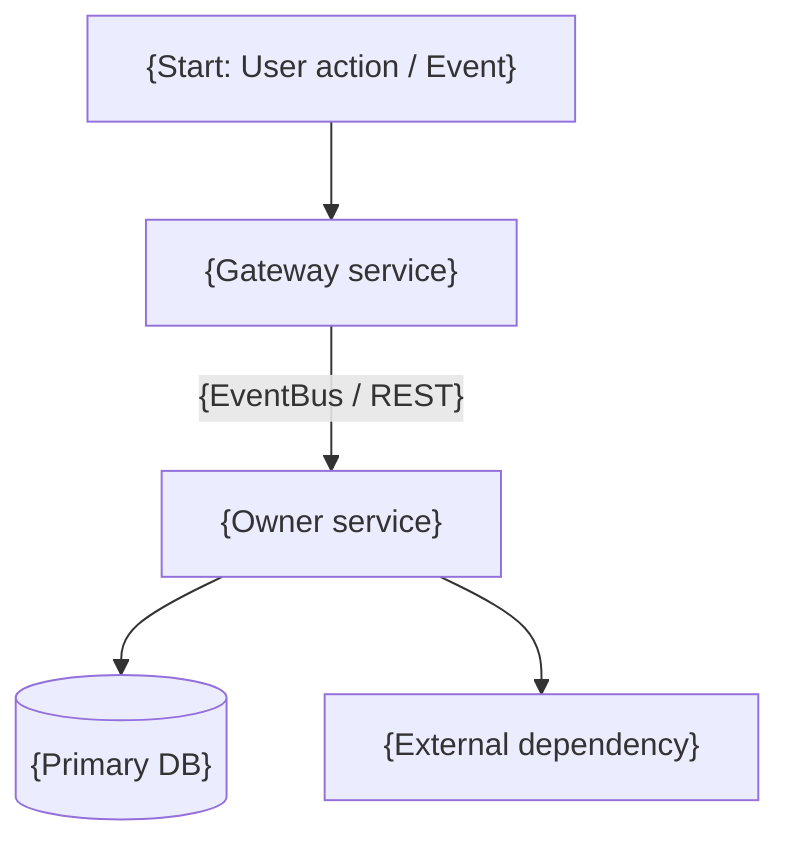
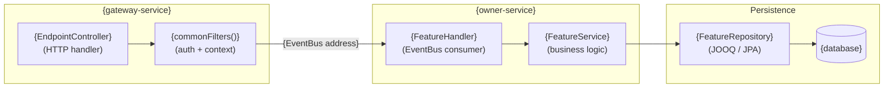
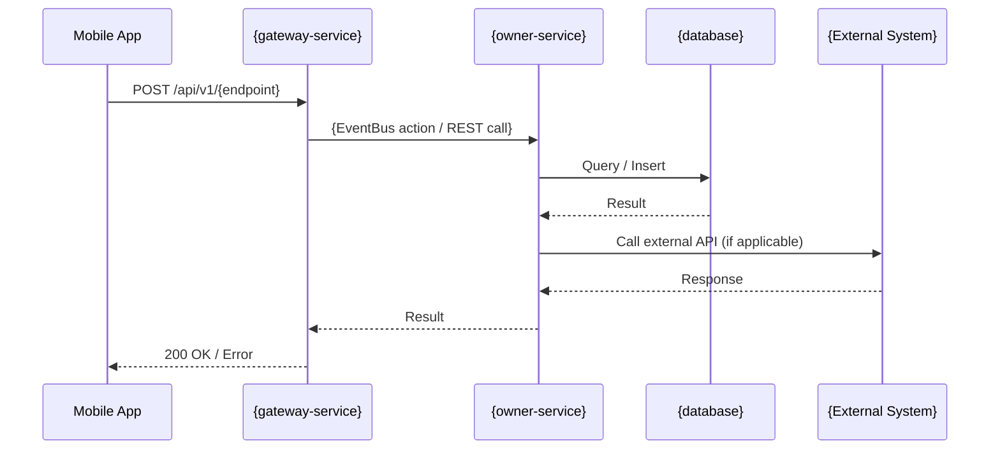
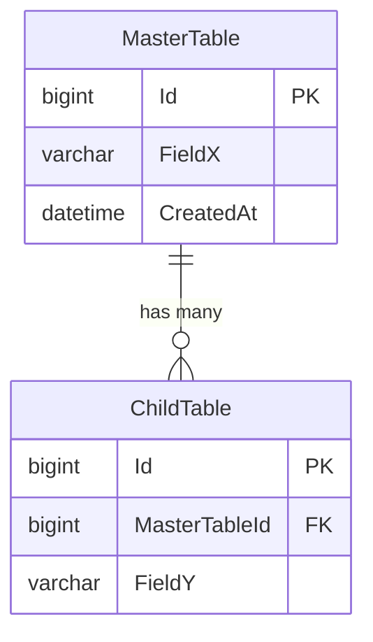

# {Feature Name} — Flow Documentation

> **Template version**: 2.0 | **Source**: [Sample flow](https://timo.atlassian.net/wiki/spaces/TECH/pages/1588101121)
>
> Replace `{placeholders}` with actual content. Remove sections marked `[Optional]` if not applicable.

---

| Field | Value |
|-------|-------|
| **Feature** | `{feature-name}` |
| **Services** | `{primary-service}`, `{secondary-service}` |
| **Version** | `{version}` |
| **Status** | `DRAFT` / `IN-REVIEW` / `READY` / `ARCHIVED` |
| **Author** | {author-name} |
| **Date** | {YYYY-MM-DD} |

---

## 1. Overview [Required]

Brief introduction of the flow. Explain **what** this feature does and **why** it exists.

- **Purpose**: {One-line summary of the flow}
- **Trigger**: {What initiates this flow — user action, scheduled job, event, etc.}
- **Outcome**: {What happens when the flow completes successfully}

---

## 2. References [Required]

| Type | Link |
|------|------|
| **PBI** | {Jira/Azure DevOps link} |
| **Figma** | {Design link} |
| **Confluence** | {Related doc link} |
| **Swagger** | {API doc link} |
| **Source Code** | {Gitea repo link} |

---

## 3. Flow Diagram [Required]

Use the **C4 model** (Simon Brown) to describe the system at three levels of abstraction:

| Level | Scope | Mermaid type | When required |
|-------|-------|--------------|---------------|
| **C1 — System Context** | Actors + platform + external systems | `flowchart TD` | Always |
| **C2 — Container** | Service topology + data stores | `flowchart TD` | Always |
| **C3 — Component** | Internal handlers / services / repos | `flowchart LR` | When service has >1 internal component |

For complex multi-service flows, also attach an external diagram (draw.io / Canva) as the primary source.

### 3.1 C1 — System Context

> Who uses this feature, which platform components handle it, and which external systems are involved.



### 3.2 C2 — Container

> Service-level topology: how services communicate and which data stores they own.



> For external tool diagrams: paste exported image inline or attach `.drawio` file.
> If diagrams differ per integration partner (e.g., SHBF vs BVB), include one diagram per partner.

### 3.3 C3 — Component [Optional]

> Internal components of the owner service: handlers → business services → repositories.



---

## 4. Sequence Diagram [Required]

> One `sequenceDiagram` per significant sub-flow. Label each as `### 4.N {Sub-flow name}`.

### 4.1 {Sub-flow name}



---

## 5. Data Model [Required]

### 5.1 Related Tables

| Table | Database | Owner Service | Purpose |
|-------|----------|--------------|---------|
| `{table_name}` | `{database_name}` | `{service}` | {Brief description} |

### 5.2 Data Flow

Describe which service writes, which reads, and any key transformations.

- **Writer**: {service-name} → `{table_name}`
- **Readers**: {downstream services, if any}
- **Events**: Kafka topic `{topic.name}` produced by `{service}`, consumed by `{service}`

### 5.3 ER Diagram [Required when > 3 tables; Optional otherwise]

> Prefer Mermaid `erDiagram`. For >6 tables, also attach a draw.io export.
> If any tables contain sensitive data, note: *"Classified table for internal using."*



> Replace `MasterTable` / `ChildTable` with actual table names (no curly-brace placeholders — Mermaid parses `{` as entity body syntax).

---

## 6. API Description [Required]

**Swagger**: [{service-name}.dev.lspm.io/swagger-ui/index.html#]({swagger-url})

### 6.1 Endpoints

| API | Method / Header | Endpoint | Auth Required |
|-----|-----------------|----------|---------------|
| {API name} | `GET`/`POST`/`PUT`/`DELETE` / `Authorization: Bearer {token}` | `/api/v1/{path}` | Yes/No |

### 6.2 Request/Response Samples

#### {API Name}

**Request**:
```json
{
    "field1": "value1",
    "field2": "value2"
}
```

**Response (Success)**:
```json
{
    "success": true,
    "code": 200,
    "data": {
        "field1": "value1"
    }
}
```

**Response (Error)**:
```json
{
    "success": false,
    "code": 400,
    "message": "{error description}"
}
```

### 6.3 Status Mapping

> DB status values vary per feature — do not use generic names. Map exactly to the DB enum/values.

| Status Value | DB Status | FE Display | Description |
|-------------|-----------|------------|-------------|
| `{1}` | `{DB_STATUS_1}` | {FE label} | {When this status applies} |
| `{2}` | `{DB_STATUS_2}` | {FE label} | {When this status applies} |

---

## 7. Business Logic [Optional]

Describe the core business rules and validation logic:

1. **Rule 1**: {Description of business rule}
2. **Rule 2**: {Description of business rule}

### Batch Jobs (if applicable)

| Job | Schedule | Purpose |
|-----|----------|---------|
| `{BatchJobName}` | `{cron expression}` | {Description} |

### Kafka Events (if applicable)

| Event | Topic | Producer | Consumer(s) |
|-------|-------|----------|-------------|
| `{EventName}` | `{topic.name}` | `{service}` | `{service1}`, `{service2}` |

---

## 8. Security & Performance [Optional]

### Security

- **Authentication**: {How requests are authenticated — e.g., JWT via plus-router/user-auth}
- **Authorization**: {Role-based access, permission checks}
- **PII Exposure**: {List any PII fields in request/response — must be masked in logs and replaced with synthetic values in the §6.2 request/response samples}
- **Network**: {Internal only / Public / Whitelisted IPs}

### Performance Considerations

- **Expected throughput**: {e.g., ~100 TPS}
- **Latency target**: {e.g., P95 < 500ms}
- **Scaling strategy**: {Horizontal pod scaling, caching, etc.}

---

## 9. Rollout & Backwards Compatibility [Optional]

- **Breaking changes**: {Does this change any existing endpoint or response structure?}
- **Feature flag**: {Unleash flag name that controls this — e.g., `ENABLE_FEATURE_X`}
- **Rollout plan**: {Step-by-step deployment plan with timeline}
- **Rollback procedure**: {How to rollback if issues are found}

---

## 10. Known Limitations & Open Questions [Optional]

- {Limitation 1}
- {Open question 1}
- {Concern 1}
