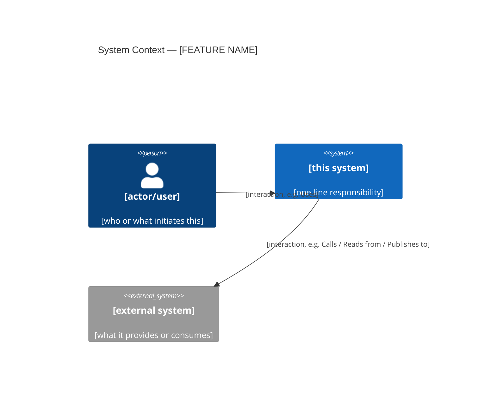
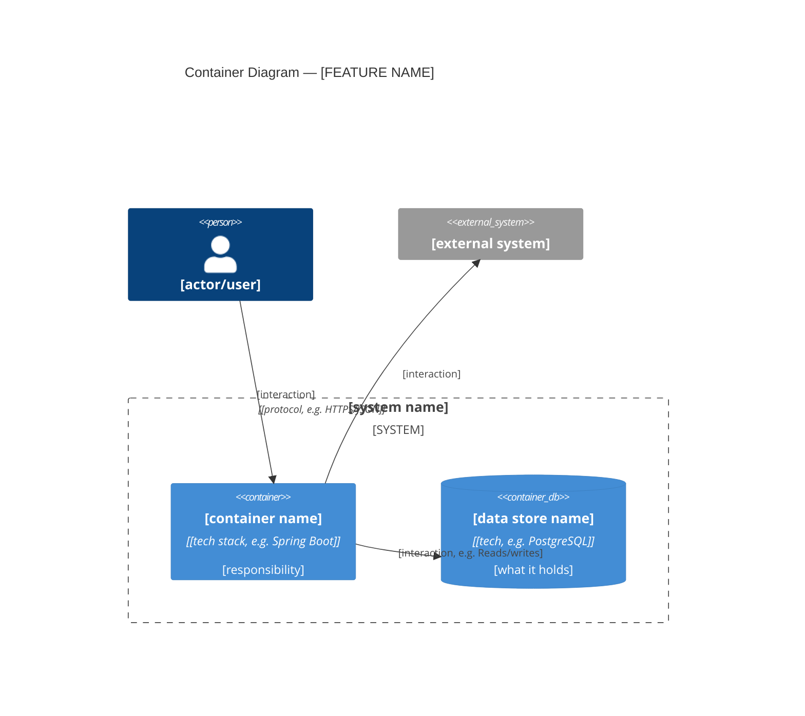

# Design: [FEATURE NAME]

**Feature:** [NNN-slug] · **Requirement:** ./requirement.md · **Status:** Draft · **Created:** [DATE]

> System shape — architecture, APIs, data/interface contracts. Reads ./requirement.md.
> Distinct from plan.md's HOW-to-implement; this is HOW-it's-shaped.

## 1. Architecture Approach
[Component boundaries, where this fits in the existing system, 2–4 sentences.]

## 2. System Overview (C4)
[The visual complement to Architecture Approach above — lets a reader unfamiliar with this
feature see the shape before reading prose. Skip only for a trivial, single-file change with no
new external interaction or deployable unit — write "N/A: [why]" instead of the diagrams.]

### Context (C4 Level 1)
[Who/what uses this system, and which external systems/services it talks to. One box per actor
or external system — do not enumerate internal components here, that's the Container level below.]

### Container (C4 Level 2)
[Which deployable services/apps/data stores this feature spans, and how they talk to each other.
One box per independently deployable unit (service, SPA, batch job, database) — implementation
detail inside a single container belongs in Components & Boundaries below, not here.]

## 3. Components & Boundaries
- [component] → [responsibility]

## 4. API / Interface Contracts
[Endpoints, method signatures, or interface definitions — or "N/A".]

## 5. Data Model
[Schema, entities, relationships — or "N/A".]

## 6. Sequence / Data Flow
[Key interaction sequences, if non-trivial — or "N/A".]

## 7. Design Risks & Alternatives Considered
- [risk/alternative] → [why this shape was chosen]
