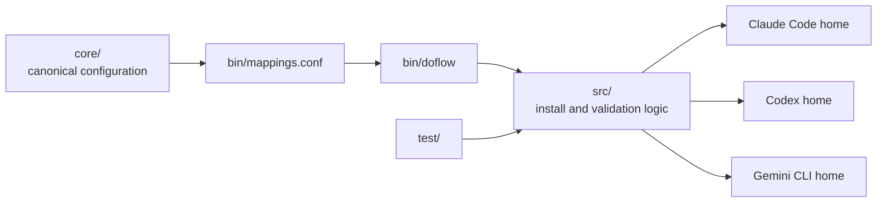
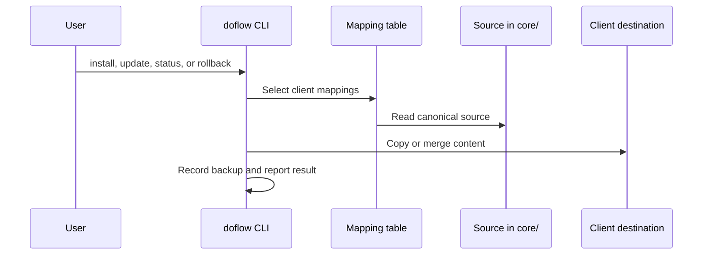
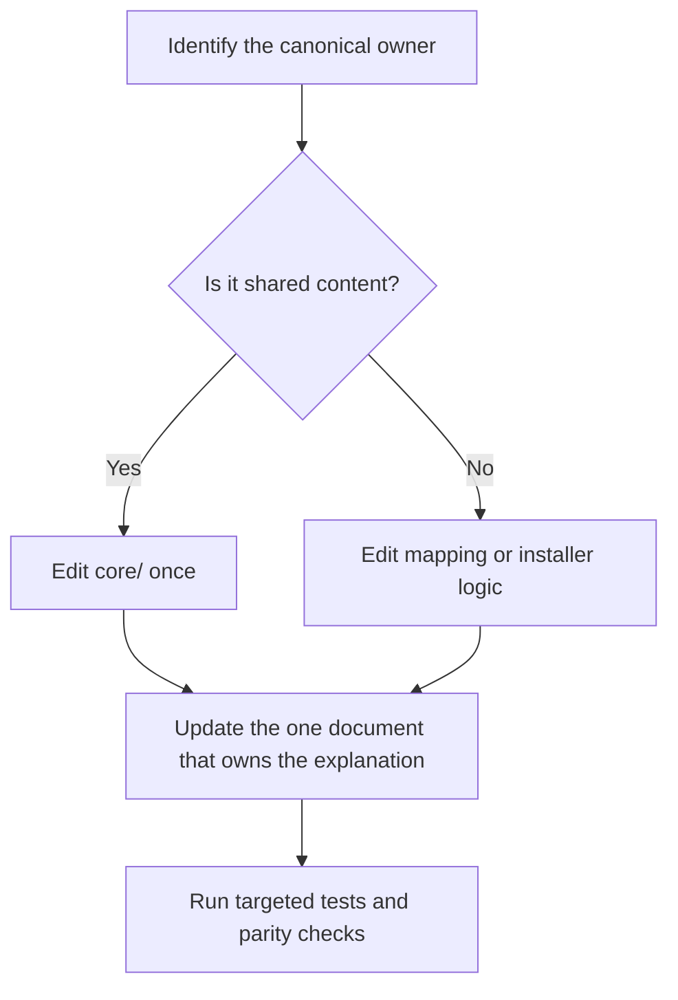

# Architecture

This guide is for contributors changing DoFlow itself. For the user-facing model, see [Overview](overview.md).

## Design in one picture



The architecture has a deliberately simple boundary: **content lives in `core/`; distribution behavior lives in the installer.** Do not duplicate a skill, rule, or template simply because clients place it in different directories.

## Repository map

| Path | Owns |
|---|---|
| `core/` | Canonical instructions, skills, rules, agents, hooks, MCP notes, scripts, templates, and references |
| `core/.claude-plugin/` | Claude Code marketplace registry and plugin manifest; `core/` is the plugin root |
| `core/.codex-plugin/` | Codex plugin manifest for plugin-based distribution |
| `bin/doflow` | CLI entry point |
| `bin/mappings.conf` | Client-to-destination mapping definitions |
| `src/` | Copy, merge, backup, restore, status, and validation implementation |
| `test/` | Installer and mapping behavior tests |
| `docs/` | User-facing and contributor documentation site |

## Installation data flow



Mappings describe whether a source is copied, merged into a managed section, or intentionally excluded for a client. The installer should be the only place that knows client-specific destination paths.

## Shared content and client adapters

`core/` is organized by purpose, not by client:

| Content | Why it is shared |
|---|---|
| `CLAUDE.md`, `FLAGS.md`, `PRINCIPLES.md`, `rules/` | Base guidance can be read by every supported client |
| `skills/`, `agents/`, `scripts/`, `templates/`, `references/` | Task knowledge and reusable assets are client-neutral |
| `hooks/`, `.mcp.json`, `mcp/` | Retained in the source tree, but copied as native configuration only where supported |

The installer projects `core/CLAUDE.md` as the appropriate client instruction file, including `AGENTS.md` for Codex and `GEMINI.md` for Gemini CLI. Managed sections let DoFlow update its portion without replacing user-owned instructions.

## How to make a change



Examples:

- Add or revise a workflow: edit its `core/skills/<name>/SKILL.md`; keep the public description compact in [Reference](reference.md).
- Change a client destination or add a supported asset: edit `bin/mappings.conf`, then cover it in tests.
- Change managed instruction behavior: edit the merge/copy implementation in `src/`, then test both fresh install and update paths.
- Change user guidance: give it one canonical document—Quickstart, Setup, Guide, Reference, or Overview—rather than copying it across all of them.

## Validation

Run checks appropriate to the change:

```bash
node test/doflow.test.js
npm run parity
mkdocs build --strict --site-dir /tmp/doflow-docs-site
```

Use a temporary client home when validating installation behavior. Do not use a developer’s live configuration as a test fixture.

## Contributor guardrails

- Preserve user content outside DoFlow-managed instruction markers.
- Treat mappings as an explicit compatibility contract; unsupported client features should be intentionally skipped, not silently copied.
- Keep `core/` client-neutral whenever possible.
- Keep documentation layered: orientation in the README, procedures in Setup and Guide, lookup facts in Reference, concepts in Overview.
- Update tests whenever a mapping, copy strategy, or installer lifecycle behavior changes.
