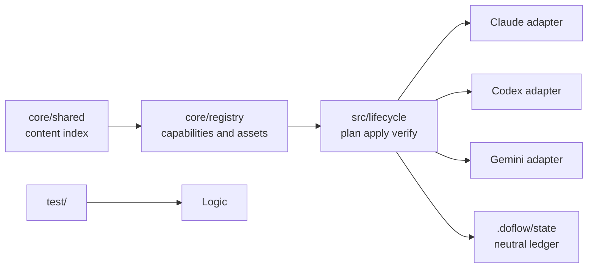
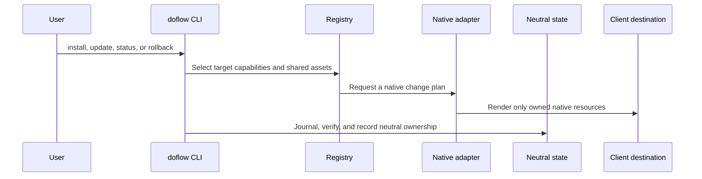
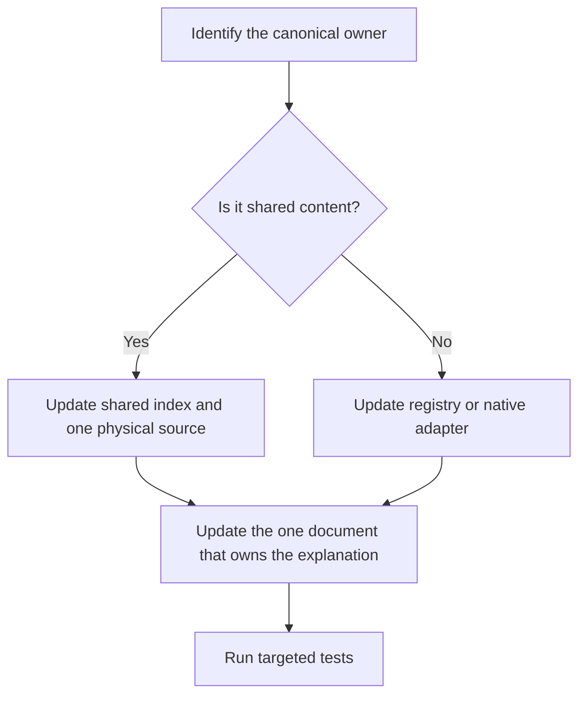

# Architecture

This guide is for contributors changing DoFlow itself. For the user-facing model, see [Overview](overview.md).

## Design in one picture


```mermaid
flowchart LR
    Shared[core/shared\ncontent index] --> Registry[core/registry\ncapabilities and assets]
    Registry --> Lifecycle[src/lifecycle\nplan apply verify]
    Lifecycle --> Claude[Claude adapter]
    Lifecycle --> Codex[Codex adapter]
    Lifecycle --> Gemini[Gemini adapter]
    Lifecycle --> State[.doflow/state\nneutral ledger]
    Tests[test/] --> Logic
```

The architecture has a deliberately simple boundary: **shared content is described once; adapters
own native paths and formats; lifecycle code owns planning, ownership, and recovery.** Do not
duplicate a skill, rule, or template simply because clients place it in different directories.

Each target is a native projection, not a copy of another target's settings. Its supported
surfaces, prerequisites, verification steps, and intentional gaps are the contract in the
[multi-harness capability map](capability-map.md). In particular, configuration and hook discovery
can be trust-sensitive, plugin activation belongs to a user or workspace, and unavailable surfaces
are reported rather than imitated.

## Repository map

| Path | Owns |
|---|---|
| `core/shared/` | Compatibility-first shared-content index: stable IDs, projections, and legacy source paths without duplicated bytes |
| `core/registry/` | Harness capabilities, assets, neutral MCP catalog, and lifecycle-policy declarations |
| `core/` | Current physical sources for instructions, skills, rules, agents, hooks, MCP notes, scripts, templates, and references during migration |
| `core/.claude-plugin/` | Claude Code marketplace registry and plugin manifest; `core/` is the plugin root |
| `core/.codex-plugin/` | Codex plugin manifest for plugin-based distribution |
| `bin/doflow` | CLI entry point |
| `src/adapters/` | Native Claude, Codex, and Gemini file formats and verification boundaries |
| `src/lifecycle/` | Non-mutating plan, ownership checks, apply/remove orchestration, and verification |
| `src/state/` | Harness-neutral ledger and recovery records |
| `src/` | Backup, restore, status, and MCP-selection implementation |
| `test/` | Installer and mapping behavior tests |
| `docs/` | User-facing and contributor documentation site |
| `docs/capability-map.md` | Registry-derived cross-harness capability contract, evidence, and verification criteria |

## Installation data flow


```mermaid
sequenceDiagram
    participant U as User
    participant CLI as doflow CLI
    participant R as Registry
    participant A as Native adapter
    participant S as Neutral state
    participant T as Client destination
    U->>CLI: install, update, status, or rollback
    CLI->>R: Select target capabilities and shared assets
    R->>A: Request a native change plan
    A->>T: Render only owned native resources
    CLI->>S: Journal, verify, and record neutral ownership
```

The transition keeps legacy mappings available, but new behavior should ask the registry and
adapter rather than infer a target from a copy path. An adapter is the only component that knows a
client-specific destination or serialization format.

## Ownership and projection boundary

Every target has three distinct ownership domains:

| Domain | DoFlow may manage | DoFlow must preserve or leave to the user/workspace |
|---|---|---|
| Repository assets | Managed instruction sections, selected DoFlow assets, and documented hook definitions. | User instructions and assets outside managed boundaries; target-specific configuration may require project trust. |
| Configuration and integrations | Explicitly named DoFlow configuration keys and selected curated MCP registrations, with recorded ownership. | Unknown configuration keys, unrelated MCP servers, credentials, approval/sandbox policy, and ambiguous user modifications. |
| Host-managed capabilities | Discoverable plugin package metadata and documentation of supported workflow entry points. | Plugin marketplace activation, hook review/trust, and scheduled-task creation/management. |

This division prevents a false parity claim: an installed file is not evidence that a host has
activated a plugin, trusted a hook, connected an MCP server, or made an automation available. The
lifecycle verifier must report those prerequisites.

## Shared content and client adapters

`core/shared/` is the single physical source for cross-harness content — `core/registry/assets.yaml`
declares each asset's `source` path and per-harness projection; `core/registry/*.yaml` overall
declares target capability and ownership inputs, and is not itself a native configuration file.

| Content | Where it lives | Why it is shared |
|---|---|---|
| `DOFLOW_CORE.md`, `rules/`, `references/`, `modes/`, `mcp/`, `docs/`, `VERSION` | `core/shared/guidance/` | One `guidance.context-layer` copy-tree asset mirrors this whole tree, byte-for-byte, into `.doflow/guidance/` for every scope — regardless of which harnesses are targeted |
| `docs/MCP_INDEX.md` (`.doflow/guidance/docs/` only, no `core/` source) | Written directly by `applyLifecycle` (`src/lifecycle/index.js`) | The one file in `.doflow/guidance/` that varies per install (the resolved MCP selection) — deliberately outside `guidance.context-layer`'s copy-tree source so its per-install content never conflicts with that asset's byte-for-byte mirror; imported unconditionally from `DOFLOW_CORE.md` |
| `skills/`, `agent-specs/`, `scripts/`, `templates/` | `core/shared/{skills,agent-specs,scripts,templates}/` | Task knowledge and reusable assets are client-neutral |
| Native config/hooks/agents per harness | `core/harnesses/{claude,codex,gemini}/` | Copied or reconciled as native configuration only where supported |
| MCP server catalog | `core/registry/mcp.yaml` | Single neutral source every harness's adapter selects from |

Each harness's native entry file (`CLAUDE.md`, `AGENTS.md`, `GEMINI.md`) no longer receives a full
copy of the guidance content — its managed section is a short pointer into `.doflow/guidance/`
instead: `@`-import syntax for Claude and Gemini (both resolve relative/absolute `@file` imports
natively), a prose read-instruction for Codex (AGENTS.md has no native import-expansion
mechanism, unlike Claude/Gemini). This replaces the physical per-harness duplication this section
previously described as pending — see `CHANGELOG.md` for when it landed.

For Codex-specific configuration, keep durable preferences and MCP servers in the applicable
`config.toml` layer, use a single `hooks.json` representation per layer for lifecycle handlers,
and keep custom agents as separate `.codex/agents/*.toml` files. Equivalent native details belong
to their own adapters; see the [capability map](capability-map.md) before claiming parity.

## Neutral state and migration

The lifecycle ledger is independent of a harness directory: project installations use
`<project>/.doflow/state/`; user installations use `~/.doflow/state/`. It records only verified
DoFlow-owned resources and recovery references. Legacy manifests remain import sources during the
migration, so existing installs can continue to update without rewriting foreign configuration.

Migration order is deliberate: declare registry ownership, introduce adapters and neutral state,
route the CLI through lifecycle planning, then retire a compatibility path only after idempotency,
conflict, rollback, and recovery tests pass.

## How to make a change


```mermaid
flowchart TD
    A[Identify the canonical owner] --> B{Is it shared content?}
    B -->|Yes| C[Update shared index and one physical source]
    B -->|No| D[Update registry or native adapter]
    C --> E[Update the one document that owns the explanation]
    D --> E
    E --> F[Run targeted tests]
```

Examples:

- Add or revise a workflow: edit its `core/shared/skills/<name>/SKILL.md`; keep the public description compact in [Reference](reference.md).
- Change a client destination or add a supported asset: edit `core/registry/assets.yaml`, then cover it in tests.
- Change managed instruction behavior: edit the merge/copy implementation in `src/`, then test both fresh install and update paths.
- Change user guidance: give it one canonical document—Quickstart, Setup, Guide, Reference, or Overview—rather than copying it across all of them.

## Validation

Run checks appropriate to the change:

```bash
node test/doflow.test.js
mkdocs build --strict --site-dir /tmp/doflow-docs-site
```

Use a temporary client home when validating installation behavior. Do not use a developer’s live configuration as a test fixture.

## Contributor guardrails

- Preserve user content outside DoFlow-managed instruction markers.
- Treat mappings as an explicit compatibility contract; unsupported client features should be intentionally skipped, not silently copied.
- Keep `core/` client-neutral whenever possible.
- Keep documentation layered: orientation in the README, procedures in Setup and Guide, lookup facts in Reference, concepts in Overview.
- Update tests whenever a mapping, copy strategy, or installer lifecycle behavior changes.
