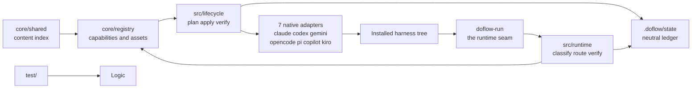
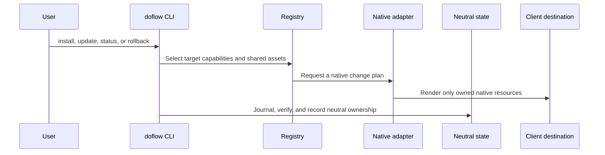
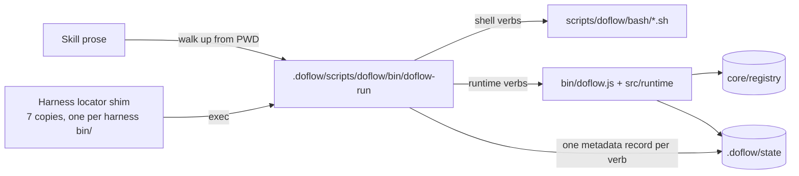
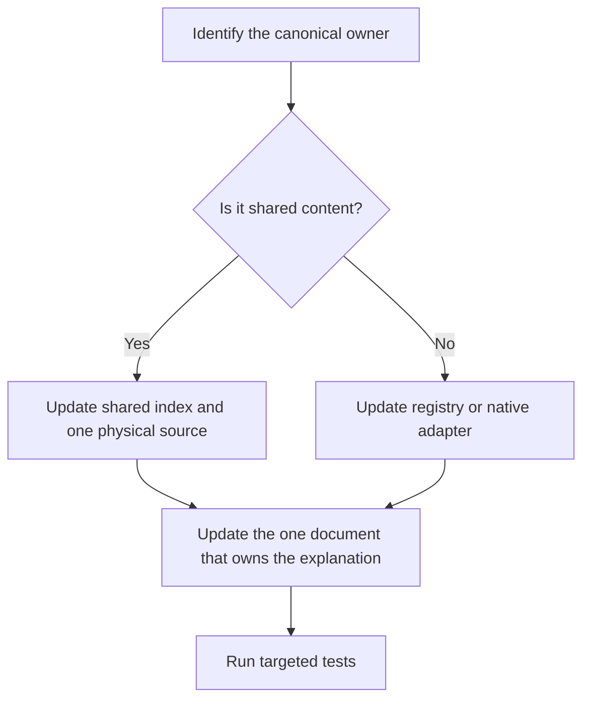

# Architecture

This guide is for contributors changing DoFlow itself. For the user-facing model, see [Overview](overview.md).

## Design in one picture


```mermaid
flowchart LR
    Shared[core/shared\ncontent index] --> Registry[core/registry\ncapabilities and assets]
    Registry --> Lifecycle[src/lifecycle\nplan apply verify]
    Lifecycle --> Adapters[7 native adapters\nclaude codex gemini\nopencode pi copilot kiro]
    Lifecycle --> State[.doflow/state\nneutral ledger]
    Adapters --> Installed[Installed harness tree]
    Installed --> Seam[doflow-run\nthe runtime seam]
    Seam --> Runtime[src/runtime\nclassify route verify]
    Runtime --> Registry
    Runtime --> State
    Tests[test/] --> Logic
```

The architecture has a deliberately simple boundary: **shared content is described once; the
registry declares what each harness can do, how each shared asset projects onto it, and what the
runtime is allowed to decide; adapters own native paths and formats; lifecycle code owns planning,
ownership, and recovery; and one runtime, reached through one seam, owns everything a skill decides
at use time.** Do not duplicate a skill, rule, or template simply because clients place it in
different directories, and do not add a second implementation of a runtime verb.

Each target is a native projection, not a copy of another target's settings. Its supported
surfaces, prerequisites, verification steps, and intentional gaps are the contract in the
[multi-harness capability map](capability-map.md). In particular, configuration and hook discovery
can be trust-sensitive, plugin activation belongs to a user or workspace, and unavailable surfaces
are reported rather than imitated.

## Repository map

| Path | Owns |
|---|---|
| `core/shared/` | The single physical source for cross-harness content: guidance, skills, agent specifications, scripts, and templates. Stable IDs and projections, no duplicated bytes |
| `core/registry/` | Two registry families in one directory: installation (harness capabilities, assets, neutral MCP catalog, lifecycle policy) and runtime (capabilities, routes, workflows, verification, readiness templates, external tools) |
| `core/harnesses/` | Native per-harness sources that have no cross-harness equivalent — hooks, settings, and native agent definitions for `claude`, `codex`, `gemini`, and `kiro` — plus `core/harnesses/shared/locator`, the one file projected into all seven |
| `core/.claude-plugin/` | Claude Code marketplace registry and plugin manifest; `core/` is the plugin root |
| `core/.codex-plugin/` | Codex plugin manifest for plugin-based distribution |
| `bin/doflow.js` | CLI entry point (exposed as the `doflow` command) — parses arguments, implements the installer commands (`cmdInstall`, `cmdUpdate`, `cmdStatus`, and siblings) directly against `src/lifecycle`, `src/adapters`, and `src/state`, and dispatches every runtime verb to the `src/runtime/` engine module that backs it (for example `handleClassifyCommand` in `task-classifier.js`), so each verb has exactly one implementation |
| `core/shared/scripts/doflow/bin/doflow-run` | The runtime seam: one dispatcher owning the whole verb namespace |
| `src/adapters/` | Native file formats and verification boundaries, one directory per harness (`claude`, `codex`, `gemini`, `opencode`, `pi`, `copilot`, `kiro`), each implementing the same six-function contract (`discover, render, plan, apply, remove, verify`) that `src/adapters/index.js` validates and each also exposing that contract through a uniform `create<Name>Adapter()` factory (`createClaudeAdapter`, `createCodexAdapter`, `createGeminiAdapter`, and so on); `src/adapters/copy-tree.js` is the shared tree-materializing engine most adapters call into rather than reimplementing file-copy logic |
| `src/lifecycle/` | Non-mutating plan, ownership checks, apply/remove orchestration, and verification against the neutral state ledger; obtains `planGeminiHooks` from the gemini adapter's public export (`src/adapters/gemini/index.js`) rather than reaching into a file inside it, and shares the generic parser in `src/helper/toml.js` with `src/adapters/codex/config.js` instead of depending on that adapter |
| `src/runtime/` | Everything a skill asks for at use time: classification, workflow resolution, capability routing, evidence and claims, readiness, verification and command detection, recovery, tracing, scaffold generation, provider health, and worktree support; `src/runtime/cli-result.js` holds the exit/error-reporting helpers (`finishRuntime`, `usageError`) shared by the verb handlers `bin/doflow.js` dispatches to, and deliberately depends on nothing else in the tree |
| `src/state/` | Harness-neutral ledger, recovery records, and legacy-manifest migration |
| `src/registry/` | Loads and validates `core/registry/*.yaml` into the in-memory registry object every adapter and lifecycle call consumes — the same data `test/guards/registry.test.js` checks implementation claims against |
| `src/helper/` | Cross-layer utilities with no harness-, install-, or runtime-specific domain: git commit lookup (`git.js`), managed-section merging (`marker-merge.js`), interactive prompts (`prompt.js`), `settings.json` merging (`settings-merge.js`, `settings-scope.js`), and generic TOML parsing (`toml.js`) |
| `src/install/` | Installer-domain operations: backup/restore/prune (`backup.js`), scope and target resolution (`context.js`, `targets.js`), manifest read/write (`manifest.js`), external-tool detection and install (`tool-lifecycle.js`), and MCP server selection (`mcp.js`) |
| `test/` | Installer, mapping, and runtime behavior tests, plus `test/guards/` for structural truths about this repo's own content |
| `bench/` | Skill-evaluation harness (`npm run bench`) — deliberately outside `npm test` because its dispatched runs make paid model calls |
| `docs/` | User-facing and contributor documentation site |
| `docs/capability-map.md` | Registry-derived cross-harness capability contract, evidence, and verification criteria |

## Installation data flow


```mermaid
sequenceDiagram
    participant U as User
    participant CLI as doflow CLI
    participant R as Registry
    participant A as Native adapter
    participant S as Neutral state
    participant T as Client destination
    U->>CLI: install, update, status, or rollback
    CLI->>R: Select target capabilities and shared assets
    R->>A: Request a native change plan
    A->>T: Render only owned native resources
    CLI->>S: Journal, verify, and record neutral ownership
```

New behavior should ask the registry and adapter rather than infer a target from a copy path. An
adapter is the only component that knows a client-specific destination or serialization format.

### Installation registries

Despite the `.yaml` extension, every file under `core/registry/` is plain JSON — a convention the
runtime registries below also follow. The installation family declares what each harness can do and
how a shared asset projects onto it:

| File | Declares |
|---|---|
| `core/registry/harnesses.yaml` | Each target's adapter id, supported scopes, native target files, and per-surface capability status with verification evidence |
| `core/registry/assets.yaml` | Each shared asset's `source` path and per-harness `projection`/`nativeDir` |
| `core/registry/contracts.yaml` | Per-harness recognized frontmatter fields and hook events — what `test/guards/fields.test.js` (G1) checks every asset against |
| `core/registry/lifecycle.yaml` | Hook-based lifecycle policies (session-context capture, pre-implementation gate, MCP tool guard, stop check) and each harness's support status or fallback |
| `core/registry/mcp.yaml` | The neutral MCP server catalog every harness's adapter selects from |

## The runtime seam

Installation is one half of the system; the other half is what a skill does once installed. Every
runtime call a skill can make — path resolution, artifact validation, task classification,
capability routing, evidence recording, readiness evaluation, verification, recovery, tracing —
passes through a single dispatcher and nothing else.


```mermaid
flowchart LR
    Skill[Skill prose] -->|walk up from PWD| Dispatch[.doflow/scripts/doflow/bin/doflow-run]
    Locator[Harness locator shim\n7 copies, one per harness bin/] -->|exec| Dispatch
    Dispatch -->|shell verbs| Bash[scripts/doflow/bash/*.sh]
    Dispatch -->|runtime verbs| Node[bin/doflow.js + src/runtime]
    Node --> Reg[(core/registry)]
    Node --> St[(.doflow/state)]
    Dispatch -->|one metadata record per verb| St
```

Four properties are load-bearing, and each has a guard because each has already been broken once:

**One namespace, one table.** The dispatcher decides whether a verb is served by a shell helper or
by a `bin/doflow.js` command, so a verb can move between the two without any caller changing. Skills
never name a helper. `test/guards/runtime-unification.test.js` checks that every shell verb resolves
to a helper that exists, that every Node verb has a CLI command and every CLI runtime command has a
verb, and that no verb has two implementations.

**Skills resolve the dispatcher by walking up, not by a relative path.** A relative path in a shell
command resolves against the working directory — the user's project root — not against the skill's
own directory. A skill therefore walks up from `$PWD` looking for
`.doflow/scripts/doflow/bin/doflow-run`, falls back to the same path under `$HOME/.doflow`, and
exits 2 with a message naming both places searched. `test/guards/skill-seam.test.js` pins that
resolver to exactly one spelling across the whole skill tree, and
`test/guards/reachability.test.js` executes each documented snippet with the working directory at a
real project root.

**The locator is a shim, not a second dispatcher.** `core/harnesses/shared/locator/doflow-run` is
projected into each harness's own `bin/` directory by the `locator.doflow` asset. It holds no verb
table — it finds the dispatcher and `exec`s it — so adding a verb never edits seven files. Note the
asymmetry, because it decides what a single-harness install can actually do: `locator.doflow`
applies to all seven harnesses, while `scripts.doflow`, which carries the dispatcher itself, applies
to `claude`, `codex`, and `gemini`, all three projecting into the same shared
`<project>/.doflow/scripts`. A harness that receives only the locator gets the documented exit-2
message naming every path searched, rather than a silent failure.

**Tracing is free because it happens at the seam.** The dispatcher appends one metadata record per
dispatched verb to a date-partitioned append-only run ledger under neutral state. No skill has to
opt in, and `test/guards/runtime-unification.test.js` asserts the records carry metadata only — no
source content, no secrets.

Behind the seam there is exactly one runtime. `src/runtime/` is canonical; the parallel Python tree
that used to shadow it — a second guidance-projection compiler, a second health auditor, and the
runtime modules behind them — was deleted. The only Python left in `core/` is `do-code-review`'s own
analyzer set, which belongs to a skill rather than to the runtime and is fixtured separately by
`test/code-review-fixtures.sh`.

### Runtime registries

The runtime reads its policy from the registry rather than hardcoding it — see [Installation
registries](#installation-registries) for the same JSON-under-a-`.yaml`-extension convention.

| File | Declares |
|---|---|
| `core/registry/workflows.yaml` | Nine task classes, each an ordered stage list naming skills that already exist, with its readiness template and gates, plus the `callers` map giving every shipped skill a role (`stage`, `router`, `standalone`) so the classifier can judge whether a class has a stage for the skill asking. There is no default class: an unrecognized proposal is rejected with the valid set rather than coerced into one |
| `core/registry/verification.yaml` | Nine check tiers and four risk levels; a level selects its required and advisory tiers and sets the recovery-retry bound |
| `core/registry/readiness-templates.yaml` | Per-class readiness requirements and the evidence kinds that satisfy each one |
| `core/registry/capabilities.yaml` | The capabilities an information need can resolve to, and their providers |
| `core/registry/routes.yaml` | Information need → capability, with an ordered fallback when the preferred capability has no healthy provider |
| `core/registry/external-tools.yaml` | External tools DoFlow can detect, install, and probe rather than reimplement |

Two contracts follow from these files and should not be re-expressed as flags. Readiness is a
four-state verdict — `READY`, `NEEDS_EVIDENCE`, `NEEDS_USER_DECISION`, `BLOCKED` — with the missing
item named, never a numeric confidence. Verification is risk-scaled: the tiers that run and the
number of recovery attempts allowed are both derived from the risk level, not chosen per invocation.

## Ownership and projection boundary

Every target has three distinct ownership domains:

| Domain | DoFlow may manage | DoFlow must preserve or leave to the user/workspace |
|---|---|---|
| Repository assets | Managed instruction sections, selected DoFlow assets, and documented hook definitions. | User instructions and assets outside managed boundaries; target-specific configuration may require project trust. |
| Configuration and integrations | Explicitly named DoFlow configuration keys and selected curated MCP registrations, with recorded ownership. | Unknown configuration keys, unrelated MCP servers, credentials, approval/sandbox policy, and ambiguous user modifications. |
| Host-managed capabilities | Discoverable plugin package metadata and documentation of supported workflow entry points. | Plugin marketplace activation, hook review/trust, and scheduled-task creation/management. |

This division prevents a false parity claim: an installed file is not evidence that a host has
activated a plugin, trusted a hook, connected an MCP server, or made an automation available. The
lifecycle verifier must report those prerequisites.

One consequence is worth stating explicitly because the shared runtime tree made it sharper: three
harnesses project the same shared `.doflow/scripts` target, so ownership of that tree is shared
rather than per-harness. Removing one harness must reclaim only what no other installed harness
still claims.

## Shared content and client adapters

`core/shared/` is the single physical source for cross-harness content — `core/registry/assets.yaml`
declares each asset's `source` path and per-harness projection; `core/registry/*.yaml` overall
declares target capability and ownership inputs, and is not itself a native configuration file.

| Content | Where it lives | Why it is shared |
|---|---|---|
| `DOFLOW_CORE.md`, `PRINCIPLES.md`, `FLAGS.md`, `VERSION`, `rules/`, `references/`, `modes/`, `mcp/` | `core/shared/guidance/` | One `guidance.context-layer` copy-tree asset mirrors this whole tree, byte-for-byte, into `.doflow/guidance/` for every scope — regardless of which harnesses are targeted |
| `MCP_INDEX.md` (`.doflow/guidance/` only, no `core/` source) | Written directly by `applyLifecycle` (`src/lifecycle/index.js`) | The one file in `.doflow/guidance/` that varies per install (the resolved MCP selection) — deliberately outside `guidance.context-layer`'s copy-tree source so its per-install content never conflicts with that asset's byte-for-byte mirror; imported unconditionally from `DOFLOW_CORE.md` |

> **Path anchor (load-bearing).** Every `@import` in `DOFLOW_CORE.md`, and every `doc` value in
> `core/registry/mcp.yaml`, is relative to the **guidance root** (`.doflow/guidance/`). That is why
> `PRINCIPLES.md`/`FLAGS.md`/`MCP_INDEX.md` sit at the root rather than in a subdirectory: writing
> any of them one level deeper silently reinterprets those relative paths against that subdirectory
> and breaks them without any error. `test/copy-tree.test.js` and `test/mcp-index.test.js` resolve
> both sets of paths against the real tree to keep that anchor enforced rather than assumed.
| `skills/`, `agent-specs/`, `scripts/`, `templates/` | `core/shared/{skills,agent-specs,scripts,templates}/` | Task knowledge and reusable assets are client-neutral |
| Native hooks, settings, and native agent definitions per harness | `core/harnesses/{claude,codex,gemini,kiro}/` | Copied or reconciled as native configuration only where the harness has such a surface |
| The runtime locator shim | `core/harnesses/shared/locator/` | Byte-identical on every harness; only the native path it is written to differs |
| MCP server catalog | `core/registry/mcp.yaml` | Single neutral source every harness's adapter selects from |

Each harness's native entry file (`CLAUDE.md`, `AGENTS.md`, `GEMINI.md`) no longer receives a full
copy of the guidance content — its managed section is a short pointer into `.doflow/guidance/`
instead: `@`-import syntax for Claude and Gemini (both resolve relative/absolute `@file` imports
natively), a prose read-instruction for Codex (AGENTS.md has no native import-expansion
mechanism, unlike Claude/Gemini). This replaces the physical per-harness duplication this section
previously described as pending — see `CHANGELOG.md` for when it landed.

For Codex-specific configuration, keep durable preferences and MCP servers in the applicable
`config.toml` layer, use a single `hooks.json` representation per layer for lifecycle handlers,
and keep custom agents as separate `.codex/agents/*.toml` files. Equivalent native details belong
to their own adapters; see the [capability map](capability-map.md) before claiming parity.

## Neutral state and migration

The lifecycle ledger is independent of a harness directory: project installations use
`<project>/.doflow/state/`; user installations use `~/.doflow/state/`. It records only verified
DoFlow-owned resources and recovery references. The same neutral state directory also holds what
the runtime writes: per-task evidence and claims, and the date-partitioned run ledger the dispatcher
appends to. Legacy manifests remain import sources during the migration, so existing installs can
continue to update without rewriting foreign configuration.

Migration order is deliberate: declare registry ownership, introduce adapters and neutral state,
route the CLI through lifecycle planning, then retire a compatibility path only after idempotency,
conflict, rollback, and recovery tests pass.

## How to make a change


```mermaid
flowchart TD
    A[Identify the canonical owner] --> B{Is it shared content?}
    B -->|Yes| C[Update shared index and one physical source]
    B -->|No| D[Update registry or native adapter]
    C --> E[Update the one document that owns the explanation]
    D --> E
    E --> F[Run targeted tests]
```

Examples:

- Add or revise a workflow: edit its `core/shared/skills/<name>/SKILL.md`; keep the public description compact in [Reference](reference.md).
- Change a client destination or add a supported asset: edit `core/registry/assets.yaml`, then cover it in tests.
- Add a harness: declare it in `core/registry/harnesses.yaml`, `contracts.yaml`, and `assets.yaml`; implement `src/adapters/<id>/index.js`'s six-function contract (`discover, render, plan, apply, remove, verify`); and register the adapter with `createAdapterRegistry` in `bin/doflow.js`. `test/guards/registry.test.js` checks the three registry files and the implementation against each other.
- Change managed instruction behavior: edit the merge/copy implementation in `src/`, then test both fresh install and update paths.
- Add or change a runtime verb: edit the dispatcher's own table alongside the implementation — it is the single place the verb namespace is written down — then run the guards, which cross-check that table against the shell helpers and the CLI commands in both directions.
- Change a skill's flags: land the skill's `argument-hint`, `docs/reference.md`, and `docs/flags.md` in the same commit. Three guards cross-check them, so a partial change turns the suite red.
- Change user guidance: give it one canonical document—Quickstart, Setup, Guide, Reference, or Overview—rather than copying it across all of them.

## Validation

Run checks appropriate to the change:

```bash
npm test                                   # the whole suite, including test/guards/
node --test test/guards/registry.test.js   # a single guard while iterating
bash test/code-review-fixtures.sh          # do-code-review's analyzer fixtures, outside npm test
mkdocs build --strict --site-dir /tmp/doflow-docs-site
```

Use a temporary client home when validating installation behavior. Do not use a developer's live
configuration as a test fixture.

## Contributor guardrails

- Preserve user content outside DoFlow-managed instruction markers.
- Treat mappings as an explicit compatibility contract; unsupported client features should be intentionally skipped, not silently copied.
- Keep `core/` client-neutral whenever possible.
- Keep one implementation per runtime verb, and reach it only through the seam.
- Keep documentation layered: orientation in the README, procedures in Setup and Guide, lookup facts in Reference, concepts in Overview.
- Update tests whenever a mapping, copy strategy, installer lifecycle behavior, or runtime verb changes.
