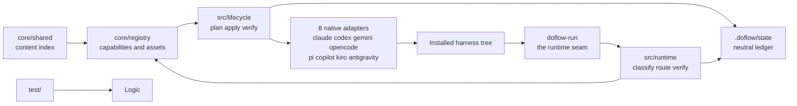
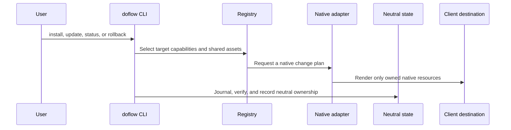
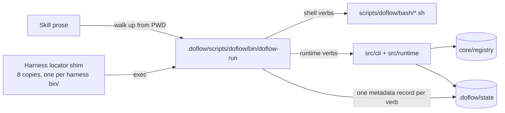
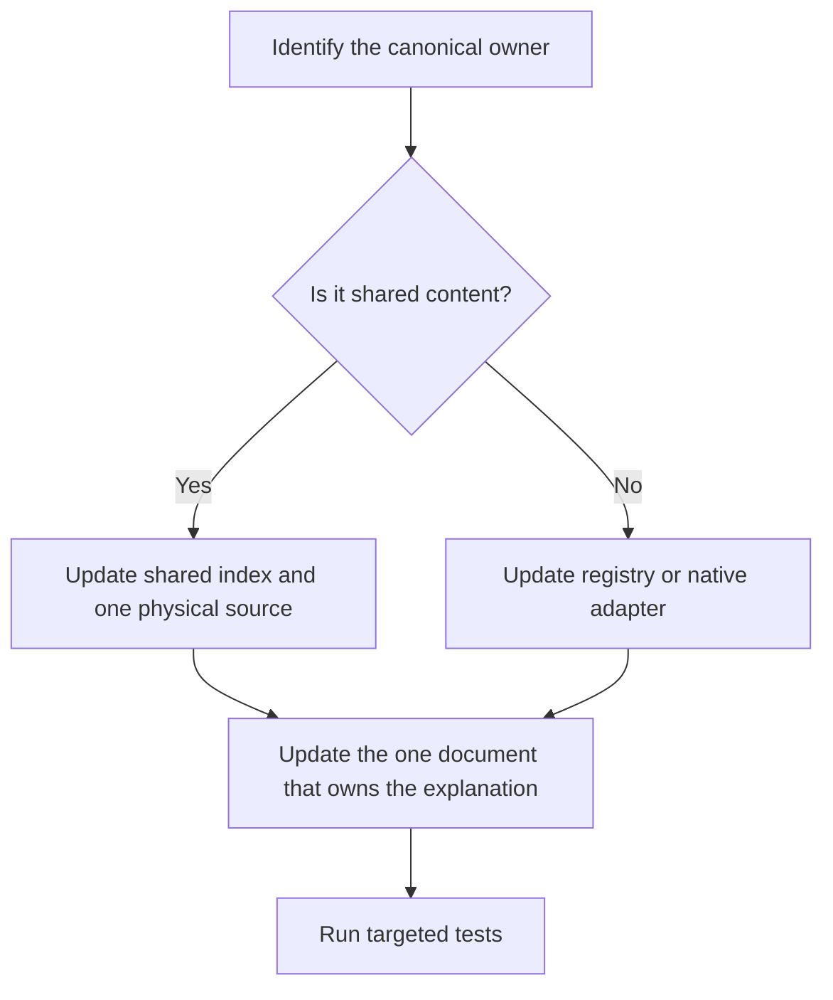

# Architecture

This guide is for contributors changing DoFlow itself. For the user-facing model, see [Overview](overview.md).

## Design in one picture


```mermaid
flowchart LR
    Shared[core/shared\ncontent index] --> Registry[core/registry\ncapabilities and assets]
    Registry --> Lifecycle[src/lifecycle\nplan apply verify]
    Lifecycle -->     Adapters[8 native adapters\nclaude codex gemini opencode\npi copilot kiro antigravity]
    Lifecycle --> State[.doflow/state\nneutral ledger]
    Adapters --> Installed[Installed harness tree]
    Installed --> Seam[doflow-run\nthe runtime seam]
    Seam --> Runtime[src/runtime\nclassify route verify]
    Runtime --> Registry
    Runtime --> State
    Tests[test/] --> Logic
```

The architecture has a deliberately simple boundary: **shared content is described once; the
registry declares what each harness can do, how each shared asset projects onto it, and what the
runtime is allowed to decide; adapters own native paths and formats; lifecycle code owns planning,
ownership, and recovery; and one runtime, reached through one seam, owns everything a skill decides
at use time.** Do not duplicate a skill, rule, or template simply because clients place it in
different directories, and do not add a second implementation of a runtime verb.

Each target is a native projection, not a copy of another target's settings. Its supported
surfaces, prerequisites, verification steps, and intentional gaps are the contract in the
[multi-harness capability map](capability-map.md). In particular, configuration and hook discovery
can be trust-sensitive, plugin activation belongs to a user or workspace, and unavailable surfaces
are reported rather than imitated.

## Repository map

| Path | Owns |
|---|---|
| `core/shared/` | The single physical source for cross-harness content: guidance, skills, agent specifications, scripts, and templates. Stable IDs and projections, no duplicated bytes |
| `core/registry/` | Two registry families in one directory: installation (harness capabilities, assets, neutral MCP catalog, lifecycle policy) and runtime (capabilities, routes, workflows, verification, readiness templates, external tools) |
| `core/harnesses/` | Native per-harness sources that have no cross-harness equivalent — hooks, settings, and native agent definitions for `claude`, `codex`, `gemini`, and `kiro` — plus `core/harnesses/shared/locator`, the one file projected into all eight. Antigravity has no native directory here by design: its adapter projects into Gemini-compatible paths (`.agents/`, `~/.gemini/config/`) rather than owning a distinct surface |
| `core/.claude-plugin/` | Claude Code marketplace registry and plugin manifest; `core/` is the plugin root |
| `core/.codex-plugin/` | Codex plugin manifest for plugin-based distribution |
| `core/.plugin/` | GitHub Copilot CLI plugin manifest (skills-only); first in Copilot's documented manifest check order |
| `bin/doflow.js` | The thin CLI entry point (exposed as the `doflow` command) — a forwarder into `src/cli`; it defines no handlers and no parser, so the binary path and the dispatcher seam (`doflow-run`) keep resolving here |
| `src/cli/` | The CLI itself: argument parsing and the installer command→handler table (`index.js`), one file per installer command under `commands/`, the runtime-verb forwarding switch (`runtime-commands.js`, whose implementations stay in `src/runtime/`), and the shared command plumbing (`shared.js`) — including `buildAdapterRegistry()`, the single construction of the adapter registry that install/update/remove/reconcile use |
| `core/shared/scripts/doflow/bin/doflow-run` | The runtime seam: one dispatcher owning the whole verb namespace |
| `src/adapters/` | Native file formats and verification boundaries, one directory per harness (`claude`, `codex`, `gemini`, `opencode`, `pi`, `copilot`, `kiro`, `antigravity`), each implementing the same six-function contract (`discover, render, plan, apply, remove, verify`) that `src/adapters/index.js` validates and each also exposing that contract through a uniform `create<Name>Adapter()` factory (`createClaudeAdapter`, `createCodexAdapter`, `createGeminiAdapter`, and so on); `src/adapters/copy-tree.js` is the shared tree-materializing engine most adapters call into rather than reimplementing file-copy logic |
| `src/lifecycle/` | Non-mutating plan, ownership checks, apply/remove orchestration, and verification against the neutral state ledger; obtains `planGeminiHooks` from the gemini adapter's public export (`src/adapters/gemini/index.js`) rather than reaching into a file inside it, and shares the generic parser in `src/helper/toml.js` with `src/adapters/codex/config.js` instead of depending on that adapter |
| `src/runtime/` | Everything a skill asks for at use time: classification, workflow resolution, capability routing, evidence and claims, readiness, verification and command detection, recovery, tracing, scaffold generation, the per-feature decision register and History compaction (`decision-register.js`, `history-compactor.js`), and provider health; `src/runtime/cli-result.js` holds the exit/error-reporting helpers (`finishRuntime`, `usageError`) shared by the verb handlers `src/cli/runtime-commands.js` dispatches to, and deliberately depends on nothing else in the tree |
| `src/state/` | Harness-neutral ledger, recovery records, and legacy-manifest migration |
| `src/registry/` | Loads and validates `core/registry/*.json` into the in-memory registry object every adapter and lifecycle call consumes — the same data `test/guards/registry.test.js` checks implementation claims against |
| `src/helper/` | Cross-layer utilities with no harness-, install-, or runtime-specific domain: git commit lookup (`git.js`), managed-section merging (`marker-merge.js`), interactive prompts (`prompt.js`), `settings.json` merging (`settings-merge.js`, `settings-scope.js`), generic TOML parsing (`toml.js`), and the single computation of the package root (`repo-root.js`), which every layer shares and no layer should re-derive from its own depth |
| `src/install/` | Installer-domain operations: backup/restore/prune (`backup.js`), scope and target resolution (`context.js`, `targets.js`), manifest read/write (`manifest.js`), external-tool detection and install (`tool-lifecycle.js`), and MCP server selection (`mcp.js`) |
| `test/` | Installer, mapping, and runtime behavior tests organized into module directories mirroring `src/` (`adapters/`, `lifecycle/`, `runtime/`, `registry/`, `state/`, `helper/`, `install/`, `e2e/`), plus `test/guards/` for structural invariants about this repo's content |
| `bench/` | Skill-evaluation corpus, TRACKED so the baseline is reproducible from a clean clone; only `bench/runs/` and `bench/reports/` are ignored. Outside the default test command, whose dispatch step makes paid model calls |
| `docs/` | User-facing and contributor documentation site |
| `docs/capability-map.md` | Cross-harness capability contract, evidence, and verification criteria (hand-maintained since the generator script was removed) |

## Installation data flow


```mermaid
sequenceDiagram
    participant U as User
    participant CLI as doflow CLI
    participant R as Registry
    participant A as Native adapter
    participant S as Neutral state
    participant T as Client destination
    U->>CLI: install, update, status, or rollback
    CLI->>R: Select target capabilities and shared assets
    R->>A: Request a native change plan
    A->>T: Render only owned native resources
    CLI->>S: Journal, verify, and record neutral ownership
```

New behavior should ask the registry and adapter rather than infer a target from a copy path. An
adapter is the only component that knows a client-specific destination or serialization format.

### Installation registries

Every file under `core/registry/` is plain JSON — a convention the
runtime registries below also follow. The installation family declares what each harness can do and
how a shared asset projects onto it:

| File | Declares |
|---|---|
| `core/registry/harnesses.json` | Each target's adapter id, supported scopes, native target files, declared native path facts (`paths`: `{base, segments}` rules resolved through `src/helper/harness-paths.js`, with adapters owning only justified logic residue), and per-surface capability status with verification evidence |
| `core/registry/assets.json` | Each shared asset's `source` path and per-harness `projection`/`nativeDir` |
| `core/registry/contracts.json` | Per-harness recognized frontmatter fields and hook events — what `test/guards/fields.test.js` (G1) checks every asset against |
| `core/registry/lifecycle.json` | Hook-based lifecycle policies (session-context capture, pre-implementation gate, MCP tool guard, stop check) and each harness's support status or fallback |
| `core/registry/mcp.json` | The neutral MCP server catalog every harness's adapter selects from |

## The runtime seam

Installation is one half of the system; the other half is what a skill does once installed. Every
runtime call a skill can make — path resolution, artifact validation, task classification,
capability routing, evidence recording, readiness evaluation, verification, recovery, tracing —
passes through a single dispatcher and nothing else.


```mermaid
flowchart LR
    Skill[Skill prose] -->|walk up from PWD| Dispatch[.doflow/scripts/doflow/bin/doflow-run]
    Locator[Harness locator shim\n8 copies, one per harness bin/] -->|exec| Dispatch
    Dispatch -->|shell verbs| Bash[scripts/doflow/bash/*.sh]
    Dispatch -->|runtime verbs| Node[src/cli + src/runtime]
    Node --> Reg[(core/registry)]
    Node --> St[(.doflow/state)]
    Dispatch -->|one metadata record per verb| St
```

Four properties are load-bearing, and each has a guard because each has already been broken once:

**One namespace, one table.** The dispatcher decides whether a verb is served by a shell helper or
by a `src/cli` command, so a verb can move between the two without any caller changing. Skills
never name a helper. `test/guards/runtime-unification.test.js` checks that every shell verb resolves
to a helper that exists, that every Node verb has a CLI command and every CLI runtime command has a
verb, and that no verb has two implementations.

**Skills resolve the dispatcher by walking up, not by a relative path.** A relative path in a shell
command resolves against the working directory — the user's project root — not against the skill's
own directory. A skill therefore walks up from `$PWD` looking for
`.doflow/scripts/doflow/bin/doflow-run`, falls back to the same path under `$HOME/.doflow`, and
exits 2 with a message naming both places searched. `test/guards/skill-seam.test.js` pins that
resolver to exactly one spelling across the whole skill tree, and
`test/guards/reachability.test.js` executes each documented snippet with the working directory at a
real project root.

**The locator is a shim, not a second dispatcher.** `core/harnesses/shared/locator/doflow-run` is
projected into each harness's own `bin/` directory by the `locator.doflow` asset. It holds no verb
table — it finds the dispatcher and `exec`s it — so adding a verb never edits eight files. Note the
placement, because it decides what a single-harness install can actually do: `locator.doflow` and
`scripts.doflow`, which carries the dispatcher itself, apply to all eight harnesses, and every
harness projects the dispatcher into the same shared `<scope root>/.doflow/scripts`, except
Antigravity at global scope, which has no skills there and projects no runtime (see Harness reach). A tree that is
missing from every searched path gets the documented exit-2 message naming each one and the
`install -t <harness>` command that provides it, rather than a silent failure.

**Tracing is free because it happens at the seam.** The dispatcher appends one metadata record per
dispatched verb to a date-partitioned append-only run ledger under neutral state. No skill has to
opt in, and `test/guards/runtime-unification.test.js` asserts the records carry metadata only — no
source content, no secrets.

Behind the seam there is exactly one runtime. `src/runtime/` is canonical; the parallel Python tree
that used to shadow it — a second guidance-projection compiler, a second health auditor, and the
runtime modules behind them — was deleted. The only Python left in `core/` is `do-code-review`'s own
analyzer set, which belongs to a skill rather than to the runtime and is fixtured separately by
`test/code-review-fixtures.sh`.

### Runtime registries

The runtime reads its policy from the registry rather than hardcoding it — see [Installation
registries](#installation-registries) for the same plain-JSON convention.

| File | Declares |
|---|---|
| `core/registry/workflows.json` | Nine task classes, each an ordered stage list naming skills that already exist, with its readiness template and gates, plus the `callers` map giving every shipped skill a role (`stage`, `router`, `standalone`) so the classifier can judge whether a class has a stage for the skill asking. There is no default class: an unrecognized proposal is rejected with the valid set rather than coerced into one |
| `core/registry/verification.json` | Nine check tiers and four risk levels; a level selects its required and advisory tiers and sets the recovery-retry bound |
| `core/registry/readiness-templates.json` | Per-class readiness requirements and the evidence kinds that satisfy each one |
| `core/registry/capabilities.json` | The capabilities an information need can resolve to, and their providers |
| `core/registry/routes.json` | Information need → capability, with an ordered fallback when the preferred capability has no healthy provider |
| `core/registry/external-tools.json` | External tools DoFlow can detect, install, and probe rather than reimplement |

Two contracts follow from these files and should not be re-expressed as flags. Readiness is a
four-state verdict — `READY`, `NEEDS_EVIDENCE`, `NEEDS_USER_DECISION`, `BLOCKED` — with the missing
item named, never a numeric confidence. Verification is risk-scaled: the tiers that run and the
number of recovery attempts allowed are both derived from the risk level, not chosen per invocation.

## The lifecycle loop

Four runtime verbs, `followup`, `lifecycle`, `goal` and `failure`, keep what a feature leaves
behind. They are wired the way `decision` is: a flag-table entry and help line in `src/cli/index.js`,
one `case` in `src/cli/runtime-commands.js`, an `is_node_verb` entry and usage line in the
dispatcher, a row in [Reference](reference.md), and the literal `doflow-run <verb>` in
`core/shared/skills/do/SKILL.md`. For how it reads to a user, see [How DoFlow
works](how-doflow-work.md#after-the-chain-the-lifecycle-loop).

### Module map

| Path | Owns |
|---|---|
| `src/runtime/mask.js` | Best-effort masking and failure-message normalisation, in two profiles (line and body). Used by the follow-up service, the report store and the failure writer |
| `src/runtime/lifecycle/root.js` | The project root a store is keyed by: the first real working tree in `git worktree list`, else the current worktree's root, else the working directory |
| `src/runtime/lifecycle/event-store.js` | Write-once event files under `agent-docs/lifecycle/events/`: id and `at` stamping, exclusive create, the store lock, the pre-write fold check |
| `src/runtime/lifecycle/fold.js` | The pure fold of events into follow-ups, tracked features, goals and release records, with conflicts. No file or git access |
| `src/runtime/lifecycle/followup.js`, `goal.js` | The follow-up and goal services; each returns a result object and never prints |
| `src/runtime/lifecycle/intent-writer.js` | Creates a new intent for `followup --action promote`, from headings fixed in code |
| `src/runtime/lifecycle/report-store.js` | The machine-local report body and its masked excerpt |
| `src/runtime/lifecycle/status.js` | Feature status derived from git and release records, never written |
| `src/runtime/lifecycle/overview.js`, `release.js` | `overview`, `init`, `status`; `release` and `merged` |
| `src/runtime/lifecycle/cli.js` | The `followup`, `lifecycle` and `goal` handlers: flag checks, text output, exit codes |
| `src/runtime/failure/home.js`, `classifier.js` | Where the failure home is and whether capture is on; the programming-error classifier |
| `src/runtime/failure/capture.js`, `store.js`, `cli.js` | The Node writer with rotation; the reader, fingerprints and settlements; the `failure` handler |

### The store

One directory, one file per change. Root rules, the write-once guarantee and the fold order are in the
module headers of `root.js`, `event-store.js` and `fold.js`; the event types are:

| Type | `data` fields |
|---|---|
| `followup.added` | `id`, `statement`, `source`; for a report also `excerpt`, `bodyRef`, `bodyBytes` |
| `followup.taken` | `ids`, `feature` |
| `followup.settled` | `id`, `as` (`kept`, `dismissed`, `fix`, `done`), `reason`, `evidence` |
| `followup.promoted` | `ids`, `intent` (root-relative path) |
| `feature.tracked` | `slug` |
| `feature.merged` | `slug`, `reason` |
| `goal.added` | `goal`, `outcome`, `items` |
| `goal.item-added` | `goal`, `item` |
| `goal.checked` | `goal`, `item`, `met`, `evidence` |
| `goal.linked` | `goal`, `slug`, `replace` |
| `goal.done` | `goal`, `reason` |
| `release.recorded` | `tag`, `commit`, `features`, `excluded` |

Every event carries `v`, `id`, `type`, `at`, `by` and `data`. A file whose name is not an event id is
ignored; one that does not parse is skipped and listed as `unreadable`; a transition that is illegal
at its place in the order is not applied and is listed as a conflict. A write is refused with
`store-locked` when the store lock cannot be taken in time. Nothing in the store is ever edited or deleted by DoFlow, and
nothing in it is staged, committed or ignored by DoFlow.

### Release detection

A feature's status is derived from the **integration ref**: the first that exists of `develop`,
`origin/develop`, `main`, `origin/main`, `master`, `origin/master` and `origin/HEAD` (DEC-044). The
release preview and the status view take it from one function, `lifecycle_integration_ref` in
`do-git-state.sh`, so a preview before the tag and the overview agree; code that needs the ref calls
that function and never resolves it a second way. When the pinned ref is a local branch behind its
`origin` counterpart the result carries `integrationBehind` and a note, and the status is still
derived from the local ref. A project with no `v*` tag finishes features at merge; with one, a
feature finishes when a release record names it, or when its merge is contained in a tag that has no record.

The Node runtime finds `do-git-state.sh` inside the package, else in the `bash` folder of the scripts
installed beside its runtime (DEC-048), and reports `git-state-helper-missing` when neither exists. The
runtime that is installed carries only `bin/`, `src/` and `core/registry/`, so a path under
`core/shared/` does not exist there. `scope-bound.js` and `feature-resolve.js` still use the older
pattern; that is recorded as a follow-up, not fixed here.

### Failure capture

Capture is a side channel that must not be noticed by the command it observes: it writes no byte to
stdout or stderr, never throws, takes no lock and never changes an exit status. Every writer
appends one JSON line to `events.jsonl` under `${XDG_CONFIG_HOME:-$HOME/.config}/doflow/failures/`,
and is a no-op when no absolute home resolves or the switch is off (the `off` file, or
`DOFLOW_FAILURE_CAPTURE` set to `off`, `0`, `false` or `no`). Only Node rotates the file.

| Capture point | Records | Is not recorded |
|---|---|---|
| `main()` catch in `src/cli/index.js`, the usage-error catch sites in `src/runtime/cli.js` and the three exit-1 catch-and-convert sites | An error the classifier calls a programming error: `TypeError`, `RangeError`, `ReferenceError`, an assertion, `MODULE_NOT_FOUND`, a Node system error with a code | A bad flag, a refusal or finding, `EPIPE`, a plain `Error`, a `SyntaxError`, an `AggregateError`, an error class a verb defines and catches |
| `uncaughtExceptionMonitor`, registered in `bin/doflow.js` before the CLI loads | The same classes, as `uncaught:<kind>` | The same exclusions |
| Dispatcher: `helper-missing`, `helpers-not-found`, a symlink loop, a verb status outside 0, 1 and 2 | The reason or `exit-<n>`; no message | 127, 130, 141, 143, status 3 from `task-brief`, caller mistakes (`no-verb`, `unknown-verb`, `node-not-found`, `cli-not-found`, `unlinked-checkout`, `stale-runtime`), a missing `jq` |
| Hook helper `capture-failure.sh`, called by `pre-bash-guard.sh` (`patterns-missing`) and `mcp-tool-guard.sh` (`policy-file-missing`) | A guard that fails open because its own install is broken | A deny, a missing `jq` |
| `stream-hook-runner.js`: `runner-exception`, `policy-exec-fault:<signal>` | A runner crash; a policy killed by a signal other than `SIGINT`, `SIGTERM` or `SIGPIPE` | A missing `bash`, a permission error |

An environment error such as `EACCES` on the project store matches the system-error rule and is
recorded; `/do maintain` settles it as noise. The hook runner carries its own copy of the writer and
of the classifier, because hook files are installed without the runtime library, and a test requires
the two classifiers to agree. A policy calls the helper only inside a subshell and a branch where it
already fails open, so no option or variable of the helper reaches the policy. A bash line is kept at
or under 1000 bytes and a Node line at or under 2048, so concurrent appends do not interleave.
Fingerprints are computed by the reader, never by a writer, and `failure --action settle` is the only
writer of `settlements.jsonl`.

### Harness reach

The runtime reaches every harness at every scope where it gets skills: a standalone install of any
of the eight projects the `scripts.doflow` and `runtime.*` assets to `<scope root>/.doflow`, so the
follow-up, capture and maintain lines run after installing one harness alone. Pi, OpenCode and
GitHub Copilot CLI also receive the shared guidance tree at `<scope root>/.doflow/guidance`, which
the pointer in their instructions names; Kiro keeps its steering files and also receives that tree,
which `doflow retrieve` searches. Antigravity has no skills at
global scope, so its global install projects no runtime and prints a notice; install it per
project. `doflow doctor` prints a `[Runtime Reach]` section with one line per installed harness and
scope: `REACHED`, `NO-REACH` with the install command that fixes it, or `N/A`. At project scope
every ledger from the working directory upward is read, so a nested ledger left by a removed harness
does not hide the install that encloses it. Nothing in the loop
depends on one harness's own commands; a goal is DoFlow's record, whatever a harness's own `goal`
command does.

### Guards this feature touched

- **G4** (`flags.test.js`): `--stage` and `--statement` are the runtime `followup` verb's own
  arguments, quoted in `WORKFLOW_HANDOFF.md`, so they are on the `NOT_FRAMEWORK_FLAGS` list with that
  reason. A new runtime-verb flag quoted in guidance goes on the same list; do not add it to `FLAGS.md`.
- **G13** (`context-budget.test.js`): the loaded-context rails of the `feature` class (224,000 to
  225,000 bytes) and the `documentation` class (56,000 to 57,000) were raised for the lifecycle
  lines in `do-brainstorm` and the follow-up line in `WORKFLOW_HANDOFF.md` (the `documentation` rail
  only for the second, which `do-test` and `do-code-review` load). When a rail fails, measure
  it, record the measured value and the reason beside the rail, and raise it deliberately in its own
  commit; do not trim an unrelated file to fit. The `dependency-change` rail has little headroom.
- **G16** (`module-reachability.test.js`): every module in `src/runtime/lifecycle/`, `src/runtime/failure/`
  and `mask.js` must be reached by a static `require()` literal. The failure modules are required
  lazily (in `bin/doflow.js` inside a `try`, in `runtime-commands.js` inside a function), so the CLI runs
  without them; keep the `require('<literal path>')` form when you add one.
- **G17** (`verb-reachability.test.js`): each of the four verbs must be spelled `doflow-run <verb>` in
  a skill file; the `do` skill line does it, so no allowlist entry exists. Spell a new verb in a skill
  or the guard fails.

When one of these fails, the stale side is almost always a skill line, a flag list or a rail, not the
guard; fix that side.

## Ownership and projection boundary

Every target has three distinct ownership domains:

| Domain | DoFlow may manage | DoFlow must preserve or leave to the user/workspace |
|---|---|---|
| Repository assets | Managed instruction sections, selected DoFlow assets, and documented hook definitions. | User instructions and assets outside managed boundaries; target-specific configuration may require project trust. |
| Configuration and integrations | Explicitly named DoFlow configuration keys and selected curated MCP registrations, with recorded ownership. | Unknown configuration keys, unrelated MCP servers, credentials, approval/sandbox policy, and ambiguous user modifications. |
| Host-managed capabilities | Discoverable plugin package metadata and documentation of supported workflow entry points. | Plugin marketplace activation, hook review/trust, and scheduled-task creation/management. |

This division prevents a false parity claim: an installed file is not evidence that a host has
activated a plugin, trusted a hook, connected an MCP server, or made an automation available. The
lifecycle verifier must report those prerequisites.

One consequence is worth stating explicitly because the shared runtime tree made it sharper: three
harnesses project the same shared `.doflow/scripts` target, so ownership of that tree is shared
rather than per-harness. Removing one harness must reclaim only what no other installed harness
still claims.

## Shared content and client adapters

`core/shared/` is the single physical source for cross-harness content — `core/registry/assets.json`
declares each asset's `source` path and per-harness projection; `core/registry/*.json` overall
declares target capability and ownership inputs, and is not itself a native configuration file.

| Content | Where it lives | Why it is shared |
|---|---|---|
| `DOFLOW_CORE.md`, `PRINCIPLES.md`, `FLAGS.md`, `VERSION`, `rules/`, `references/`, `modes/`, `mcp/` | `core/shared/guidance/` | One `guidance.context-layer` copy-tree asset mirrors this whole tree, byte-for-byte, into `.doflow/guidance/` for every scope, on the harnesses its `appliesTo` names, except Kiro, which gets this tree as `.kiro/steering/` and a second, Kiro-only `kiro.guidance-tree` asset that mirrors it into `.doflow/guidance/`; that copy is never loaded as steering |
| `MCP_INDEX.md` (`.doflow/guidance/` only, no `core/` source) | Written directly by `applyLifecycle` (`src/lifecycle/index.js`) | The one file in `.doflow/guidance/` that varies per install (the resolved MCP selection) — deliberately outside `guidance.context-layer`'s copy-tree source so its per-install content never conflicts with that asset's byte-for-byte mirror; imported unconditionally from `DOFLOW_CORE.md` |

> **Path anchor (load-bearing).** Every `@import` in `DOFLOW_CORE.md`, and every `doc` value in
> `core/registry/mcp.json`, is relative to the **guidance root** (`.doflow/guidance/`). That is why
> `PRINCIPLES.md`/`FLAGS.md`/`MCP_INDEX.md` sit at the root rather than in a subdirectory: writing
> any of them one level deeper silently reinterprets those relative paths against that subdirectory
> and breaks them without any error. `test/adapters/copy-tree.test.js` and `test/install/mcp-index.test.js` resolve
> both sets of paths against the real tree to keep that anchor enforced rather than assumed.
| `skills/`, `agent-specs/`, `scripts/`, `templates/` | `core/shared/{skills,agent-specs,scripts,templates}/` | Task knowledge and reusable assets are client-neutral |
| Native hooks, settings, and native agent definitions per harness | `core/harnesses/{claude,codex,gemini,kiro}/` | Copied or reconciled as native configuration only where the harness has such a surface |
| The runtime locator shim | `core/harnesses/shared/locator/` | Byte-identical on every harness; only the native path it is written to differs |
| MCP server catalog | `core/registry/mcp.json` | Single neutral source every harness's adapter selects from |

Each harness's native entry file (`CLAUDE.md`, `AGENTS.md`, `GEMINI.md`) no longer receives a full
copy of the guidance content — its managed section is a short pointer into `.doflow/guidance/`
instead: `@`-import syntax for Claude and Gemini (both resolve relative/absolute `@file` imports
natively), a prose read-instruction for Codex (AGENTS.md has no native import-expansion
mechanism, unlike Claude/Gemini). This replaces the physical per-harness duplication this section
previously described as pending — see `CHANGELOG.md` for when it landed.

For Codex-specific configuration, keep durable preferences and MCP servers in the applicable
`config.toml` layer, use a single `hooks.json` representation per layer for lifecycle handlers,
and keep custom agents as separate `.codex/agents/*.toml` files. Equivalent native details belong
to their own adapters; see the [capability map](capability-map.md) before claiming parity.

## Neutral state and migration

The lifecycle ledger is independent of a harness directory: project installations use
`<project>/.doflow/state/`; user installations use `~/.doflow/state/`. Lifecycle backups and the
install manifest use sibling paths under `.doflow/` (`backups/` and `.install-manifest.json`). The
same neutral state directory also holds what the runtime writes: per-task evidence and claims, and
the date-partitioned run ledger the dispatcher appends to. Lifecycle commands no longer anchor
metadata to `.claude`; the explicit neutral-state importer remains separate for historical state.

Migration order is deliberate: declare registry ownership, introduce adapters and neutral state,
route the CLI through lifecycle planning, then retire a compatibility path only after idempotency,
conflict, rollback, and recovery tests pass.

## How to make a change


```mermaid
flowchart TD
    A[Identify the canonical owner] --> B{Is it shared content?}
    B -->|Yes| C[Update shared index and one physical source]
    B -->|No| D[Update registry or native adapter]
    C --> E[Update the one document that owns the explanation]
    D --> E
    E --> F[Run targeted tests]
```

Examples:

- Add or revise a workflow: edit its `core/shared/skills/<name>/SKILL.md`; keep the public description compact in [Reference](reference.md).
- Change a client destination or add a supported asset: edit `core/registry/assets.json`, then cover it in tests.
- Add a harness: declare it in `core/registry/harnesses.json`, `contracts.json`, and `assets.json`; implement `src/adapters/<id>/index.js`'s six-function contract (`discover, render, plan, apply, remove, verify`); and register the adapter via `buildAdapterRegistry()` in `src/cli/shared.js`, the one construction of the adapter registry. `test/guards/registry.test.js` checks the three registry files and the implementation against each other.
- Change managed instruction behavior: edit the merge/copy implementation in `src/`, then test both fresh install and update paths.
- Add or change a runtime verb: edit the dispatcher's own table alongside the implementation — it is the single place the verb namespace is written down — then run the guards, which cross-check that table against the shell helpers and the CLI commands in both directions.
- Change a skill's flags: land the skill's `argument-hint`, `docs/reference.md`, and `docs/flags.md` in the same commit. Three guards cross-check them, so a partial change turns the suite red.
- Change user guidance: give it one canonical document—Quickstart, Setup, Guide, Reference, or Overview—rather than copying it across all of them.

## Validation

Run checks appropriate to the change:

```bash
npm test                                   # the whole suite, including test/guards/
node --test test/guards/registry.test.js   # a single guard while iterating
bash test/doflow-chain-test.sh             # shell suites — not part of npm test
bash test/hooks/test-hooks.sh              # shell suites — not part of npm test
bash test/verify-hooks.sh                  # shell suites — not part of npm test
bash test/code-review-fixtures.sh          # do-code-review's analyzer fixtures, outside npm test
pip install -r requirements.txt            # docs deps, once per environment — see note below
mkdocs build --strict --site-dir /tmp/doflow-docs-site
```

The docs build needs `mkdocs` and the Dracula theme, which `requirements.txt` pins and which nothing
else in this repository installs. Without that step `mkdocs build` reports command-not-found, which
reads as "this check cannot run here" rather than "the dependency is not installed yet" — so the
install line belongs beside the command, not in a contributor's memory.

Use a temporary client home when validating installation behavior. Do not use a developer's live
configuration as a test fixture.

### The guard suite

`test/guards/*.test.js` checks structural truths about this repository's own content rather than
runtime behavior, and it is what most changes actually need to keep green. `test/guards/` holds
thirty-one test files (plus `_shared.js`, a helper rather than a test); the twenty-four listed
below are the ones this inventory documents, and they carry twenty-two distinct G-numbers because two
numbers are used twice. Name the file, not the number, when you mean a specific guard: across the
whole directory three numbers are claimed by two files each — G11 and G13, both pairs listed below,
and G18, whose second claimant `adapter-force.test.js` is not. The collisions are historical rather
than a convention; G24 is the highest number in use, so a new guard takes the next one above it
instead of adding a fourth. The list is not the whole directory. The seven files absent from it are
`verb-reachability.test.js`, which owns G17 and is why the list runs G16 then G18;
`adopt-path.test.js`, which owns G19, and `adapter-force.test.js`, which is the unlisted half of
the G18 pair — between them the reason the list runs G18 then G20; and `boundaries.test.js`,
`harness-paths.test.js`, `cli-boundary.test.js` and `frozen-behaviour.test.js`.

- **G1** (`fields.test.js`) — every frontmatter key an asset declares is recognized by something.
- **G2** (`paths.test.js`) — path reachability from `MCP_INDEX.md`-style generalizations.
- **G3** (`consumers.test.js`) — every guidance-tree `modes/`/`references/` file has at least one
  skill or always-loaded rule that actually reads it (lazy-loading is only safe if something
  loads it — a mode's own "Activation Triggers" prose is not itself a trigger). It also holds every
  `pointers/` file to being named as a source by a registry asset: a pointer's consumer is a registry
  entry rather than a skill, and copy-tree'ing the guidance directory is not reachability — that is
  how an orphaned pointer shipped to five harnesses while naming a directory the install had
  flattened away.
- **G4** (`flags.test.js`) — `FLAGS.md` entries are wired to a real consumer and vice versa. A flag that is a runtime verb's own argument (such as `--stage` and `--statement` of `followup`) is listed with its reason rather than added to `FLAGS.md`.
- **G5** (`registry.test.js`) — the only guard that reads `src/` and `core/harnesses/` as data;
  checks registry claims against what's actually implemented.
- **G6** (`docs.test.js`) — documented inventories match reality: the skill list in
  `docs/reference.md`, and every skill/agent count quoted in `README.md`.
- **G7** (`package.test.js`) — the published npm tarball matches the source of truth.
- **G8** (`reachability.test.js`) — every shipped script/CLI command/doc-referenced path is
  reachable from something, where a script reached *through a dispatcher verb* counts as reached;
  `docs/reference.md`'s per-skill flags match each skill's own `argument-hint`; and every
  documented runtime-resolution snippet is actually executed with CWD at a project root.
- **G9** (`dispatch.test.js`) — a skill that names any `core/shared/agent-specs/` archetype by
  name must reference `references/MODEL_SELECTION.md` for model-tier selection.
- **G10** (`flag-index.test.js`) — `docs/flags.md` (the flag-first companion to `reference.md`'s
  skill-first table) stays in sync with every skill's `argument-hint`, forward and reverse.
- **G11** (`evals.test.js`, with `test/bench/bench-runner.test.js` covering the runner's own
  behavior) — the skill-evaluation corpus under `bench/` is tracked, so a clean clone
  can reproduce the behavioral baseline: the harness, the per-skill case files, the pinned-model
  config and the sanitized baseline are all present, every shipped skill has a case file carrying
  both triggering and behavioral cases, the case files are internally consistent, every case has a
  side (`train` or `heldout`) and every skill a held-out case, every skill has a should-not-trigger
  case graded on by-path runs by `skill_not_routed`, every assertion type is one the runner knows,
  and the config declares a valid token ceiling. The committed baseline still describes the
  committed corpus: a case missing from the baseline is reported as pending, awaiting a paid
  capture, and does not fail, while a removed, renamed or kind-changed case does, and so does a
  baseline entry recorded twice, and so does a case moved to the other side when its baseline result recorded `split` (the committed baseline
  records none, so that comparison starts applying per case once a re-captured baseline does);
  `coverage` alone cannot see any of these. It also holds the boundary that keeps the corpus
  cheap: `npm test` scopes discovery to `test/` via the directory argument, so an unscoped
  `node --test` cannot execute captured artifacts under `bench/runs/`; the harness keeps its own
  `bench` script; and `npm test` never invokes the harness, whose dispatch step makes paid model
  calls. Only `bench/runs/` and `bench/reports/` stay ignored. G11b, in the same file, holds skill
  provenance: a run is told to load its skill from the sandbox by path, and a run that cannot prove
  which `SKILL.md` it read is never graded as if it could; a without-skill run withholds the skill
  and is graded `withheld`, `leaked` or `unrecorded` the same way.
- **G11** (`scaffold.test.js`, same number, different guard) — a `--scaffold` run writes only under
  `agent-docs/doflow/<slug>/scaffold/`, is byte-identical on re-run, emits signatures rather than
  logic, leaves a hand-edited file alone, and reports what it skipped as prominently as what it
  produced.
- **G12** (`runtime-unification.test.js`) — one runtime: exactly one dispatcher and one locator, no
  verb with two implementations, every shell verb resolving to a helper that exists, every Node verb
  having a CLI command and vice versa, no skill reaching the JS runtime except through the
  dispatcher, and the run ledger carrying metadata only.
- **G13** (`workflows.test.js`) — every class in `workflows.yaml` resolves to stages naming skills
  that exist; review has no implementation stage; research requires no implementation readiness.
- **G13** (`context-budget.test.js`, same number, different guard) — the DoFlow-authored
  always-loaded set stays within its byte ceiling and every import in it resolves; and every task
  class stays within its loaded-context rail (SKILL.md entries plus named references, summed over
  the class's resolved workflow skills — a coarse drift rail, not a byte-exact pin). A rail is raised deliberately, in its own commit, with the measured value beside it. A size view alongside the rails
  reports lines and bytes per always-loaded file and per harness (what each harness's projections
  load before the user types, classified from the registry) as diagnostics, so a change shows what it
  costs each harness; a harness the classification does not recognize fails the guard rather than
  reporting zero.
- **G14** (`agent-specs.test.js`) — an agent specification references no file outside itself, since
  a dispatched agent has no working directory to resolve one against.
- **G15** (`skill-seam.test.js`) — one path to the runtime entrypoint, one spelling of the resolver
  across the whole skill tree, and no skill reaching into the config directory for anything but that
  entrypoint.
- **G16** (`module-reachability.test.js`) — every JavaScript module under `src/` is reachable from
  something outside `test/`: a static relative `require()` in `bin/`, `src/` or `bench/`, or a path
  named on one of the caller surfaces that invoke a module without requiring it (`package.json`
  scripts, `core/shared/scripts`). It closes for `.js` modules the same gap G8 already closes for
  shipped scripts (this is how four now-deleted `src/runtime/` modules accumulated with no requirer
  anywhere before this guard existed) — and excluding `test/` closes the residual case, a module kept
  alive solely by its own test, which is how one dead module survived thirteen months. Its companion
  check, that every relative `require()` literal resolves, deliberately still reads `test/`: it asks
  whether a specifier dangles, which is a different question.
- **G18** (`artifact-conventions.test.js`) — `references/ARTIFACT_FORMAT.md` declares the artifact
  conventions and the four chain-artifact templates transcribe them, so the two can disagree
  silently; this compares them. Each template must carry a `**Maturity:**` header field and no
  `**Status:**` one, and must restate both closed vocabularies, which stay disjoint. The C4 level
  names must agree between §4's table, §4's prose and `design-template.md` §2, and no level label on
  either side may be shaped like a component ID. The reviewer-facing sections §10 declares must
  appear in the template that owns each, and §10's four component labels must be transcribed into
  `design-template.md` §3 in order. Separately from the templates, the rule names
  `validate-artifacts.sh` implements must match the list §9 documents.
- **G20** (`ownership-identity.test.js`) — `doflow inventory` treats two recorded resources as
  copies of one logical asset when `(harness, ownershipIdentity)` agrees (IC-004), which makes two
  properties of that identity load-bearing and neither was enforced anywhere: it must carry no
  scope name and no destination path, or a global and a project copy stop joining and are reported
  as two unrelated singletons; and no two resources in one plan may share a pair, or two resources
  collapse into one asset holding two copies at the same scope, a shape the report cannot
  represent. Both are checked twice over. Behaviourally, by planning every harness against
  `mkdtemp` roots — two project roots of different length, then global against project — with
  antigravity's `agents.shared` named as the sentinel, since it is the one asset whose destination
  root genuinely differs by scope. Statically, by parsing every `ownershipIdentity` composition
  site under `src/adapters/` and failing closed on any interpolation not listed with the reason it
  is the same at both scopes. A plan against an empty root only exercises the create path, so the
  scan covers the verify and remove sites the behavioral half never reaches.
- **G21** (`wholesale-assets.test.js`) — `doflow inventory` reports an unmanaged neighbouring file
  only in a directory the harness loads *wholesale*, and nothing in the registry records load
  semantics, so `WHOLESALE_ASSETS` in `src/runtime/inventory/siblings.js` is derived by hand. This
  pins it to what adapters actually do, so a harness that gains an apply-to-everything transform
  cannot silently stop being inspected. The derived half runs every entry of `copy-tree.js`'s
  `TRANSFORMS` table over a probe file and reads the frontmatter it produces — a projection whose
  transform renders an apply-to-everything directive must appear in the constant — and the
  constant may hold no entry that is neither derived this way nor recorded, nor one naming a
  projection that no longer exists. The recorded half exists for Kiro, whose steering tree is
  loaded wholesale with no transform to execute; that entry instead pins the two registry facts its
  rationale rests on, and becomes removable if the registry ever declares load semantics per
  projection.
- **G22** (`skill-caps.test.js`) — every `SKILL.md` stays inside the host's skill limits: listing text
  (`description` plus `when_to_use`) at most 1,536 characters, the file at most 20,000 bytes with
  `## Boundaries` starting inside them (the post-compaction window), and each task class's workflow
  skills at most 100,000 bytes together. The listing text summed over every skill also stays within
  8,000 characters, the figure Codex applies when the model's context window is unknown.
- **G23** (`hidden-unicode.test.js`) — shipped prose and code are read by models and by reviewers, and
  a code point that renders as nothing (tag characters, zero-width characters, bidirectional
  controls, invisible operators, variation selectors, soft hyphens, filler characters — in all, any code
  point with the Unicode property Default_Ignorable_Code_Point) can carry instructions or reorder text
  no reviewer sees. U+FE0E and U+FE0F after a pictograph or a keycap base choose an emoji's
  presentation and are allowed, as is a zero-width joiner between two pictographs; a variation selector
  anywhere else, and a leading byte order mark, are findings. Every file
  under `core/`, `src/`, `bin/` and `docs/`, and `README.md`, must hold none and must decode as strict
  UTF-8, so an undecodable file cannot slip past unscanned. `test/` and `bench/` are not scanned:
  `test/` holds deliberate bidirectional fixtures.
- **G24** (`instruction-lint.test.js`) — the guidance, skills and agent specs the harnesses load tell a
  model to read files and run `doflow-run` verbs, and nothing else checked those instructions against
  the tree. Every `doflow-run <verb>` they name must be a verb the dispatcher serves, every backticked
  path they cite must resolve to a file or directory that ships (G8 does the same for `docs/` and
  `README.md`), and no two contradictory defaults may both be present. A path or verb intentionally
  absent from the tree is declared in `instruction-lint.json`; an entry that suppresses nothing, or a
  malformed policy file, fails the lint, so the policy cannot rot into a blanket suppression.

A finding from any of these is almost always "a doc/registry/skill went stale relative to
another," not a runtime bug — fix the stale side, don't weaken the guard.

## Contributor guardrails

- Preserve user content outside DoFlow-managed instruction markers.
- Treat mappings as an explicit compatibility contract; unsupported client features should be intentionally skipped, not silently copied.
- Keep `core/` client-neutral whenever possible.
- Keep one implementation per runtime verb, and reach it only through the seam.
- Keep documentation layered: orientation in the README, procedures in Setup and Guide, lookup facts in Reference, concepts in Overview.
- Update tests whenever a mapping, copy strategy, installer lifecycle behavior, or runtime verb changes.
