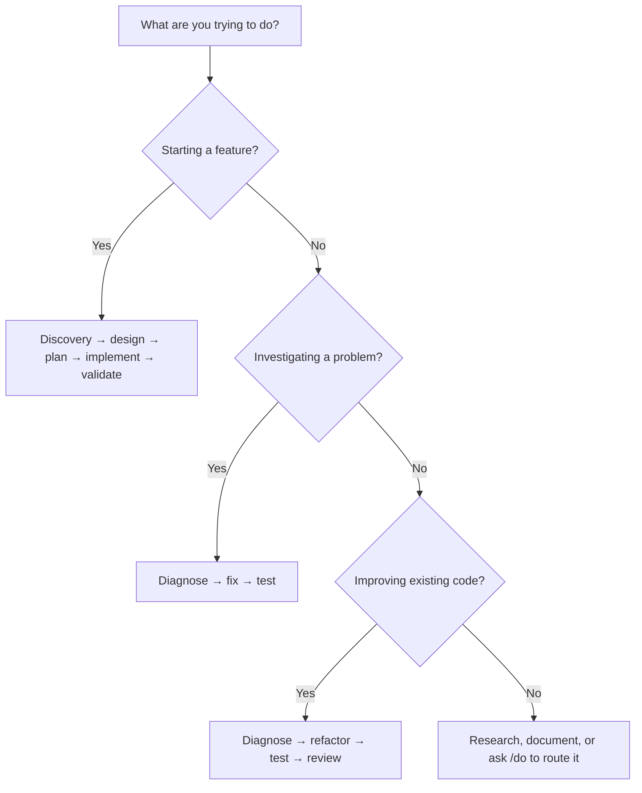
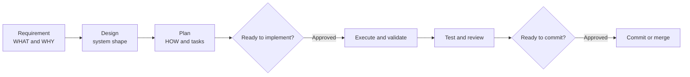

# Guide

Use this page to choose a workflow. Use [Reference](reference.md) when you need an exact command or capability.

## Choose a path


```mermaid
flowchart TD
    A[What are you trying to do?] --> B{Starting a feature?}
    B -->|Yes| C[Discovery → design → plan → implement → validate]
    B -->|No| D{Investigating a problem?}
    D -->|Yes| E[Diagnose → fix → test]
    D -->|No| F{Improving existing code?}
    F -->|Yes| G[Diagnose → refactor → test → review]
    F -->|No| H[Research, document, or ask /do to route it]
```

## Deliver a feature

Choose the guided path when the request needs requirements, design decisions, or multiple implementation steps.

### The spec-driven workflow

DoFlow treats feature delivery as a sequence of durable specifications, not one long chat. Each phase writes an artifact under `agent-docs/doflow/<feature-slug>/`; the next phase reads that artifact rather than relying on conversation memory.


```mermaid
flowchart LR
    R[Requirement\nWHAT and WHY] --> D[Design\nsystem shape]
    D --> P[Plan\nHOW and tasks]
    P --> G{Ready to implement?}
    G -->|Approved| I[Execute and validate]
    I --> V[Test and review]
    V --> C{Ready to commit?}
    C -->|Approved| M[Commit or merge]
```

| Phase | Command | Artifact | It answers |
|---|---|---|---|
| Discover | `/do-brainstorm` | `requirement.md` | What problem are we solving, for whom, and why? |
| Design | `/do-design` | `design.md` | What system shape, interfaces, and decisions satisfy the requirement? |
| Plan | `/do-plan` | `plan.md` | How will work be broken into dependency-ordered, verifiable tasks? |
| Execute | `/do-execute-plan` | Checked tasks and `state.md` | What is complete, what is next, and what blocked progress? |
| Validate | `/do-test`, `/do-code-review` | Test and review results | Does the implementation meet the agreed specification? |

The three specifications are deliberately different. Do not put implementation tasks into `requirement.md`, or repeat design decisions in `plan.md`; update the artifact that owns the decision.

### Gates and review points

`/do-flow` advances through phases automatically, but pauses where human judgment matters:

1. **Clarification gate:** resolve any remaining requirement ambiguity before design.
2. **Implementation gate:** review `requirement.md`, `design.md`, and `plan.md` before code changes. The prerequisite gate also prevents implementation when any of those files is missing.
3. **Commit gate:** review test and code-review results before using `/do-git` to commit or merge.

Use this as the normal path for a new feature:

```bash
/do-brainstorm "add team invitations"
/do-design "team invitation flow"
/do-plan
/do-execute-plan --dry-run
/do-execute-plan --scope next
/do-test
/do-code-review
/do-git save
```

Or use the lifecycle intents for git operations:

```bash
/do-git ship          # Ship current feature to integration
/do-git release       # Full release with version bump, tag, and merge
/do-git hotfix <id>   # Create and propagate a hotfix across all branches
```

`/do-flow "add team invitations"` coordinates the same path and pauses at its approval gates. Use it when one feature should progress through the full delivery sequence.

### Resume a generated plan

The plan and its checklist are the source of truth once planning is complete. `state.md` records progress so a later session can resume without reconstructing the work from chat history.

```bash
/do-execute-plan --dry-run
/do-execute-plan --scope resume
/do-execute-plan --scope phase:2
```

Stop and update the requirements or design if a dependency, decision, or validation result makes the plan invalid.

### Start or resume with one command

`/do-flow` detects the active feature and starts at the first missing specification. It begins with discovery for a new feature, creates a design when only a requirement exists, creates a plan when design is the missing artifact, and asks for implementation approval when the specification set is complete.

```bash
# Start a new spec-driven feature
/do-flow "add team invitations"

# Continue an existing feature from its first incomplete phase
/do-flow

# Deliberately rerun a phase after a material change
/do-flow --from design
```

## Investigate a bug

Start with diagnosis. A fix is an explicit next step, not an assumption.

```bash
/do-diagnose "login returns 500 after password reset" --focus quality
/do-diagnose src/auth.ts --focus security
/do-test
/do-git save
```

## Improve code deliberately

Use diagnosis to establish the root cause or audit scope, then improve only the agreed scope.

```bash
/do-diagnose src/ --focus quality
/do-test
/do-code-review
```

For parallel task orchestration, `do-execute-plan` automatically isolates write-sets across specialist subagents.

## Research before committing to a design

Keep current or uncertain external knowledge separate from implementation work.

```bash
/do-document "current OAuth 2.1 authorization-code guidance" --type research
/do-design "OAuth login for this application"
/do-execute-plan --scope next
```

Research produces evidence; it does not replace a design decision or validation.

## Write and maintain documentation

Use documentation work as a focused task, then build the site when repository documentation changes.

```bash
/do-document "document the billing API" --type api
mkdocs build --strict
```

For this repository, keep one canonical home for each topic: installation in [Setup](setup.md), workflows here, complete lookup material in [Reference](reference.md), and system concepts in [Overview](overview.md).

## Work across supported tools

| Environment | Start point | What to expect |
|---|---|---|
| Claude Code | `/do` or a named skill | Native instructions, skills, hooks, and MCP after verification |
| Codex | Read `AGENTS.md`, then use installed skills | Native settings/MCP/hook behavior requires trust and hook review |
| Gemini CLI | Read `GEMINI.md`, then use installed skills | Skills and instructions are native; unavailable hooks/scripts/templates are reported, not emulated |

The same shared sources drive every installation, but adapters render them into native target
formats. Tool-specific behavior, activation prerequisites, and unavailable differences are in the
[capability map](capability-map.md) and [Setup](setup.md).
