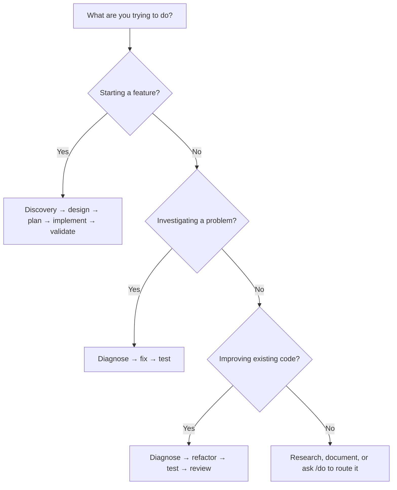
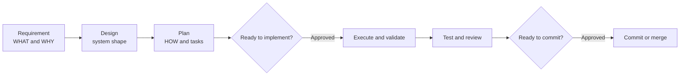

# Guide

Use this page to choose a workflow. Use [Reference](reference.md) when you need an exact command or capability.

## Choose a path


```mermaid
flowchart TD
    A[What are you trying to do?] --> B{Starting a feature?}
    B -->|Yes| C[Discovery → design → plan → implement → validate]
    B -->|No| D{Investigating a problem?}
    D -->|Yes| E[Diagnose → fix → test]
    D -->|No| F{Improving existing code?}
    F -->|Yes| G[Diagnose → refactor → test → review]
    F -->|No| H[Research, document, or ask /do to route it]
```

## Deliver a feature

Choose the guided path when the request needs requirements, design decisions, or multiple implementation steps.

### The spec-driven workflow

DoFlow treats feature delivery as a sequence of durable specifications, not one long chat. Each phase writes an artifact under `agent-docs/doflow/<feature-slug>/`; the next phase reads that artifact rather than relying on conversation memory.


```mermaid
flowchart LR
    R[Requirement\nWHAT and WHY] --> D[Design\nsystem shape]
    D --> P[Plan\nHOW and tasks]
    P --> G{Ready to implement?}
    G -->|Approved| I[Execute and validate]
    I --> V[Test and review]
    V --> C{Ready to commit?}
    C -->|Approved| M[Commit or merge]
```

| Phase | Command | Artifact | It answers |
|---|---|---|---|
| Discover | `/do-brainstorm` | `requirement.md` | What problem are we solving, for whom, and why? |
| Design | `/do-design` | `design.md` | What system shape, interfaces, and decisions satisfy the requirement? |
| Plan | `/do-plan` | `plan.md` | How will work be broken into dependency-ordered, verifiable tasks? |
| Execute | `/do-execute-plan` | Checked tasks and `state.md` | What is complete, what is next, and what blocked progress? |
| Validate | `/do-test`, `/do-code-review` | Test and review results | Does the implementation meet the agreed specification? |

The three specifications are deliberately different. Do not put implementation tasks into `requirement.md`, or repeat design decisions in `plan.md`; update the artifact that owns the decision.

### Gates and review points

`/do-flow` advances through phases automatically, but pauses where human judgment matters:

1. **Clarification gate:** resolve any remaining requirement ambiguity before design.
2. **Implementation gate:** review `requirement.md`, `design.md`, and `plan.md` before code changes. The prerequisite gate also prevents implementation when any of those files is missing.
3. **Commit gate:** review test and code-review results before using `/do-git` to commit or merge.

Use this as the normal path for a new feature:

```bash
/do-brainstorm "add team invitations"
/do-design "team invitation flow"
/do-plan
/do-execute-plan --dry-run
/do-execute-plan --scope next
/do-test
/do-code-review
/do-git save
```

Or use the lifecycle intents for git operations:

```bash
/do-git ship          # Ship current feature to integration
/do-git release       # Full release with version bump, tag, and merge
/do-git hotfix <id>   # Create and propagate a hotfix across all branches
```

`/do-flow "add team invitations"` coordinates the same path and pauses at its approval gates. Use it when one feature should progress through the full delivery sequence.

### Resume a generated plan

The plan and its checklist are the source of truth once planning is complete. `state.md` records progress so a later session can resume without reconstructing the work from chat history.

```bash
/do-execute-plan --dry-run
/do-execute-plan --scope resume
/do-execute-plan --scope phase:2
```

Stop and update the requirements or design if a dependency, decision, or validation result makes the plan invalid.

### Start or resume with one command

`/do-flow` detects the active feature and starts at the first missing specification. It begins with discovery for a new feature, creates a design when only a requirement exists, creates a plan when design is the missing artifact, and asks for implementation approval when the specification set is complete.

```bash
# Start a new spec-driven feature
/do-flow "add team invitations"

# Continue an existing feature from its first incomplete phase
/do-flow

# Deliberately rerun a phase after a material change
/do-flow --from design
```

## Investigate a bug

Start with diagnosis. A fix is an explicit next step, not an assumption.

```bash
/do-diagnose "login returns 500 after password reset" --focus quality
/do-diagnose src/auth.ts --focus security
/do-test
/do-git save
```

## Improve code deliberately

Use diagnosis to establish the root cause or audit scope, then improve only the agreed scope.

```bash
/do-diagnose src/ --focus quality
/do-test
/do-code-review
```

For parallel task orchestration, `do-execute-plan` automatically isolates write-sets across specialist subagents.

## Research before committing to a design

Keep current or uncertain external knowledge separate from implementation work.

```bash
/do-document "current OAuth 2.1 authorization-code guidance" --type research
/do-design "OAuth login for this application"
/do-execute-plan --scope next
```

Research produces evidence; it does not replace a design decision or validation.

During an active feature run, a stage can open a `research-request` only for a specific external fact it cannot establish locally, or when you explicitly ask for research. The question and results stay under the feature task ID; a blocking unanswered question keeps its dependent stage open. Web search addresses broader current questions, while Context7 addresses version-specific library documentation when the harness has those tools. An unavailable provider leaves a stated gap, not an invented answer. Outbound queries omit private repository content unless you approve the exact disclosure. This does not add a seventh feature stage or waive implementation, commit, or merge approval.

```bash
# Inspect the active feature's research questions and their status
doflow research-request --action list --task-id <feature-slug> --json
```

The feature stage ordinarily manages open/resolve actions and source evidence itself; run the standalone `/do-document ... --type research` workflow when the question is not part of an active feature.

## Write and maintain documentation

Use documentation work as a focused task, then build the site when repository documentation changes.

```bash
/do-document "document the billing API" --type api
mkdocs build --strict
```

For this repository, keep one canonical home for each topic: installation in [Setup](setup.md), workflows here, complete lookup material in [Reference](reference.md), and system concepts in [Overview](overview.md).

## Keep track of what is left

A feature rarely finishes everything it found. The lifecycle loop gives deferred work one place to
live, so the next feature can start from it instead of from someone's memory.

- **Follow-ups are recorded when work is deferred.** A stage that leaves something undone records it with its one-line statement and where it came from.
- **The next feature starts from them.** Discovery shows the open follow-ups before it asks you anything; you pick the ones the new feature takes, and DoFlow marks them taken by that feature.
- **A follow-up can become an intent.** Promoting one or more items creates a new intent file that names them, and each promoted item shows the intent it went to.
- **A release finishes what it shipped.** After you tag a release, `lifecycle release --confirm` records which features it carried; those features, and the follow-ups they took, become done. The release ritual previews it for you before the tag.
- **Problems in the product can be reported.** A report is an open follow-up with a body that stays on your machine.
- **Goals are optional.** A goal is one outcome with a checklist; a feature may serve one, and no feature has to.
- **`/do maintain` goes through everything open.** It lists reports, open follow-ups and (in the DoFlow repository) DoFlow's own captured failures, and you settle each one: keep, dismiss, promote, start a fix, or mark done.

DoFlow proposes and you decide. A goal is closed only when you say so, and an item is dismissed only with a reason you give.

### Where it is stored

Everything lives under `.doflow/state/lifecycle/` at the root of your repository, as one small JSON file per change. The store is local to this machine and not shared: DoFlow never stages, commits or pushes it and adds no ignore rule for it. Linked worktrees share the store of the main working tree.

Earlier versions kept the store in `agent-docs/lifecycle/events/`. The first `followup`, `lifecycle`, `goal` or `failure --action settle --as imported` command in a repository that still has that folder copies it once into the new location, and leaves the old folder exactly as it was. The copy then writes `.doflow/state/lifecycle/migrated.json`, a marker that tells every later command the store is in place, so the old folder is never read again, even after retention empties the store; a new store that already holds events gets the marker without a copy. The line saying the old folder is no longer read and can be deleted repeats on every one of those commands for as long as the folder exists. If the copy fails, the command exits 1 with `store-migration-failed`, changes nothing, writes no marker, and the next command tries again.

Nothing is deleted unless you ask for it. Set `DOFLOW_RETENTION_HOURS` to a positive whole number of hours and each of those commands removes the files of settled follow-ups (done or dismissed) and settled goals (done) whose newest event is older than that. Open, taken and unfinished items are never removed, and neither are feature or release records. A removal prints one line on stderr, such as `retention: removed 3 event files older than 720 h` (the count is not pluralised, so one file reads `removed 1 event files`). An unset or empty value keeps everything; a value that is not a positive whole number prints a warning, removes nothing and lets the command run. Only the lifecycle store is cleaned: run state under `.doflow/state/` and the old `agent-docs/lifecycle/` folder are never touched.

The machine-local pieces are kept outside the repository, under `${XDG_CONFIG_HOME:-$HOME/.config}/doflow/`:

| What | Where | Sent anywhere |
|---|---|---|
| Failures DoFlow captured about itself | `failures/` | Never. Recorded on this machine only |
| The full body of a report | `reports/` | Never. The project store keeps only the id, a masked excerpt and the size |

Secrets are masked before anything is written, on a best-effort basis: it is a safeguard, not a guarantee, so do not paste credentials into a report.

### Failure capture and its off switch

When a DoFlow command ends in an internal error, or the dispatcher or a guard hook crashes, DoFlow appends one masked line to a file on this machine. A bad flag, a refusal, a hook that denies a command, a missing `jq` and a missing `bash` are not recorded. Some environment errors, such as a permission error on a folder or a missing program, are recorded because they look like internal errors; `/do maintain` lets you settle them as noise. Capture never changes a command's output or exit status. Turn it off with:

```bash
doflow failure --action capture --set off      # creates the file `off` in the failures folder
doflow failure --action capture --set on       # removes it
DOFLOW_FAILURE_CAPTURE=off doflow ...          # off for one command or shell; cannot turn capture on over the file
```

Failures are for the people who maintain DoFlow: inside the DoFlow repository, `/do maintain` lists new and regressed entries and lets you import one as a follow-up. Elsewhere they are only listed by `doflow failure --action list`.

### The /do suggestion and its off switch

On Claude Code and Codex, the first prompt of a session that reads as a plain code-change request
(for example "add a retry to src/upload.js") gets a one-sentence suggestion from the model that `/do`
would classify the task and apply DoFlow's checks. The model then does what you asked. It happens at
most once per session, and only when no `/do-*` skill is already in use. It is advisory and
keyword-based, so it can miss a request or fire on one that is not a change request. The other
harnesses get no such hook; their skill descriptions steer a plain change request to `/do`. To turn it
off for one project or for yourself:

```bash
echo off > .doflow/prompt-nudge                                        # this project, from the repo root
mkdir -p "${XDG_CONFIG_HOME:-$HOME/.config}/doflow" && echo off > "${XDG_CONFIG_HOME:-$HOME/.config}/doflow/prompt-nudge"   # every project, this user
```

Use `on` in place of `off` to turn it back on. If both files exist, the project file wins, even when
the user file says the opposite. A file that is empty, unreadable or holds any other word counts as
`off`. Whether the project file is committed or ignored is up to the project's own rules: commit it to
switch the nudge off for everyone on the repository, or add it to `.gitignore` to keep the choice
personal. The setting changes only the nudge, not the first-prompt Git context or any other hook.

### A worked example

This was run in a scratch repository with a `develop` branch, a `v1.0.0` tag and empty feature folders under `agent-docs/doflow/`. The agent runs the same verbs through `doflow-run`; `doflow` is the same command for you. Item ids are random, so yours will differ.

Feature `010-search` is tracked and, during review, leaves two follow-ups. Then it merges.

```console
$ doflow lifecycle --action init --slug 010-search
010-search: tracked new
$ doflow followup --action add --slug 010-search --stage review --statement "Search ignores accents in the query"
added FU-88ggkq (stage 010-search review): Search ignores accents in the query
$ doflow followup --action add --slug 010-search --stage review --statement "Search index is rebuilt on every start"
added FU-w1as7v (stage 010-search review): Search index is rebuilt on every start
```

The next feature starts from the overview, then takes the first item:

```console
$ doflow lifecycle
discovery overview: 2 open follow-ups, 2 shown (release mode tagged, integration ref develop)
  FU-88ggkq  (stage 010-search review, 2026-10-03)  Search ignores accents in the query
  FU-w1as7v  (stage 010-search review, 2026-10-03)  Search index is rebuilt on every start
awaiting release: 010-search
next: Take items into the new feature when its folder exists: doflow-run lifecycle --action init --slug <slug> --take FU-88ggkq
$ doflow lifecycle --action init --slug 011-accents --take FU-88ggkq
011-accents: tracked new, took FU-88ggkq
$ doflow followup --action list --state taken
FU-88ggkq  taken by 011-accents  (stage 010-search review, 2026-10-03)  Search ignores accents in the query
```

Both features merge into `develop`. Before the tag exists, `release` is a preview and writes nothing; after `git tag v1.1.0`, `--confirm` records it:

```console
$ doflow lifecycle --action release --tag v1.1.0
preview of release v1.1.0 (previous v1.0.0, bound develop)
  ships 010-search  (branch feat/010-search)
  ships 011-accents  (branch feat/011-accents)
follow-ups done: FU-88ggkq
next: After git tag v1.1.0: doflow-run lifecycle --action release --tag v1.1.0 --confirm (add --feature <slug> for a feature listed under notDetected that shipped)
$ doflow lifecycle --action release --tag v1.1.0 --confirm
recorded release v1.1.0 (previous v1.0.0, bound v1.1.0)
  ships 010-search  (branch feat/010-search)
  ships 011-accents  (branch feat/011-accents)
follow-ups done: FU-88ggkq
$ doflow followup --action list --state all
FU-88ggkq  done by 011-accents  (stage 010-search review, 2026-10-03)  Search ignores accents in the query
FU-w1as7v  open  (stage 010-search review, 2026-10-03)  Search index is rebuilt on every start
```

A user reports a problem, and `/do maintain` starts from the overview (here `FU-2sb0xv` is the report):

```console
$ doflow followup --action report --release v1.1.0 --statement "Search crashes on an empty query" --text "TypeError: query is undefined at search.js:12"
reported FU-2sb0xv (report v1.1.0): Search crashes on an empty query
  body on-this-machine (45 bytes), excerpt 45 bytes, 0 values masked
next: Settle it now or at /do maintain; to start a fix, route it as a bug run
$ doflow lifecycle --maintain
maintain overview: 2 open follow-ups, 2 shown (release mode tagged, integration ref develop)
  FU-2sb0xv  (report v1.1.0, 2026-10-03)  Search crashes on an empty query
  FU-w1as7v  (stage 010-search review, 2026-10-03)  Search index is rebuilt on every start
finished: 010-search, 011-accents
pending: 2
next: Take items into the new feature when its folder exists: doflow-run lifecycle --action init --slug <slug> --take FU-2sb0xv
next: Keep open: doflow-run followup --action settle --ids FU-2sb0xv --as kept --reason "<why it stays>" --channel question
next: Dismiss: doflow-run followup --action settle --ids FU-2sb0xv --as dismissed --reason "<why>" --channel question
next: Promote to a new intent: doflow-run followup --action promote --ids FU-2sb0xv --title "<intent title>" --channel question
next: Start a fix: doflow-run followup --action settle --ids FU-2sb0xv --as fix --reason "<where it is routed>" --channel question
next: Done outside a feature: doflow-run followup --action settle --ids FU-2sb0xv --as done --evidence "<what shows it>" --channel question
```

`/do maintain` asks you about each item and runs the matching line. Here the report is dismissed and the other item is promoted, which creates `agent-docs/intent/search-startup-speed.md` and lets the next feature start from it:

```console
$ doflow followup --action promote --ids FU-w1as7v --title "Search startup speed" --channel question
created agent-docs/intent/search-startup-speed.md from FU-w1as7v
$ doflow followup --action settle --ids FU-2sb0xv --as dismissed --reason "cannot reproduce" --channel question
settled FU-2sb0xv as dismissed
$ doflow lifecycle --action init --slug 012-startup --intent agent-docs/intent/search-startup-speed.md
012-startup: tracked new, took FU-w1as7v
```

A goal records an outcome and a checklist, and only you close it:

```console
$ doflow goal --action add --goal fast-search --statement "Search feels instant" --item "Accents work" --item "Index is cached"
added goal fast-search: Search feels instant
  C1  Accents work
  C2  Index is cached
next: Link a feature that serves it: doflow-run goal --action link --goal fast-search --slug <slug>
next: Record a met item with evidence: doflow-run goal --action check --goal fast-search --item C1 --evidence "<what shows it>"
$ doflow goal --action link --goal fast-search --slug 011-accents
011-accents now serves fast-search
$ doflow goal --action check --goal fast-search --item C1 --evidence 011-accents
fast-search C1: met (011-accents); 1/2 items met
next: Record a met item with evidence: doflow-run goal --action check --goal fast-search --item C2 --evidence "<what shows it>"
$ doflow goal --action done --goal fast-search --channel default
not-user: only the user marks a goal done: pass --channel question, gate or prompt once the user has said so (got 'default'). Nothing was written.
$ doflow goal --action done --goal fast-search --channel question --reason "caching is out of scope"
fast-search is done with C2 unmet: caching is out of scope
```

### Limits worth knowing

- A merge git cannot show (a squash, a rebase, a fast-forward or a cherry-pick) is not detected as shipped. List the feature with `--feature <slug>` when you record the release, or confirm the merge with `doflow lifecycle --action merged --slug <slug> --reason "<line>"`.
- Features created before the loop existed keep working as they did; their earlier follow-ups are not collected.
- The loop runs on all eight harnesses, in every scope where the harness gets skills: installing any one of them projects the DoFlow runtime. Antigravity has no skills at global scope, so install it per project. `doflow doctor` shows which harnesses reach the runtime.

## Work across supported tools

| Environment | Start point | What to expect |
|---|---|---|
| Claude Code | `/do` or a named skill | Native instructions, skills, hooks, and MCP after verification |
| Codex | Read `AGENTS.md`, then use installed skills | Native settings/MCP/hook behavior requires trust and hook review |
| Gemini CLI | Read `GEMINI.md`, then use installed skills | Skills and instructions are native; unavailable hooks/scripts/templates are reported, not emulated |
| OpenCode · Pi · Copilot CLI · Kiro · Antigravity | Read the projected instruction file (`AGENTS.md`, steering files, or `.github/copilot-instructions.md`), then use installed skills | Each harness gets its documented native surfaces; everything else is guidance projection |

The same shared sources drive every installation, but adapters render them into native target
formats — eight of them today. Tool-specific behavior, activation prerequisites, and per-harness
differences are in the [capability map](capability-map.md) and [Setup](setup.md).
