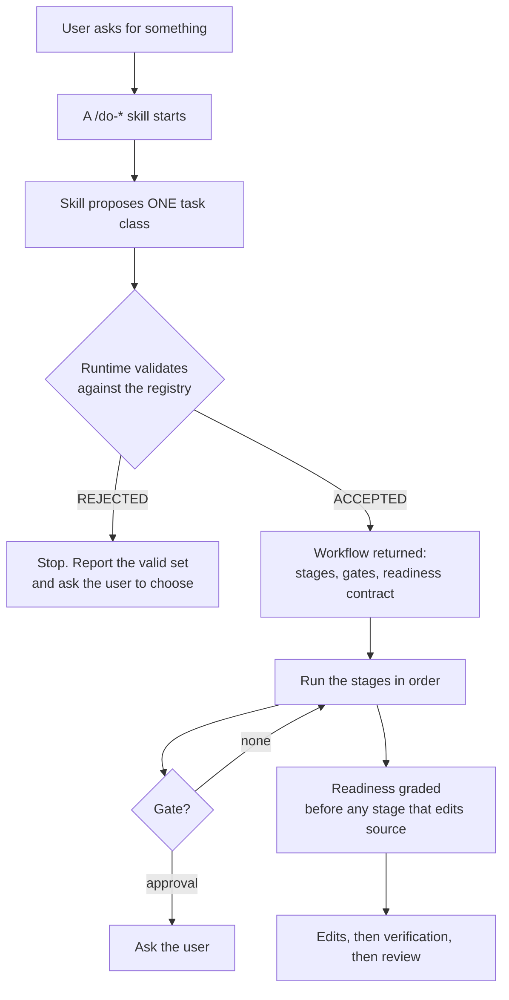

# How DoFlow works

DoFlow gives an AI coding agent a **declared procedure** for a piece of work, instead of letting it
decide the procedure as it goes. The agent proposes what kind of task this is; a runtime validates
that proposal against a registry and hands back the stages, gates and contracts that apply. From
that point the run has a plan of record that neither the agent nor the user has to hold in memory.

This page describes the machinery. For where the code lives, see
[Architecture](architecture.md); for the per-skill surface, see [Reference](reference.md).

## The shape of a run

Two properties matter more than the diagram. **The class is proposed by the model and validated by
the runtime, never chosen by the runtime.** And **the validation checks two things**: that the class
exists, and that the skill asking is actually a stage in that class's workflow. A skill can be
refused for a class that is perfectly correct, because that class does not route through it.

## The nine task classes

Declared in `core/registry/workflows.yaml`. Stages name skills that already exist; the registry adds
none.

| Class | Stages | Gates | Readiness |
|---|---|---|---|
| `feature` | discovery → design → planning → implementation → verification → review | 3 | `feature` |
| `bug` | reproduction → root-cause → implementation → regression-verification → review | — | `bug` |
| `refactor` | architecture-mapping → baseline-verification → implementation → verification → review | — | `refactor` |
| `dependency-change` | release-evidence → usage-impact → implementation → verification → review | — | `dependency-change` |
| `trivial-edit` | implementation → verification | — | `trivial-edit` |
| `documentation` | authoring → verification → review | — | — |
| `operations` | state-check → preflight → execution → record | — | — |
| `review` | verification → review | — | — |
| `research` | scoping → synthesis | — | — |

The differences between them are the point. `feature` is the only class with a discovery stage, and
the only one that demands three artifacts before an edit. `refactor` has no discovery stage at all —
refactoring starts from code that already exists, so its first stage *maps* the system rather than
eliciting requirements. `refactor` also has no planning stage. `review` has no implementation stage
by construction, and `research` requires no implementation readiness, because neither authors source.

A class whose stages never mutate source declares no readiness template. That is not an omission:
there is no source edit for a contract to gate.

## Stages have kinds

Every stage declares a `kind`, and the kind decides what the stage may do.

| Kind | What it does | Mutates source |
|---|---|---|
| `discovery` | Elicit requirements through dialogue | no |
| `analysis` | Map existing structure, behaviour, root cause, or blast radius | no |
| `design` / `planning` | Decide system shape, then decompose into ordered tasks | no |
| `implementation` | Author or modify source | **yes** |
| `verification` | Run builds, suites and coverage against the tree as it stands | no |
| `review` | Assess a change and report findings; produces judgement, not edits | no |

`implementation` is the only kind that mutates the tree, and therefore the only kind a readiness
template can gate.

## Gates

A gate pauses the run between stages. Only `feature` declares any:

| Gate | After | Trigger | Asks |
|---|---|---|---|
| `gate-0` | discovery | unresolved clarifications | Resolve every open marker before design starts |
| `gate-a` | planning | always | The three artifacts are ready — proceed to implementation? |
| `gate-b` | review | always | Review is complete — proceed to commit and merge? |

`feature` additionally carries a hard hook, keyed on branch and artifact state, that blocks source
edits until its three artifacts exist — regardless of which skill is doing the editing.

## Readiness is four states, never a score

Before a stage that edits source, the runtime grades the task against its class's template from
`core/registry/readiness-templates.yaml`. The verdict is one of exactly four states:

| State | Meaning |
|---|---|
| `READY` | Every mandatory prerequisite is satisfied |
| `NEEDS_EVIDENCE` | The contract is understood; the prerequisites are not yet established |
| `NEEDS_USER_DECISION` | A decision is owed by the user |
| `BLOCKED` | A claim on this task is `conflicted` — its evidence disagrees with itself |

There is no fifth state, no partial state, and no numeric or percentage rendering of any of them.
The engine fails closed: a requirement it cannot evaluate reads as unmet.

Five classes have a template:

| Class | Requirements |
|---|---|
| `feature` | `scope_clear`, `affected_components`, `verification_plan` |
| `bug` | `reproduction`, `affected_code`, `root_cause`, `blast_radius`, `regression_verification` |
| `refactor` | `architecture_mapped`, `invariants_captured`, `baseline_tests`, `blast_radius` |
| `dependency-change` | `compatibility_checked`, `usage_impact`, `verification_command` |
| `trivial-edit` | `target_identified`, `scope_verified` |

Three different inputs satisfy them, and **knowing which one moved a verdict is the difference
between a contract that was met and one that was described as met**:

- **Recorded evidence** satisfies requirements that declare evidence kinds.
- **A supported claim** satisfies `root_cause`, the one requirement that demands one.
- **A caller-stated profile** satisfies the rest. These are reported separately, because nothing
  backs them but the statement.

## Evidence and claims

A stage records what it observed as an evidence batch — one pass at the stage boundary, never one
call per fact. Each item carries a `kind`, a `source`, a locator or content, and a **provenance**
that is `extracted`, `inferred`, or `asserted`, with no default. An unstated provenance is refused
rather than filed as repository fact.

The rule that does the most work: `generated-analysis` and `user-statement` can never be
`extracted`. That pairing is precisely how a reading of the evidence stops being distinguishable
from the evidence.

Conclusions are added as **claims**, stored as hypotheses. A claim becomes `supported` only by
linking evidence the ledger actually holds — a link naming an unknown id is refused, not graded. A
claim carrying both fresh support and fresh contradiction becomes `conflicted`, which is what makes
readiness report `BLOCKED`.

Relevance is not confidence. A match count, a ranking or a best hit is a property of the query, not
of the fact; the ledger records locators, never scores.

## Verification scales with risk

`core/registry/verification.yaml` declares nine check tiers in a fixed order —
`parse`, `build`, `static-analysis`, `targeted-tests`, `broad-tests`, `structural-invariants`,
`requirement-satisfaction`, `change-scope`, `model-review` — and four risk levels (`LOW`, `MEDIUM`,
`HIGH`, `CRITICAL`) that select how many of them a change must clear. The risk level also sets the
bound on how many times a failed check may be retried; the runtime classifies the failure and
returns the action, so no agent picks its own retry count.

## One seam between skills and the runtime

Every runtime call a skill can make goes through a single dispatcher,
`core/shared/scripts/doflow/bin/doflow-run`, which owns the whole verb namespace and decides per
verb whether a shell helper or a `bin/doflow.js` command serves it. Skills never name a helper and
never name a verb's implementation, so a verb can move between the two arms without any caller
changing.

A skill reaches the dispatcher by walking up from the working directory, then falling back to the
user's home install. Never by a repo-relative path — a relative path in a shell command resolves
against the user's project root, not the skill's directory.

## What this buys

The machinery exists so that a run's decisions survive the agent that made them.

- A class the runtime rejected cannot be quietly substituted for a more convenient one.
- A stage that edits source cannot start on the assumption that prerequisites will work out.
- What was measured stays distinguishable from what was stated, in the ledger and in the report.
- Where a run stopped is read from a record, not reconstructed from a transcript — so a session
  that is compacted, interrupted or resumed by a different agent picks up from artifacts and
  `git log` rather than from memory.

None of it prevents a wrong decision. It makes the decision, its basis and its author legible
afterwards, which is the property that survives the conversation.
