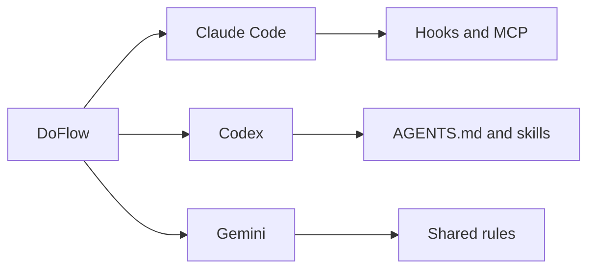

# DoFlow

DoFlow gives AI coding tools a shared engineering operating model: reusable workflows, specialist
guidance, and guardrails that stay close to the repository.

## What you get

| Capability | Purpose |
|---|---|
| Skills | Structured workflows for planning, implementation, testing, review, and research |
| Agents | Focused perspectives for security, architecture, quality, and diagnosis |
| Rules | Consistent safety, workflow, quality, and question-handling expectations |
| Hooks | Claude Code session context and command safety controls |

## Documentation map

| Page | Use it for |
|---|---|
| [Quickstart](quickstart.md) | First installation and first workflow |
| [Setup](setup.md) | CLI, installation scope, updates, backup, rollback, and tool mapping |
| [Overview](overview.md) | Diagrams of context, lifecycle, and component relationships |
| [Guide](guide.md) | Feature, bug, quality, research, and documentation workflows |
| [Reference](reference.md) | Skills, agents, hooks, MCP servers, flags, and rules |
| [Architecture](architecture.md) | Repository structure and contributor-facing deployment design |
