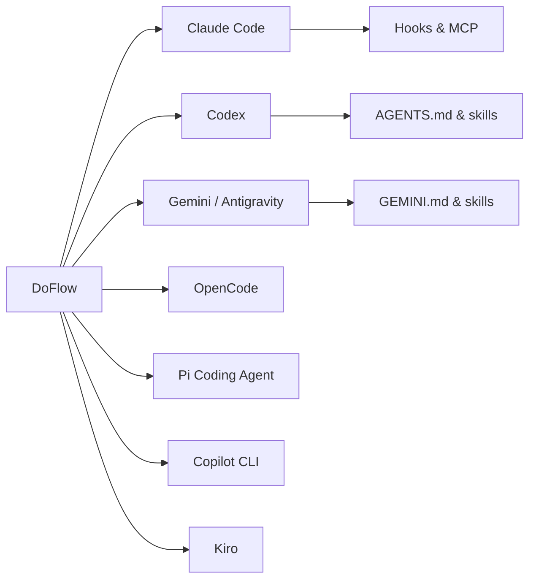

# DoFlow

DoFlow gives AI coding tools a shared engineering operating model: reusable workflows, specialist
guidance, and guardrails that stay close to the repository.

```mermaid
flowchart LR
    D[DoFlow] --> C[Claude Code]
    D --> X[Codex]
    D --> G[Gemini / Antigravity]
    D --> O[OpenCode]
    D --> P[Pi Coding Agent]
    D --> CP[Copilot CLI]
    D --> K[Kiro]
    C --> H[Hooks & MCP]
    X --> S[AGENTS.md & skills]
    G --> R[GEMINI.md & skills]
```

## What you get

| Capability | Purpose |
|---|---|
| Skills | Structured workflows for planning, implementation, testing, review, and research |
| Agents | Five specialist archetypes: spec analysis, system architecture, implementation, quality, and research |
| Rules | Consistent safety, workflow, quality, and question-handling expectations |
| Hooks | Claude Code session context and command safety controls |

## Documentation map

| Page | Use it for |
|---|---|
| [Quickstart](quickstart.md) | First installation and first workflow |
| [Setup](setup.md) | CLI, installation scope, updates, backup, rollback, and tool mapping |
| [Overview](overview.md) | Diagrams of context, lifecycle, and component relationships |
| [How DoFlow works](how-doflow-work.md) | Declared execution procedure, 9 task classes, gates, and readiness contracts |
| [Guide](guide.md) | Feature, bug, quality, research, and documentation workflows |
| [Reference](reference.md) | Skills, runtime commands, agents, and git lifecycle intents |
| [Flags](flags.md) | Flag-first cross-index of all skill options and parameters |
| [Capability Map](capability-map.md) | What each harness supports, and where it differs |
| [Architecture](architecture.md) | Repository structure and contributor-facing deployment design |
