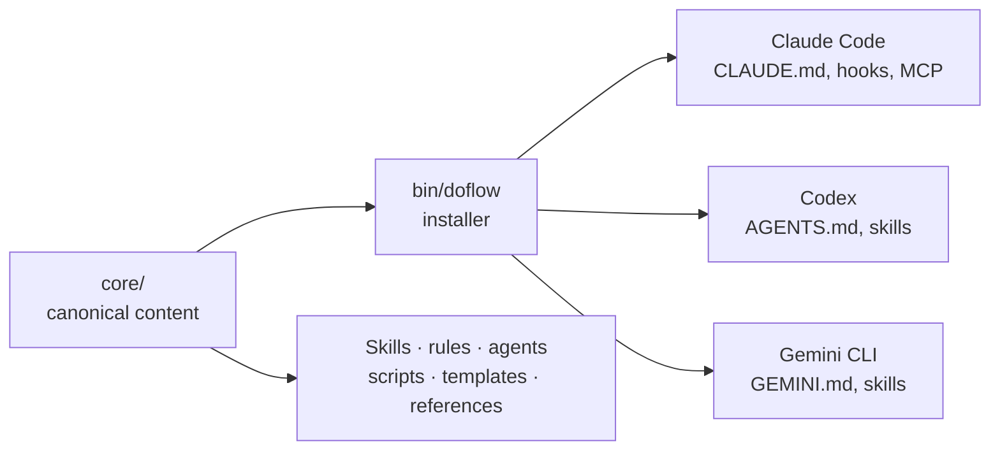
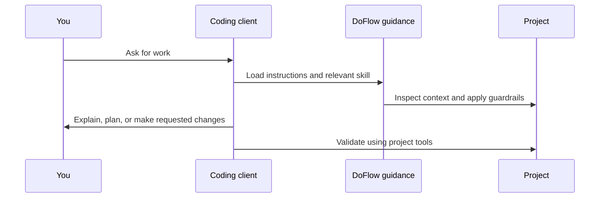
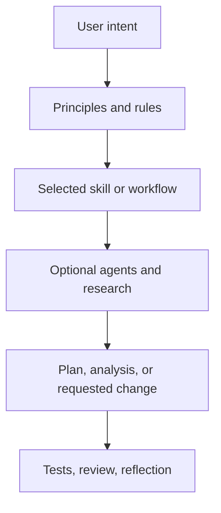
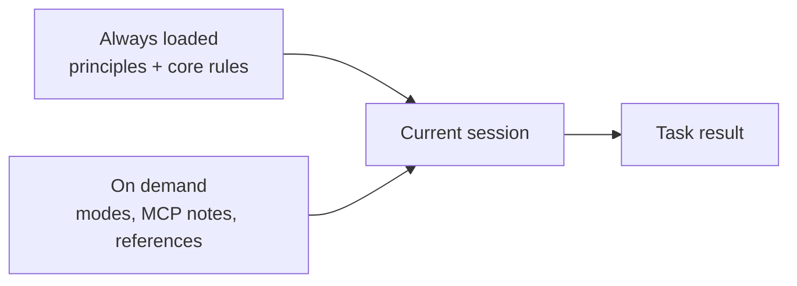

# Overview

DoFlow keeps one source configuration and projects the parts each AI coding environment can use. This page explains the system; [Setup](setup.md) explains how to install it.

## The component model

The `core/` directory owns reusable content. `bin/` and `src/` decide where that content belongs for each supported client. This separation makes it possible to change a skill or rule once and distribute it consistently.

## What happens in a session

The client decides how to execute work. DoFlow supplies shared guidance, task workflows, and—where the client supports them—hooks and MCP registrations.

## Capability boundaries by client

| Capability | Claude Code | Codex | Gemini CLI |
|---|---|---|---|
| Base instructions | Yes | Yes | Yes |
| Skills | Yes | Yes | Yes |
| Agents, scripts, templates, references | Yes | Yes | Yes |
| Hook configuration | Yes | No file-based installer support | No file-based installer support |
| MCP registration from DoFlow | Yes | No file-based installer support | No file-based installer support |
| Plugin manifest distribution | N/A | Available in `core/.codex-plugin/` | N/A |

“No file-based installer support” means the source is not copied as a client configuration file. It does not prevent that client from using its own native extension or connector system.

## Workflow layers

The layers have different jobs:

| Layer | Role |
|---|---|
| Principles and rules | Set non-negotiable collaboration, safety, workflow, and quality expectations |
| Skills | Define focused repeatable workflows |
| Agents | Provide a named expert lens when a workflow benefits from one |
| Scripts and hooks | Automate guardrails in environments that support them |
| Templates and references | Keep repeated deliverables consistent without putting everything in the active prompt |

## Memory without prompt bloat

DoFlow separates always-needed instructions from material that is only useful for a specific kind of work.

This keeps the default context small while retaining a discoverable home for deeper guidance. The installed instruction file points to optional resources instead of copying them into every session.

## Where to go next

- New installation: [Quickstart](quickstart.md) or [Setup](setup.md)
- Choosing a task flow: [Guide](guide.md)
- Looking up a capability: [Reference](reference.md)
- Changing DoFlow itself: read [Architecture](architecture.md)
