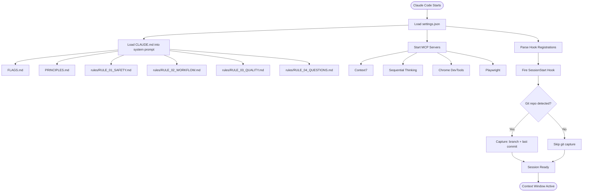
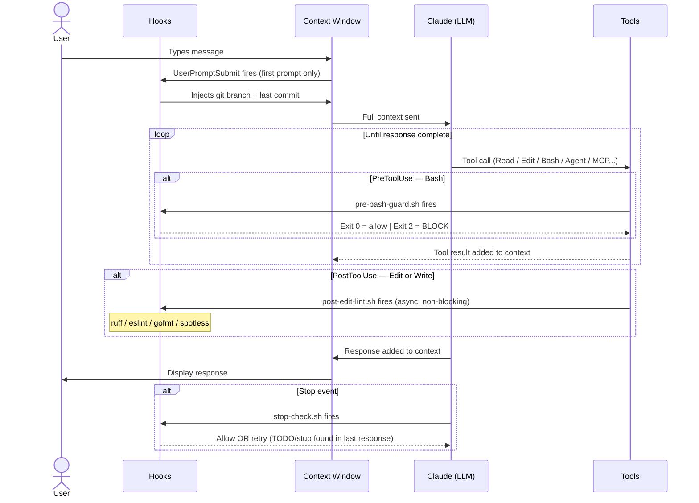
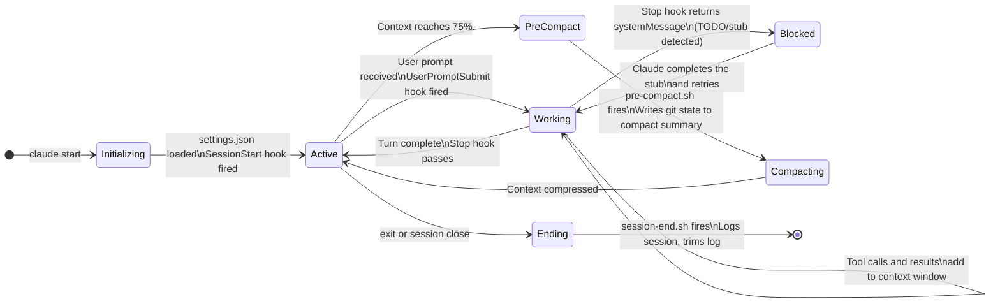
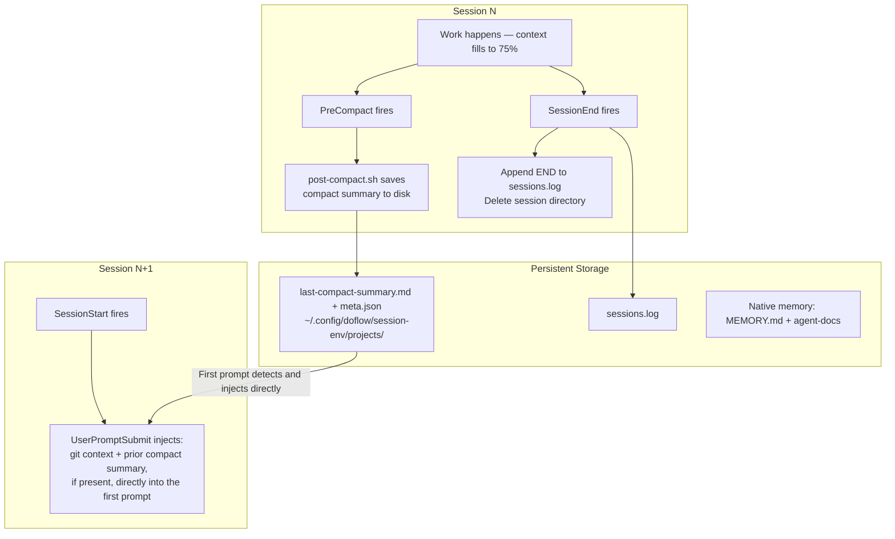

# Overview

How the framework's components — hooks, agents, skills, and MCP servers — fit together.

---

## Two Context Horizons

Every AI session has two layers of memory that operate at different timescales:

| Horizon | Scope | Managed By | Survives Session? |
|---------|-------|------------|-------------------|
| **Short-context** | Active conversation window | LLM token budget (auto-compacted at 75%) | No |
| **Long-context** | Cross-session persistence | Files on disk, native memory (MEMORY.md + agent-docs) | Yes |

Hooks bridge these two horizons. `SessionStart` captures state to disk, `UserPromptSubmit` injects lightweight context plus the prior session's compact summary directly on the first prompt, and compaction hooks preserve those summaries to disk for the next session to read.

---

## Session Initialization Flow

What happens when Claude Code opens:



**Always in context** (every session): `FLAGS.md`, `PRINCIPLES.md`, and `rules/*.md`. Git state enters on the first prompt through `UserPromptSubmit`.

**Not auto-loaded** (on-demand): behavioral modes, MCP documentation, reference files, agents (instantiated on demand).

---

## Per-Turn Context Building

How context grows with each user message:



---

## Session Lifecycle States



---

## Cross-Session Memory

How state persists from one session to the next:



**Default behavior**: Sessions start with lightweight git context, plus the prior session's compact summary automatically injected on the first prompt if one exists on disk — no manual restore command needed.

---

## Agents vs Skills vs Modes

| Mechanism | How It Enters Context | Cost | Use When |
|-----------|----------------------|------|----------|
| **Skill** (`/do-*`) | Skill prompt expanded inline | Medium | Structured workflows |
| **Agent** (`Agent` tool) | Only return message in main context | Low | Parallel work, large tasks |
| **Mode** (manual Read) | Full `MODE_*.md` file loaded | High | Session-wide behavioral change |
| **MCP call** | Tool result injected | Varies | Library docs, code analysis |
| **Hook injection** | `additionalContext` at prompt | Very low | Ambient metadata (git state) |

**Subagent efficiency:** When a skill uses `Agent` tool delegation, the main session's context only grows by the size of the subagent's *return message* — not its full working context. This is why `--delegate` protects the main window on large operations.

---

## Context Budget

```
Total context budget: ~200K tokens (Sonnet 4.6)
Auto-compact threshold: 75% = ~150K tokens consumed

Typical per-session allocation:
├── System prompt (CLAUDE.md + rules + FLAGS + PRINCIPLES): ~8–12K tokens
├── Skill/mode expansions (if loaded): ~5–15K per skill
├── MCP server tool schemas (all 5 servers): ~10–20K tokens
├── Conversation turns: ~2–5K per turn (with thinking tokens)
└── Tool results: ~1–50K per call (varies widely)

At 75% -> PreCompact fires -> context compressed
Summary saved to disk -> next session's first prompt injects it automatically
```
