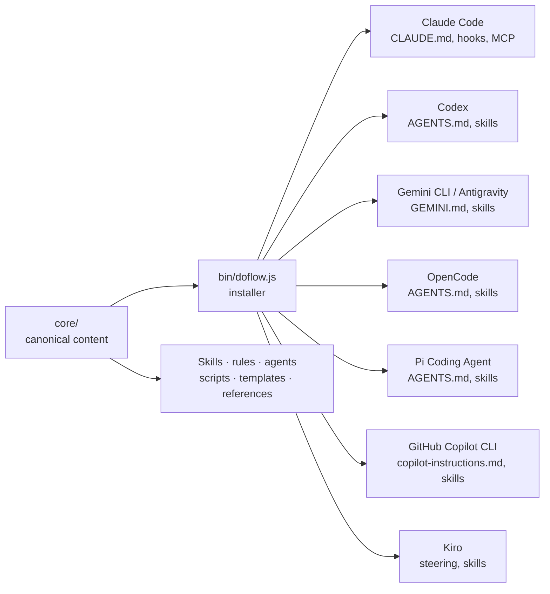
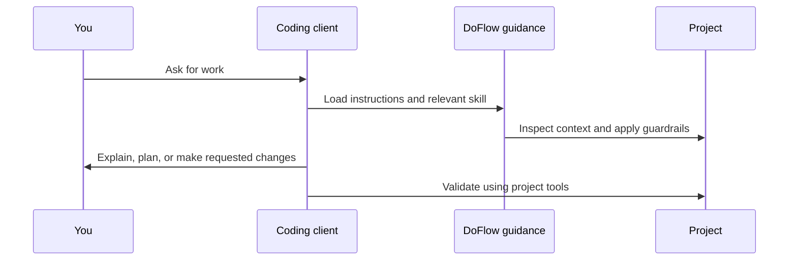
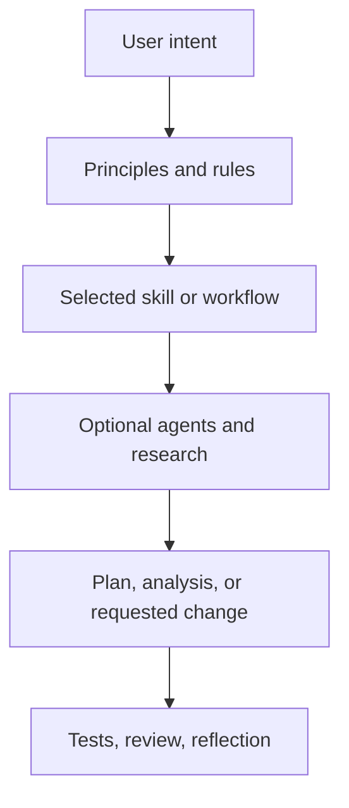
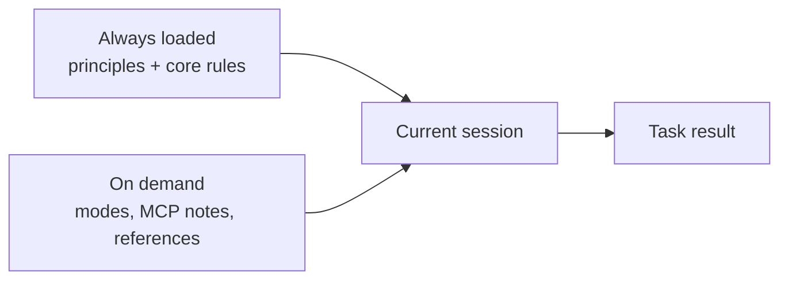

# Overview

DoFlow keeps one source configuration and projects the parts each AI coding environment can use. This page explains the system; [Setup](setup.md) explains how to install it.

## The component model

```mermaid
flowchart LR
    Core[core/\ncanonical content] --> Installer[bin/doflow.js\ninstaller]
    Installer --> Claude[Claude Code\nCLAUDE.md, hooks, MCP]
    Installer --> Codex[Codex\nAGENTS.md, skills]
    Installer --> Gemini[Gemini CLI / Antigravity\nGEMINI.md, skills]
    Installer --> OpenCode[OpenCode\nAGENTS.md, skills]
    Installer --> Pi[Pi Coding Agent\nAGENTS.md, skills]
    Installer --> Copilot[GitHub Copilot CLI\ncopilot-instructions.md, skills]
    Installer --> Kiro[Kiro\nsteering, skills]
    Core --> Content[Skills · rules · agents\nscripts · templates · references]
```

The `core/` directory owns reusable content. `bin/` and `src/` decide where that content belongs for each supported client. This separation makes it possible to change a skill or rule once and distribute it consistently.

## What happens in a session

```mermaid
sequenceDiagram
    participant U as You
    participant C as Coding client
    participant D as DoFlow guidance
    participant P as Project
    U->>C: Ask for work
    C->>D: Load instructions and relevant skill
    D->>P: Inspect context and apply guardrails
    C->>U: Explain, plan, or make requested changes
    C->>P: Validate using project tools
```

The client decides how to execute work. DoFlow supplies shared guidance, task workflows, and—where the client supports them—hooks and MCP registrations.

## Capability boundaries by client

DoFlow now spans seven harnesses: Claude Code, Codex, Gemini CLI / Antigravity, OpenCode, Pi
Coding Agent, GitHub Copilot CLI, and Kiro. Every one of them gets DoFlow's base instructions,
skills, and specialist guidance (agents, scripts, templates, references) in whatever native form
that harness documents — a managed instruction file, a discoverable skills directory, or both.
Hooks, native settings merges, MCP registration, and plugin/marketplace distribution are where the
harnesses diverge the most: some support all of them natively, some support a subset, and a few
have DoFlow project the underlying guidance through instructions or skills instead of a dedicated
native surface.

The full capability matrix — generated from `core/registry/harnesses.yaml` and covering
instructions, skills, agents, scripts, templates, modes, settings, hooks, MCP, and plugin support
across all seven harnesses, plus the per-event hook matrix and per-harness verification and
prerequisite tables — lives in [Capability Map](capability-map.md). This page intentionally does
not repeat that table: DoFlow previously kept two hand-maintained copies of the same matrix, and
they drifted from the registry and from each other. One generated source is kept instead.

Anywhere that matrix marks a plugin/marketplace row as unavailable, it means DoFlow does not
publish a plugin package for that client — not that the client lacks its own native extension
system. Gemini CLI, OpenCode, and Pi, among others, each have one, reached through the file-based
projection above instead of a DoFlow-distributed package.

## Workflow layers

```mermaid
flowchart TB
    Intent[User intent] --> Rules[Principles and rules]
    Rules --> Skill[Selected skill or workflow]
    Skill --> Specialists[Optional agents and research]
    Specialists --> Action[Plan, analysis, or requested change]
    Action --> Verify[Tests, review, reflection]
```

The layers have different jobs:

| Layer | Role |
|---|---|
| Principles and rules | Set non-negotiable collaboration, safety, workflow, and quality expectations |
| Skills | Define focused repeatable workflows |
| Agents | Provide a named expert lens when a workflow benefits from one |
| Scripts and hooks | Automate guardrails in environments that support them |
| Templates and references | Keep repeated deliverables consistent without putting everything in the active prompt |

## Memory without prompt bloat

DoFlow separates always-needed instructions from material that is only useful for a specific kind of work.

```mermaid
flowchart LR
    Always[Always loaded\nprinciples + core rules] --> Session[Current session]
    OnDemand[On demand\nmodes, MCP notes, references] --> Session
    Session --> Output[Task result]
```

This keeps the default context small while retaining a discoverable home for deeper guidance. The installed instruction file points to optional resources instead of copying them into every session.

## Where to go next

- New installation: [Quickstart](quickstart.md) or [Setup](setup.md)
- How execution works: [How DoFlow works](how-doflow-work.md)
- Choosing a task flow: [Guide](guide.md)
- Looking up a capability: [Reference](reference.md)
- Changing DoFlow itself: read [Architecture](architecture.md)
