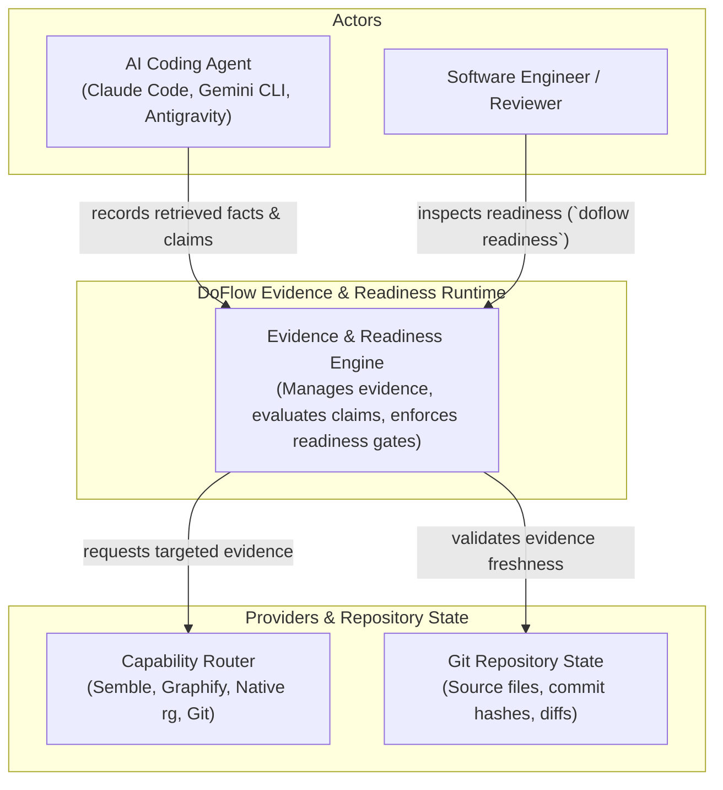
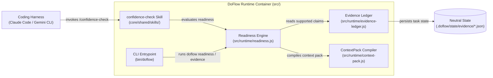
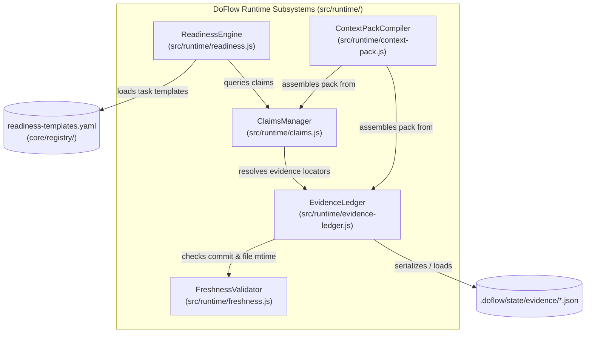
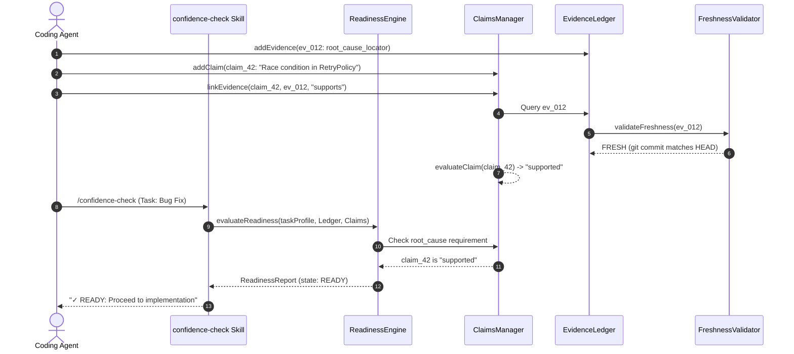

# Design: DoFlow Runtime Evolution — Evidence Ledger & Readiness Contracts

**Feature:** 005-evidence-ledger-readiness · **Requirement:** ./requirement.md · **Status:** Draft · **Created:** 2026-08-14

> System shape — architecture, APIs, data/interface contracts. Reads ./requirement.md.
> Distinct from plan.md's HOW-to-implement; this is HOW-it's-shaped.
>
> Structure follows `references/ARTIFACT_FORMAT.md`: indexed sections carry a table above full
> `**Detail**`, `Status` is only `Live` or `Superseded → <ref>`, and superseded prose moves to §9.

## 1. Architecture Approach

This design establishes the **Evidence & Readiness Subsystem** (Release B of the DoFlow v3 runtime architecture). It introduces structured evidence capture with exact provenance locators, an explicit epistemic claims state machine, an automated evidence freshness invalidator, a budget-aware `ContextPack` compiler, and a deterministic `ReadinessContract` engine for 5 core task classes (Bug, Feature, Refactor, Trivial Edit, Dependency Change).

The subsystem eliminates uncurated raw context dumping and subjective self-graded confidence scores by enforcing that every factual proposition relied on during engineering workflows must trace to verified evidence before implementation begins.

```text
[Retrieved Facts] ──────────► [EvidenceLedger] (provenance + freshness)
                                     │
                                     ▼
[Agent Inferences] ─────────► [ClaimsManager] (hypothesis → supported)
                                     │
                                     ▼
[TaskProfile & Template] ───► [ReadinessEngine] (READY | NEEDS_EVIDENCE | BLOCKED)
                                     │
                              ┌──────┴──────┐
                              ▼             ▼
                         [ContextPack]  [Missing Evidence Actions]
                              │             │
                              ▼             ▼
                      [Coding Agent]  [CapabilityRouter]
```

---

## 2. System Overview (C4)

### C1: System Context

The Evidence and Readiness engine sits between the developer/agent, capability retrieval providers, and repository state.



### C2: Container

DoFlow runtime modules execute in-process within Node.js, persisting task evidence and ledger state to neutral filesystem locations.



### C3: Component

Internal component architecture of the Evidence & Readiness subsystem in `src/runtime/`.



---

## 3. Components & Boundaries

**Index** — `Status` is `Live` or `Superseded → <ref>`.

| ID | Component | Kind | Serves | Status |
|---|---|---|---|---|
| C1 | `src/runtime/evidence-ledger.js` | service | FR-001, NFR-001, NFR-003 | Live |
| C2 | `src/runtime/claims.js` | service | FR-002, NFR-002 | Live |
| C3 | `src/runtime/readiness.js` | service | FR-003, FR-006 | Live |
| C4 | `src/runtime/context-pack.js` | service | FR-004 | Live |
| C5 | `src/runtime/freshness.js` | service | FR-005 | Live |
| C6 | `core/registry/readiness-templates.yaml` | configuration | FR-006 | Live |
| C7 | `core/shared/skills/confidence-check/` | template | FR-007, NFR-004 | Live |
| C8 | CLI Handlers (`doflow readiness`, `doflow evidence`) | script | FR-008 | Live |

**Detail**

- **C1 (`src/runtime/evidence-ledger.js`):** In-process evidence ledger module. Manages the lifecycle of discrete evidence items (`exact-search`, `semantic-retrieval`, `structural`, `historical`, `documentation`, `test-result`, `diff`), enforces locator schemas, tracks provenance, and persists to `.doflow/state/evidence/<task_id>.json`.
- **C2 (`src/runtime/claims.js`):** Epistemic claims management engine. Governs claim state transitions (`hypothesis` → `supported` / `conflicted` / `invalidated`). Prohibits unsupported inferences from graduating to facts.
- **C3 (`src/runtime/readiness.js`):** Task readiness evaluation engine. Matches task profiles against declarative templates, checks prerequisite evidence fulfillment, and outputs deterministic readiness states (`READY`, `NEEDS_EVIDENCE`, `NEEDS_USER_DECISION`, `BLOCKED`) with actionable diagnostic guidance.
- **C4 (`src/runtime/context-pack.js`):** Compact context compiler. Assembles grounded structured context documents for coding agents (objective, constraints, supported claims, relevant files, structural context, unknowns, verification requirements) with strict token/item budget enforcement.
- **C5 (`src/runtime/freshness.js`):** Repository freshness inspector. Compares recorded evidence commit hashes and file modification timestamps against live Git state, automatically invalidating stale evidence.
- **C6 (`core/registry/readiness-templates.yaml`):** Canonical declarative registry declaring mandatory and optional prerequisites for 5 task classes (Bug Fix, Feature, Refactor, Trivial Edit, Dependency Change).
- **C7 (`core/shared/skills/confidence-check/`):** Refactored skill façade that executes the `ReadinessEngine` and renders structured, actionable readiness diagnostics instead of arbitrary numerical percentages.
- **C8 (CLI Handlers `src/runtime/cli.js`):** CLI commands `doflow readiness` and `doflow evidence` displaying active task readiness breakdowns, claims genealogies, and evidence chains.

---

## 4. API / Interface Contracts

### 4.1 `EvidenceLedger` Class Interface (`src/runtime/evidence-ledger.js`)

```javascript
class EvidenceLedger {
  constructor(options = {}) {}

  /**
   * Records a new evidence item with provenance and locator.
   * @param {EvidenceItem} evidence
   * @returns {string} evidenceId
   */
  addEvidence(evidence) {}

  /**
   * Retrieves an evidence item by ID.
   * @param {string} id
   * @returns {EvidenceItem|null}
   */
  getEvidence(id) {}

  /**
   * Queries evidence matching specific criteria.
   * @param {Object} filter - { kind, provider, file, status }
   * @returns {Array<EvidenceItem>}
   */
  queryEvidence(filter = {}) {}

  /**
   * Marks evidence referencing specific files as STALE.
   * @param {Array<string>} modifiedFiles
   */
  invalidateFiles(modifiedFiles) {}

  /** Persists ledger state to disk */
  save(taskId) {}

  /** Loads ledger state from disk */
  load(taskId) {}
}
```

### 4.2 `ClaimsManager` Class Interface (`src/runtime/claims.js`)

```javascript
class ClaimsManager {
  constructor(evidenceLedger) {}

  /**
   * Creates an initial claim in 'hypothesis' state.
   * @param {Object} claim - { statement, taskId }
   * @returns {string} claimId
   */
  addClaim(claim) {}

  /**
   * Links supporting or contradicting evidence to a claim.
   * @param {string} claimId
   * @param {string} evidenceId
   * @param {'supports'|'contradicts'} relation
   */
  linkEvidence(claimId, evidenceId, relation = 'supports') {}

  /**
   * Evaluates claim status based on linked evidence validity and contradictions.
   * @param {string} claimId
   * @returns {'hypothesis'|'supported'|'conflicted'|'invalidated'|'unknown'}
   */
  evaluateClaim(claimId) {}

  /** Returns all claims for a task */
  getClaims(taskId) {}
}
```

### 4.3 `ReadinessEngine` Class Interface (`src/runtime/readiness.js`)

```javascript
class ReadinessEngine {
  constructor(options = {}) {}

  /**
   * Evaluates task readiness against the task class template.
   * @param {TaskProfile} taskProfile
   * @param {EvidenceLedger} evidenceLedger
   * @param {ClaimsManager} claimsManager
   * @returns {ReadinessReport}
   */
  evaluateReadiness(taskProfile, evidenceLedger, claimsManager) {}
}
```

### 4.4 `ReadinessReport` JSON Contract

```json
{
  "taskId": "task_bug_404",
  "taskClass": "bug",
  "state": "NEEDS_EVIDENCE",
  "summary": "Root cause hypothesis is not yet supported by evidence.",
  "requirements": [
    {
      "id": "reproduction",
      "required": true,
      "status": "satisfied",
      "evidenceIds": ["ev_001"]
    },
    {
      "id": "affected_code",
      "required": true,
      "status": "satisfied",
      "evidenceIds": ["ev_002"]
    },
    {
      "id": "root_cause",
      "required": true,
      "status": "unsatisfied",
      "reason": "Root cause claim_012 is still in hypothesis state.",
      "recommendedAction": {
        "intent": "trace-dependency",
        "capability": "code.relationships",
        "suggestedQuery": "graphify query \"PaymentProcessor\""
      }
    }
  ]
}
```

---

## 5. Data Model

### 5.1 `Evidence` Schema

```json
{
  "$schema": "http://json-schema.org/draft-07/schema#",
  "title": "EvidenceItem",
  "type": "object",
  "required": ["id", "taskId", "source", "kind", "locator", "provenance", "freshness"],
  "properties": {
    "id": { "type": "string", "example": "ev_001" },
    "taskId": { "type": "string", "example": "task_123" },
    "source": {
      "type": "object",
      "required": ["provider", "capability"],
      "properties": {
        "provider": { "type": "string", "example": "semble.search" },
        "capability": { "type": "string", "example": "code.semantic-search" }
      }
    },
    "kind": {
      "type": "string",
      "enum": ["exact-search", "semantic-retrieval", "structural", "historical", "documentation", "test-result", "runtime-observation", "user-statement", "diff", "generated-analysis"]
    },
    "locator": {
      "type": "object",
      "properties": {
        "repository": { "type": "string" },
        "file": { "type": "string" },
        "lineRange": { "type": "array", "items": { "type": "integer" } },
        "entity": { "type": "string" },
        "relation": { "type": "string" }
      }
    },
    "provenance": {
      "type": "string",
      "enum": ["extracted", "inferred", "asserted"]
    },
    "freshness": {
      "type": "object",
      "properties": {
        "gitCommit": { "type": "string" },
        "fileHash": { "type": "string" },
        "observedAt": { "type": "string", "format": "date-time" },
        "status": { "type": "string", "enum": ["FRESH", "STALE"] }
      }
    },
    "supports": { "type": "array", "items": { "type": "string" } },
    "contradicts": { "type": "array", "items": { "type": "string" } }
  }
}
```

### 5.2 `readiness-templates.yaml` Schema

```yaml
version: 1
templates:
  bug:
    name: "Bug Fix Readiness"
    requirements:
      reproduction:
        description: "Reproduction step or failing test verified"
        required: true
        evidenceKinds: ["runtime-observation", "test-result"]
      affected_code:
        description: "Exact files and symbols identified"
        required: true
        evidenceKinds: ["exact-search", "semantic-retrieval"]
      root_cause:
        description: "Root cause claim supported by evidence"
        required: true
        requiresClaimStatus: "supported"
      blast_radius:
        description: "Downstream dependents mapped"
        required: true
        evidenceKinds: ["structural", "exact-search"]
      regression_verification:
        description: "Targeted verification command defined"
        required: true

  feature:
    name: "Feature Implementation Readiness"
    requirements:
      scope_clear:
        description: "Acceptance criteria and scope boundary defined"
        required: true
      affected_components:
        description: "Target components and integration points identified"
        required: true
        evidenceKinds: ["structural", "semantic-retrieval"]
      verification_plan:
        description: "Test execution plan defined"
        required: true

  refactor:
    name: "Refactoring Readiness"
    requirements:
      architecture_mapped:
        description: "Current architecture and call graphs mapped"
        required: true
        evidenceKinds: ["structural"]
      invariants_captured:
        description: "Structural and behavioral invariants identified"
        required: true
      baseline_tests:
        description: "Baseline test suite passing prior to edits"
        required: true
        evidenceKinds: ["test-result"]
      blast_radius:
        description: "Affected dependents mapped"
        required: true

  trivial-edit:
    name: "Trivial Edit Readiness"
    requirements:
      target_identified:
        description: "Target file and line identified"
        required: true
        evidenceKinds: ["exact-search"]
      scope_verified:
        description: "Single-file scope verified without cascading dependents"
        required: true

  dependency-change:
    name: "Dependency Change Readiness"
    requirements:
      compatibility_checked:
        description: "Upstream release notes and breaking changes reviewed"
        required: true
        evidenceKinds: ["documentation"]
      usage_impact:
        description: "All repository usages of package mapped"
        required: true
        evidenceKinds: ["exact-search", "structural"]
      verification_command:
        description: "Build and test verification commands established"
        required: true
```

---

## 6. Sequence / Data Flow

### Evidence Registration & Readiness Gating



---

## 7. Design Risks & Alternatives Considered

**Index** — `Status` is `Live` or `Superseded → <ref>`.

| ID | Risk / Alternative | Disposition | Status |
|---|---|---|---|
| R1 | Numeric Confidence Score vs Categorical Readiness | rejected | Live |
| R2 | Unbounded Context Dumping vs ContextPack Budget | rejected | Live |
| R3 | Database (SQLite) vs File-Based JSON Ledger | rejected | Live |
| R4 | False Gating Blocks on Trivial Changes | mitigated | Live |

**Detail**

- **R1 (Numeric Confidence Score vs Categorical Readiness):** Relying on subjective numbers (e.g. 85%). *Disposition: Rejected.* Numbers encourage LLM self-grading inflation. Categorical states (`READY`, `NEEDS_EVIDENCE`, `BLOCKED`) enforce verifiable factual proofs.
- **R2 (Unbounded Context Dumping vs ContextPack Budget):** Dumping raw multi-megabyte grep outputs into LLM context. *Disposition: Rejected.* Floods context and degrades reasoning. `ContextPackCompiler` filters strictly by supported claims and relevance budgets.
- **R3 (Database SQLite vs File-Based JSON Ledger):** Introducing external database dependencies. *Disposition: Rejected.* In-process JSON store in `.doflow/state/evidence/` keeps DoFlow 100% zero-dependency and human-auditable.
- **R4 (False Gating Blocks on Trivial Changes):** Heavy feature checklists blocking single-line fixes. *Disposition: Mitigated.* Explicit `trivial-edit` task template requires only localized target identification.

---

## 8. Assumptions

**Index** — `Status` is `Live` or `Superseded → <ref>`.

| ID | Assumption | Affects | Basis |
|---|---|---|---|
| A1 | In-Process JSON Persistence | C1, NFR-003 | Zero-dependency `.doflow/state/evidence/` storage. |
| A2 | Immediate File Hash Invalidation | C5, FR-005 | Git commit advancement triggers freshness re-check. |
| A3 | Strict Categorical Gating | C3, C7 | User selected strict gating with actionable diagnostics. |

**Detail**

- **A1** — File-based JSON storage guarantees zero external native binary dependencies while keeping state inspectable.
- **A2** — Automatic freshness invalidation ensures that code changes made in iteration 1 immediately force re-verification in iteration 2.
- **A3** — Strict gating prevents agents from attempting code edits when root cause claims remain ungrounded hypotheses.

---

## 9. History

None — initial version.
