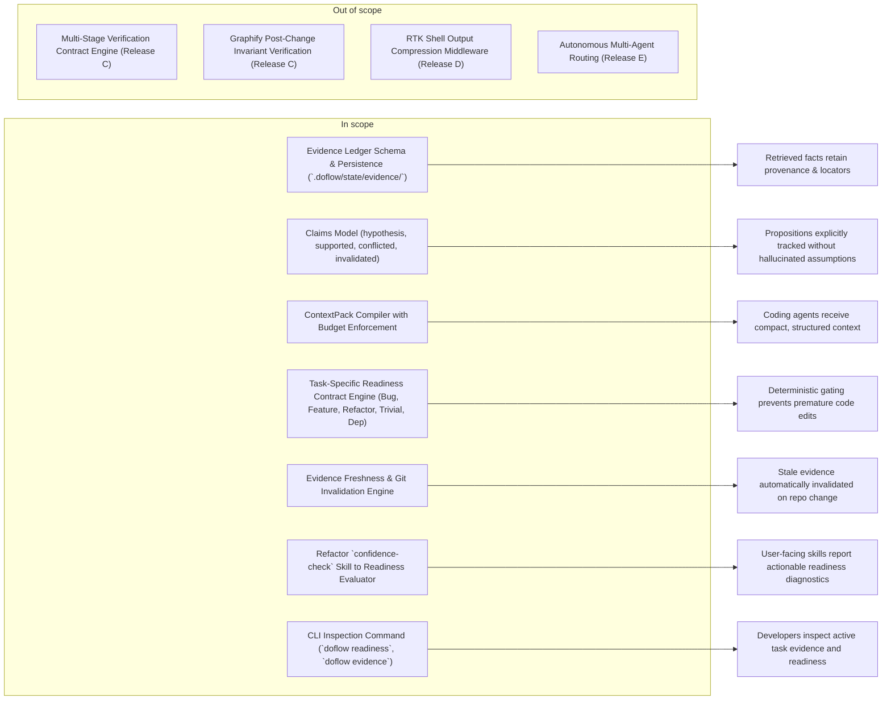

# Feature Requirement: DoFlow Runtime Evolution — Evidence Ledger & Readiness Contracts

**Feature:** 005-evidence-ledger-readiness · **Branch:** `feat/005-evidence-ledger-readiness` · **Status:** Draft
**Created:** 2026-08-14 · **Owner:** kai · **Ticket:** none

> WHAT and WHY only — no tech or implementation detail. Zero unresolved
> `[NEEDS CLARIFICATION]` markers at hand-off — every ambiguity is resolved via
> `AskUserQuestion` before this file is written; deferred answers become assumptions in §8.
>
> Structure follows `references/ARTIFACT_FORMAT.md`: indexed sections carry a table above full
> `**Detail**`, `Status` is only `Live` or `Superseded → <ref>`, and superseded prose moves to §9.

## 1. Summary

Evolve DoFlow with an auditable **Evidence Ledger**, **Claims Model**, **ContextPack Compiler**, and deterministic **Readiness Contract Engine** (Release B of the DoFlow v3 runtime architecture). This milestone replaces uncurated raw context dumping with structured evidence retaining source provenance and freshness, and replaces arbitrary numeric confidence scoring with task-specific state gating (`READY`, `NEEDS_EVIDENCE`, `NEEDS_USER_DECISION`, `BLOCKED`) across Claude Code and Gemini/Antigravity harnesses.

**Scope boundary:**

## 2. User Stories

- **US1 (P1):** As a coding agent executing discovery, I want retrieved facts to be recorded in an Evidence Ledger with exact source locators, provenance, and freshness metadata, so that my reasoning is grounded in verifiable evidence rather than anonymous context noise.
- **US2 (P1):** As a developer or agent formulating an implementation plan, I want my propositions to be tracked as explicit Claims with validation states (`hypothesis`, `supported`, `conflicted`, `invalidated`), so that unverified assumptions are never mistaken for established repository truths.
- **US3 (P1):** As a coding agent preparing to edit code, I want DoFlow to evaluate an explicit, task-specific Readiness Contract (`READY`, `NEEDS_EVIDENCE`, `NEEDS_USER_DECISION`, `BLOCKED`), so that I am prevented from making premature or uninformed code modifications.
- **US4 (P1):** As a coding harness (Claude Code, Gemini CLI), I want to receive a compact, budget-controlled `ContextPack` synthesizing only supported claims, relevant files, structural context, and verification requirements, so that my attention is maximized and token waste is minimized.
- **US5 (P2):** As a developer running workflows, I want stale evidence to automatically invalidate when underlying source files change or when git HEAD advances, so that outdated assumptions do not corrupt subsequent task steps.
- **US6 (P2):** As a developer or reviewer, I want to inspect active task readiness and evidence chains via CLI commands (`doflow readiness` and `doflow evidence`), so that I have full transparency into agent preparation.

## 3. Functional Requirements

**Index** — `Status` is `Live` or `Superseded → <ref>`.

| ID | Requirement | Story | Priority | Status |
|---|---|---|---|---|
| FR-001 | Evidence Ledger Schema & In-Process Store | US1 | P1 | Live |
| FR-002 | Claims Model & Epistemic State Machine | US2 | P1 | Live |
| FR-003 | Task-Specific Readiness Contract Engine | US3 | P1 | Live |
| FR-004 | ContextPack Compiler & Budget Enforcer | US4 | P1 | Live |
| FR-005 | Evidence Freshness & Automatic Git Invalidation | US5 | P2 | Live |
| FR-006 | Five Core Task Class Readiness Templates | US3 | P1 | Live |
| FR-007 | Refactor `confidence-check` to Readiness Evaluator | US3, US6 | P1 | Live |
| FR-008 | CLI Inspection Surface (`readiness` & `evidence`) | US6 | P2 | Live |

**Detail**

- **FR-001:** The system MUST define an `Evidence` schema capturing `id`, `task_id`, `source` (provider, capability), `kind` (exact-search, semantic-retrieval, structural, historical, documentation, test-result, runtime-observation, user-statement, diff, generated-analysis), `locator` (repository, entity, file, line_range, relation), `provenance` (extracted, inferred, asserted), `freshness` (git_commit, file_hash, observed_at), and `supports`/`contradicts` claim associations. Evidence MUST be managed in-process and persistable to neutral JSON state under `.doflow/state/evidence/`.
- **FR-002:** The system MUST define a `Claim` schema tracking `id`, `task_id`, `statement`, `status` (`hypothesis`, `supported`, `conflicted`, `unknown`, `invalidated`), supporting evidence IDs, and contradicting evidence IDs. The system MUST enforce the rule that agent inferences begin as `hypothesis` and cannot transition to `supported` without linked evidence.
- **FR-003:** The system MUST implement a `ReadinessContract` engine that evaluates task readiness into categorical states: `READY` (all mandatory prerequisites satisfied with evidence), `NEEDS_EVIDENCE` (specific evidence missing, returns actionable retrieval recommendations), `NEEDS_USER_DECISION` (ambiguous trade-off requiring user input), or `BLOCKED` (conflicting evidence or failing prerequisites).
- **FR-004:** The system MUST implement a `ContextPack` compiler that assembles a structured context document for coding agents containing: task objective, constraints, supported claims, active hypotheses, relevant files, structural context, unknowns, and verification requirements, adhering to configurable token and entity budgets.
- **FR-005:** The system MUST provide an evidence freshness checker that compares recorded `git_commit` and file hashes against current repository state, automatically transitioning affected evidence to `STALE` and dependent claims to `invalidated` or `conflicted` when files are modified.
- **FR-006:** The system MUST provide 5 built-in task class readiness contract templates:
  - **Bug Fix**: Requires reproduction verified, affected code located, root-cause claim supported by evidence, blast radius mapped, and regression test defined.
  - **Feature**: Requires scope clear, acceptance criteria defined, affected components mapped, and test plan established.
  - **Refactor**: Requires architecture mapped, structural invariants captured, baseline test suite green, and blast radius identified.
  - **Trivial Edit**: Requires target symbol/file identified and localized single-file scope verified.
  - **Dependency Change**: Requires package compatibility verified, upstream release notes checked, breaking changes documented, and build verification command defined.
- **FR-007:** The system MUST evolve the `confidence-check` skill and guidance files to invoke the `ReadinessContract` engine, replacing numerical percentage confidence scores with categorical readiness evaluation and explicit missing-evidence locators.
- **FR-008:** The system MUST expose `doflow readiness` and `doflow evidence` CLI commands to print active task readiness breakdowns, claims genealogies, and evidence chains in human-readable and `--json` formats.

## 4. Non-Functional Requirements

| ID | Constraint | Kind | Status |
|---|---|---|---|
| NFR-001 | Synchronous Evaluation Performance | performance | Live |
| NFR-002 | Epistemic Integrity (No Conflation) | reliability | Live |
| NFR-003 | Neutral State Isolation | security | Live |
| NFR-004 | Multi-Harness Compatibility | compatibility | Live |

**Detail**

- **NFR-001 (Synchronous Evaluation Performance):** In-process evidence insertion, claims evaluation, and readiness contract checking MUST execute in < 25ms total per task turn.
- **NFR-002 (Epistemic Integrity):** The system MUST strictly decouple retrieval relevance scores (e.g. Semble cosine similarity) from factual confidence; high semantic similarity must never be treated as authoritative proof of truth.
- **NFR-003 (Neutral State Isolation):** All evidence ledgers, claims, and context packs MUST reside within `.doflow/state/evidence/` or session memory, never polluting source trees or global configurations.
- **NFR-004 (Multi-Harness Compatibility):** The Evidence Ledger and Readiness Contract subsystem MUST operate natively and identically across Claude Code, Gemini CLI, and Antigravity environments.

## 5. Out of Scope

- **Multi-Stage Verification Contract Engine (Release C)** — Automated compiler, test, lint, and Graphify structural invariant checks are scheduled for Release C.
- **RTK Command Compression Middleware (Release D)** — Shell execution token compression is scheduled for Release D.
- **Autonomous Multi-Agent Routing (Release E)** — Cross-harness agent selection is scheduled for Release E.

## 6. Acceptance Criteria

- [ ] `Evidence` and `Claim` schemas are defined, validated, and serialized to JSON (FR-001, FR-002).
- [ ] `ReadinessContract` correctly evaluates tasks to `READY`, `NEEDS_EVIDENCE`, `NEEDS_USER_DECISION`, and `BLOCKED` (FR-003).
- [ ] Missing prerequisites return exact, actionable missing evidence locators and suggested capability routes (FR-003).
- [ ] `ContextPack` compiles compact, structured YAML/JSON context with budget enforcement (FR-004).
- [ ] Evidence referencing modified files is automatically flagged `STALE` on git commit advancement (FR-005).
- [ ] All 5 task class templates (Bug, Feature, Refactor, Trivial Edit, Dependency Change) are implemented and tested (FR-006).
- [ ] `confidence-check` skill outputs categorical readiness instead of arbitrary percentages (FR-007).
- [ ] `doflow readiness` and `doflow evidence` CLI commands output clear tabular and `--json` reports (FR-008).
- [ ] Unit test suite validates evidence tracking, claims transitions, freshness invalidation, and readiness gating (NFR-001, NFR-002).

## 7. Open Questions

None.

## 8. Assumptions

| ID | Assumption | Affects | Basis |
|---|---|---|---|
| A1 | File-based neutral JSON persistence | FR-001, NFR-003 | User selected in-process runtime store with JSON serialization in `.doflow/state/evidence/`. |
| A2 | Automatic Git Freshness Invalidation | FR-005 | User selected automatic invalidation when git commit hash or file state changes. |
| A3 | Strict State Gating | FR-003, FR-007 | User selected categorical states (`READY`, `NEEDS_EVIDENCE`, etc.) with actionable diagnostics replacing numeric scores. |
| A4 | 5 Core Task Class Templates | FR-006 | User confirmed Bug, Feature, Refactor, Trivial Edit, and Dependency Change templates. |

**Detail**

- **A1** — Storing evidence ledgers in `.doflow/state/evidence/` keeps DoFlow lightweight and zero-dependency while allowing cross-turn and cross-subagent inspection.
- **A2** — Automatic invalidation guarantees that code edits immediately stale out affected evidence, forcing re-verification before further edits.
- **A3** — Categorical readiness prevents agents from self-grading artificial confidence scores to bypass safety checks.
- **A4** — Providing 5 tailored templates prevents trivial edits from being blocked by heavy feature-style checklists.

## 9. History

None — initial version.
